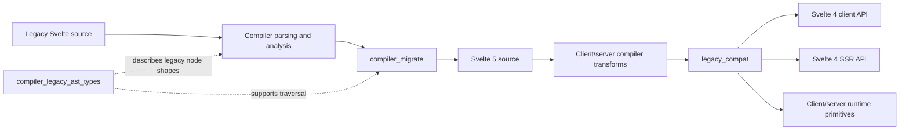
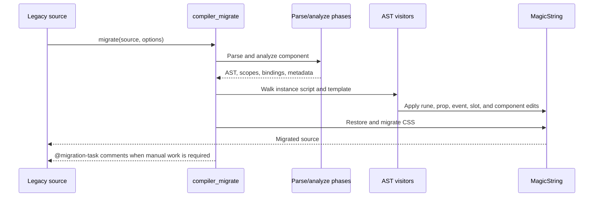
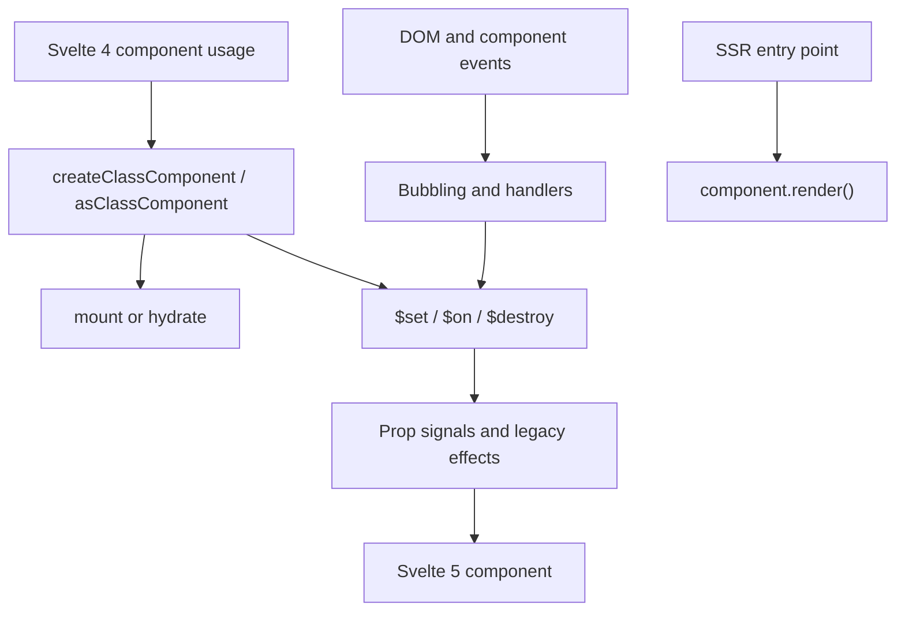

# Legacy Compatibility and Migration

The `legacy_compatibility_and_migration` module preserves Svelte 3/4 compatibility while enabling migration to Svelte 5. It combines:

- `compiler_migrate`: best-effort Svelte 4 → Svelte 5 source rewriting.
- `compiler_legacy_ast_types`: TypeScript contracts for legacy template and CSS AST nodes.
- `legacy_compat`: client and server runtime adapters for the Svelte 4 component API, lifecycle, events, stores, and modifiers.

## Architecture

### Source migration flow

### Runtime compatibility flow

## Core component references

| Area | Documentation |
|---|---|
| Compiler phase ordering | [compilation_pipeline](compilation_pipeline.md) |
| Parsing and AST construction | [compiler_parse](compiler_parse.md) |
| Semantic analysis and scopes | [compiler_analyze](compiler_analyze.md) |
| Compiler state and shared helpers | [compiler_core](compiler_core.md) |
| Modern AST declarations | [compiler_ast_types](compiler_ast_types.md) |
| Migration source rewriter | [compiler_migrate](compiler_migrate.md) |
| Legacy AST contracts | [compiler_legacy_ast_types](compiler_legacy_ast_types.md) |
| Runtime compatibility bridge | [legacy_compat](legacy_compat.md) |
| Client compatibility generation | [compiler_transform_client](compiler_transform_client.md) |
| Server compatibility generation | [compiler_transform_server_core](compiler_transform_server_core.md) |
| Client reactivity runtime | [client_reactivity](client_reactivity.md) |
| Client rendering runtime | [client_render_and_templates](client_render_and_templates.md) |
| Server rendering runtime | [server_runtime](server_runtime.md) |