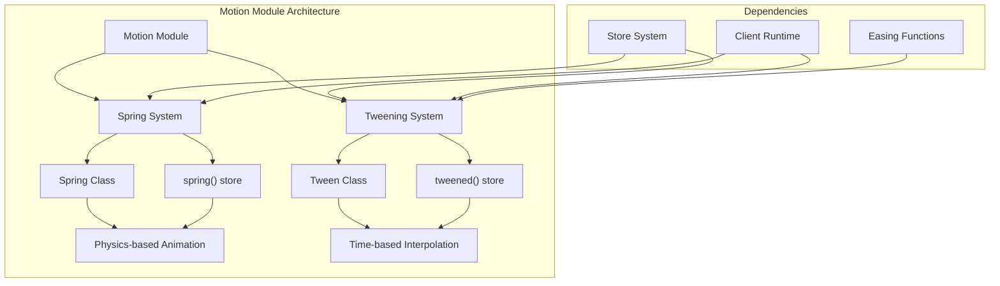
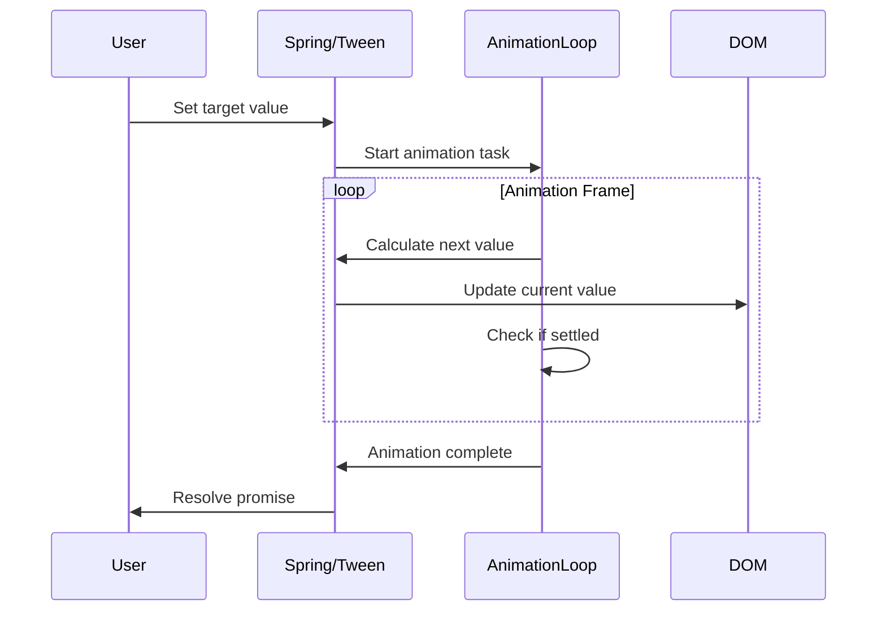

# Motion Module

## Overview

The Motion module provides smooth animation capabilities for Svelte applications through spring physics and tweening systems. It offers both legacy store-based APIs and modern class-based implementations for creating fluid, interactive animations that enhance user experience.

## Architecture

The Motion module is built around two core animation paradigms:



## Core Components

### Spring Animation System
- **Spring Class**: Modern reactive spring implementation with direct property access
- **spring() Store**: Legacy store-based spring animation (deprecated)
- **Physics Engine**: Handles spring calculations with stiffness, damping, and precision controls

### Tweening System  
- **Tween Class**: Modern reactive tweening implementation
- **tweened() Store**: Legacy store-based tweening (deprecated)
- **Interpolation Engine**: Handles smooth transitions between values over time

## Sub-modules

### [Spring Physics](spring_physics.md)
The Spring Physics sub-module implements physics-based animations that simulate spring behavior. It provides natural-feeling motion with configurable stiffness, damping, and precision parameters. The module includes both the modern `Spring` class and the legacy `spring()` store function, offering smooth transitions with realistic momentum and settling behavior.

### [Tweening Engine](tweening_engine.md)  
The Tweening Engine sub-module provides time-based interpolation between values with customizable duration, delay, easing functions, and interpolation strategies. It supports various data types including numbers, objects, arrays, and dates, making it versatile for different animation scenarios through both the modern `Tween` class and legacy `tweened()` store function.

## Key Features

### Modern Class-Based API
- Direct property access (`spring.current`, `spring.target`)
- Promise-based completion tracking
- Reactive binding with `Spring.of()` and `Tween.of()`
- Better TypeScript integration

### Legacy Store Compatibility
- Backward compatibility with existing store-based APIs
- Gradual migration path from stores to classes
- Consistent behavior across API versions

### Advanced Animation Controls
- **Spring Physics**: Natural momentum and settling behavior
- **Custom Interpolation**: Support for numbers, dates, arrays, and objects
- **Easing Functions**: Integration with Svelte's easing system
- **Performance Optimization**: Efficient animation loops and cleanup

## Data Flow



## Integration Points

### Store System Integration
The motion module builds upon Svelte's [store system](stores.md) for the legacy APIs, providing reactive state management for animated values.

### Client Runtime Integration  
Leverages the [client runtime](client_runtime.md) for:
- Reactive state management (`state()`, `set()`, `get()`)
- Effect system for reactive bindings (`render_effect()`)
- Animation loop management (`loop()`, `raf`)

### Easing System Integration
Integrates with Svelte's easing functions for smooth transitions in the tweening system.

## Usage Patterns

### Modern Spring Animation
```javascript
import { Spring } from 'svelte/motion';

const spring = new Spring(0, {
  stiffness: 0.1,
  damping: 0.25
});

// Direct property access
spring.target = 100;
console.log(spring.current); // animated value

// Reactive binding
const reactiveSpring = Spring.of(() => someReactiveValue);
```

### Modern Tweening
```javascript
import { Tween } from 'svelte/motion';

const tween = new Tween(0, {
  duration: 300,
  easing: cubicOut
});

// Promise-based completion
await tween.set(100);
console.log('Animation complete');
```

## Migration Guide

### From Legacy Stores to Modern Classes

**Spring Migration:**
```javascript
// Legacy
const springStore = spring(0);
springStore.set(100);

// Modern
const springClass = new Spring(0);
springClass.target = 100;
```

**Tweened Migration:**
```javascript
// Legacy  
const tweenedStore = tweened(0);
tweenedStore.set(100);

// Modern
const tweenClass = new Tween(0);
await tweenClass.set(100);
```

## Performance Considerations

- **Animation Loop Efficiency**: Uses RAF-based loops with automatic cleanup
- **Value Clamping**: Prevents excessive calculations during long pauses
- **Precision Control**: Configurable settling thresholds to avoid unnecessary updates
- **Memory Management**: Automatic task cleanup and promise resolution

## Related Modules

- **[Stores](stores.md)**: Foundation for legacy motion APIs
- **[Client Runtime](client_runtime.md)**: Reactive state and effect systems
- **[Transitions](transitions.md)**: Declarative animation system for enter/leave transitions
- **[Animations](animations.md)**: Layout animation system for position changes