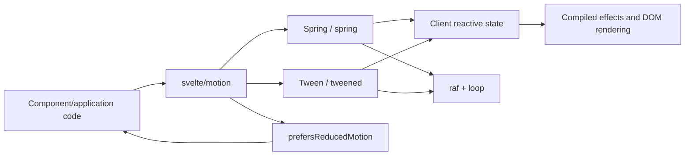
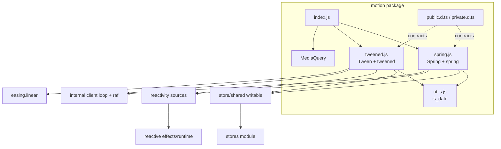
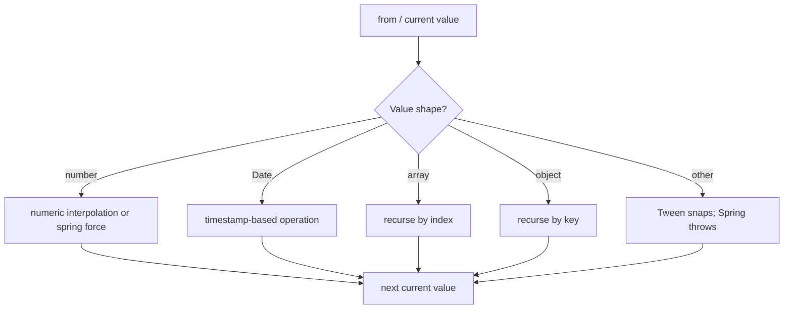
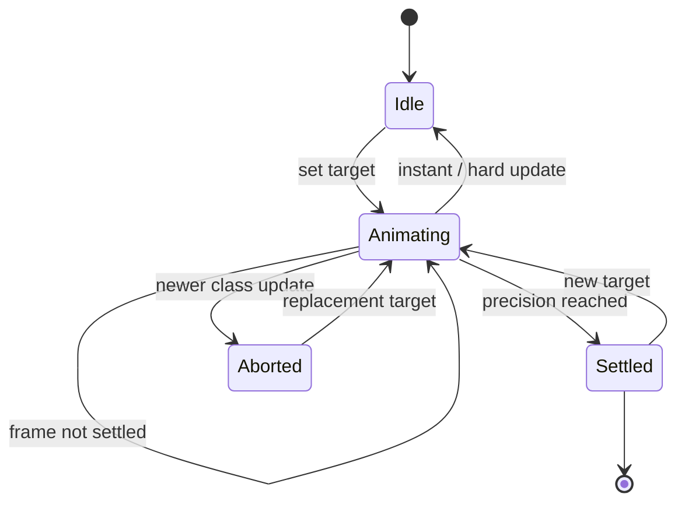
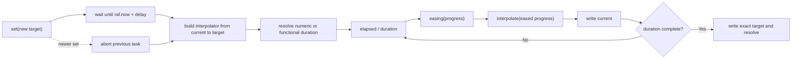

# Motion

The `motion` module provides value-level animation primitives for Svelte. It turns changes to a target value into a sequence of intermediate values, either by simulating spring physics or by interpolating over a timed easing curve. The resulting value can drive component state, bindings, or any other reactive consumer.

The module is implemented in `packages/svelte/src/motion/` and is exposed through `svelte/motion`. It is distinct from element transitions and animations: motion animates application values, while [`transitions.md`](transitions.md) describes DOM transition configuration and lifecycle.

## Position in the system


```mermaid
flowchart LR
    App["Component/application code"] --> API["svelte/motion"]
    API --> Spring["Spring / spring"]
    API --> Tween["Tween / tweened"]
    API --> Reduced["prefersReducedMotion"]
    Spring --> Reactive["Client reactive state"]
    Tween --> Reactive
    Spring --> Frame["raf + loop"]
    Tween --> Frame
    Reactive --> Render["Compiled effects and DOM rendering"]
    Reduced --> App
```

Motion owns interpolation and frame scheduling. The reactive runtime owns dependency tracking and notification, and the renderer consumes the changing current value. Those responsibilities are described in [`client_reactivity_core.md`](client_reactivity_core.md) and [`client_dom_rendering_runtime.md`](client_dom_rendering_runtime.md); store lifecycle is described in [`stores.md`](stores.md).

## Module structure

| File | Responsibility |
| --- | --- |
| `motion/index.js` | Public barrel; exports spring/tween APIs and creates `prefersReducedMotion`. |
| `motion/spring.js` | `spring` legacy store, `Spring` class, shared spring tick algorithm, and `Spring.of`. |
| `motion/tweened.js` | `tweened` legacy store, `Tween` class, interpolation construction, and `Tween.of`. |
| `motion/private.d.ts` | Internal option and callback contracts shared by implementations. |
| `motion/public.d.ts` | Public `Spring`, `Tweened`, and compatibility declarations. |
| `motion/utils.js` | Date detection used by both interpolation algorithms. |

The package also relies on easing functions from [`easing/index.js`](easing.md) and on the published declaration aggregation described in [`published_type_declaration_surface.md`](published_type_declaration_surface.md).

## Public API

### Spring APIs

`new Spring(value, options)` exposes reactive `current` and `target` properties. Assigning `target` or calling `set` starts or updates a physics simulation. `Spring.of(fn, options)` creates a spring whose target is refreshed from an effect callback.

Spring options are:

| Option | Meaning |
| --- | --- |
| `stiffness` | Force pulling the current value toward the target; clamped to `0..1` on the class. |
| `damping` | Opposes velocity; clamped to `0..1` on the class. |
| `precision` | Position and movement threshold at which the simulation is considered settled. |

`Spring.set(value, options)` supports `instant`, which snaps current and target immediately, and `preserveMomentum`, which temporarily gives the simulation effectively infinite mass so an existing trajectory continues. Its promise resolves when the current value catches up.

The deprecated `spring(value, options)` function returns a `Readable`-compatible store with `set`, `update`, `subscribe`, `stiffness`, `damping`, and `precision`. Its update-specific options are `hard` and `soft`. The compatibility declaration is merged into the `Spring` name in `public.d.ts` to avoid a breaking change; the comments identify which members belong only to the legacy store.

### Tween APIs

`new Tween(value, options)` exposes reactive `current` and `target` properties. `Tween.set` animates from the current value to the new target, while assigning `target` is shorthand for calling `set`. `Tween.of(fn, options)` follows a reactive expression from an effect root.

`Tween`/`tweened` options are:

| Option | Meaning |
| --- | --- |
| `delay` | Milliseconds before interpolation begins; default `0`. |
| `duration` | Milliseconds or a function receiving `(from, to)`; default `400`. |
| `easing` | Maps normalized progress to eased progress; default `linear`. |
| `interpolate` | Custom `(from, to) => (t) => value` factory. |

`tweened(value, defaults)` is the deprecated store form. It exposes `set`, `update`, and `subscribe`, and merges per-update options over its defaults.

### Reduced-motion preference

`prefersReducedMotion` is a `MediaQuery` instance for `(prefers-reduced-motion: reduce)`. It lets application code select zero-distance or zero-duration behavior before invoking a motion primitive. The underlying reactive media-query implementation is documented with the reactive built-ins in [`reactive_state_and_stores_library.md`](reactive_state_and_stores_library.md).

## Architecture and dependencies


```mermaid
graph TD
    subgraph Motion["motion package"]
        Index["index.js"]
        SpringImpl["spring.js\nSpring + spring"]
        TweenImpl["tweened.js\nTween + tweened"]
        Types["public.d.ts / private.d.ts"]
        Utils["utils.js\nis_date"]
        Index --> SpringImpl
        Index --> TweenImpl
        Index --> Reduced["MediaQuery"]
        Types -. contracts .-> SpringImpl
        Types -. contracts .-> TweenImpl
        SpringImpl --> Utils
        TweenImpl --> Utils
    end
    SpringImpl --> Store["store/shared writable"]
    SpringImpl --> Sources["reactivity sources"]
    TweenImpl --> Store
    TweenImpl --> Sources
    SpringImpl --> Loop["internal client loop + raf"]
    TweenImpl --> Loop
    TweenImpl --> Easing["easing.linear"]
    Sources --> Effects["reactive effects/runtime"]
    Store --> StoreDocs["stores module"]
```

There are two implementation paths:

- Legacy stores keep the animated value in a `writable` store and expose subscription-based updates.
- Classes keep `current`, `target`, and configuration in internal reactive sources. Getters read the source through the runtime, and setters write it through the source API.

Both paths use the client frame loop and `raf.now()`. The class APIs are the current rune-oriented surface; the store APIs remain for compatibility.

## Value model

Both algorithms support numeric values, `Date` values, arrays, and plain objects recursively.

### Spring values

`tick_spring` applies the physics calculation to numbers and dates, then recursively visits arrays and object properties. A numeric step is computed from displacement, velocity, stiffness, damping, inverse mass, and elapsed time. A value is settled only when both displacement and movement are within `precision`.

Non-numeric leaves are unsupported and throw `Cannot spring ... values`. The recursive object path follows the current value's keys, so compatible object shapes are expected.

### Tween values

`get_interpolator(a, b)` constructs a reusable interpolator:

- numbers use linear arithmetic;
- dates interpolate timestamps and create new `Date` instances;
- arrays build one interpolator per index;
- objects build one interpolator per destination key;
- strings, booleans, and other non-numeric leaves snap to the destination;
- incompatible primitive types, array/object mismatches, and null objects throw.

The `interpolate` option can replace this behavior for custom value types.


```mermaid
flowchart TD
    Value["from / current value"] --> Kind{"Value shape?"}
    Kind -->|number| Numeric["numeric interpolation or spring force"]
    Kind -->|Date| Date["timestamp-based operation"]
    Kind -->|array| Array["recurse by index"]
    Kind -->|object| Object["recurse by key"]
    Kind -->|other| Snap["Tween snaps; Spring throws"]
    Numeric --> Next["next current value"]
    Date --> Next
    Array --> Next
    Object --> Next
    Snap --> Next
```

## Frame scheduling and data flow

```mermaid
sequenceDiagram
    participant Caller
    participant Motion as Spring/Tween
    participant State as current/target or store
    participant Loop as raf + loop
    participant Reactive as reactive subscribers/effects

    Caller->>Motion: set(target, options)
    Motion->>State: write target
    Motion->>Loop: schedule task
    loop each animation frame
        Loop->>Motion: timestamp
        Motion->>Motion: calculate next value
        Motion->>State: write current
        State-->>Reactive: notify dependents/subscribers
    end
    Motion-->>Caller: resolve promise when settled
```

The elapsed interval is capped at `1000 / 30` milliseconds in both implementations. This prevents a blocked thread or inactive tab from producing an unstable spring step or a large discontinuity in frame-driven updates.

## Spring process and lifecycle


```mermaid
stateDiagram-v2
    [*] --> Idle
    Idle --> Animating: set target
    Animating --> Animating: frame not settled
    Animating --> Settled: precision reached
    Settled --> Animating: new target
    Animating --> Idle: instant / hard update
    Animating --> Aborted: newer class update
    Aborted --> Animating: replacement target
    Settled --> [*]
```

For the legacy store, `hard` cancels the running task and writes the value immediately. `soft` starts with inverse mass zero and gradually restores mass, allowing the current motion to influence the new target. For `Spring`, `instant` performs the equivalent snap, while `preserveMomentum` controls the temporary momentum window. A class update rejects the previous pending deferred promise with `Aborted`; only the latest deferred is resolved when the task catches up.

The spring's shared equation is conceptually:

```text
delta       = target - current
velocity    = (current - last) / dt
springForce = stiffness * delta
damperForce = damping * velocity
acceleration = (springForce - damperForce) * inverseMass
next        = current + (velocity + acceleration) * dt
```

The actual implementation applies this equation recursively for composite values and returns the exact target when the precision thresholds are met.

## Tween process and cancellation


```mermaid
flowchart LR
    Set["set(new target)"] --> Delay["wait until raf.now + delay"]
    Delay --> Build["build interpolator from current to target"]
    Build --> Duration["resolve numeric or functional duration"]
    Duration --> Progress["elapsed / duration"]
    Progress --> Ease["easing(progress)"]
    Ease --> Interpolate["interpolate(eased progress)"]
    Interpolate --> Write["write current"]
    Write --> Done{"duration complete?"}
    Done -->|No| Progress
    Done -->|Yes| Resolve["write exact target and resolve"]
    Set -. newer set .-> Cancel["abort previous task"]
    Cancel --> Build
```

The interpolator is created when the delay expires, not when `set` is called. This means it uses the value current at animation start. A duration function is also evaluated at that point with the actual start and destination values. A zero duration aborts the previous task and writes the target immediately.

## Integration boundaries

- Use [`stores.md`](stores.md) for subscription semantics and `writable`; motion only uses it to implement deprecated store APIs.
- Use [`client_reactivity_core.md`](client_reactivity_core.md) for source reads/writes, effect roots, and notification scheduling; `Spring.of` and `Tween.of` require that runtime context.
- Use [`easing.md`](easing.md) for easing-curve implementations. Motion consumes an easing callback and does not own easing mathematics.
- Use [`transitions.md`](transitions.md) for element-level `transition:` and `in:/out:` directives. A motion value may feed a component, but motion does not create a `TransitionConfig`.
- Use [`server_rendering_and_shared_runtime_primitives.md`](server_rendering_and_shared_runtime_primitives.md) for SSR. The frame loop and client reactive sources are browser-oriented; server rendering does not advance an animation over time.
- Use [`published_type_declaration_surface.md`](published_type_declaration_surface.md) for how `Spring`, `Tweened`, options, and related types become part of the package declaration surface.

## Maintenance considerations

- Preserve the distinction between class-only options (`instant`, `preserveMomentum`) and legacy-store options (`hard`, `soft`).
- Changes to `tick_spring` must preserve recursive support and the settled check, because promises and loop termination depend on it.
- Changes to tween interpolation should be tested for arrays, objects, dates, incompatible shapes, and custom interpolators.
- Keep frame elapsed-time clamping when changing scheduling behavior.
- `Spring` configuration is reactive: class setters clamp stiffness and damping, while the legacy store exposes mutable configuration values without the class source wrappers.
- Development builds tag class sources for tracing. These tags are diagnostic metadata and should not alter production scheduling.

The motion module is therefore a bridge between user-level value changes and Svelte's reactive frame updates: it owns the motion model, while stores, reactivity, rendering, easing, and SSR remain separate system modules.
