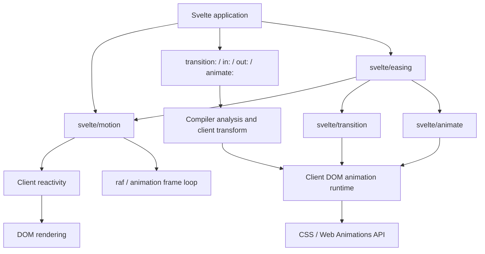
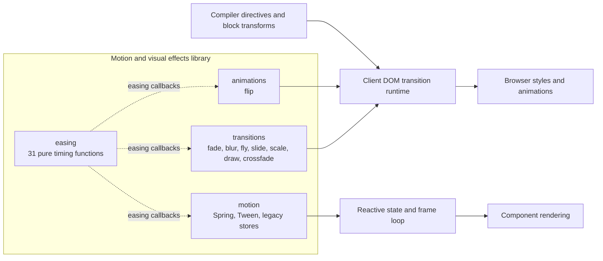
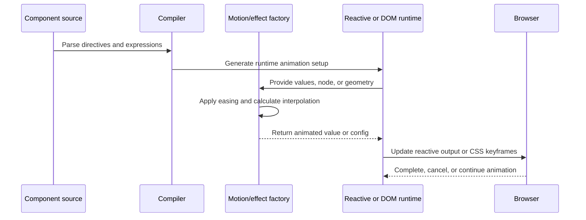

# Motion and Visual Effects Library

## Purpose

The `motion_and_visual_effects_library` module provides Svelte’s public APIs for animating values and DOM elements:

- `transitions`: element enter/exit effects and keyed crossfades.
- `animations`: the `flip` animation for keyed list reordering and resizing.
- `motion`: value-level spring and tween primitives.
- `easing`: pure timing functions shared by motion and visual effects.

These modules define animation behavior and configuration. Scheduling, lifecycle management, DOM updates, and cancellation are delegated to Svelte’s compiler, reactive runtime, and client DOM animation runtime.

## Architecture

### Component relationships

## Core component summaries

### Transitions

The `transitions` module creates `TransitionConfig` objects for element intros, outros, and paired keyed transitions. Factories inspect computed styles, geometry, or SVG path length and return CSS or tick functions. The runtime controls timing, reversal, cancellation, and cleanup.

### Animations

The `animations` module provides `flip`, which implements First–Last–Invert–Play for keyed `{#each}` blocks. The runtime measures element rectangles before and after reconciliation, then invokes `flip` to produce translate/scale keyframes.

### Motion

The `motion` module animates application values rather than DOM elements. `Spring` uses physics-based interpolation, while `Tween` uses duration, easing, and recursive interpolation for numbers, dates, arrays, and objects. Both update reactive state through the client frame loop.

### Easing

The `easing` module contains stateless timing functions such as `cubicInOut`, `backOut`, `elasticOut`, and `bounceInOut`. It maps normalized progress to eased progress but does not schedule frames, interpolate values, or modify the DOM.

## End-to-end flow

## Core component documentation

- [Transitions](</home/anhnh/CodeWiki-journal/results/generation/svelte/transitions.md>) — built-in DOM transition factories and `crossfade`.
- [Animations](</home/anhnh/CodeWiki-journal/results/generation/svelte/animations.md>) — `flip` and keyed-list animation integration.
- [Motion](</home/anhnh/CodeWiki-journal/results/generation/svelte/motion.md>) — `Spring`, `Tween`, legacy stores, and frame scheduling.
- [Easing](</home/anhnh/CodeWiki-journal/results/generation/svelte/easing.md>) — public easing functions and their consumers.

Related runtime and compiler documentation referenced by these components includes the client DOM transition runtime, keyed block runtime, client directive transforms, client reactivity, and published type declarations.