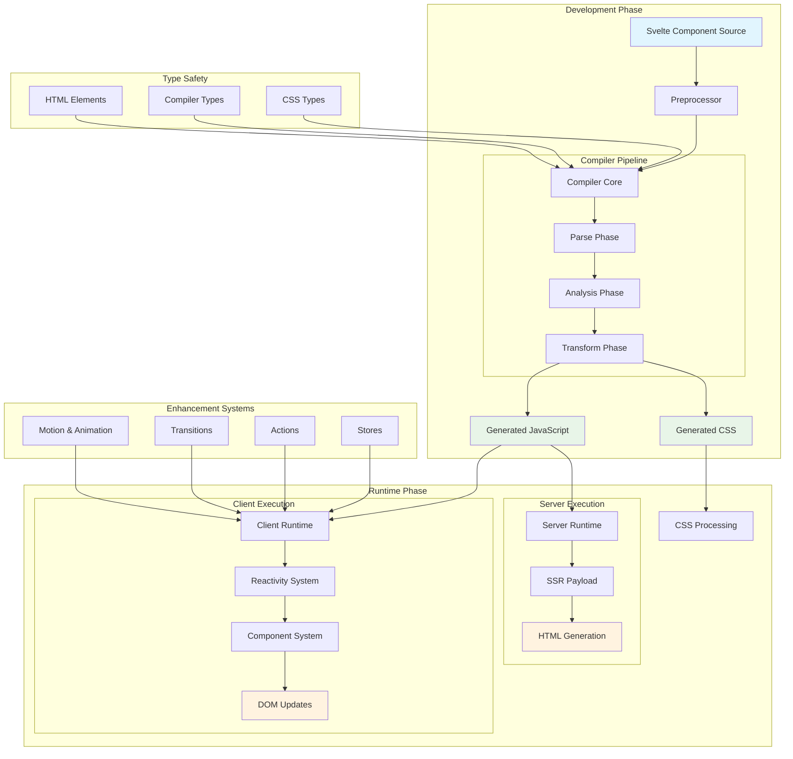
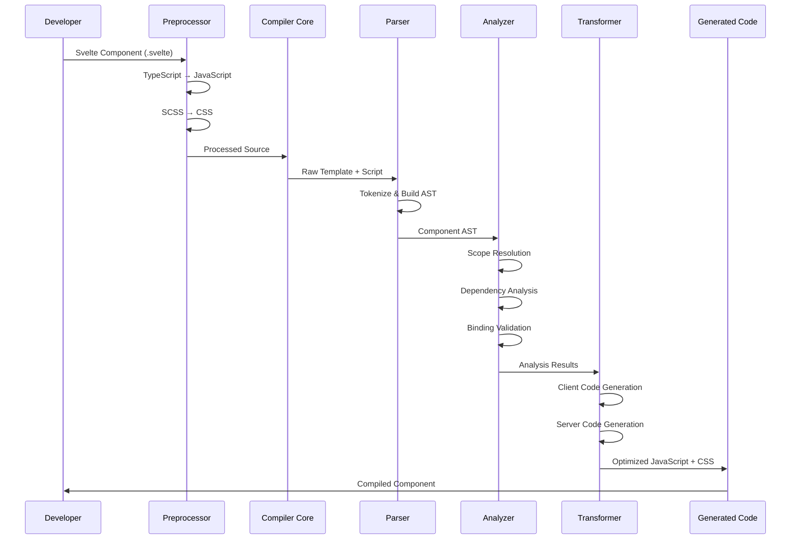
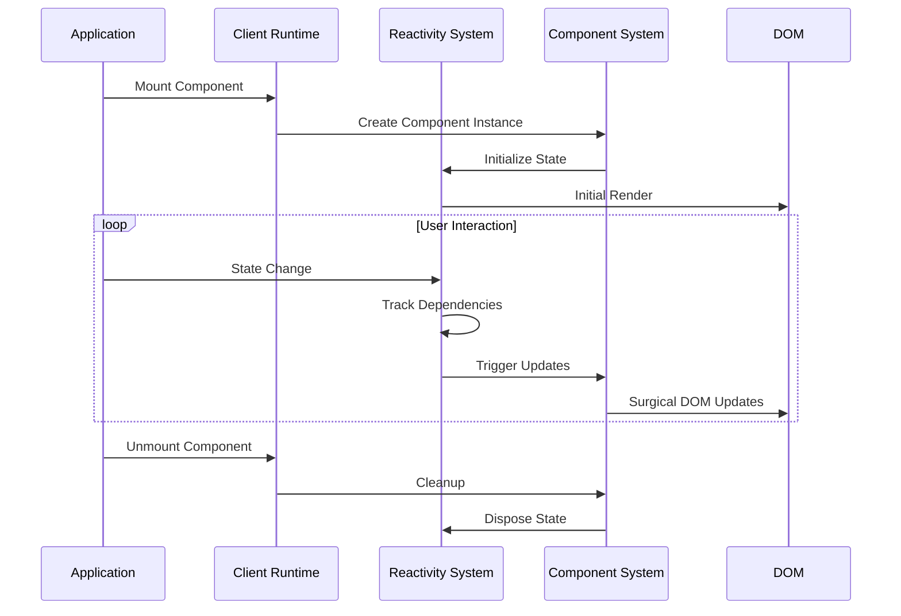

# Svelte Repository Overview

## Purpose

The `sveltejs--svelte` repository is the core implementation of Svelte, a modern JavaScript framework for building user interfaces. Svelte is a compile-time framework that transforms declarative components into efficient, vanilla JavaScript code that surgically updates the DOM. Unlike traditional frameworks that do most of their work in the browser, Svelte shifts that work into a compile step that happens when you build your app.

The repository provides:
- **Compiler Infrastructure**: A sophisticated multi-phase compiler that transforms Svelte components into optimized JavaScript
- **Runtime Systems**: Lightweight client and server runtime systems for reactive state management and DOM manipulation
- **Developer Tools**: Comprehensive type definitions, preprocessor support, and development utilities
- **Animation & Interaction**: Built-in systems for transitions, animations, and user interactions

## End-to-End Architecture

### Compilation Flow

### Runtime Execution Flow

## Core Module Documentation

### Compilation System
- **[Compiler Core](compiler_core.md)**: Multi-phase compilation pipeline (parsing, analysis, transformation)
- **[Compiler Types](compiler_types.md)**: AST node definitions and compilation interfaces
- **[CSS Types](css_types.md)**: CSS parsing and scoping type definitions
- **[Preprocessor](preprocessor.md)**: Source transformation hooks for TypeScript, SCSS, etc.

### Runtime Systems
- **[Client Runtime](client_runtime.md)**: Reactive state management and DOM manipulation
- **[Server Runtime](server_runtime.md)**: Server-side rendering and payload management
- **[Component System](component_system.md)**: Component lifecycle and interaction patterns

### State Management
- **[Stores](stores.md)**: Reactive state management with subscription patterns
- **[Reactive Data Structures](reactive_data_structures.md)**: Reactive versions of Map, Set, Date, URL, etc.

### Animation & Interaction
- **[Motion](motion.md)**: Spring physics and tweening for smooth animations
- **[Transitions](transitions.md)**: Enter/exit animations with built-in effects
- **[Animations](animations.md)**: FLIP animations for layout changes
- **[Actions](actions.md)**: Reusable DOM element behaviors

### Type Safety & Integration
- **[HTML Elements](html_elements.md)**: Comprehensive DOM element type definitions