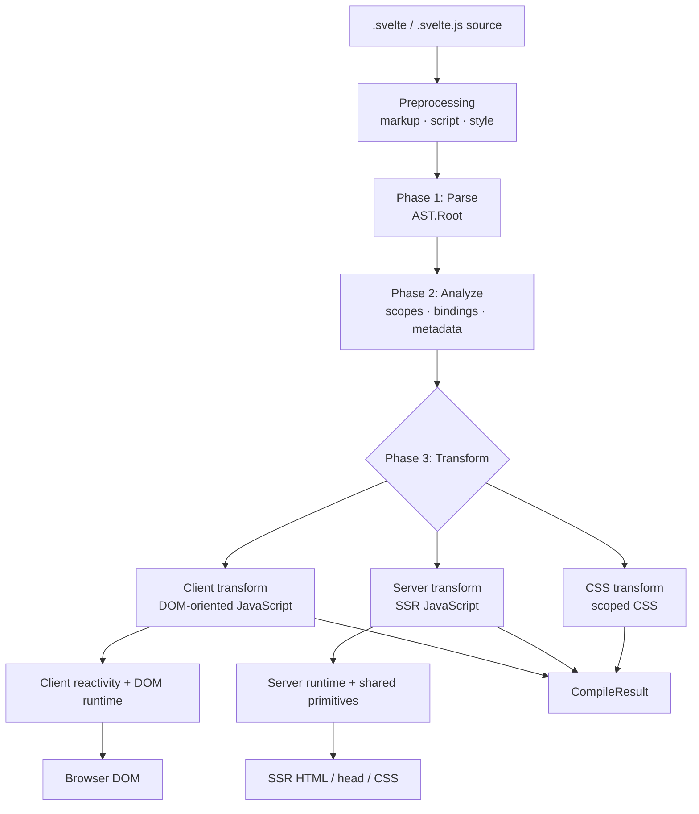
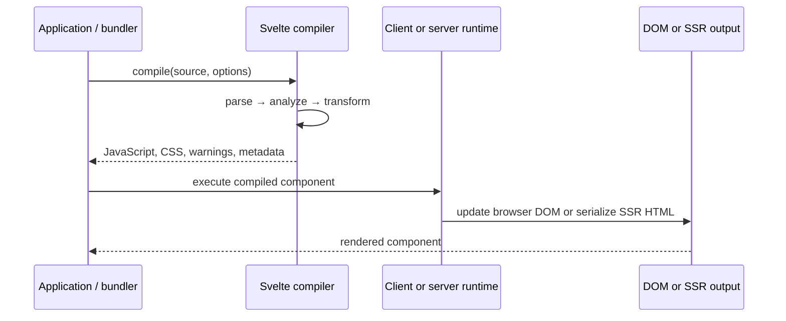
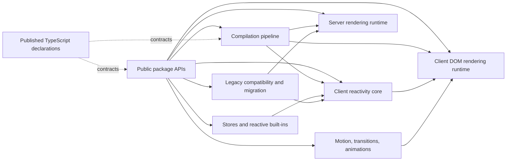

# Svelte Repository Overview

Svelte is a compiler-driven UI framework. It compiles `.svelte` components and reactive modules into optimized JavaScript, CSS, and SSR output, then provides client, server, reactivity, animation, store, compatibility, and TypeScript APIs for executing and consuming that output.

The repository is centered in `packages/svelte`, with compiler phases, internal runtimes, public entry points, and published type declarations.

## End-to-end architecture

```mermaid
flowchart TB
    Source[".svelte / .svelte.js source"]
    Preprocess["Preprocessing<br/>markup · script · style"]
    Parse["Phase 1: Parse<br/>AST.Root"]
    Analyze["Phase 2: Analyze<br/>scopes · bindings · metadata"]
    Transform{"Phase 3: Transform"}

    Client["Client transform<br/>DOM-oriented JavaScript"]
    Server["Server transform<br/>SSR JavaScript"]
    CSS["CSS transform<br/>scoped CSS"]

    ClientRuntime["Client reactivity + DOM runtime"]
    ServerRuntime["Server runtime + shared primitives"]
    Browser["Browser DOM"]
    HTML["SSR HTML / head / CSS"]
    Result["CompileResult"]

    Source --> Preprocess --> Parse --> Analyze --> Transform
    Transform --> Client --> Result
    Transform --> Server --> Result
    Transform --> CSS --> Result

    Client --> ClientRuntime --> Browser
    Server --> ServerRuntime --> HTML
```

```mermaid
sequenceDiagram
    participant App as Application / bundler
    participant Compiler as Svelte compiler
    participant Runtime as Client or server runtime
    participant Output as DOM or SSR output

    App->>Compiler: compile(source, options)
    Compiler->>Compiler: parse → analyze → transform
    Compiler-->>App: JavaScript, CSS, warnings, metadata
    App->>Runtime: execute compiled component
    Runtime->>Output: update browser DOM or serialize SSR HTML
    Output-->>App: rendered component
```

## Runtime and library relationships

```mermaid
flowchart LR
    Public["Public package APIs"]
    Types["Published TypeScript declarations"]
    Compiler["Compilation pipeline"]
    Reactivity["Client reactivity core"]
    DOM["Client DOM rendering runtime"]
    SSR["Server rendering runtime"]
    Stores["Stores and reactive built-ins"]
    Motion["Motion, transitions, animations"]
    Legacy["Legacy compatibility and migration"]

    Public --> Compiler
    Public --> Reactivity
    Public --> DOM
    Public --> SSR
    Public --> Stores
    Public --> Motion
    Public --> Legacy

    Types -. contracts .-> Public
    Types -. contracts .-> Compiler
    Compiler --> Reactivity
    Compiler --> DOM
    Compiler --> SSR
    Reactivity --> DOM
    Stores --> Reactivity
    Motion --> DOM
    Legacy --> Reactivity
    Legacy --> SSR
```

## Core module documentation

| Module | Source area | Documentation |
| --- | --- | --- |
| Compilation pipeline | `packages/svelte/src/compiler` | [compilation_pipeline.md](/home/anhnh/CodeWiki-journal/results/generation/svelte/compilation_pipeline.md) |
| Compiler support services | `packages/svelte/src/compiler` | [compiler_support_services.md](/home/anhnh/CodeWiki-journal/results/generation/svelte/compiler_support_services.md) |
| Legacy compatibility and migration | `packages/svelte/src` | [legacy_compatibility_and_migration.md](/home/anhnh/CodeWiki-journal/results/generation/svelte/legacy_compatibility_and_migration.md) |
| Client reactivity core | `packages/svelte/src/internal/client/reactivity` | [client_reactivity_core.md](/home/anhnh/CodeWiki-journal/results/generation/svelte/client_reactivity_core.md) |
| Client DOM rendering runtime | `packages/svelte/src/internal/client` | [client_dom_rendering_runtime.md](/home/anhnh/CodeWiki-journal/results/generation/svelte/client_dom_rendering_runtime.md) |
| Server rendering and shared primitives | `packages/svelte/src/internal` | [server_rendering_and_shared_runtime_primitives.md](/home/anhnh/CodeWiki-journal/results/generation/svelte/server_rendering_and_shared_runtime_primitives.md) |
| Reactive state and stores | `packages/svelte/src/store`, `packages/svelte/src/reactivity` | [reactive_state_and_stores_library.md](/home/anhnh/CodeWiki-journal/results/generation/svelte/reactive_state_and_stores_library.md) |
| Motion and visual effects | `packages/svelte/src/transition`, `animate`, `motion`, `easing` | [motion_and_visual_effects_library.md](/home/anhnh/CodeWiki-journal/results/generation/svelte/motion_and_visual_effects_library.md) |
| Public package entry points | `packages/svelte` | [public_package_entry_points.md](/home/anhnh/CodeWiki-journal/results/generation/svelte/public_package_entry_points.md) |
| Published type declarations | `packages/svelte/types/index.d.ts` | [published_type_declaration_surface.md](/home/anhnh/CodeWiki-journal/results/generation/svelte/published_type_declaration_surface.md) |

## Key design points

- The compiler parses source into one AST, decorates it during analysis, and shares the analyzed structure with client, server, and CSS transforms.
- Client output delegates fine-grained updates to the reactivity runtime and DOM runtime.
- Server output uses payload-based SSR primitives to produce HTML, head content, CSS, and hydration markers.
- Stores and reactive built-ins provide public state abstractions that integrate with client signals.
- Transitions, animations, motion, and easing build on compiler-generated instructions and runtime scheduling.
- Legacy adapters preserve Svelte 3/4 component behavior while migration tools assist conversion to Svelte 5.
- Public JavaScript APIs and TypeScript declarations form the stable consumer-facing boundary over these internal systems.