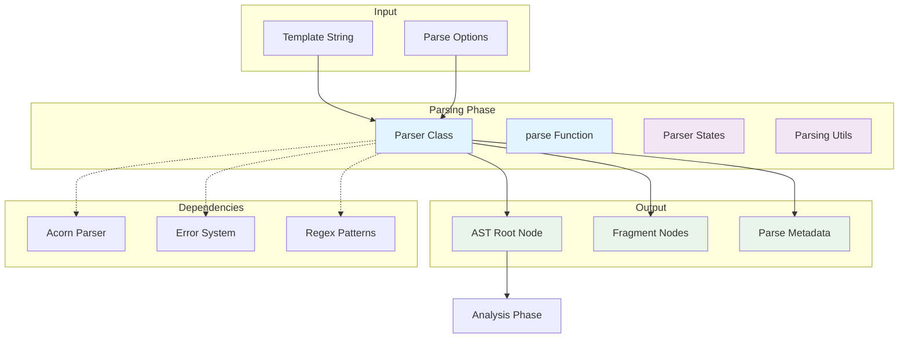
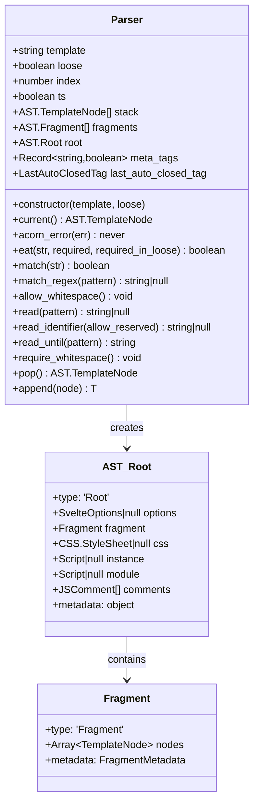
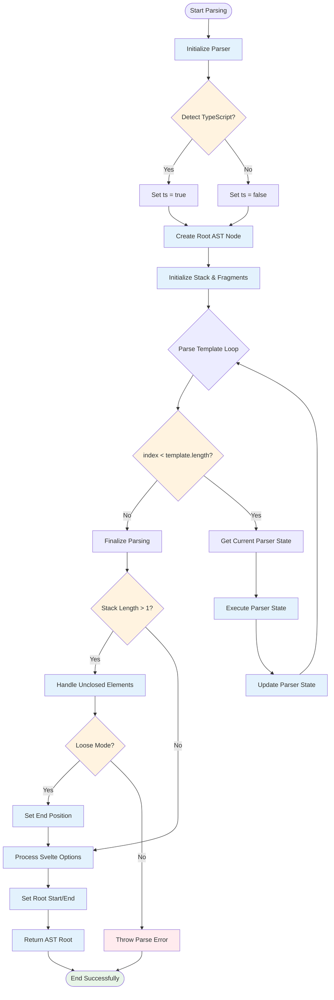
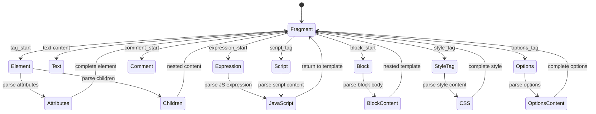
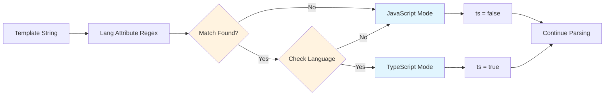
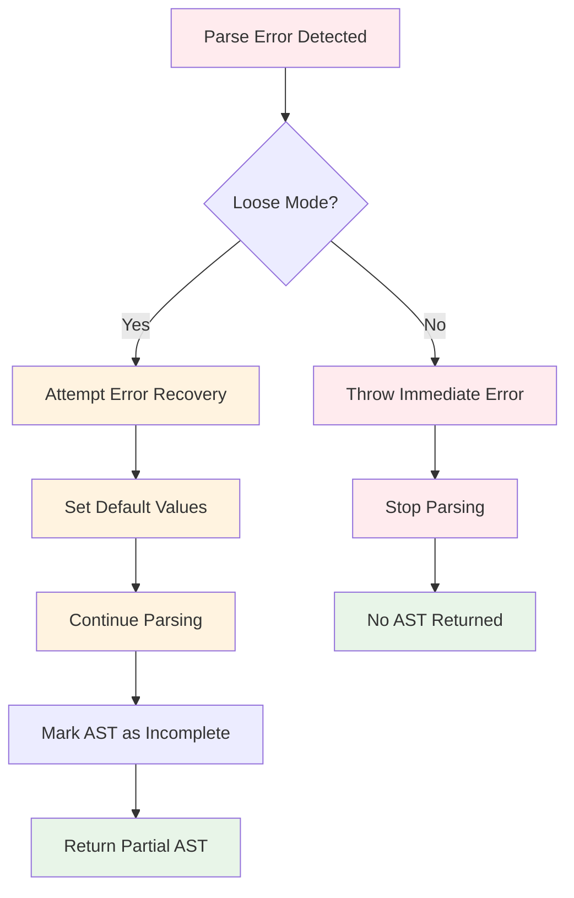
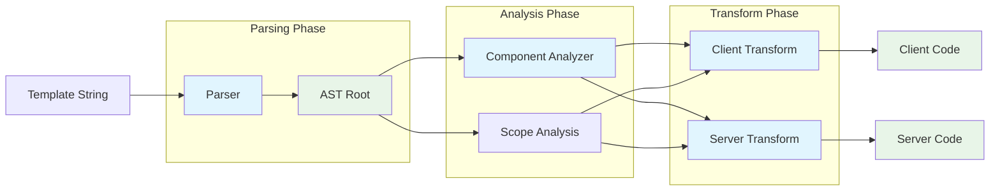
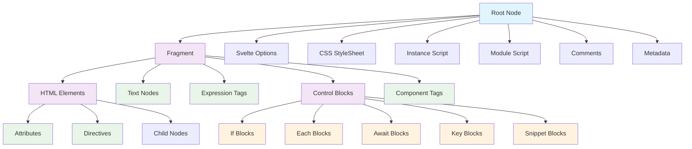

# Parsing Phase Module

The parsing phase is the first critical stage in the Svelte compilation pipeline, responsible for transforming raw Svelte template strings into structured Abstract Syntax Trees (AST). This module provides the foundational parsing capabilities that enable all subsequent compilation phases.

## Overview

The parsing phase takes Svelte component source code and converts it into a structured AST representation that can be analyzed and transformed by later compilation phases. It handles the complex task of parsing mixed HTML, JavaScript, CSS, and Svelte-specific syntax into a unified tree structure.

## Architecture



## Core Components

### Parser Class

The `Parser` class is the central component that orchestrates the parsing process:



#### Key Properties

- **`template`**: The raw Svelte component source code
- **`loose`**: Enables loose parsing mode for error recovery
- **`index`**: Current parsing position in the template
- **`ts`**: TypeScript mode detection flag
- **`stack`**: Parsing context stack for nested elements
- **`fragments`**: Fragment stack for managing nested scopes
- **`root`**: The resulting AST root node

#### Core Methods

- **`eat(str, required, required_in_loose)`**: Consumes expected tokens
- **`match(str)`**: Tests for token presence without consuming
- **`read_identifier(allow_reserved)`**: Parses JavaScript identifiers
- **`read_until(pattern)`**: Reads content until pattern match
- **`append(node)`**: Adds nodes to current fragment

## Parsing Process Flow



## Parser States

The parser uses a state machine approach where different parsing states handle different contexts:



## TypeScript Detection

The parser automatically detects TypeScript mode by scanning for `<script lang="ts">` tags:



## Error Handling

The parser provides comprehensive error handling with two modes:

### Strict Mode (default)
- Throws errors immediately on syntax violations
- Provides precise error locations and messages
- Ensures complete syntax compliance

### Loose Mode
- Attempts to continue parsing after errors
- Useful for IDE integration and partial parsing
- Provides best-effort AST construction



## Integration with Compilation Pipeline

The parsing phase serves as the foundation for the entire Svelte compilation process:



## AST Structure

The parser generates a hierarchical AST with the following key node types:



## Performance Considerations

The parser is optimized for performance through several strategies:

### Efficient String Operations
- Single-character matching optimization
- Minimal string slicing operations
- Regex pattern caching

### Memory Management
- Reusable parser state objects
- Minimal object allocation during parsing
- Efficient stack management

### Early Optimization
- TypeScript detection via single regex scan
- Whitespace handling optimization
- Pattern matching shortcuts

## Usage Examples

### Basic Parsing
```javascript
import { parse } from './phases/1-parse/index.js';

const template = `
<script>
  let count = 0;
</script>

<button on:click={() => count++}>
  Count: {count}
</button>
`;

const ast = parse(template);
console.log(ast.type); // 'Root'
console.log(ast.fragment.nodes.length); // Number of top-level nodes
```

### Loose Mode Parsing
```javascript
const incompleteTemplate = `
<div>
  <p>Unclosed paragraph
  <span>Some content
`;

const ast = parse(incompleteTemplate, true); // loose = true
// Returns partial AST instead of throwing error
```

## Related Documentation

- [Analysis Phase](analysis_phase.md) - Next phase that processes the parsed AST
- [Compiler Types](compiler_types.md) - Type definitions for AST nodes
- [Transform Phase](transform_phase.md) - Final compilation phase
- [Preprocessor](preprocessor.md) - Pre-parsing template transformation

## API Reference

### `parse(template, loose?)`
Main parsing function that creates a Parser instance and returns the AST.

**Parameters:**
- `template` (string): The Svelte component source code
- `loose` (boolean, optional): Enable loose parsing mode

**Returns:** `AST.Root` - The parsed AST root node

### `Parser` Class
Core parser implementation with methods for tokenization, state management, and AST construction.

**Constructor:**
- `new Parser(template, loose)` - Creates a new parser instance

**Key Methods:**
- `current()` - Returns the current parsing context
- `eat(str, required?, required_in_loose?)` - Consumes expected tokens
- `match(str)` - Tests for token presence
- `read_identifier(allow_reserved?)` - Parses JavaScript identifiers
- `append(node)` - Adds nodes to the current fragment

The parsing phase establishes the foundation for Svelte's compilation pipeline, transforming raw template strings into structured ASTs that enable powerful static analysis and optimization in subsequent phases.