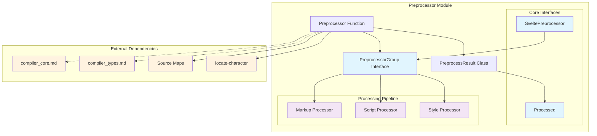
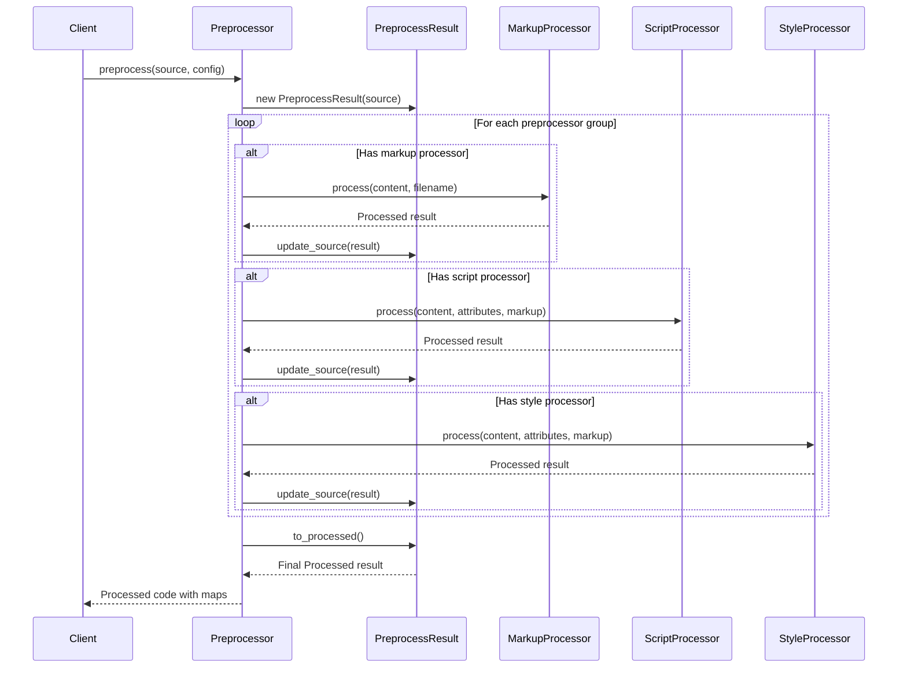

# Preprocessor Module

## Overview

The Preprocessor module is a core component of the Svelte compiler that provides hooks for transforming component source code before compilation. It enables developers to use alternative languages and syntaxes (like TypeScript, SCSS, PostCSS) within Svelte components by converting them to standard HTML, CSS, and JavaScript.

## Purpose

The preprocessor system allows for:
- **Language Transformation**: Convert TypeScript to JavaScript, SCSS to CSS, etc.
- **Code Enhancement**: Add features like autoprefixing, minification, or linting
- **Source Map Generation**: Maintain debugging capabilities across transformations
- **Dependency Tracking**: Monitor file changes for hot reloading and build optimization

## Architecture Overview



## Core Components

### 1. Preprocessor Function
The main entry point that orchestrates the preprocessing pipeline:
- Accepts source code and preprocessor configurations
- Manages the sequential application of preprocessors
- Returns processed code with source maps and dependencies

### 2. PreprocessResult Class
Internal state management for preprocessing operations:
- Tracks source transformations through multiple stages
- Maintains source map chain for debugging
- Accumulates dependencies for build system integration

### 3. PreprocessorGroup Interface
Configuration structure defining available preprocessors:
- **markup**: Processes the entire Svelte file content
- **script**: Processes `<script>` tag content
- **style**: Processes `<style>` tag content

## Data Flow



## Key Features

### Source Map Management
- **Chain Preservation**: Maintains source map chain through multiple transformations
- **Offset Calculation**: Correctly maps positions between original and transformed code
- **Combination Logic**: Merges multiple source maps into a single comprehensive map

### Tag Processing
- **Regex-based Extraction**: Uses sophisticated regex patterns to identify and extract tag content
- **Attribute Handling**: Parses and transforms tag attributes while preserving structure
- **Content Isolation**: Processes tag content independently while maintaining context

### Dependency Tracking
- **File Watching**: Tracks additional files that should trigger recompilation
- **Deduplication**: Ensures dependency lists don't contain duplicates
- **Build Integration**: Provides dependency information for build system optimization

## Integration Points

### With Compiler Core
The preprocessor integrates with the [compiler_core](compiler_core.md) module by:
- Processing source code before the parsing phase
- Providing transformed code to the Parser component
- Maintaining source map information for error reporting

### With Compiler Types
Utilizes types from [compiler_types](compiler_types.md) for:
- CompileOptions interface for configuration
- Template type definitions for structure validation

## Usage Patterns

### Basic Preprocessing
```typescript
const result = await preprocess(source, {
  name: 'my-preprocessor',
  script: ({ content, attributes }) => {
    // Transform TypeScript to JavaScript
    return { code: transformedCode, map: sourceMap };
  },
  style: ({ content, attributes }) => {
    // Transform SCSS to CSS
    return { code: transformedCSS, map: sourceMap };
  }
});
```

### Multiple Preprocessors
```typescript
const result = await preprocess(source, [
  typescriptPreprocessor,
  scssPreprocessor,
  postcssPreprocessor
]);
```

## Error Handling

The preprocessor system includes robust error handling:
- **Graceful Degradation**: If a preprocessor fails, the original code is preserved
- **Source Map Preservation**: Error locations are mapped back to original source
- **Dependency Validation**: Invalid dependencies are filtered out

## Performance Considerations

- **Lazy Processing**: Only processes tags that have corresponding preprocessors
- **Efficient Regex**: Uses optimized regex patterns for tag extraction
- **Memory Management**: Properly manages source map memory usage
- **Async Processing**: Supports asynchronous preprocessor functions

## Future Enhancements

The preprocessor module is designed for extensibility:
- **Plugin System**: Framework for third-party preprocessor plugins
- **Parallel Processing**: Potential for concurrent preprocessing of independent tags
- **Caching Layer**: Integration with build system caching mechanisms
- **Enhanced Debugging**: Improved source map resolution and error reporting