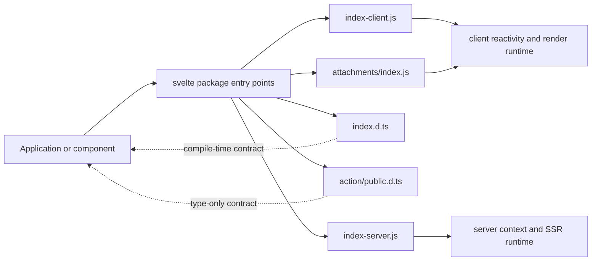
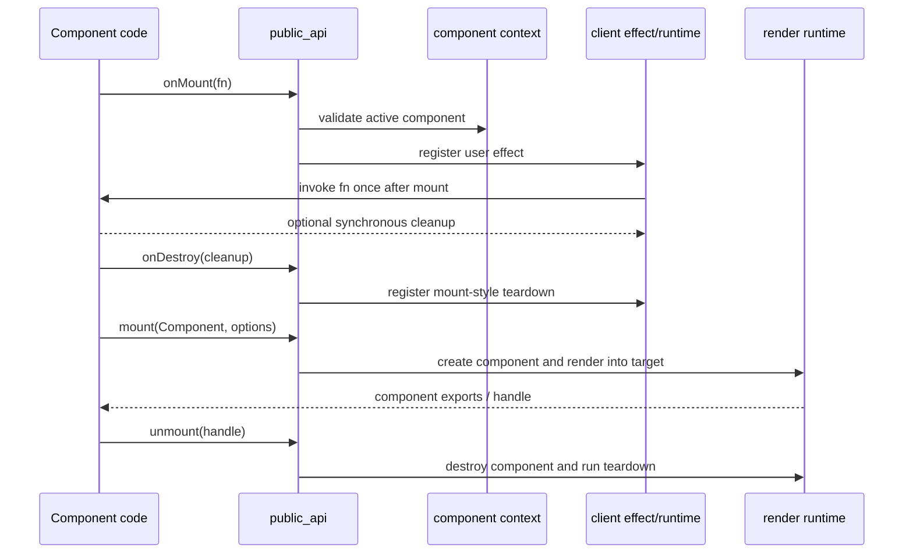
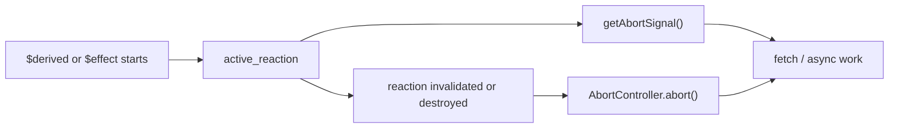
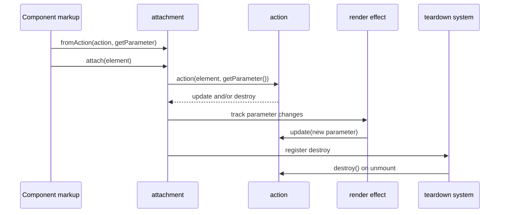
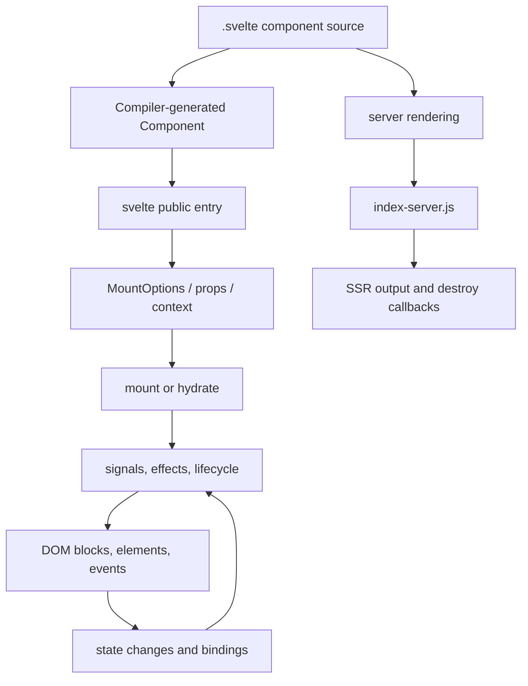

# public_api

`public_api` is Svelte's package-level public entry surface. It exposes the APIs that application code, component libraries, and tooling import from `svelte`: component lifecycle helpers, client mounting and hydration, context, scheduling, snippets, event dispatching, actions, attachments, and the TypeScript contracts for components and their props.

The entry point is environment-specific. `index-client.js` provides browser behavior and delegates to the client runtime, while `index-server.js` provides SSR-safe lifecycle behavior and explicitly rejects browser-only operations. `index.d.ts` is the public type contract and re-exports the client surface for normal TypeScript consumers.

## Role in the system



The module is an adapter boundary, not a separate rendering engine. It binds stable public names to the internal client/server implementations described in [client_dom_rendering_runtime](client_dom_rendering_runtime.md), [client_reactivity_core](client_reactivity_core.md), and [server_rendering_and_shared_runtime_primitives](server_rendering_and_shared_runtime_primitives.md).

## Public surface architecture

```mermaid
graph TD
    API["public_api"]

    API --> L["Lifecycle and effects"]
    API --> R["Render control"]
    API --> C["Context and scheduling"]
    API --> E["Events"]
    API --> S["Component and snippet types"]
    API --> A["Actions"]
    API --> AT["Attachments"]

    L --> ONM["onMount (client only)"]
    L --> OND["onDestroy"]
    L --> PRE["beforeUpdate (legacy)"]
    L --> POST["afterUpdate (legacy)"]

    R --> MOUNT["mount"]
    R --> HYDRATE["hydrate"]
    R --> UNMOUNT["unmount"]
    R --> FLUSH["flushSync"]

    C --> CTX["getContext / setContext / ..."]
    C --> TICK["tick / settled / untrack"]
    E --> DISPATCH["createEventDispatcher"]
    S --> COMPONENT["Component"]
    S --> SNIPPET["Snippet"]
    S --> LEGACY["SvelteComponentTyped"]
    A --> ACTION["Action / ActionReturn"]
    AT --> KEY["createAttachmentKey"]
    AT --> BRIDGE["fromAction"]
```



### Entry-point behavior

| Capability | Client entry | Server entry |
| --- | --- | --- |
| `onDestroy` | Registers cleanup through the component lifecycle | Stores cleanup callbacks on the current server component |
| `onMount` | Runs once in a user effect; a synchronous returned function is cleanup | `noop` |
| `beforeUpdate`, `afterUpdate` | Legacy lifecycle callback queues | `noop` |
| `createEventDispatcher` | Dispatches non-bubbling `CustomEvent` instances to registered callbacks | `noop` |
| `mount`, `hydrate`, `unmount` | Delegates to client rendering | Throws an unavailable-function error |
| `getAbortSignal` | Uses the active reaction's abort controller | Uses the server abort-signal implementation |
| `tick`, `settled` | Delegates to the client scheduler | Resolves immediately |
| context helpers | Client component context | Server render context |

This split lets a shared component module import lifecycle and context APIs without accidentally performing DOM work during server rendering.

## Component interaction



`onMount` requires an active component context. In runes mode it is implemented with `user_effect` and executes the callback through `untrack`, preventing reads inside the callback from becoming unintended dependencies. In legacy mode it appends to the component's mount callback list. `onDestroy` is expressed in terms of mount teardown on the client, which gives it the required pre-unmount ordering; the server entry stores the callback in the current component's destruction list.

Calling lifecycle APIs outside component initialization raises a lifecycle error. `beforeUpdate` and `afterUpdate` additionally require legacy mode and are deprecated in favor of `$effect.pre` and `$effect`.

## Event dispatch flow

```mermaid
flowchart TD
    CALL["dispatch(type, detail, options)"] --> LOOKUP["Read active component $$events"]
    LOOKUP -->|none| TRUE["Return true"]
    LOOKUP -->|one or many callbacks| EVENT["Create CustomEvent"]
    EVENT --> CALLBACKS["Invoke callbacks with component context"]
    CALLBACKS --> PREVENTED{ "defaultPrevented?" }
    PREVENTED -->|yes| FALSE["Return false"]
    PREVENTED -->|no| TRUE
```

`createEventDispatcher()` captures the current component context at creation time. The returned dispatcher accepts an event name, optional detail, and `cancelable`/`bubbles` options. Events are non-bubbling by default and are delivered only to callbacks registered for that component event. A callback array is copied before invocation, so dispatch is insulated from callback-list mutation during delivery. The boolean result is `!event.defaultPrevented`.

The API is deprecated for new Svelte 5 code; callback props and `$host()` are the preferred communication mechanisms. See [legacy_compatibility_and_migration](legacy_compatibility_and_migration.md) for compatibility behavior.

## Abortable reactive work



`getAbortSignal()` is valid only while a derived value or effect is running. It lazily creates and caches an `AbortController` on the active reaction and returns its signal. When the reaction re-runs or is destroyed, the runtime aborts the prior controller, allowing pending work such as `fetch` to be cancelled. A call with no active reaction raises an error. The underlying scheduling and reaction lifecycle are documented in [client_reactivity](client_reactivity.md).

## Actions and attachments

Actions are a TypeScript-only public contract in `action/public.d.ts`. An `Action<Element, Parameter, Attributes>` receives an element and optional parameter and may return `update` and `destroy` methods. `update` runs after markup updates when the parameter changes; `destroy` runs after unmount. The `Attributes` generic adds editor/type-checking support for attributes and events enabled by an action, with no runtime effect.

Attachments are the newer element-composition mechanism. `createAttachmentKey()` returns a unique symbol branded with Svelte's internal attachment key. When used as a computed property in an element spread, the associated function is recognized as an attachment.



`fromAction` adapts an existing action to the attachment protocol. The parameter argument is deliberately a function, not a value: this allows the adapter to read the current parameter inside a render effect. The action is initially invoked inside `untrack`; subsequent `update` calls occur only after the parameter changes. If the action supplies `destroy`, it is registered with the effect teardown system. This preserves action lifecycle semantics while allowing migration to `{@attach ...}`. See [client_dom_elements](client_dom_elements.md) for the element runtime that consumes these behaviors.

## TypeScript contract

`index.d.ts` defines the type surface used by component authors and consumers:

- `Component<Props, Exports, Bindings>` models the function-shaped Svelte 5 component and its exported values.
- `ComponentProps<T>` extracts props from either a modern `Component` or legacy `SvelteComponent`.
- `Snippet<Parameters>` models a typed `#snippet` callable used by `{@render ...}`.
- `EventDispatcher<EventMap>` makes event detail required, optional, or absent based on the event map.
- `MountOptions<Props>` describes the target, anchor, context, intro behavior, and required/optional props for `mount`.
- `SvelteComponent` and `SvelteComponentTyped` preserve the legacy class-shaped compatibility surface and are deprecated.

The public declaration file also contains compatibility-only constructor and `$on`/`$set`/`$destroy` members. These exist for migration and legacy adapters; modern components are functions and should be instantiated with `mount`. Compiler-produced component shapes originate in [compiler_ast_types](compiler_ast_types.md).

## Data flow through the public API



The compilation pipeline creates the component callable and its runtime instructions; this module gives consumers the stable way to instantiate and interact with that result. See [compilation_pipeline](compilation_pipeline.md) for parser, analysis, and transform phases, and [client_render_and_templates](client_render_and_templates.md) for client mounting, hydration, templates, and unmounting.

## Error and compatibility boundaries

- Client lifecycle functions validate that a component context exists before registering work.
- Runes used outside Svelte-managed reactive execution are guarded in development builds and produce a diagnostic rather than silently behaving as globals.
- `getAbortSignal` rejects calls outside a reaction.
- Browser-only `mount`, `hydrate`, and `unmount` reject server-side use.
- `beforeUpdate`, `afterUpdate`, class components, and event dispatchers remain available for compatibility but are deprecated in favor of runes, callback props, and function components.

## Related documentation

- [client_dom_rendering_runtime](client_dom_rendering_runtime.md) — client blocks, DOM operations, bindings, hydration, and render lifecycle.
- [client_reactivity_core](client_reactivity_core.md) — effects, teardown, batching, signals, and async reactive execution.
- [client_reactivity](client_reactivity.md) — public-facing reactivity concepts and runtime scheduling.
- [server_rendering_and_shared_runtime_primitives](server_rendering_and_shared_runtime_primitives.md) — SSR context, payloads, and server helpers.
- [client_dom_elements](client_dom_elements.md) — element attributes, events, transitions, and custom elements.
- [legacy_compatibility_and_migration](legacy_compatibility_and_migration.md) — legacy components, events, and migration adapters.
- [compiler_ast_types](compiler_ast_types.md) — compiler-generated component and AST contracts.
