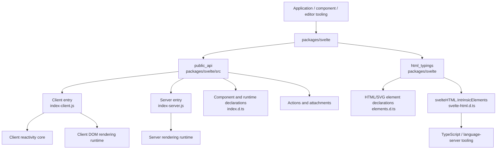
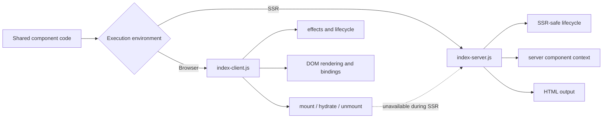
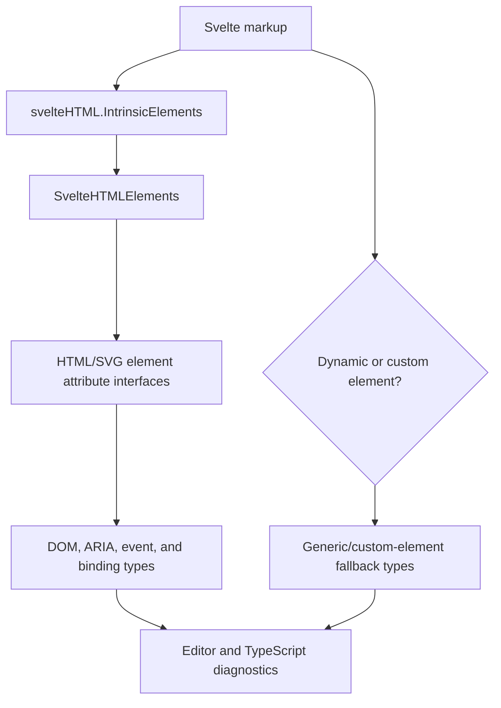

# public_package_entry_points

## Purpose

The `public_package_entry_points` module defines the package-level surfaces consumers import from `svelte`. It combines:

- Runtime APIs for component lifecycle, mounting, hydration, context, scheduling, events, actions, and attachments.
- TypeScript contracts for components, snippets, props, events, HTML/SVG attributes, bindings, and editor tooling.
- Environment-specific client and server behavior.
- Compatibility declarations for legacy Svelte components and APIs.

The module is located at `packages/svelte` and consists of two primary child modules:

- `public_api` — runtime exports and component-facing TypeScript APIs.
- `html_typings` — markup typings and language-server integration.

## Architecture

### Runtime entry-point split

The public API is an adapter boundary over the compiler-generated component shape and internal runtimes. Client APIs delegate to reactivity and DOM-rendering systems, while server APIs provide SSR-safe alternatives and reject browser-only operations.

### Markup type-checking flow

`elements.d.ts` provides the reusable public vocabulary, while `svelte-html.d.ts` bridges that vocabulary into global intrinsic-element declarations used by Svelte tooling.

## Core component references

- [public_api](public_api.md) — package runtime exports, client/server behavior, lifecycle, mounting, context, events, actions, attachments, and component types.
- [html_typings](html_typings.md) — HTML/SVG attributes, DOM events, ARIA metadata, bindings, intrinsic elements, and editor integration.
- [compilation_pipeline](compilation_pipeline.md) — produces the component structures consumed by the public runtime API.
- [client_reactivity_core](client_reactivity_core.md) — signals, effects, scheduling, teardown, and abortable reactive work.
- [client_dom_rendering_runtime](client_dom_rendering_runtime.md) — DOM blocks, elements, bindings, hydration, and rendering lifecycle.
- [server_rendering_and_shared_runtime_primitives](server_rendering_and_shared_runtime_primitives.md) — SSR context, payload generation, and server helpers.
- [published_type_declaration_surface](published_type_declaration_surface.md) — aggregated published TypeScript declarations.
- [legacy_compatibility_and_migration](legacy_compatibility_and_migration.md) — legacy components, lifecycle APIs, event dispatching, and migration support.