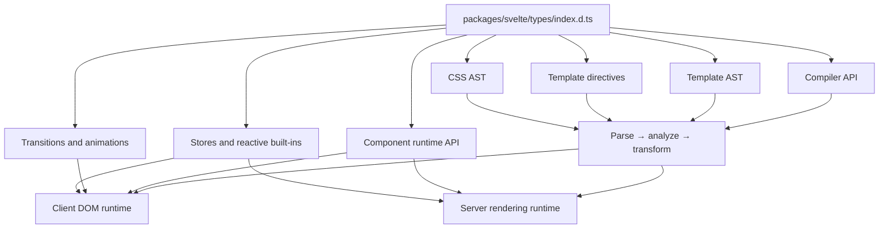
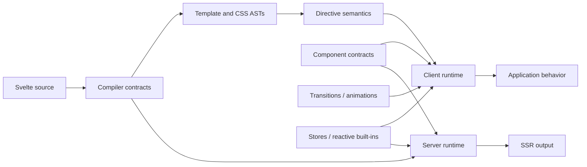

# `published_type_declaration_surface`

## Purpose

`published_type_declaration_surface` is Svelte’s aggregate public TypeScript declaration layer, located at `packages/svelte/types/index.d.ts`.

It defines the contracts consumed by application code, tooling, compiler integrations, and runtime APIs. The module does not implement parsing, compilation, rendering, reactivity, stores, or animations; it exposes their stable public types and connects them through a single published surface.

## Architecture

The declaration surface is organized around three major boundaries:

- Compiler and AST declarations describe parsing, preprocessing, diagnostics, compilation results, template nodes, directives, and CSS structures.
- Runtime declarations describe components, snippets, actions, attachments, rendering output, stores, reactive wrappers, transitions, and animations.
- Client and server implementations consume the same public contracts while providing environment-specific behavior.

## Core component documentation

- [compiler_api](compiler_api.md) — public `parse`, `compile`, `compileModule`, `preprocess`, and `migrate` APIs.
- [template_ast](template_ast.md) — modern component template AST, nodes, blocks, elements, and source locations.
- [template_directives](template_directives.md) — public directive types and their compiler/runtime consumers.
- [css_ast](css_ast.md) — stylesheet, selector, rule, at-rule, and declaration AST contracts.
- [component_runtime_api](component_runtime_api.md) — modern and legacy component types, snippets, actions, attachments, and render output.
- [transitions_and_animations](transitions_and_animations.md) — transition, animation, easing, and configuration contracts.
- [stores_and_reactive_builtins](stores_and_reactive_builtins.md) — stores, store bridges, reactive collections, dates, URLs, and media queries.

## Related implementation documentation

- [compilation_pipeline](compilation_pipeline.md) — compiler phase orchestration.
- [client_reactivity_core](client_reactivity_core.md) — signals, effects, derived values, scheduling, and cleanup.
- [client_dom_rendering_runtime](client_dom_rendering_runtime.md) — client rendering and DOM updates.
- [server_rendering_and_shared_runtime_primitives](server_rendering_and_shared_runtime_primitives.md) — SSR behavior and shared runtime primitives.
- [public_package_entry_points](public_package_entry_points.md) — package exports and consumer-facing entry points.
- [legacy_compatibility_and_migration](legacy_compatibility_and_migration.md) — legacy component types and migration support.