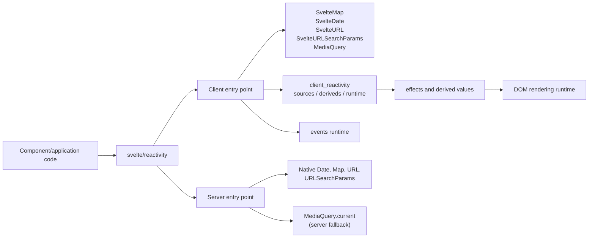
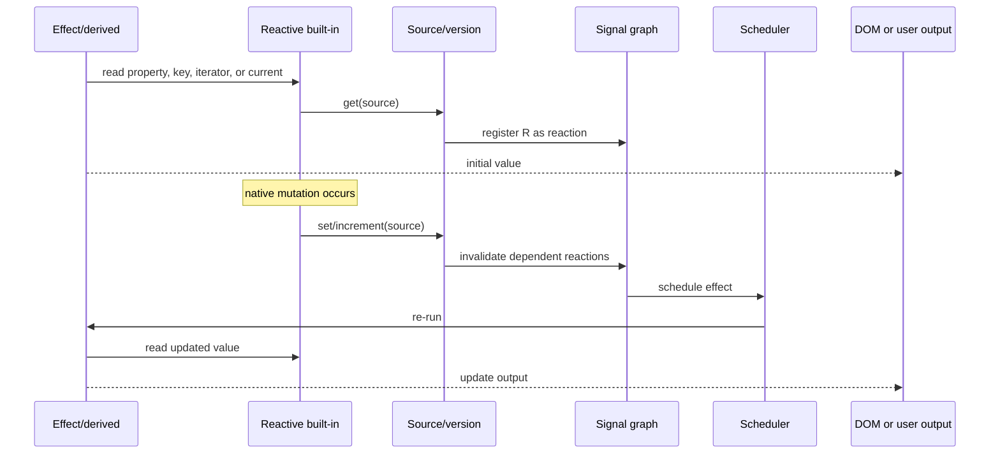
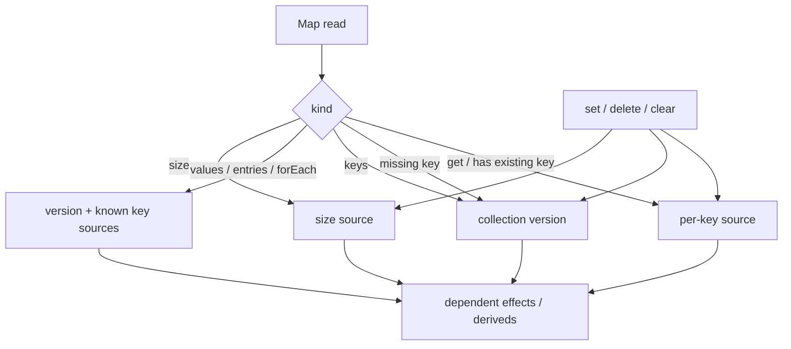
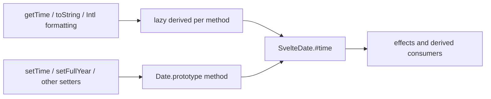
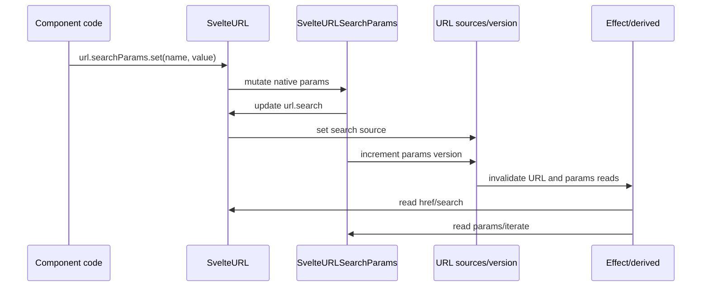
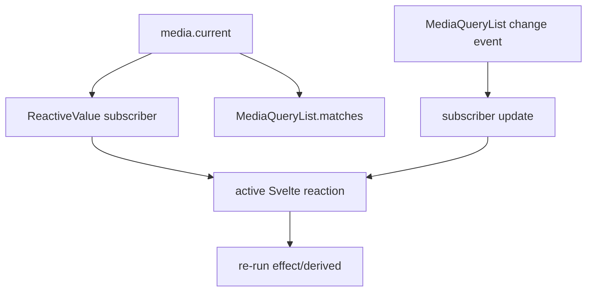
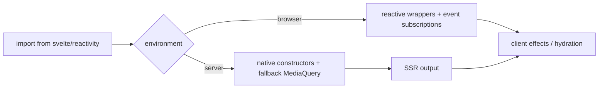

# reactive_builtins

`reactive_builtins` provides reactive wrappers around browser and JavaScript built-ins whose
ordinary mutations are invisible to Svelte's dependency graph. The wrappers preserve the native
APIs while recording reads and invalidating effects or derived values when the underlying object
changes.

The module is exposed through `svelte/reactivity`. It complements the general signal runtime in
[client_reactivity](client_reactivity.md), rather than replacing `$state` or stores. The compiler
and DOM runtime consume the resulting invalidations through the same mechanisms described in
[client_transform_client_core](compiler_transform_client_core.md) and
[client_dom_rendering_runtime](client_dom_rendering_runtime.md).

## 1. Role in the system

The module has two execution profiles:

- The client profile uses Svelte sources, derived values, and external-event subscribers.
- The server profile exports native constructors where no live browser reactivity is possible;
  `MediaQuery` instead exposes a deterministic fallback value.

The public client entry point also exports `SvelteSet` from the same package. Its implementation
is a sibling of `SvelteMap`; it is not included in the supplied core component set and is therefore
not detailed below.

## 2. Component inventory

| Component | Native base | Reactive surface | Main invalidation strategy |
| --- | --- | --- | --- |
| `SvelteMap` | `Map` | key reads, iteration, `size`, mutations | Per-key sources plus collection version and size source |
| `SvelteDate` | `Date` | getters, string conversion, `valueOf`, setters | One time source; lazily-created derived getter values |
| `SvelteURL` | `URL` | URL properties and `searchParams` | One source per URL field; synchronized search-parameter object |
| `SvelteURLSearchParams` | `URLSearchParams` | lookups, iteration, serialization, `size` | Collection version source and URL synchronization |
| `MediaQuery` | `MediaQueryList` | `current` | `ReactiveValue` plus `change` event subscription |
| server `MediaQuery` | none | `current` | Constructor fallback, defaulting to `false` |

All client wrappers retain native return values and mutation semantics. Reactivity is an additive
side effect of reading or writing; values stored inside a `SvelteMap` are not recursively proxied.

## 3. Shared reactive model

`SvelteMap`, `SvelteDate`, `SvelteURL`, and `SvelteURLSearchParams` directly call the client
runtime's `get`, `set`, `state`, `source`, or `increment` helpers. A read inside an effect or
derived therefore registers a dependency, and a mutation marks the corresponding signal dirty.
See [client_reactivity](client_reactivity.md) for signal fields, scheduling, batching, and effect
ownership.

## 4. `SvelteMap`

`SvelteMap<K, V>` extends `Map<K, V>` and tracks dependencies at useful granularities:

- A key that exists gets a dedicated source. `get(key)` and `has(key)` depend on that source.
- A missing key reads the collection version, so a later insertion of that key can invalidate the
  reaction.
- `keys()` depends on the collection version because key membership and insertion order matter.
- `values()`, `entries()`, `forEach()`, and the default iterator read the collection and all known
  key sources, covering both membership and value changes.
- `size` reads a separate size source.

`set` creates tracking state for a new key, updates size, and increments the collection version.
For an existing key it invalidates the key source only when the value changes, and may also bump
the collection version when collection-level reactions are not already covered by that key's
reactions. `delete` and `clear` invalidate removed keys and collection-level consumers.

The wrapper tracks map structure and value replacement, not deep changes to an object used as a
map value. Use Svelte state/proxies or another reactive built-in when nested mutation must be
observed.

## 5. `SvelteDate`

`SvelteDate` extends `Date` and stores the timestamp in a private reactive source. During first
initialization it inspects `Date.prototype` and installs wrappers for:

- methods beginning with `get`, `to`, or `valueOf`;
- methods beginning with `set`.

Getter-like methods with no arguments are represented by lazily-created derived values. This
avoids repeating the same calculation for multiple consumers and preserves the reaction context
captured when the instance is constructed. Getter-like calls with arguments read the time source
directly. Every setter delegates to the native method and then writes the resulting timestamp to
the source, so all date-derived reads update together.

## 6. `SvelteURL` and `SvelteURLSearchParams`

`SvelteURL` extends `URL` and maintains a source for each mutable URL component: protocol,
username, password, hostname, port, pathname, hash, and search. Composite getters register all
sources needed to compute their native result:

- `host` depends on hostname and port;
- `origin` depends on protocol, hostname, and port;
- `href` depends on every URL component.

Setters perform the native update first, then publish the canonical value from the native URL.
Changing `href` or `search` also replaces the contents of the associated
`SvelteURLSearchParams` instance.

`SvelteURLSearchParams` tracks reads using one version source. Reads through `get`, `getAll`,
`has`, iteration, `toString`, and `size` depend on that version. Mutating methods (`append`,
`delete`, `set`, and `sort`) delegate to the native implementation, update the owning URL's
`search` field, and increment the version when appropriate. A private re-entrancy flag prevents
URL-to-params and params-to-URL synchronization from recursively updating each other.

The `current_url` hand-off during construction lets `SvelteURLSearchParams` associate itself with
the URL being constructed without exposing a public back-reference API. The internal `REPLACE`
symbol is used when URL setters need to copy a new native parameter set into the existing reactive
object.

## 7. `MediaQuery` and external subscriptions

`MediaQuery` is built on the `ReactiveValue` abstraction in `reactive-value.js`. The abstraction
combines a value function with a lazily-managed subscriber: reading `.current` subscribes the
active reaction, then evaluates the value function. `MediaQuery` creates a `MediaQueryList` with
`window.matchMedia`, reads `q.matches`, and subscribes to its `change` event.

The constructor normalizes common queries by adding parentheses when the query is not already
parenthesized and is not composed of keywords such as `screen`, `print`, `and`, `or`, `not`, or
`only`. This preserves valid keyword-only media queries while making feature expressions accepted
by `matchMedia`.

The class is browser-oriented. During SSR, `index-server.js` provides a lightweight compatibility
class whose `.current` is the supplied `matches` argument, defaulting to `false`; it does not
attempt to evaluate a real viewport. This avoids browser access during server rendering but means
that media-query-dependent markup can differ during hydration. Prefer CSS media queries where
possible.

## 8. Server compatibility and boundaries

The server entry point exports `globalThis.Date`, `Map`, `Set`, `URL`, and
`URLSearchParams` under the Svelte names. It also exports `createSubscriber` as a no-op-compatible
function. Consequently, code can share imports across SSR and browser builds, but only the client
build provides live dependency tracking.

This module does not own scheduling, DOM operations, store subscription semantics, or server
payload construction. Follow the links below for those concerns:

- [client_reactivity](client_reactivity.md) — source graph, derived values, effects, and batching.
- [client_store_interop](client_store_interop.md) — bridges between stores and compiled reactive
  code.
- [stores](stores.md) — public store contracts and lifecycle.
- [client_dom_rendering_runtime](client_dom_rendering_runtime.md) — blocks, attributes, bindings,
  hydration, and DOM effects.
- [server_runtime](server_runtime.md) — server rendering primitives and context.

## 9. Practical guidance

- Read a property or collection through an effect/derived to establish the dependency.
- Mutate the wrapper itself (`map.set`, `date.setTime`, `url.pathname = ...`, or
  `params.append`) so the wrapper can publish invalidation.
- Treat map values as shallow: replacing a value is observable, mutating an object stored in the
  map is not necessarily observable.
- Avoid relying on a precise `MediaQuery.current` value during SSR; provide a fallback only when
  the application can tolerate the hydration transition.
- Use stores when the state is primarily an explicit subscription stream, and use these wrappers
  when native object ergonomics and mutation methods are central to the component API.

## 10. Source map

| Source | Key implementation |
| --- | --- |
| `packages/svelte/src/reactivity/map.js` | `SvelteMap` per-key, version, and size tracking |
| `packages/svelte/src/reactivity/date.js` | `SvelteDate` method wrapping and derived getters |
| `packages/svelte/src/reactivity/url.js` | `SvelteURL` field sources and params synchronization |
| `packages/svelte/src/reactivity/url-search-params.js` | Reactive parameter collection and URL coupling |
| `packages/svelte/src/reactivity/media-query.js` | Browser `matchMedia` adapter |
| `packages/svelte/src/reactivity/reactive-value.js` | Generic externally-subscribed reactive value |
| `packages/svelte/src/reactivity/index-client.js` | Browser-facing exports |
| `packages/svelte/src/reactivity/index-server.js` | SSR compatibility exports |
