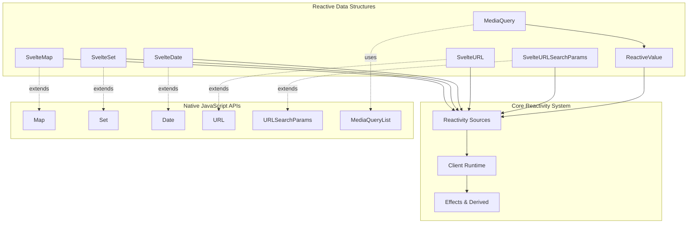
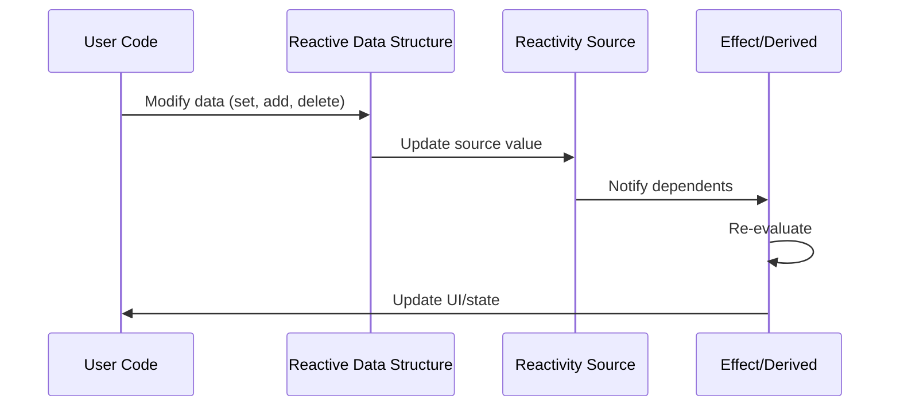

# Reactive Data Structures Module

## Overview

The reactive data structures module provides reactive versions of built-in JavaScript objects and utilities that automatically track changes and trigger updates in Svelte's reactivity system. These structures seamlessly integrate with Svelte's `$effect` and `$derived` to provide fine-grained reactivity for complex data operations.

## Purpose

This module extends JavaScript's native data structures (Map, Set, Date, URL, URLSearchParams) with reactive capabilities, allowing developers to:

- Track changes to data structures automatically
- Trigger reactive updates when data is modified
- Maintain compatibility with native JavaScript APIs
- Provide specialized reactive utilities like media queries

## Architecture Overview



## Core Components

The reactive data structures module is organized into three main functional areas:

### Collection Data Structures
Reactive versions of JavaScript's built-in collection types that provide fine-grained reactivity for data manipulation operations.

- **SvelteMap**: Reactive Map implementation with individual key tracking
- **SvelteSet**: Reactive Set implementation with element-specific reactivity

For detailed information about collection structures, see [Collection Structures Documentation](collection_structures.md).

### Web API Wrappers
Reactive wrappers around web platform APIs that provide automatic change tracking and synchronization.

- **SvelteDate**: Reactive Date object with time-based change tracking
- **SvelteURL**: Reactive URL with individual property tracking
- **SvelteURLSearchParams**: Reactive URLSearchParams with synchronized updates

For detailed information about web API wrappers, see [Web API Wrappers Documentation](web_api_wrappers.md).

### Utility Classes
Foundation classes and utilities for building custom reactive data structures and integrating with external systems.

- **ReactiveValue**: Base class for creating reactive values from external sources
- **MediaQuery**: Reactive media query implementation for responsive design

For detailed information about utility classes, see [Utility Classes Documentation](utility_classes.md).

## Reactivity Integration

All reactive data structures integrate with Svelte's core reactivity system through:

### Source Management
- **State Sources**: Track primitive values and trigger updates
- **Version Sources**: Track collection-wide changes
- **Derived Sources**: Provide memoized computed values

### Change Detection


### Performance Optimizations
- **Lazy Source Creation**: Sources are created only when accessed
- **Batch Updates**: Multiple changes can be batched for efficiency
- **Version Tracking**: Prevents unnecessary re-evaluations
- **Memoization**: Expensive operations are cached using derived values

## Usage Patterns

### Basic Reactive Collections
```javascript
import { SvelteMap, SvelteSet } from 'svelte/reactivity';

// Reactive map with automatic UI updates
const userPreferences = new SvelteMap();
userPreferences.set('theme', 'dark');

// Reactive set for managing selections
const selectedItems = new SvelteSet();
selectedItems.add('item1');
```

### Temporal Reactivity
```javascript
import { SvelteDate } from 'svelte/reactivity';

// Reactive date that updates UI automatically
const currentTime = new SvelteDate();
setInterval(() => currentTime.setTime(Date.now()), 1000);
```

### URL State Management
```javascript
import { SvelteURL } from 'svelte/reactivity';

// Reactive URL with synchronized search parameters
const appURL = new SvelteURL(window.location.href);
appURL.searchParams.set('page', '2'); // Automatically updates URL
```

### Media Query Reactivity
```javascript
import { MediaQuery } from 'svelte/reactivity';

// Reactive media query for responsive design
const isMobile = new MediaQuery('(max-width: 768px)');
// isMobile.current automatically updates when screen size changes
```

## Integration with Other Modules

### Client Runtime System
The reactive data structures depend heavily on the [client_runtime](client_runtime.md) module for:
- Reactivity sources and signals
- Effect tracking and execution
- Batch processing capabilities
- Runtime state management

### Compiler Integration
Works with the [compiler_core](compiler_core.md) module to:
- Optimize reactive data structure usage during compilation
- Generate efficient update code
- Provide development-time debugging information

### Component System
Integrates with the [component_system](component_system.md) to:
- Provide reactive state management within components
- Support component lifecycle integration
- Enable cross-component data sharing

## Development and Debugging

### Development Mode Features
- **Source Tagging**: All reactive sources are tagged for debugging
- **Change Tracking**: Detailed logging of data structure modifications
- **Performance Monitoring**: Track source creation and update patterns

### Error Handling
- **Validation**: Input validation with native JavaScript error handling
- **State Consistency**: Ensures reactive state remains synchronized
- **Memory Management**: Automatic cleanup of unused sources

## Performance Considerations

### Memory Management
- Sources are created lazily to minimize memory usage
- Unused sources are automatically cleaned up
- Version tracking prevents memory leaks in long-running applications

### Update Efficiency
- Fine-grained reactivity minimizes unnecessary updates
- Batch processing reduces update overhead
- Memoization prevents redundant computations

### Scalability
- Efficient handling of large collections
- Optimized iteration patterns
- Minimal overhead for unused features

## Best Practices

1. **Use Appropriate Data Structures**: Choose the right reactive data structure for your use case
2. **Minimize Source Creation**: Access patterns that create fewer sources perform better
3. **Batch Updates**: Group related changes together when possible
4. **Leverage Memoization**: Use derived values for expensive computations
5. **Handle Server-Side Rendering**: Provide appropriate fallbacks for SSR scenarios

## Future Considerations

The reactive data structures module is designed to be extensible and may include:
- Additional reactive data structures (WeakMap, WeakSet)
- Enhanced performance optimizations
- Better integration with web platform APIs
- Improved development tooling and debugging capabilities