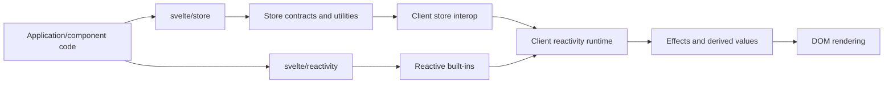
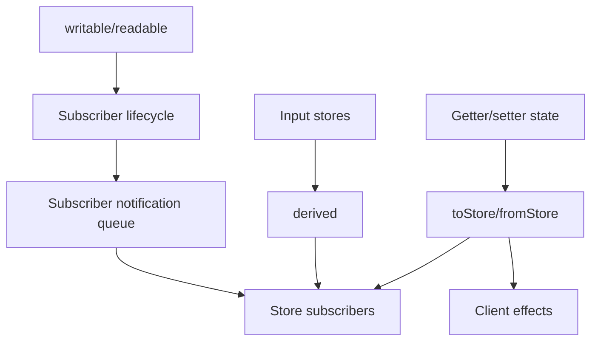
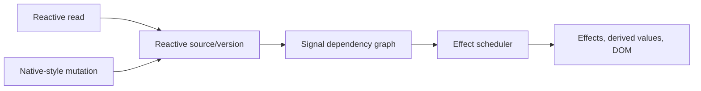

# Reactive State and Stores Library

The `reactive_state_and_stores_library` module provides Svelte’s public reactive state primitives:

- `stores` — explicit subscription-based state with `Readable`, `Writable`, `derived`, lifecycle management, and store/state bridges.
- `reactive_builtins` — reactive wrappers for mutable browser and JavaScript built-ins such as `SvelteMap`, `SvelteDate`, `SvelteURL`, `SvelteURLSearchParams`, and `MediaQuery`.

Together, these modules support both explicit data streams and reactive native-object APIs across client and server environments.

## Architecture



### Stores

Stores are implemented under `packages/svelte/src/store` and expose shared behavior for client and server builds.



`writable` manages values, subscribers, equality checks, and start/stop notifiers. `derived` combines one or more stores while waiting for all inputs to provide current values. `toStore` and `fromStore` bridge stores with getter/setter state; client builds connect these bridges to live reactions, while server builds provide snapshot behavior.

### Reactive built-ins

Reactive built-ins preserve native APIs while registering dependencies and invalidating effects when mutations occur.



`SvelteMap` tracks keys, collection membership, iteration, and size. `SvelteDate` tracks timestamp-dependent getters and setters. `SvelteURL` and `SvelteURLSearchParams` synchronize URL state and parameter mutations. `MediaQuery` adapts browser `matchMedia` events, with an SSR fallback.

## Repository structure

```text
packages/svelte/src/
├── store/       # stores
└── reactivity/  # reactive_builtins
```

## Core component documentation

- [stores](stores.md) — store contracts, lifecycle, derived stores, notification ordering, and client/server bridges.
- [reactive_builtins](reactive_builtins.md) — reactive native-object wrappers and external subscriptions.
- [client_reactivity](client_reactivity.md) — signal sources, derived values, effects, scheduling, and batching.
- [client_store_interop](client_store_interop.md) — compiler-generated `$store` integration.
- [compiler_transform_server_javascript_stores](compiler_transform_server_javascript_stores.md) — server-side store code generation.
- [client_dom_rendering_runtime](client_dom_rendering_runtime.md) — DOM effects and rendering consumers.
- [server_runtime](server_runtime.md) — server rendering primitives and context.