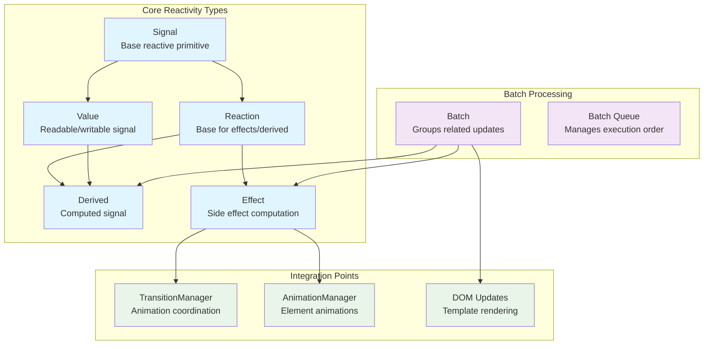
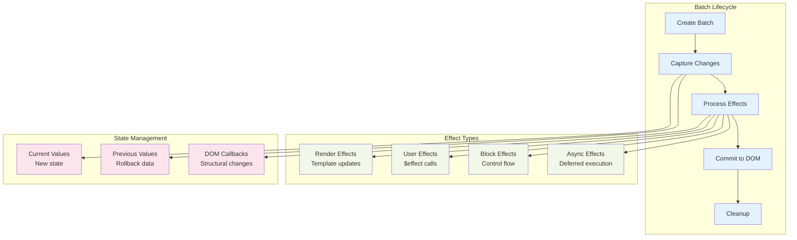
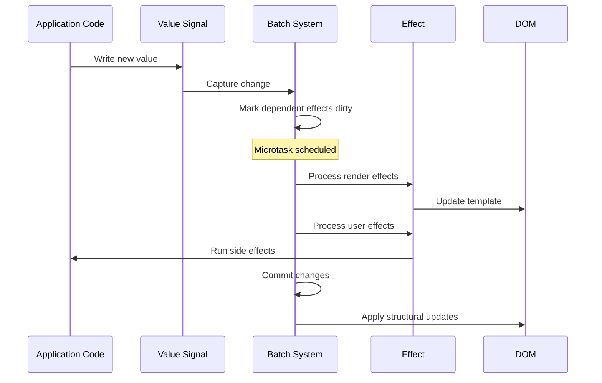

# Reactivity System

The reactivity system is the core engine that powers Svelte's reactive programming model. It provides fine-grained reactivity through signals, effects, and batch processing, enabling efficient updates to the DOM when application state changes.

## Overview

The reactivity system implements a signal-based reactive programming paradigm where:
- **Signals** represent reactive values that can be read and written
- **Effects** are computations that automatically re-run when their dependencies change
- **Derived values** are computed signals that update when their inputs change
- **Batch processing** optimizes updates by grouping related changes together

This system enables Svelte's declarative programming model where the UI automatically stays in sync with application state without manual DOM manipulation.

## Architecture



## Core Components

### Signal Interface

The base interface for all reactive primitives in the system:

```typescript
interface Signal {
    f: number;    // Flags bitmask for state tracking
    wv: number;   // Write version for change detection
}
```

**Key Features:**
- **Flags System**: Uses bitmasks to efficiently track signal state (dirty, clean, etc.)
- **Version Tracking**: Write versions enable efficient change detection
- **Memory Efficient**: Minimal overhead per signal instance

### Value<V> - Reactive State

Represents mutable reactive state that can be read from and written to:

```typescript
interface Value<V = unknown> extends Signal {
    equals: Equals;           // Custom equality function
    reactions: Reaction[];    // Dependent computations
    rv: number;              // Read version
    v: V;                    // Current value
    
    // Development features
    label?: string;          // Debug label
    created?: Error;         // Creation stack trace
    updated?: Map<string, {error: Error; count: number}>;
    set_during_effect?: boolean;
    trace?: () => void;
}
```

**Key Features:**
- **Change Detection**: Configurable equality functions for optimization
- **Dependency Tracking**: Maintains list of dependent reactions
- **Development Support**: Rich debugging information in dev mode
- **Effect Safety**: Tracks writes during effect execution

### Reaction - Base for Computations

Base interface for effects and derived values:

```typescript
interface Reaction extends Signal {
    ctx: ComponentContext | null;  // Associated component
    fn: Function | null;           // Computation function
    deps: Value[] | null;          // Input dependencies
    ac: AbortController | null;    // Cleanup controller
}
```

**Key Features:**
- **Component Integration**: Links to Svelte component lifecycle
- **Dependency Management**: Tracks input signals for invalidation
- **Cleanup Support**: AbortController for resource cleanup
- **Execution Control**: Function can be nulled for disposal

### Derived<V> - Computed Values

Computed signals that automatically update when dependencies change:

```typescript
interface Derived<V = unknown> extends Value<V>, Reaction {
    fn: () => V;                    // Computation function
    effects: Effect[] | null;       // Child effects
    parent: Effect | Derived | null; // Parent in computation tree
}
```

**Key Features:**
- **Automatic Updates**: Recomputes when dependencies change
- **Effect Management**: Can create and manage child effects
- **Hierarchical**: Forms computation trees with parent/child relationships
- **Memoization**: Only recomputes when dependencies actually change

### Effect - Side Effects

Manages side effects and DOM updates:

```typescript
interface Effect extends Reaction {
    nodes_start: TemplateNode | null;  // DOM range start
    nodes_end: TemplateNode | null;    // DOM range end
    fn: (() => void | (() => void)) | null; // Effect function
    teardown: (() => void) | null;     // Cleanup function
    transitions: TransitionManager[];  // Animation managers
    
    // Tree structure
    prev: Effect | null;    // Previous sibling
    next: Effect | null;    // Next sibling  
    first: Effect | null;   // First child
    last: Effect | null;    // Last child
    parent: Effect | null;  // Parent effect
    
    b: Boundary | null;     // Error boundary
    
    // Development
    component_function?: any;
    dev_stack?: DevStackEntry | null;
}
```

**Key Features:**
- **DOM Management**: Tracks associated DOM nodes for updates
- **Cleanup Support**: Automatic teardown function execution
- **Animation Integration**: Manages transitions and animations
- **Tree Structure**: Hierarchical organization for proper cleanup order
- **Error Boundaries**: Integration with Svelte's error handling

## Batch Processing System

### Batch Class

The `Batch` class orchestrates reactive updates by grouping related changes:



**Key Features:**
- **Change Tracking**: Captures before/after values for rollback
- **Effect Scheduling**: Organizes effects by type and priority
- **Async Coordination**: Manages asynchronous effects and promises
- **DOM Optimization**: Batches DOM updates for performance

## Data Flow



## Integration with Other Systems

### Component System Integration

The reactivity system integrates closely with Svelte's [component system](component_system.md):

- **Component Context**: Effects are associated with component instances
- **Lifecycle Integration**: Effects are cleaned up when components unmount
- **State Management**: Component state is backed by reactive signals

### Animation and Transition Integration

Effects coordinate with [animation and transition systems](animation_transition.md):

- **TransitionManager**: Manages element enter/exit animations
- **AnimationManager**: Handles element position animations
- **Timing Coordination**: Ensures animations complete before DOM cleanup

### Batch Processing Integration

The reactivity system works with [batch processing](batch_processing.md) for optimization:

- **Update Batching**: Groups related state changes together
- **Effect Scheduling**: Prioritizes different types of effects
- **Async Coordination**: Manages promises and async effects

## Development Features

### Debug Support

The system includes comprehensive debugging features:

- **Signal Labels**: Human-readable names for signals
- **Stack Traces**: Creation and update tracking
- **Effect Trees**: Visualization of effect hierarchies
- **Change Tracking**: History of value changes

### Performance Monitoring

Built-in performance tracking:

- **Version Tracking**: Efficient change detection
- **Dependency Graphs**: Optimization of update paths
- **Batch Metrics**: Update frequency and size tracking

## Usage Patterns

### Basic Reactive State

```typescript
// Create reactive state
const count = $state(0);

// Create derived value
const doubled = $derived(count * 2);

// Create effect
$effect(() => {
    console.log(`Count is ${count}`);
});
```

### Advanced Effect Management

```typescript
// Effect with cleanup
$effect(() => {
    const timer = setInterval(() => {
        count++;
    }, 1000);
    
    // Cleanup function
    return () => clearInterval(timer);
});

// Pre-effect for DOM measurements
$effect.pre(() => {
    // Runs before DOM updates
    measureElement();
});
```

### Custom Equality

```typescript
// Custom equality for objects
const user = $state(
    { name: 'John', age: 30 },
    (a, b) => a.name === b.name && a.age === b.age
);
```

## Performance Characteristics

### Memory Efficiency

- **Minimal Overhead**: Each signal has minimal memory footprint
- **Weak References**: Automatic cleanup of unused signals
- **Batch Optimization**: Reduces memory allocation during updates

### Update Performance

- **Fine-grained Updates**: Only affected components re-render
- **Batch Processing**: Groups updates for optimal DOM performance
- **Version Tracking**: O(1) change detection

### Scalability

- **Large Applications**: Handles thousands of signals efficiently
- **Deep Hierarchies**: Optimized for complex component trees
- **Async Support**: Non-blocking updates for better UX

## Error Handling

### Signal Errors

- **Creation Tracking**: Stack traces for signal creation
- **Update Tracking**: History of value changes
- **Circular Dependencies**: Detection and prevention

### Effect Errors

- **Boundary Integration**: Works with error boundaries
- **Cleanup Guarantees**: Ensures cleanup even on errors
- **Development Warnings**: Helpful error messages in dev mode

## Future Considerations

### Planned Enhancements

- **Signal Debugging Tools**: Enhanced development experience
- **Performance Profiling**: Built-in performance analysis
- **Memory Optimization**: Further reduction in memory usage

### Compatibility

- **Legacy Support**: Maintains compatibility with Svelte 4 patterns
- **Migration Path**: Clear upgrade path for existing applications
- **Framework Integration**: Designed for use in other frameworks

## Related Documentation

- [Component System](component_system.md) - How components use reactivity
- [Animation and Transition](animation_transition.md) - Animation coordination
- [Batch Processing](batch_processing.md) - Update optimization
- [Client Runtime](client_runtime.md) - Overall runtime architecture
- [Compiler Core](compiler_core.md) - How reactivity is compiled