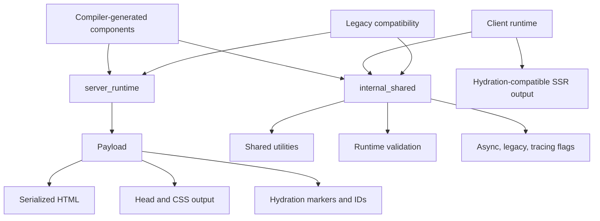
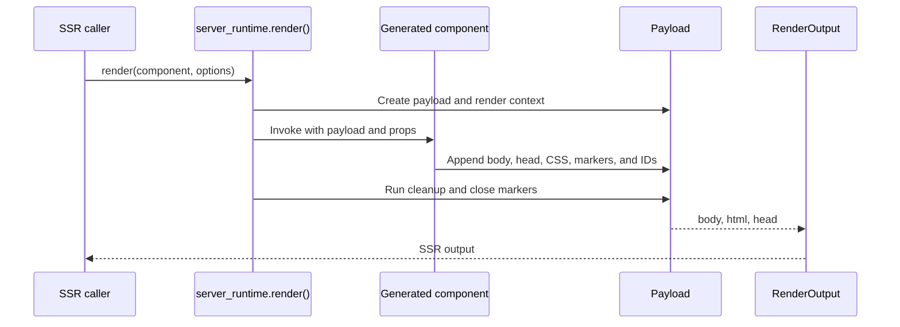
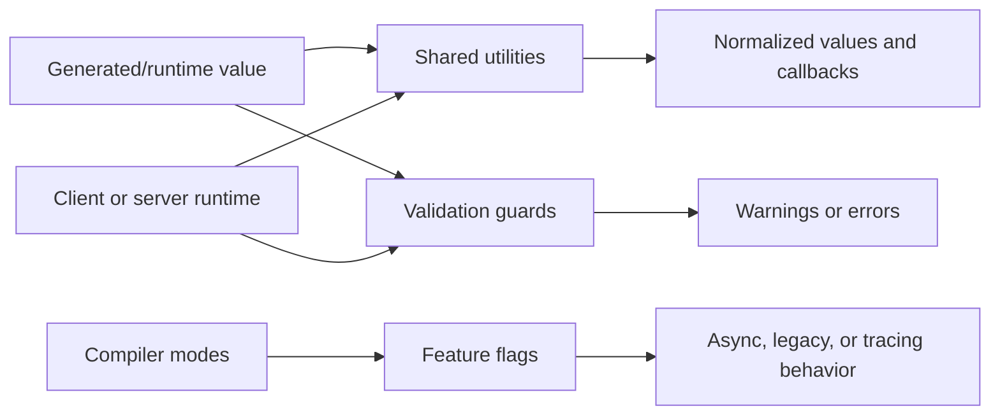

# Server Rendering and Shared Runtime Primitives

## Purpose

The `server_rendering_and_shared_runtime_primitives` module provides the runtime foundation for Svelte’s server-side rendering and environment-neutral helpers.

It combines:

- `server_runtime`: synchronous SSR execution, HTML serialization, hydration markers, head/CSS collection, component context, stores, snippets, and render cleanup.
- `internal_shared`: reusable utilities, runtime validation, iterable/promise helpers, and compiler/runtime feature flags shared by client, server, and compatibility code.

The module is consumed primarily by compiler-generated components and higher-level client/server runtimes rather than directly by application code.

## Architecture



### SSR render flow



### Shared primitive flow



## Core components

- [server_runtime](server_runtime.md) — SSR payloads, rendering primitives, attributes, blocks, snippets, context, stores, IDs, abort signals, and diagnostics.
- [internal_shared](internal_shared.md) — shared utilities, validation policies, feature flags, and common client/server contracts.

## Module structure

```text
server_rendering_and_shared_runtime_primitives/
├── server_runtime/
│   └── packages/svelte/src/internal/server
└── internal_shared/
    └── packages/svelte/src/internal
```