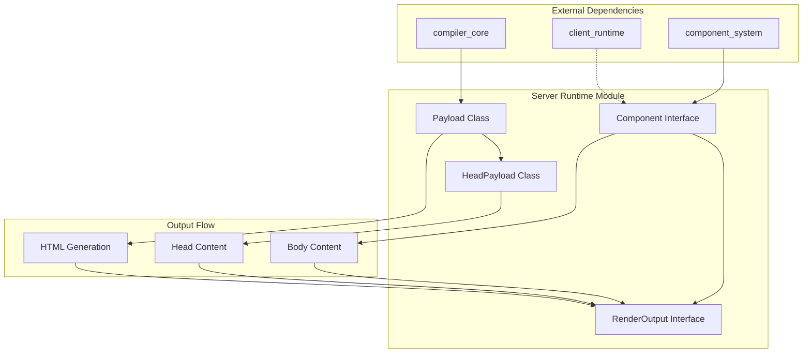
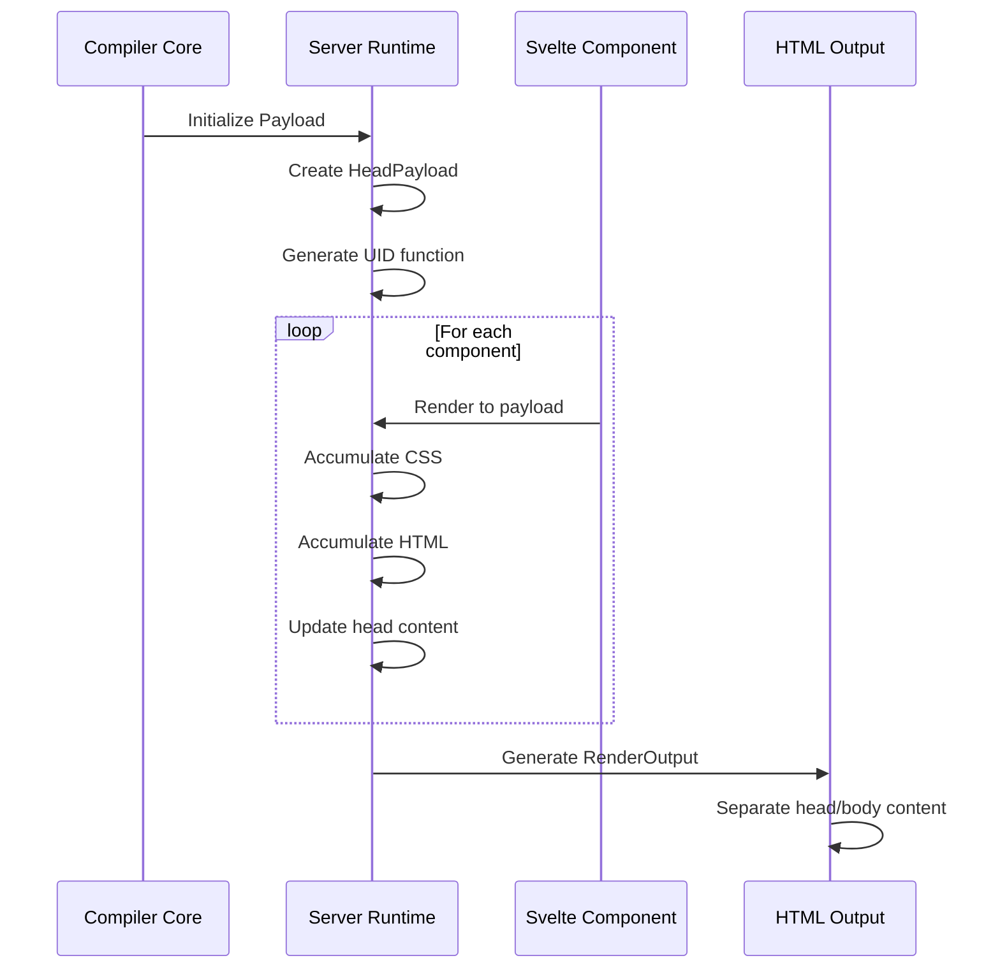

# Server Runtime Module

## Overview

The `server_runtime` module is a core component of Svelte's server-side rendering (SSR) infrastructure. It provides the essential building blocks for rendering Svelte components on the server, managing payload data structures, and generating HTML output that can be sent to clients.

This module serves as the bridge between Svelte's compilation process and the actual server-side execution, handling the accumulation of rendered content, CSS styles, and metadata during the server rendering process.

## Purpose

The server runtime module enables:

- **Server-Side Rendering**: Provides the foundational structures for rendering Svelte components to HTML strings on the server
- **Payload Management**: Manages the accumulation of rendered content, CSS, and metadata during the rendering process
- **Component Lifecycle**: Handles server-side component instantiation and cleanup
- **Output Generation**: Structures the final HTML output with proper head and body content separation

## Architecture Overview



## Core Components

### Payload Management System

The payload system is responsible for accumulating rendered content during the server-side rendering process:

- **Payload Class**: Main container for rendered output, CSS, and utility functions
- **HeadPayload Class**: Specialized container for `<head>` section content
- **Utility Functions**: Helper functions for payload manipulation and ID generation

**Key Features:**
- CSS deduplication through Set-based storage
- Unique ID generation for server-rendered elements
- Hierarchical content organization (head vs body)
- Payload copying and assignment for component isolation

### Component System Interface

Defines the structure and lifecycle management for server-side components:

- **Component Interface**: Defines the server-side component structure with parent relationships, context, and cleanup handlers
- **RenderOutput Interface**: Standardizes the final HTML output format with separate head and body sections

**Key Features:**
- Parent-child component relationships
- Context propagation between components
- Cleanup function management for resource disposal
- Structured HTML output with head/body separation

## Data Flow



## Integration with Other Modules

### Compiler Core Integration
- Receives compiled component output from [compiler_core](compiler_core.md)
- Utilizes transform phase outputs for server-side rendering
- Integrates with analysis phase for component structure understanding

### Component System Integration
- Implements server-side component interfaces defined in [component_system](component_system.md)
- Provides server-specific component lifecycle management
- Handles component instantiation and cleanup

### Client Runtime Coordination
- Coordinates with [client_runtime](client_runtime.md) for hydration preparation
- Ensures server-rendered content is compatible with client-side reactivity
- Manages unique ID generation for client-server synchronization

## Key Features

### 1. Payload Accumulation
- **CSS Management**: Deduplicates and accumulates CSS styles across components
- **Content Buffering**: Efficiently buffers HTML output during rendering
- **Metadata Handling**: Manages title and other head metadata

### 2. Component Lifecycle
- **Parent-Child Relationships**: Maintains component hierarchy for proper cleanup
- **Context Propagation**: Enables context sharing between parent and child components
- **Resource Cleanup**: Provides mechanisms for proper resource disposal

### 3. Output Generation
- **Head/Body Separation**: Cleanly separates head and body content
- **Backward Compatibility**: Maintains deprecated `html` property for legacy support
- **Structured Output**: Provides well-defined interfaces for consuming applications

## Usage Patterns

### Basic Payload Usage
```javascript
// Initialize payload for rendering
const payload = new Payload('component-prefix');

// Render components (handled by compiler-generated code)
// payload.out.push('<div>content</div>');
// payload.css.add({ hash: 'abc123', code: '.class { color: red; }' });

// Generate final output
const output = {
  head: payload.head.out.join(''),
  body: payload.out.join(''),
  html: payload.out.join('') // deprecated
};
```

### Component Structure
```javascript
// Server-side component structure
const component = {
  p: parentComponent,           // Parent component reference
  c: new Map(),                // Component context
  d: [cleanupFunction1, ...]   // Cleanup functions
};
```

## Performance Considerations

- **Memory Efficiency**: Uses Set-based CSS storage to prevent duplicates
- **String Concatenation**: Efficiently accumulates HTML strings using arrays
- **ID Generation**: Lightweight unique ID generation for server-rendered elements
- **Payload Copying**: Optimized payload copying for component isolation

## Error Handling

The module provides robust error handling through:
- Safe payload copying with proper initialization
- Graceful handling of missing or undefined payload properties
- Component cleanup function execution with error isolation

## Future Considerations

- Enhanced streaming support for large component trees
- Improved memory management for long-running server processes
- Better integration with modern server frameworks
- Enhanced debugging and development tools

---

*This documentation covers the server_runtime module's core functionality. For related modules, see [compiler_core](compiler_core.md), [client_runtime](client_runtime.md), and [component_system](component_system.md).*