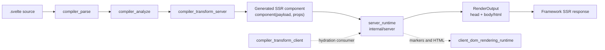
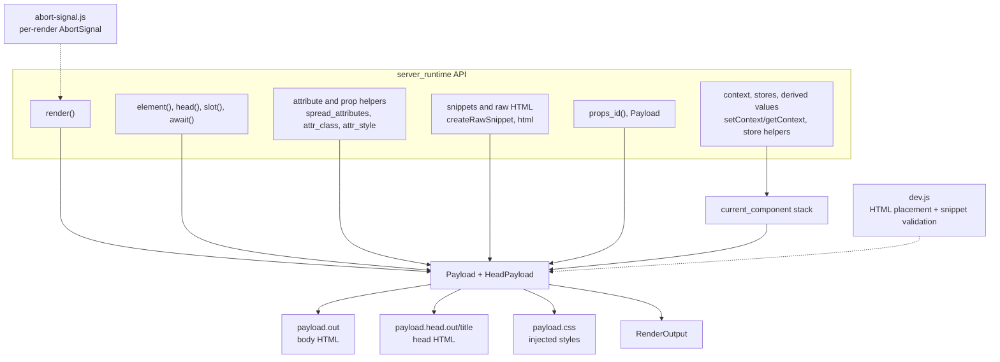
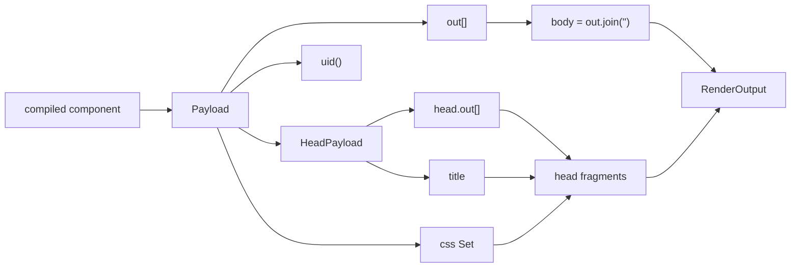
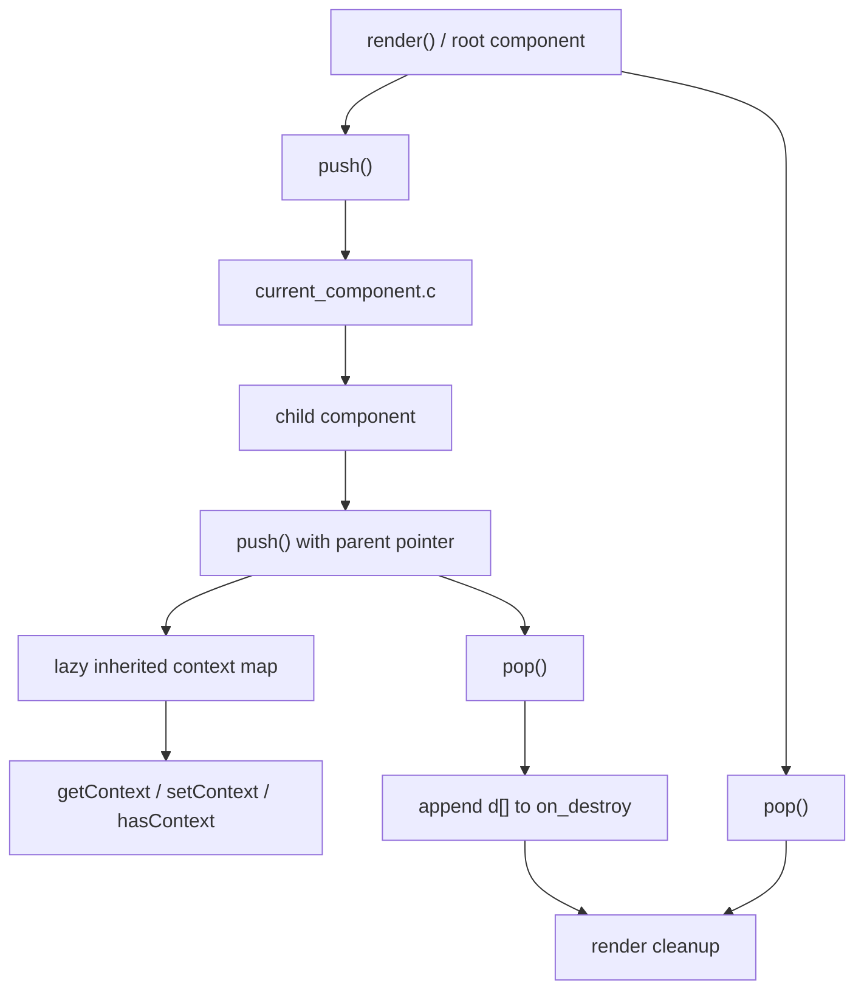
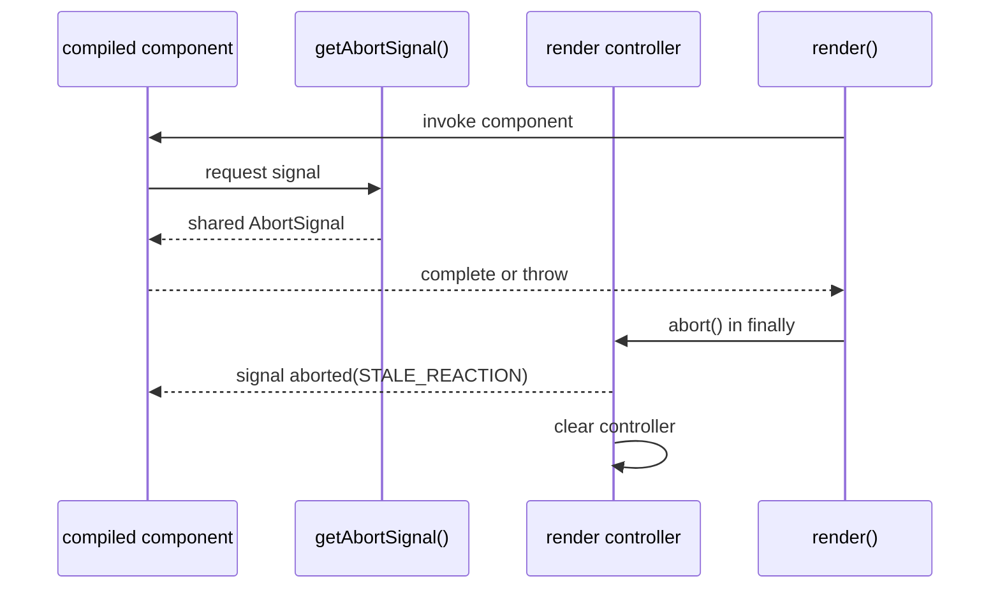
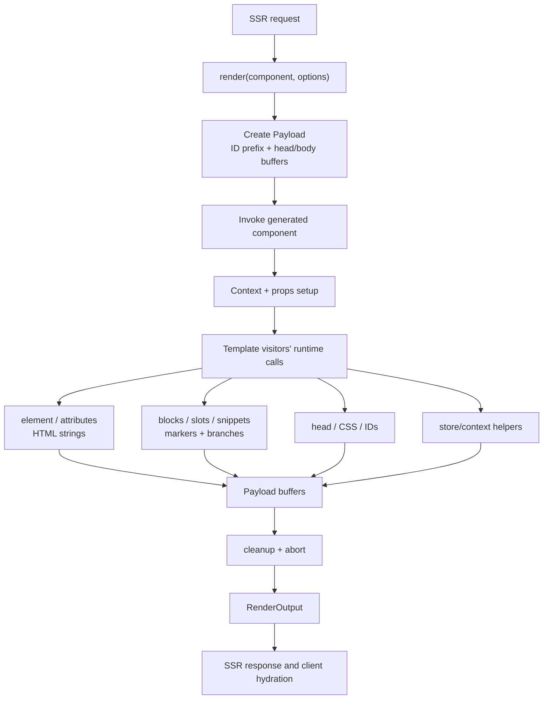

# server_runtime

## 1. Purpose

`server_runtime` is Svelte’s server-side rendering (SSR) runtime. It is the small, synchronous execution environment imported by compiler-generated server components. A compiled component receives a `Payload`, evaluates its template, and appends HTML, head content, CSS, hydration markers, and generated IDs to that payload.

The runtime is deliberately string-oriented: it does not create browser DOM nodes or maintain client-side reactive effects. Its responsibilities are to:

- serialize elements, attributes, styles, classes, slots, snippets, and raw HTML;
- preserve the structure required by client hydration through comment markers and stable IDs;
- provide server equivalents for stores, derived values, context, bindings, and async blocks;
- collect `<head>` output and injected component CSS;
- manage nested component context and render cleanup;
- provide development-only SSR validation for invalid HTML nesting and snippet arguments.

The compiler side that emits calls into this module is documented in [compiler_transform_server](compiler_transform_server.md), especially [compiler_transform_server_core](compiler_transform_server_core.md). The browser-side counterpart is [client_dom_rendering_runtime](client_dom_rendering_runtime.md).

## 2. Position in the system

The server runtime is consumed by generated SSR modules, not normally called directly by application code. The compiler converts a `.svelte` component into a function of the form `component(payload, props, …)`; the public server entry point creates the payload, invokes that function, and returns the accumulated `RenderOutput`.

```mermaid
flowchart LR
    Source[".svelte source"] --> Parse["compiler_parse"]
    Parse --> Analyze["compiler_analyze"]
    Analyze --> ServerGen["compiler_transform_server"]
    ServerGen --> Generated["Generated SSR component\ncomponent(payload, props)"]
    Generated --> Runtime["server_runtime\ninternal/server"]
    Runtime --> Output["RenderOutput\nhead + body/html"]
    Output --> Response["Framework SSR response"]

    ClientGen["compiler_transform_client"] -. hydration consumer .-> Runtime
    Runtime -. markers and HTML .-> ClientRuntime["client_dom_rendering_runtime"]
```

The larger server-rendering surface groups this module with shared helpers and server block primitives. Its compiler-facing boundary is described in [compiler_transform_server_core](compiler_transform_server_core.md), while the browser-facing runtime boundary is described in [client_dom_rendering_runtime](client_dom_rendering_runtime.md).

## 3. Architecture

```mermaid
flowchart TB
    subgraph API["server_runtime API"]
        Render["render()"]
        Elements["element(), head(), slot(), await()"]
        Attrs["attribute and prop helpers\nspread_attributes, attr_class, attr_style"]
        State["context, stores, derived values\nsetContext/getContext, store helpers"]
        Composition["snippets and raw HTML\ncreateRawSnippet, html"]
        IDs["props_id(), Payload"]
    end

    Render --> Payload["Payload + HeadPayload"]
    Elements --> Payload
    Attrs --> Payload
    Composition --> Payload
    IDs --> Payload
    State --> ComponentStack["current_component stack"]
    ComponentStack --> Payload

    Payload --> Body["payload.out\nbody HTML"]
    Payload --> Head["payload.head.out/title\nhead HTML"]
    Payload --> CSS["payload.css\ninjected styles"]
    Payload --> Result["RenderOutput"]

    Dev["dev.js\nHTML placement + snippet validation"] -.-> Payload
    Abort["abort-signal.js\nper-render AbortSignal"] -.-> Render
```

### 3.1 Main execution model

`render(component, options)` performs one complete server render:

1. Construct `Payload`, optionally prefixing generated IDs with `options.idPrefix`.
2. Save and replace the module-level `on_destroy` list so nested or concurrent render scopes can restore the previous list.
3. Add the opening hydration/block marker to `payload.out`.
4. In development, reset the element validator’s parent state.
5. If a context map was supplied, push a component frame and install it as the current component context.
6. Invoke the compiled component with `options.props`.
7. Pop the supplied context and restore development element state.
8. Add the closing block marker, execute registered destruction callbacks, and restore the previous destruction list.
9. Combine head fragments, title, and collected CSS into `head`; join `payload.out` into `body` and the deprecated `html` alias.
10. Always abort the render-scoped abort signal in `finally`.

```mermaid
sequenceDiagram
    participant Caller as SSR caller
    participant R as render()
    participant P as Payload
    participant C as compiled component
    participant CTX as context stack
    participant D as on_destroy

    Caller->>R: render(component, { props, context, idPrefix })
    R->>P: new Payload(prefix)
    R->>P: out.push(BLOCK_OPEN)
    opt context supplied
        R->>CTX: push(); install context map
    end
    R->>C: component(payload, props, {}, {})
    C->>P: append body/head/CSS/IDs
    opt context supplied
        R->>CTX: pop()
    end
    R->>P: out.push(BLOCK_CLOSE)
    R->>D: execute cleanup callbacks
    R-->>Caller: { head, body, html }
    R->>R: abort() in finally
```

## 4. Payload and output representation

`Payload` is the mutable render accumulator shared by every generated component in a render tree.

| Field | Meaning |
| --- | --- |
| `out: string[]` | Ordered body fragments. Components and helpers push strings rather than repeatedly concatenating a single large string. |
| `head: HeadPayload` | Separate head output, title, CSS set, and ID generator. |
| `css: Set<{ hash, code }>` | Deduplicated injected CSS collected during rendering. |
| `uid()` | Monotonic ID generator returning `s1`, `s2`, … with an optional render prefix. |
| `select_value` | Current `<select>` value used by `maybe_selected` and `valueless_option`. |

`HeadPayload` has its own `out`, `title`, `css`, and `uid`, allowing `<svelte:head>` content to be assembled independently while sharing ID generation with the body.

```mermaid
flowchart LR
    Component["compiled component"] --> P["Payload"]
    P --> O["out[]"]
    P --> H["HeadPayload"]
    H --> HO["head.out[]"]
    H --> Title["title"]
    P --> CSS["css Set"]
    P --> UID["uid()"]
    O --> Body["body = out.join('')"]
    HO --> Head["head fragments"]
    Title --> Head
    CSS --> Head
    Body --> Result["RenderOutput"]
    Head --> Result
```

`copy_payload` clones body/head arrays and CSS sets for legacy binding retries. `assign_payload` replaces the destination payload’s body, CSS, head, and ID generator with the source payload’s state. These operations let compiler-generated compatibility code render into a temporary payload and commit the final stable result; see [legacy_compat](legacy_compat.md).

## 5. Rendering primitives

### Elements and head

`element(payload, tag, attributes_fn, children_fn)` emits an element with hydration comments around the element and, for non-void elements, after the children. It skips the opening/closing tag when `tag` is falsy, supports void elements, and avoids inserting the ordinary trailing marker inside raw-text elements.

`head(payload, fn)` runs a writer against `payload.head`, surrounding the result with block markers. The compiler’s `SvelteHead`, title, and special-element visitors use this boundary to keep head output separate from body output.

### Attributes and styles

- `attr_class` and `attr_style` turn class/style values into escaped HTML attributes using shared class/style normalization.
- `spread_attributes` merges style and class directives, applies scoped CSS classes, omits functions and internal `$$` properties, rejects invalid attribute names, lowercases HTML names when required, and emits boolean attributes according to HTML rules.
- `spread_props` merges property objects while preserving own property descriptors where present.
- `rest_props` returns all properties not listed in an exclusion array.
- `sanitize_props` removes `children` and `$$slots` before passing ordinary props to a component.
- `stringify` converts nullish values to an empty string and all other non-string values to text.

Attribute values and raw HTML must be treated differently: normal values are escaped by the shared attribute/escaping helpers, while `html(value)` intentionally inserts the supplied string between marker comments.

### Blocks, slots, and snippets

`slot` resolves a named `$$slots` function, supports the `children`/default-slot interop convention, and invokes a fallback when the slot is absent. `sanitize_slots` exposes only slot presence as booleans for component prop handling.

`await_block` is the SSR representation of an await block. For a promise it emits the pending branch and an opening marker; for an already-resolved value it emits the fulfilled branch. SSR does not wait for the promise in this helper. `ensure_array_like` normalizes arrays, iterables, and nullish values for generated each-block loops.

`createRawSnippet` adapts a programmatic snippet function to the payload protocol. It supplies getter wrappers for arguments, calls `render()`, trims the resulting string, and appends it to `payload.out`. Its optional browser `setup` behavior is not executed by this server adapter.

### Select handling and IDs

`maybe_selected` emits ` selected` when a value matches `payload.select_value`. `valueless_option` captures the rendered option body and marks the option selected when its text equals the current select value, removing only the temporary marker comments from the comparison.

`props_id` allocates a stable per-render ID and writes `<!--#id-->` into the output. These IDs support compiler-generated relationships and hydration-sensitive structures.

## 6. Component context and lifecycle

`context.js` models the component tree during synchronous SSR. `push(fn)` creates a frame containing a parent pointer, optional context map, and destruction list; `pop()` transfers that frame’s cleanup callbacks to the render-level `on_destroy` queue and restores the parent.

Context lookup lazily clones the nearest parent map. Consequently, child components inherit context without mutating the parent’s map, while `setContext` changes the current component’s map. Calling context APIs without a current component raises a lifecycle error.

```mermaid
flowchart TD
    Root["render() / root component"] --> PushRoot["push()"]
    PushRoot --> RootCtx["current_component.c"]
    RootCtx --> Child["child component"]
    Child --> PushChild["push() with parent pointer"]
    PushChild --> ChildCtx["lazy inherited context map"]
    ChildCtx --> APIs["getContext / setContext / hasContext"]
    PushChild --> PopChild["pop()"]
    PopChild --> Cleanup["append d[] to on_destroy"]
    Root --> PopRoot["pop()"]
    Cleanup --> End["render cleanup"]
    PopRoot --> End
```

The module-level `on_destroy` array is scoped and restored by `render`. Compiled components register cleanup functions through their generated lifecycle logic; SSR executes them after the component tree has finished writing output.

## 7. Stores and server-side state helpers

The runtime supplies the server equivalents needed by compiler-generated store syntax:

| Helper | Behavior |
| --- | --- |
| `store_get` | Reuses a cached value when the store identity is unchanged; otherwise unsubscribes the previous store, subscribes to the new store, and caches its latest value. |
| `store_set` | Calls `store.set(value)` and returns `value`. |
| `store_mutate` | Reads the current store value, writes it back, and returns the expression result. |
| `update_store` | Adds `d` (default `1`) and returns the pre-update value. |
| `update_store_pre` | Adds `d` and returns the updated value. |
| `unsubscribe_stores` | Calls every cached unsubscribe function at component teardown. |
| `derived` | Lazily evaluates a getter once and then permits an explicitly supplied updated value. |

In development, `store_get` validates that a value is store-like. The store model connects to [client_store_interop](client_store_interop.md), but SSR uses subscriptions only to obtain a synchronous render value; it does not establish a long-lived browser update loop.

## 8. Abort-signal boundary

`getAbortSignal()` returns one lazily-created `AbortSignal` for the active server render. `render()` calls `abort()` in a `finally` block, including when component rendering throws. The signal is aborted with the shared `STALE_REACTION` reason and then discarded, so asynchronous work associated with a completed render cannot remain attached to the next render.

```mermaid
sequenceDiagram
    participant Component as compiled component
    participant Signal as getAbortSignal()
    participant Controller as render controller
    participant Caller as render()

    Caller->>Component: invoke component
    Component->>Signal: request signal
    Signal-->>Component: shared AbortSignal
    Component-->>Caller: complete or throw
    Caller->>Controller: abort() in finally
    Controller-->>Component: signal aborted(STALE_REACTION)
    Controller->>Controller: clear controller
```

## 9. Development diagnostics

`dev.js` tracks the current SSR element parent. `push_element` checks each child against its parent and all ancestors using HTML tree validation. Invalid placement is reported once, logged to the server console, and also inserted as a diagnostic `<script>` in the head. The warning explains that browser HTML repair can shift content and cause hydration mismatch.

`reset_elements` isolates validator state for a render, preventing a failed or nested render from corrupting a later render. `validate_snippet_args` accepts only `Payload` or `HeadPayload` objects and raises an internal error for invalid calls. `inspect` provides the server-side initialization form of the inspect rune, and `once` supports lazy one-time evaluation for derived values and compiler helpers.

## 10. End-to-end data flow

```mermaid
flowchart TD
    A["SSR request"] --> B["render(component, options)"]
    B --> C["Create Payload\nID prefix + head/body buffers"]
    C --> D["Invoke generated component"]
    D --> E["Context + props setup"]
    E --> F["Template visitors' runtime calls"]
    F --> G1["element / attributes\nHTML strings"]
    F --> G2["blocks / slots / snippets\nmarkers + branches"]
    F --> G3["head / CSS / IDs"]
    F --> G4["store/context helpers"]
    G1 --> H["Payload buffers"]
    G2 --> H
    G3 --> H
    G4 --> H
    H --> I["cleanup + abort"]
    I --> J["RenderOutput"]
    J --> K["SSR response and client hydration"]
```

## 11. Integration and maintenance notes

- Changes to marker placement, `props_id`, `Payload`, or select handling can affect hydration. Check the generated code in [compiler_transform_server_core_template](compiler_transform_server_core_template.md) and the client hydration implementation in [client_render_and_templates](client_render_and_templates.md).
- Changes to escaping, class/style normalization, or spread attributes affect both security and output compatibility; these helpers delegate to shared attribute and escaping utilities rather than implementing HTML serialization independently.
- Changes to context or `on_destroy` must preserve stack restoration on errors and nested renders.
- Changes to store helpers should be checked against the compiler’s server store lowering in [compiler_transform_server_javascript_stores](compiler_transform_server_javascript_stores.md).
- Development validation is intentionally diagnostic: invalid placement still produces output, but emits a warning and a head-side console diagnostic.
- `RenderOutput.html` is retained as a deprecated alias of `body`; new consumers should use `body`.

## 12. Core component index

| File | Components | Responsibility |
| --- | --- | --- |
| `internal/server/index.js` | `render`, `element`, `head`, `slot`, `await_block`, `css_props` | Render orchestration and markup primitives |
| `internal/server/index.js` | `spread_attributes`, `spread_props`, `rest_props`, `sanitize_props`, `sanitize_slots`, `bind_props` | Prop and attribute serialization |
| `internal/server/index.js` | `store_get`, `store_mutate`, `update_store`, `update_store_pre`, `unsubscribe_stores`, `derived` | SSR store/state interop |
| `internal/server/index.js` | `stringify`, `attr_class`, `attr_style`, `ensure_array_like`, `props_id`, `maybe_selected`, `valueless_option` | Compiler-facing serialization helpers |
| `internal/server/payload.js` | `Payload`, `HeadPayload`, `copy_payload`, `assign_payload` | Render buffers, CSS, head output, and IDs |
| `internal/server/context.js` | `push`, `pop`, `setContext`, `getContext`, `getAllContexts`, `hasContext` | Component nesting and context inheritance |
| `internal/server/blocks/html.js` | `html` | Raw HTML insertion with hydration markers |
| `internal/server/blocks/snippet.js` | `createRawSnippet` | Programmatic snippet adaptation |
| `internal/server/abort-signal.js` | `getAbortSignal` | Render-scoped cancellation |
| `internal/server/dev.js` | `push_element`, `pop_element`, `validate_snippet_args` | SSR diagnostics and development validation |
| `internal/server/types.d.ts` | `Component`, `RenderOutput` | Internal component frame and public render result shapes |

## Related modules

- [compiler_transform_server](compiler_transform_server.md) — complete server visitor layer that emits runtime calls.
- [compiler_transform_server_core](compiler_transform_server_core.md) — server component assembly and template string generation.
- [compiler_transform_server_blocks](compiler_transform_server_blocks.md) — server control-flow and snippet visitors.
- [compiler_transform_server_elements](compiler_transform_server_elements.md) — server element and attribute visitors.
- [compiler_transform_server_components](compiler_transform_server_components.md) — component invocation and slot lowering.
- [client_dom_rendering_runtime](client_dom_rendering_runtime.md) — browser runtime that consumes SSR output during hydration.
- [client_reactivity_core](client_reactivity_core.md) — client reactivity counterpart to server state helpers.
- [legacy_compat](legacy_compat.md) — legacy component and binding compatibility behavior.
