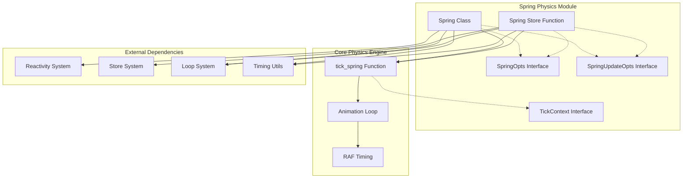
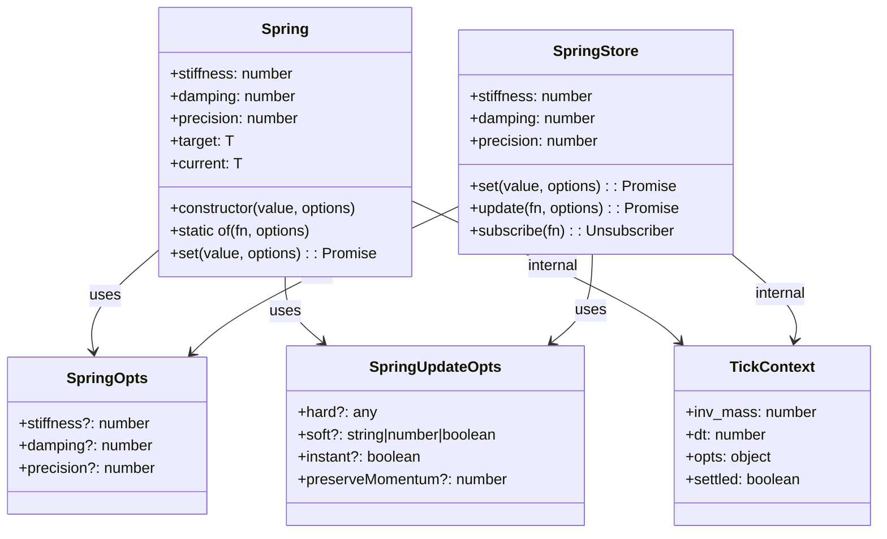
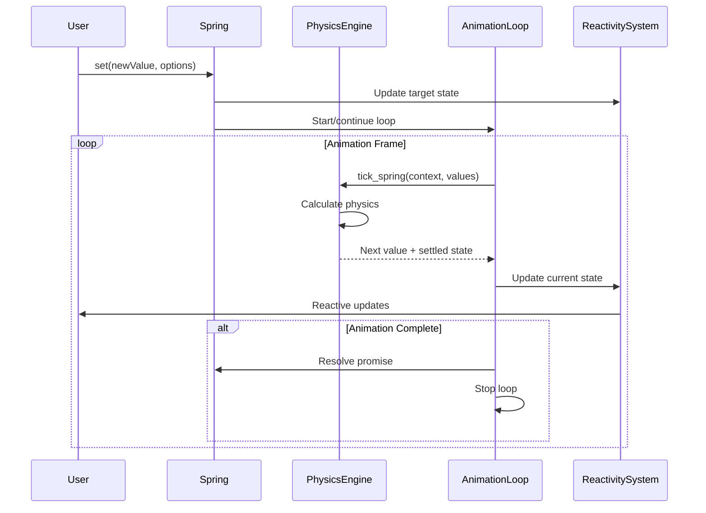
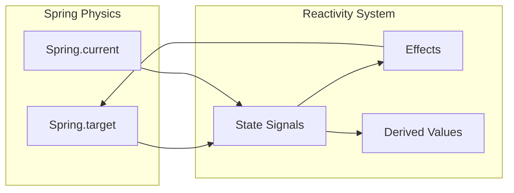
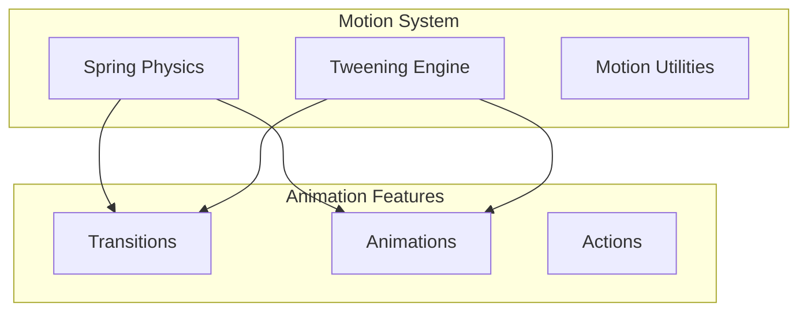

# Spring Physics Module

The Spring Physics module provides physics-based animation capabilities in Svelte, implementing spring-like motion behaviors for smooth, natural-feeling animations. This module is part of Svelte's motion system and offers both legacy store-based and modern class-based APIs for creating spring animations.

## Overview

Spring physics simulates the behavior of a physical spring system, where values animate towards targets with realistic momentum, damping, and oscillation effects. Unlike linear transitions, spring animations provide more natural motion that can enhance user experience through physics-based easing.

The module provides two main implementations:
- **Legacy Spring Store**: A store-based API (`spring()` function) for backward compatibility
- **Modern Spring Class**: A new class-based API (`Spring` class) with improved ergonomics and features

## Architecture



## Component Relationships



## Core Components

### Spring Class (Modern API)

The `Spring` class is the modern, recommended approach for creating spring animations in Svelte 5+.

**Key Features:**
- **Reactive Properties**: `target` and `current` properties that integrate with Svelte's reactivity system
- **Static Factory Method**: `Spring.of()` for creating reactive springs bound to derived values
- **Promise-based API**: `set()` method returns promises for animation completion
- **Advanced Options**: Support for instant updates and momentum preservation

**Physics Parameters:**
- `stiffness` (0-1): Controls how quickly the spring responds to changes
- `damping` (0-1): Controls oscillation and settling behavior
- `precision`: Threshold for considering the animation complete

### Spring Store Function (Legacy API)

The `spring()` function creates a store-based spring animation, maintained for backward compatibility.

**Key Features:**
- **Store Interface**: Implements Svelte's readable store pattern
- **Update Methods**: Both `set()` and `update()` methods for value changes
- **Subscription Model**: Standard store subscription mechanism

### Physics Engine

The core physics simulation is handled by the `tick_spring()` function, which implements the spring equation:

```
acceleration = (stiffness × delta - damping × velocity) × inverse_mass
```

**Supported Data Types:**
- Numbers
- Dates
- Arrays (component-wise animation)
- Objects (property-wise animation)

## Data Flow



## Integration with Svelte Ecosystem

### Reactivity System Integration

The Spring class integrates deeply with Svelte's [reactivity system](client_runtime.md#reactivity_system):



### Motion System Context

The spring physics module is part of Svelte's broader [motion system](motion.md):



## Usage Patterns

### Basic Spring Animation

```typescript
import { Spring } from 'svelte/motion';

// Create a spring with default physics
const spring = new Spring(0);

// Animate to new value
spring.set(100);

// Access current and target values
console.log(spring.current, spring.target);
```

### Reactive Spring

```typescript
import { Spring } from 'svelte/motion';

let mouseX = $state(0);

// Spring that follows mouse position
const springX = Spring.of(() => mouseX, {
  stiffness: 0.3,
  damping: 0.7
});
```

### Advanced Animation Control

```typescript
// Instant update
await spring.set(200, { instant: true });

// Preserve momentum (useful for gestures)
await spring.set(300, { preserveMomentum: 500 });

// Custom physics parameters
spring.stiffness = 0.5;
spring.damping = 0.9;
```

## Performance Considerations

### Animation Loop Management

The module uses Svelte's internal loop system for efficient animation scheduling:

- **Shared Loop**: Multiple springs share the same animation loop when possible
- **Automatic Cleanup**: Loops stop automatically when animations complete
- **Frame Rate Limiting**: Built-in protection against excessive frame rates

### Memory Management

- **Automatic Cleanup**: Springs clean up their resources when animations complete
- **Weak References**: Internal state management avoids memory leaks
- **Efficient Updates**: Only active springs participate in animation loops

## Configuration Options

### SpringOpts Interface

```typescript
interface SpringOpts {
  stiffness?: number;  // 0-1, default: 0.15
  damping?: number;    // 0-1, default: 0.8
  precision?: number;  // default: 0.01
}
```

### SpringUpdateOpts Interface

```typescript
interface SpringUpdateOpts {
  // Legacy options (spring store only)
  hard?: any;                    // Immediate update
  soft?: string|number|boolean;  // Gradual mass recovery
  
  // Modern options (Spring class only)
  instant?: boolean;             // Immediate update
  preserveMomentum?: number;     // Momentum preservation duration
}
```

## Error Handling

The spring physics engine includes robust error handling:

- **Type Validation**: Ensures only supported data types are animated
- **Parameter Clamping**: Automatically clamps physics parameters to valid ranges
- **Graceful Degradation**: Falls back to immediate updates for invalid configurations

## Migration Guide

### From Spring Store to Spring Class

```typescript
// Legacy approach
import { spring } from 'svelte/motion';
const legacySpring = spring(0, { stiffness: 0.3 });

// Modern approach
import { Spring } from 'svelte/motion';
const modernSpring = new Spring(0, { stiffness: 0.3 });

// Access patterns
legacySpring.subscribe(value => console.log(value));  // Store pattern
console.log(modernSpring.current);                    // Direct access
```

## Related Documentation

- [Motion System](motion.md) - Overview of Svelte's motion capabilities
- [Tweening Engine](tweening_engine.md) - Alternative animation approach
- [Client Runtime](client_runtime.md) - Underlying reactivity system
- [Transitions](transitions.md) - Component transition animations
- [Animations](animations.md) - Element animation system

## Future Considerations

The Spring Physics module is designed for extensibility and future enhancements:

- **Custom Easing Functions**: Potential support for custom spring curves
- **Multi-dimensional Springs**: Enhanced support for complex data structures
- **Performance Optimizations**: Continued improvements to animation loop efficiency
- **WebGL Integration**: Potential GPU-accelerated physics calculations