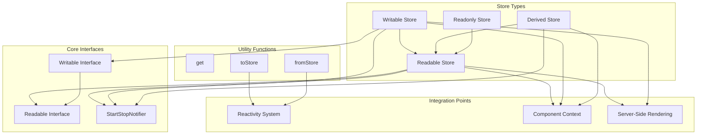
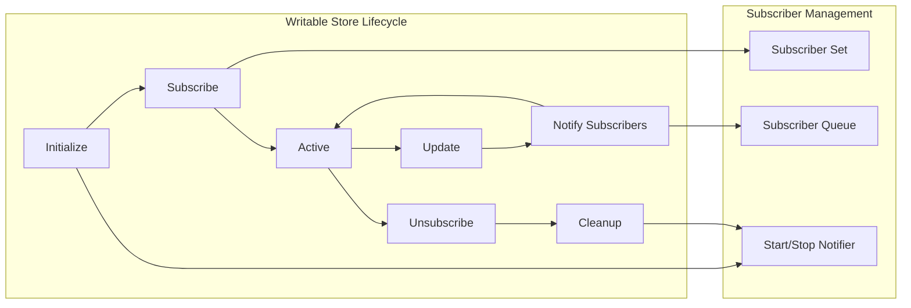
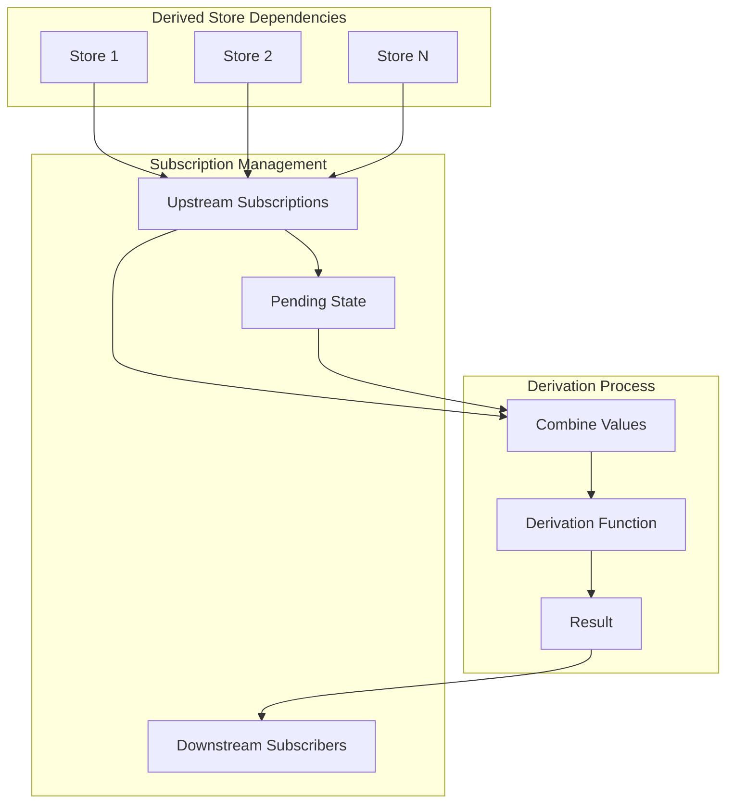
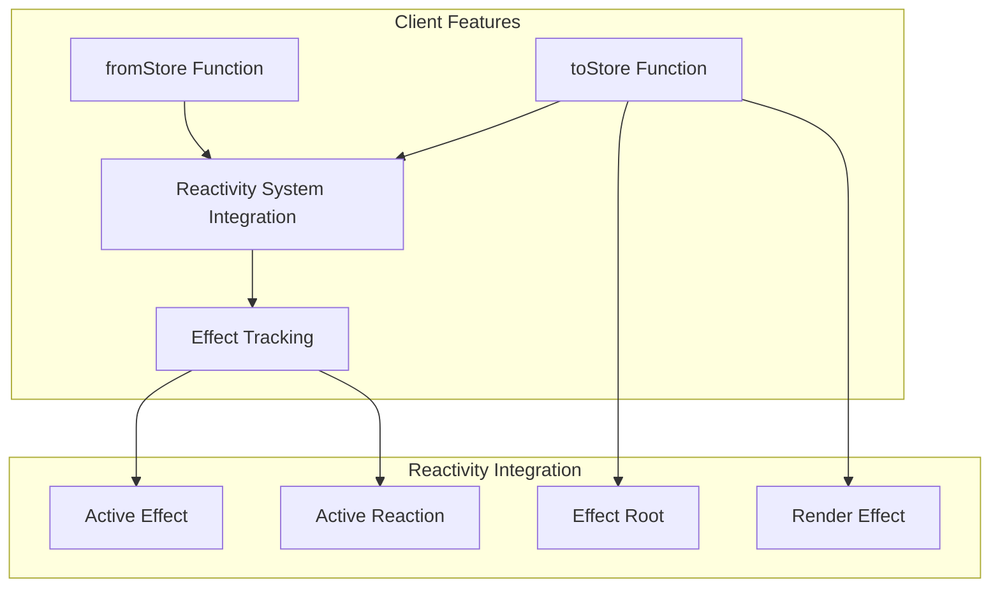
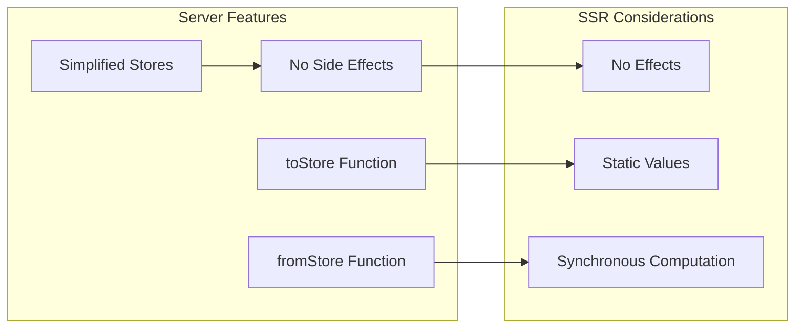
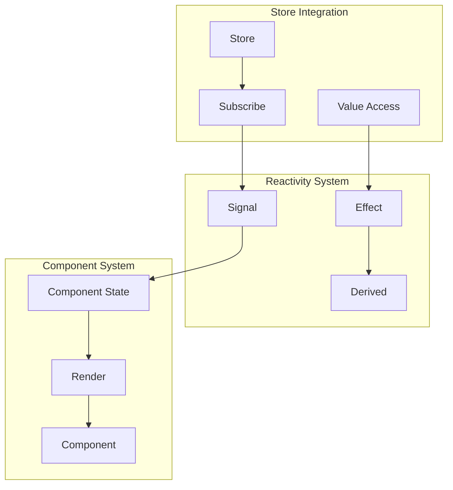
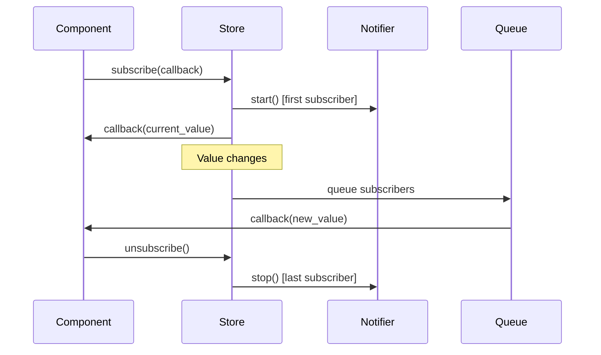
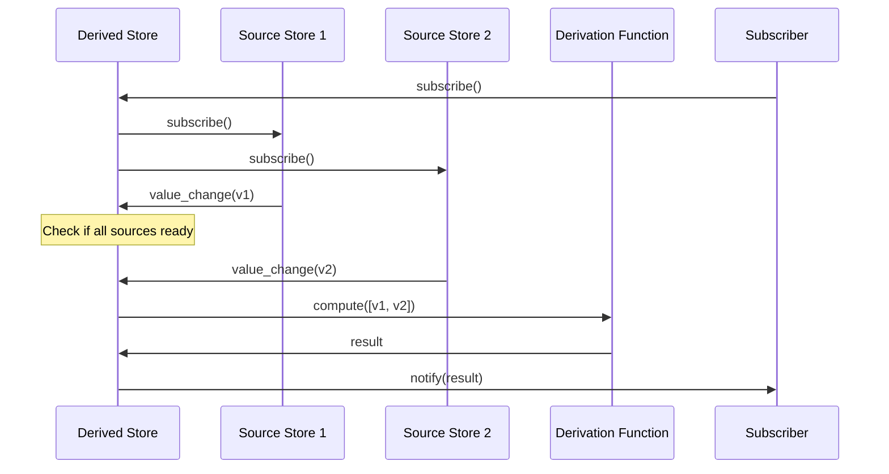

# Stores Module

The stores module provides Svelte's reactive state management system through a subscription-based pattern. It offers a lightweight, framework-agnostic approach to managing application state that can be shared across components and even used outside of Svelte components.

## Core Architecture

The stores module implements a publisher-subscriber pattern with automatic lifecycle management, providing both readable and writable stores that integrate seamlessly with Svelte's reactivity system.



## Core Components

### Store Interfaces

#### Readable Interface
```typescript
interface Readable<T> {
    subscribe(run: Subscriber<T>, invalidate?: () => void): Unsubscriber;
}
```

The `Readable` interface defines the contract for subscribing to value changes. It provides:
- **Subscription mechanism**: Subscribe to value updates with a callback function
- **Cleanup support**: Optional invalidation callback for cleanup operations
- **Unsubscription**: Returns a function to cancel the subscription

#### Writable Interface
```typescript
interface Writable<T> extends Readable<T> {
    set(value: T): void;
    update(updater: Updater<T>): void;
}
```

The `Writable` interface extends `Readable` with mutation capabilities:
- **Direct setting**: Set values directly with `set()`
- **Functional updates**: Update values using an updater function with `update()`
- **Inheritance**: Maintains all readable functionality

### Type Definitions

```typescript
type Subscriber<T> = (value: T) => void;
type Unsubscriber = () => void;
type Updater<T> = (value: T) => T;
type StartStopNotifier<T> = (
    set: (value: T) => void,
    update: (fn: Updater<T>) => void
) => void | (() => void);
```

## Store Implementations

### Writable Store



**Key Features:**
- **Lazy initialization**: Start notifier only runs when first subscriber subscribes
- **Automatic cleanup**: Stop notifier runs when last subscriber unsubscribes
- **Batched updates**: Subscriber notifications are queued and processed in batches
- **Change detection**: Only notifies subscribers when values actually change

### Readable Store

A simplified store that only allows subscription, typically used for:
- External data sources
- Computed values that shouldn't be directly modified
- API responses or time-based data

### Derived Store



**Derivation Logic:**
- **Multi-store support**: Can derive from single store or array of stores
- **Synchronization**: Waits for all dependencies before computing
- **Cleanup handling**: Supports cleanup functions from derivation logic
- **Pending state management**: Tracks which dependencies are updating

## Client-Server Architecture

### Client Implementation



**Client-Specific Features:**
- **Reactivity integration**: Stores work with Svelte's `$state` and effects
- **Effect tracking**: Automatic subscription when accessed in reactive contexts
- **State bridging**: Convert between stores and reactive state

### Server Implementation



**Server-Specific Behavior:**
- **No effect system**: Simplified implementation without reactive effects
- **Synchronous operations**: All operations are synchronous for SSR compatibility
- **Static evaluation**: Values are computed immediately without tracking

## Integration with Svelte Ecosystem

### Reactivity System Integration

The stores module integrates deeply with Svelte's [reactivity system](client_runtime.md):



### Component System Integration

Stores work seamlessly with Svelte's [component system](component_system.md):
- **Automatic subscriptions**: Components automatically subscribe to stores used in templates
- **Lifecycle management**: Subscriptions are cleaned up when components are destroyed
- **Reactive updates**: Store changes trigger component re-renders

## Utility Functions

### Store Conversion Functions

#### toStore()
Converts reactive state to store format:
```typescript
// Client: Creates reactive subscription
const store = toStore(() => count, (v) => count = v);

// Server: Creates static store
const store = toStore(() => count, (v) => count = v);
```

#### fromStore()
Converts stores to reactive objects:
```typescript
const count = fromStore(store);
// Access: count.current
// Update: count.current = newValue (if writable)
```

#### get()
Synchronously retrieves current store value:
```typescript
const currentValue = get(store);
```

#### readonly()
Creates read-only wrapper around any store:
```typescript
const readonlyStore = readonly(writableStore);
```

## Data Flow Patterns

### Subscription Flow



### Derived Store Flow



## Performance Characteristics

### Memory Management
- **Weak references**: Automatic cleanup when no subscribers remain
- **Subscription pooling**: Efficient management of subscriber collections
- **Batched notifications**: Reduces redundant updates

### Update Optimization
- **Change detection**: Only notifies on actual value changes
- **Queue processing**: Batches multiple updates for efficiency
- **Lazy evaluation**: Derived stores only compute when needed

## Error Handling

### Subscription Errors
- **Safe unsubscription**: Always safe to call unsubscribe multiple times
- **Error isolation**: Subscriber errors don't affect other subscribers
- **Cleanup guarantees**: Stop notifiers always run on cleanup

### Derivation Errors
- **Error propagation**: Derivation errors are contained and logged
- **Fallback values**: Initial values provide fallback during errors
- **Recovery mechanisms**: Stores can recover from transient errors

## Best Practices

### Store Design
1. **Single responsibility**: Each store should manage one piece of state
2. **Immutable updates**: Use immutable patterns for complex state
3. **Cleanup functions**: Always provide cleanup in start notifiers
4. **Type safety**: Use TypeScript for better development experience

### Performance Optimization
1. **Minimize derivations**: Avoid deep derivation chains
2. **Batch updates**: Use update() for multiple changes
3. **Selective subscriptions**: Only subscribe to needed data
4. **Cleanup subscriptions**: Always unsubscribe when done

### Integration Patterns
1. **Service layer**: Use stores for application-wide state
2. **Component props**: Pass stores as props for shared state
3. **Context API**: Combine with Svelte's context for dependency injection
4. **External libraries**: Bridge external state management with stores

## Related Modules

- **[Client Runtime](client_runtime.md)**: Reactivity system integration
- **[Component System](component_system.md)**: Component lifecycle integration
- **[Motion](motion.md)**: Animated store values
- **[Reactive Data Structures](reactive_data_structures.md)**: Enhanced reactive collections

The stores module serves as the foundation for state management in Svelte applications, providing a simple yet powerful abstraction that scales from simple component state to complex application-wide state management.