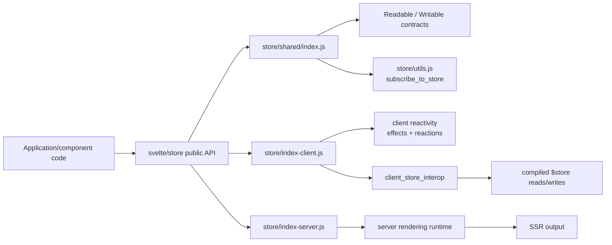
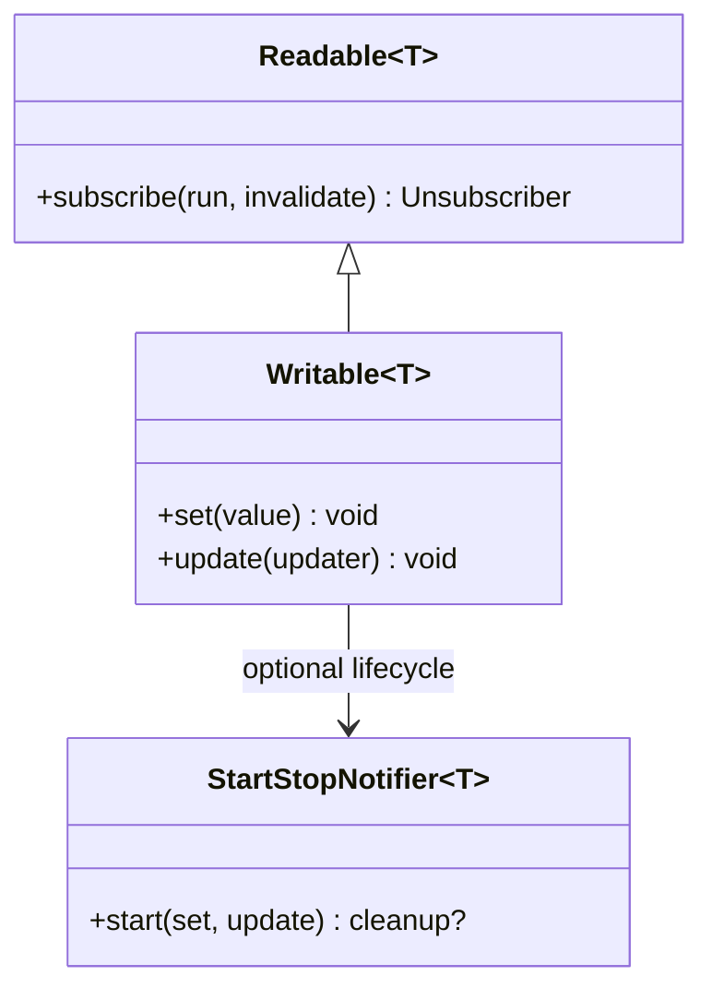
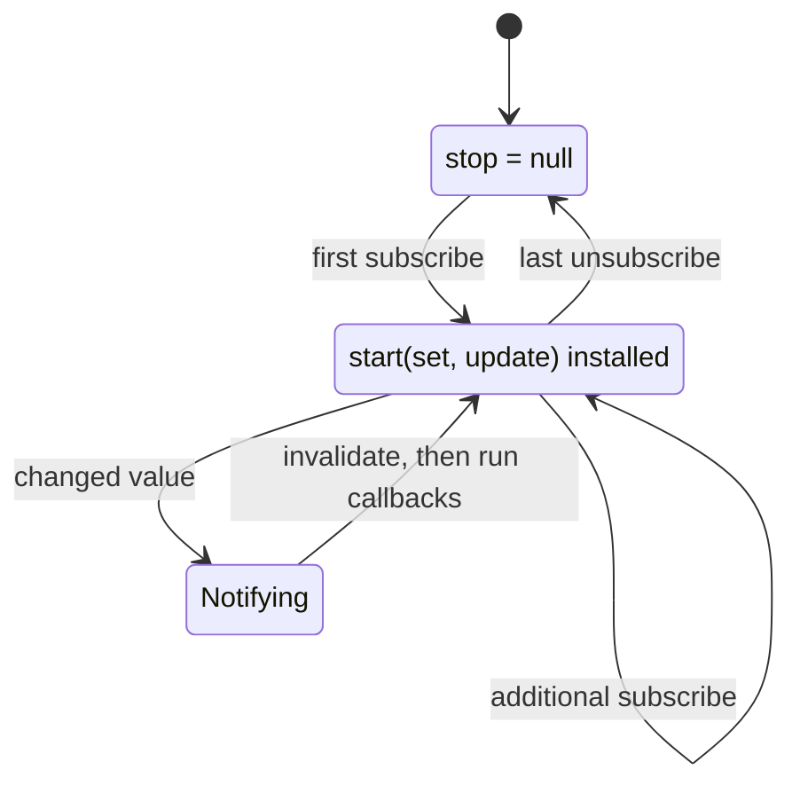
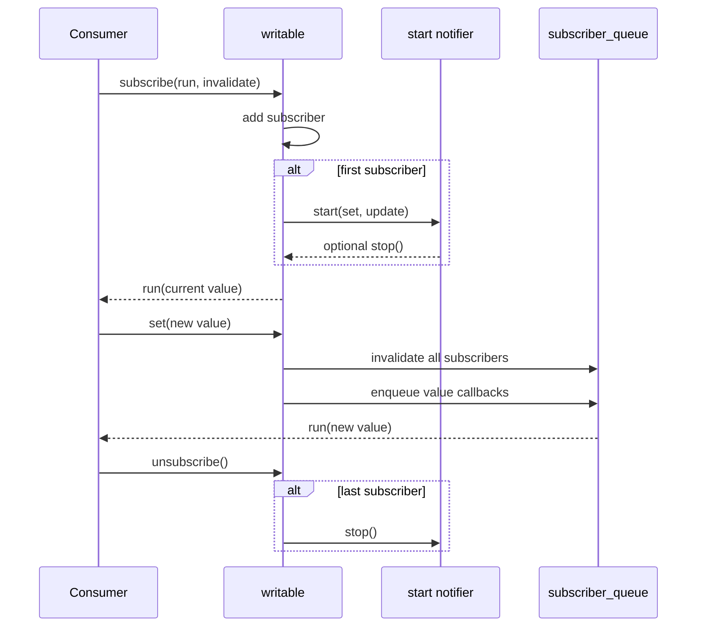
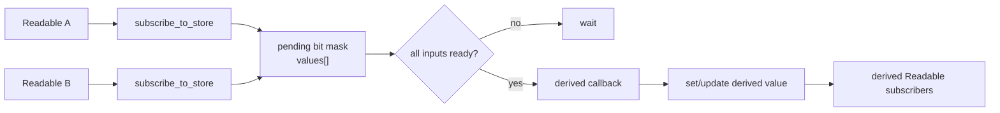
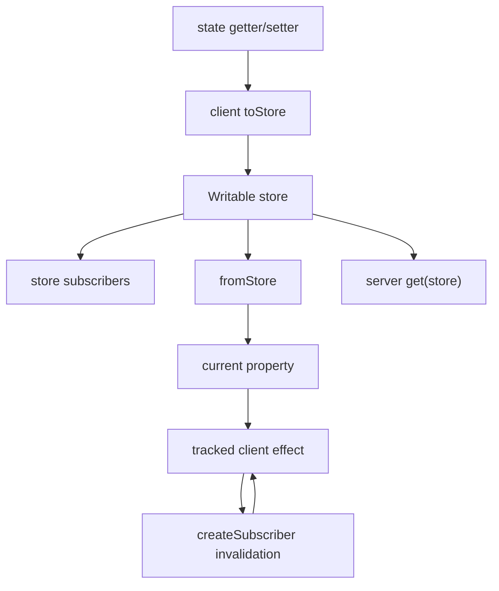
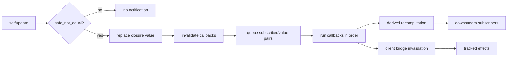

# Stores

The `stores` module is Svelte's public store library. It defines the `Readable` and `Writable`
contracts, creates stores with explicit subscription lifecycles, composes stores with `derived`,
and bridges stores with rune/state-style getter and setter functions through `toStore` and
`fromStore`. It is shared by client and server entry points; only the client bridge adds live
integration with Svelte's signal/effect runtime.

The module is implemented in `packages/svelte/src/store/` and is re-exported through the package's
published type surface. Compiler-generated `$store` expressions are handled by
[client_store_interop](client_store_interop.md), which consumes this module's `subscribe`, `set`,
and `update` contracts.

## Position in the system


```mermaid
flowchart LR
    APP["Application/component code"] --> API["svelte/store public API"]
    API --> SH["store/shared/index.js"]
    API --> CLIENT["store/index-client.js"]
    API --> SERVER["store/index-server.js"]
    SH --> CONTRACT["Readable / Writable contracts"]
    SH --> INTEROP["store/utils.js\nsubscribe_to_store"]
    CLIENT --> CR["client reactivity\neffects + reactions"]
    CLIENT --> CS["client_store_interop"]
    SERVER --> SSR["server rendering runtime"]
    CS --> DOM["compiled $store reads/writes"]
    SSR --> HTML["SSR output"]
```

The module is deliberately below component rendering and motion APIs. Reactive built-ins such as
`SvelteMap` and `MediaQuery` are siblings, not implementations of the store contract. The broader
signal scheduler is documented in [client_reactivity](client_reactivity.md).

## Module structure

| File | Responsibility | Environment |
| --- | --- | --- |
| `store/shared/index.js` | `readable`, `writable`, `derived`, `readonly`, and `get` | Client and server |
| `store/index-client.js` | Public exports plus reactive `toStore` and `fromStore` bridges | Browser/client runtime |
| `store/index-server.js` | Public exports plus snapshot-style bridges | SSR/server runtime |
| `store/public.d.ts` | `Readable`, `Writable`, callbacks, and start/stop types | Type declarations |

Both entry points export `derived`, `get`, `readable`, `readonly`, and `writable` from the shared
implementation. They differ only in how `toStore` and `fromStore` connect to reactivity.

## Core contracts

### Readable

A `Readable<T>` exposes:

```ts
subscribe(run: Subscriber<T>, invalidate?: () => void): Unsubscriber
```

`subscribe` immediately invokes `run` with the current value and returns an unsubscribe function.
The optional invalidation callback runs before a changed value is delivered. Subscribers are
treated as pairs of callbacks, so each subscription can have independent invalidation behavior.

### Writable

`Writable<T>` extends `Readable<T>` with:

```ts
set(value: T): void
update(updater: (value: T) => T): void
```

The `StartStopNotifier<T>` passed to a store receives `set` and `update` callbacks when the first
subscriber arrives and may return cleanup code for the transition to zero subscribers.


```mermaid
classDiagram
    class Readable~T~ {
        +subscribe(run, invalidate) Unsubscriber
    }
    class Writable~T~ {
        +set(value) void
        +update(updater) void
    }
    Readable <|-- Writable
    class StartStopNotifier~T~ {
        +start(set, update) cleanup?
    }
    Writable --> StartStopNotifier : optional lifecycle
```

## Store creation and lifecycle

`readable(value, start)` is a restricted view over `writable(value, start)`: it exposes only the
`subscribe` method. `writable` stores its value in a closure and tracks subscribers in a `Set`.

The lifecycle is reference-counted at the subscriber set level:


```mermaid
stateDiagram-v2
    [*] --> Inactive
    Inactive --> Active: first subscribe
    Active --> Active: set/update
    Active --> Inactive: last unsubscribe
    Active --> Active: additional subscribe
    Inactive: stop = null
    Active: start(set, update) installed
    Active --> Notifying: changed value
    Notifying --> Active: invalidate, then run callbacks
```

Important behavior:

- `start` is called exactly when the first subscriber is added.
- The subscriber receives the current value immediately, including on the first subscription.
- The returned `stop` function runs when the last subscriber unsubscribes, then is cleared.
- `set` uses `safe_not_equal`; changed values notify subscribers, including object/function values
  that must be treated as potentially mutable.
- `update(fn)` computes a value from the current closure value and delegates to `set`.
- A shared `subscriber_queue` serializes nested or cascading notifications. Invalidation is queued
  first for every subscriber, followed by value callbacks, preventing interleaved partial updates.


```mermaid
sequenceDiagram
    participant Consumer
    participant Store as writable
    participant Start as start notifier
    participant Queue as subscriber_queue

    Consumer->>Store: subscribe(run, invalidate)
    Store->>Store: add subscriber
    alt first subscriber
        Store->>Start: start(set, update)
        Start-->>Store: optional stop()
    end
    Store-->>Consumer: run(current value)
    Consumer->>Store: set(new value)
    Store->>Queue: invalidate all subscribers
    Store->>Queue: enqueue value callbacks
    Queue-->>Consumer: run(new value)
    Consumer->>Store: unsubscribe()
    alt last subscriber
        Store->>Start: stop()
    end
```

## Derived stores

`derived(stores, fn, initial_value)` creates a readable store that synchronizes one input store or
an array of input stores. It subscribes to inputs only while the derived store itself has
subscribers, because it is implemented on top of `readable`.

There are two callback forms:

```js
derived(source, value => transform(value), initial)

derived([left, right], (values, set, update) => {
	set(combine(values));
	return cleanup;
}, initial)
```

The one-argument form is automatic: its return value becomes the derived value. The callback form
can call `set` or `update` over time and optionally return cleanup code. Inputs use a bit mask to
track pending invalidations; computation waits until all inputs have supplied their current value.
This avoids running the aggregation function against a partially updated input set.


```mermaid
flowchart LR
    A["Readable A"] --> SA["subscribe_to_store"]
    B["Readable B"] --> SB["subscribe_to_store"]
    SA --> P["pending bit mask\nvalues[]"]
    SB --> P
    P --> SYNC{"all inputs ready?"}
    SYNC -->|no| WAIT["wait"]
    SYNC -->|yes| FN["derived callback"]
    FN --> SET["set/update derived value"]
    SET --> OUT["derived Readable subscribers"]
```

On derived teardown, all input unsubscribers run, callback cleanup runs, and the `started` guard is
disabled. The guard matters because callbacks may already be present in the shared notification
queue after unsubscription.

## Utility operations

- `readonly(store)` returns a wrapper exposing the original store's `subscribe` method without
  exposing `set` or `update`. It does not clone or buffer values.
- `get(store)` obtains a synchronous snapshot by subscribing, recording the immediate value, and
  immediately unsubscribing. It may start and stop a store, so it should be used for snapshots,
  not as a replacement for a long-lived subscription.

## Client and server bridges

### `toStore`

`toStore(get, set?)` adapts a getter function to the store contract. With `set`, it returns a
`Writable`; without it, it returns a `Readable`. `update` is implemented as `set(fn(get()))`, so
the getter is the source of truth for writes.

On the client, the bridge creates a writable internally and installs a render effect under an
effect root. The effect observes `get()` and forwards changes to subscribers. It preserves the
active reaction/effect context from the call site while installing the effect, and its teardown
is tied to the store's start/stop lifecycle.

On the server, `toStore` initializes a writable with `get()` but does not install a client reaction;
it is therefore suitable for server-side access and mutation during rendering, not for ongoing
browser-style observation.

### `fromStore`

`fromStore(store)` exposes a store as an object with a `current` property:

- writable input: `current` is readable and assignable;
- readable input: `current` is readable only.

On the client, reads inside an actively tracked effect subscribe through `createSubscriber`, update
the cached value from store notifications, and invalidate the current reaction after the initial
subscription callback. Reads outside tracking use `get(store)`. On the server, every access calls
`get(store)`, so the property is a synchronous snapshot accessor.


```mermaid
flowchart TD
    GETTER["state getter/setter"] --> TOSTORE["client toStore"]
    TOSTORE --> W["Writable store"]
    W --> SUB["store subscribers"]
    W --> FROM["fromStore"]
    FROM --> CURRENT["current property"]
    CURRENT --> EFFECT["tracked client effect"]
    EFFECT --> INVALIDATE["createSubscriber invalidation"]
    INVALIDATE --> EFFECT
    W --> SNAP["server get(store)"]
```

## Notification and data-flow invariants


```mermaid
flowchart LR
    WRITE["set/update"] --> EQ{"safe_not_equal?"}
    EQ -->|no| END["no notification"]
    EQ -->|yes| VALUE["replace closure value"]
    VALUE --> INV["invalidate callbacks"]
    INV --> ENQ["queue subscriber/value pairs"]
    ENQ --> RUN["run callbacks in order"]
    RUN --> DER["derived recomputation"]
    RUN --> BRIDGE["client bridge invalidation"]
    DER --> DOWN["downstream subscribers"]
    BRIDGE --> EFFECTS["tracked effects"]
```

The principal invariants are:

- subscribers always see an initial value synchronously;
- a store starts when it becomes observed and stops when observation reaches zero;
- notifications are ordered as invalidation followed by value delivery;
- derived callbacks do not run until all inputs have current values;
- `fromStore` exposes mutability only when the source store has `set`;
- client-only reactivity is an adapter concern, while the shared store contract remains environment
  independent.

## Relationship to compiler and runtime modules

The compiler recognizes `$store` references and emits calls consumed by
[client_store_interop](client_store_interop.md). That adapter owns per-component subscriptions,
signal sources, store reassignment, and teardown. The stores module supplies the underlying public
operations and does not manage component ownership.

For client state scheduling, derived signals, and effect execution, see
[client_reactivity](client_reactivity.md). For server-side generated store reads, updates, and
unsubscribe bookkeeping, see [compiler_transform_server_javascript_stores](compiler_transform_server_javascript_stores.md)
and [server_runtime](server_runtime.md). The public declarations are assembled into the package's
published type surface.

## Maintenance considerations

Changes to equality, subscriber queue ordering, or start/stop transitions affect every store user,
including compiler-generated `$store` code. Changes to client `toStore`/`fromStore` must preserve
effect-context restoration and teardown behavior. Changes to server bridges should be evaluated
against SSR's snapshot nature and must not accidentally assume browser reactions exist.
