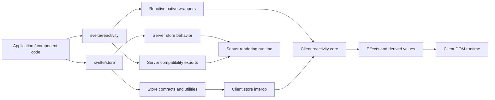
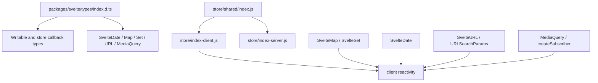
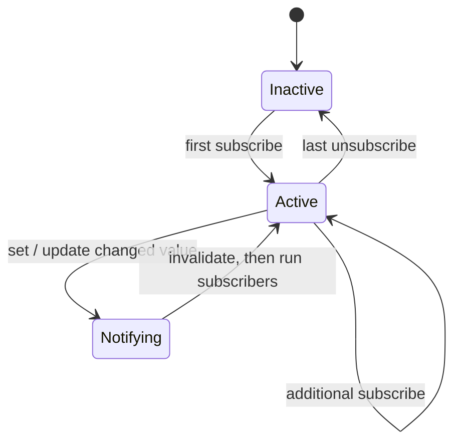
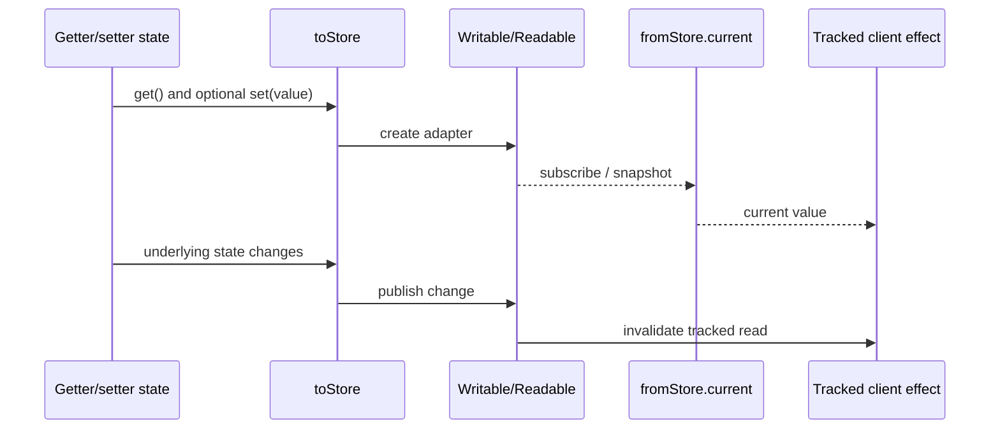
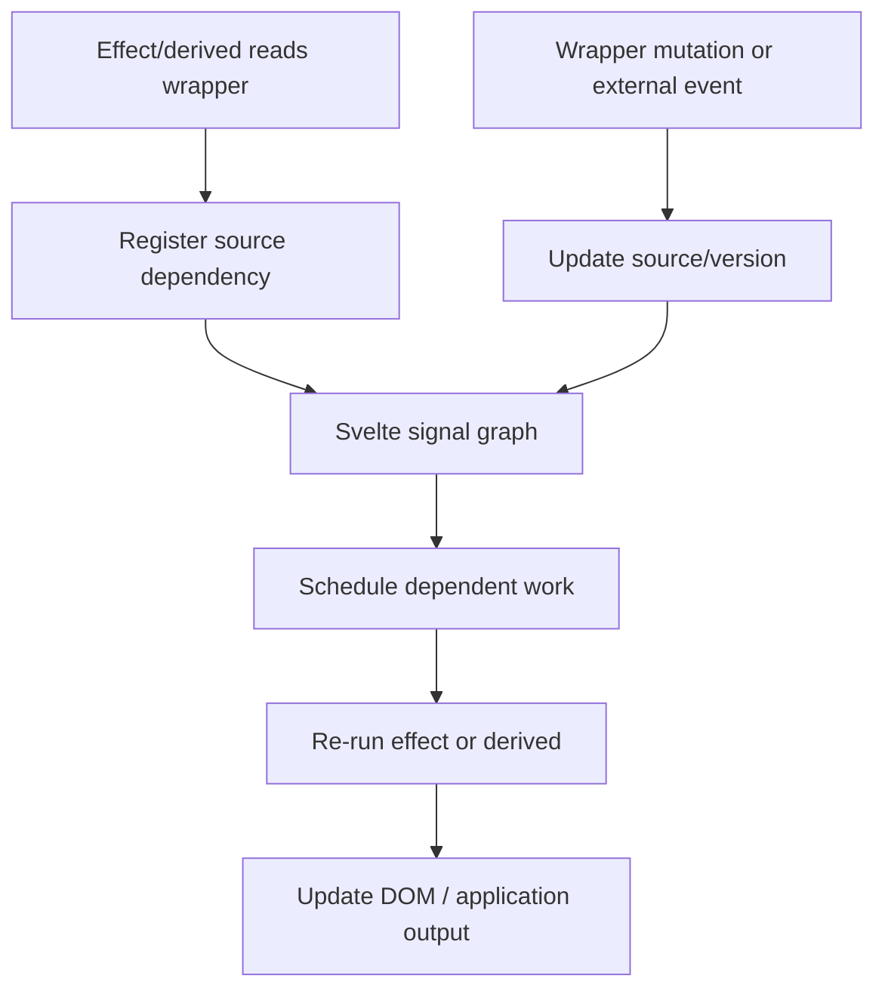
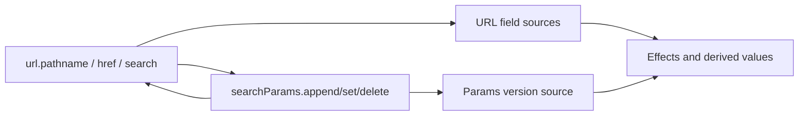
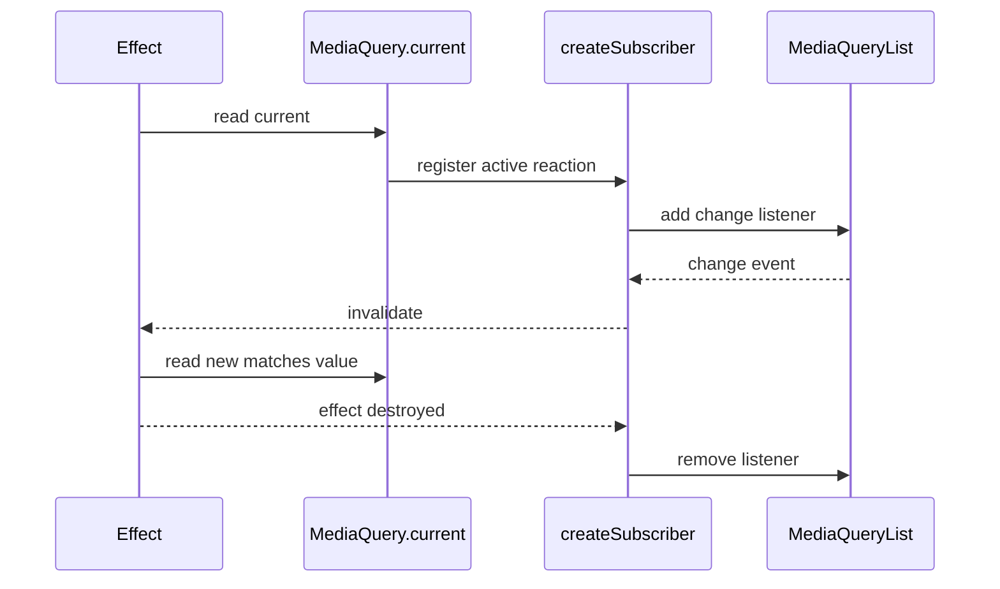
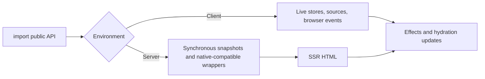

# Stores and Reactive Built-ins

The `stores_and_reactive_builtins` module is Svelte's public state-utility surface. It combines
subscription-oriented stores from `svelte/store` with reactive wrappers around mutable native
values from `svelte/reactivity`. Stores are explicit and stream-like; reactive built-ins preserve
native object ergonomics while making reads and mutations visible to Svelte's signal graph.

The module is represented by the published declaration aggregator
`packages/svelte/types/index.d.ts`. Runtime behavior lives in the store and reactivity packages,
with separate client and server entry points.

## Position in the system



This module does not compile templates, schedule effects, or render DOM. See
[compilation_pipeline](compilation_pipeline.md), [client_reactivity](client_reactivity.md),
[client_store_interop](client_store_interop.md), [client_dom_rendering_runtime](client_dom_rendering_runtime.md),
and [server_runtime](server_runtime.md) for those responsibilities.

## Architecture and component inventory



| Area | Public components | Implementation | Responsibility |
| --- | --- | --- | --- |
| Stores | `Readable`, `Writable`, `readable`, `writable`, `readonly`, `derived`, `get`, `toStore`, `fromStore` | `packages/svelte/src/store/shared/index.js`, `index-client.js`, `index-server.js` | Subscription, composition, snapshots, and state bridges |
| Collections | `SvelteMap`, `SvelteSet` | `packages/svelte/src/reactivity/map.js` and sibling collection implementation | Reactive membership, values, iteration, and size |
| Time | `SvelteDate` | `packages/svelte/src/reactivity/date.js` | Reactive date reads and setter mutations |
| URL state | `SvelteURL`, `SvelteURLSearchParams` | `url.js`, `url-search-params.js` | Reactive URL fields and query parameters |
| External values | `MediaQuery`, `createSubscriber` | `media-query.js`, client/server entry points | Adapt browser events to effects |
| Types | `Writable`, `SvelteDate`, `SvelteMap`, `SvelteSet`, `SvelteURL`, `MediaQuery` | `packages/svelte/types/index.d.ts` | Published TypeScript surface |

The declaration aggregator also exposes `Tweened`; its runtime belongs to [motion](motion.md).

## Stores

```ts
interface Readable<T> {
    subscribe(run: (value: T) => void, invalidate?: () => void): () => void;
}
interface Writable<T> extends Readable<T> {
    set(value: T): void;
    update(updater: (value: T) => T): void;
}
```

`readable` and `writable` support a start/stop notifier. It starts when the first subscriber
arrives and is cleaned up after the final subscriber leaves. `derived` subscribes to inputs only
while observed and publishes a transformation or callback-driven values. `get` obtains a
synchronous snapshot by subscribing and immediately unsubscribing.



### Store bridges

`toStore(get, set?)` adapts getter-based state to a store. Supplying `set` produces a writable
store; omitting it produces a readable store. `fromStore(store)` exposes a store through a
`current` property, writable only when the source store is writable.



The client bridge installs live observation through the signal runtime; the server bridge is
snapshot-oriented because SSR has no persistent effect graph. See [stores](stores.md) for
notification ordering, derived-store synchronization, and lifecycle details.

## Reactive built-ins

| Type | Native base | Observable operations |
| --- | --- | --- |
| `SvelteMap<K, V>` | `Map<K, V>` | `get`, `has`, iteration, `size`, `set`, `delete`, `clear` |
| `SvelteSet<T>` | `Set<T>` | membership, iteration, `size`, and collection mutations |
| `SvelteDate` | `Date` | date/time getters, formatting/value conversion, and setters |
| `SvelteURL` | `URL` | URL fields, composite properties, and `searchParams` |
| `SvelteURLSearchParams` | `URLSearchParams` | lookup, iteration, serialization, `size`, and mutations |
| `MediaQuery` | `MediaQueryList` on client | reactive `current` and `change` events |



The wrappers are shallow: changing a property on an object stored as a map value is not
automatically a map mutation. Use `$state` or another reactive wrapper for nested state.

### Collections, dates, and URLs

`SvelteMap` and `SvelteSet` distinguish membership reads from collection-wide reads. Key or
membership lookups can use narrow sources, while iteration and `size` use collection/version
sources. Mutations invalidate the narrowest applicable dependencies.

`SvelteDate` wraps date prototype methods. Getter-like operations depend on a timestamp source;
setter-like operations delegate to native `Date` behavior and publish the resulting timestamp.

`SvelteURL` tracks mutable URL components and composite properties such as `host`, `origin`, and
`href`. Its `searchParams` object is reactive; URL and parameter mutations update one another
with an internal re-entrancy guard.



### External subscriptions

`createSubscriber(start)` adapts an event source to Svelte reactivity. The first tracked reader
starts the external subscription; the last destroyed reader runs cleanup. `MediaQuery` uses this
adapter around `window.matchMedia(...).change` and exposes the result through `.current`.



## Client/server behavior



Store contracts are shared across environments. Client bridges integrate with effects; server
bridges are snapshot-oriented. Server reactivity exports use native-compatible constructors where
live observation is impossible. `MediaQuery` accepts an SSR fallback, defaulting to `false`, so
media-query-dependent markup can differ at hydration. Prefer CSS media queries when possible.

## End-to-end process flows

### Store update

1. Component code calls `set` or `update`.
2. The store replaces its value when the equality policy reports a change.
3. Invalidation callbacks are queued before value callbacks.
4. Derived stores recompute after their inputs are ready.
5. Client adapters update signal sources, causing dependent effects and DOM expressions to rerun.

### Reactive built-in update

1. An effect, derived expression, or template reads a wrapper property.
2. The wrapper records a dependency on a key, field, collection version, or external subscriber.
3. Code mutates the wrapper, or the platform emits an event.
4. The corresponding source is invalidated.
5. The client scheduler reruns consumers, which read the updated native value.

## References and source map

- [stores](stores.md) — store contracts, lifecycle, derived stores, notifications, and bridges.
- [reactive_builtins](reactive_builtins.md) — per-wrapper implementation details and SSR boundaries.
- [reactive_state_and_stores_library](reactive_state_and_stores_library.md) — broader module grouping.
- [client_reactivity](client_reactivity.md) — sources, derived values, effects, scheduling, and batching.
- [client_store_interop](client_store_interop.md) — compiler/runtime handling of `$store` expressions.
- [motion](motion.md) — `Tweened` and other motion APIs sharing the declaration surface.
- [public_package_entry_points](public_package_entry_points.md) — package exports and the published API boundary.

```text
packages/svelte/src/store/shared/index.js
packages/svelte/src/store/index-client.js
packages/svelte/src/store/index-server.js
packages/svelte/src/store/public.d.ts
packages/svelte/src/reactivity/map.js
packages/svelte/src/reactivity/date.js
packages/svelte/src/reactivity/url.js
packages/svelte/src/reactivity/url-search-params.js
packages/svelte/src/reactivity/media-query.js
packages/svelte/src/reactivity/index-server.js
packages/svelte/types/index.d.ts
```
