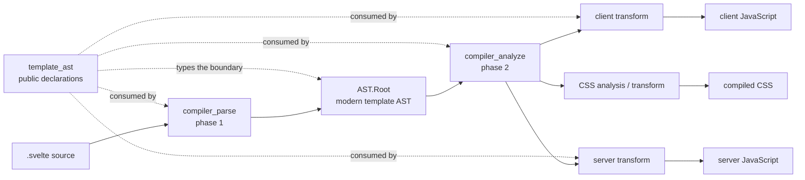
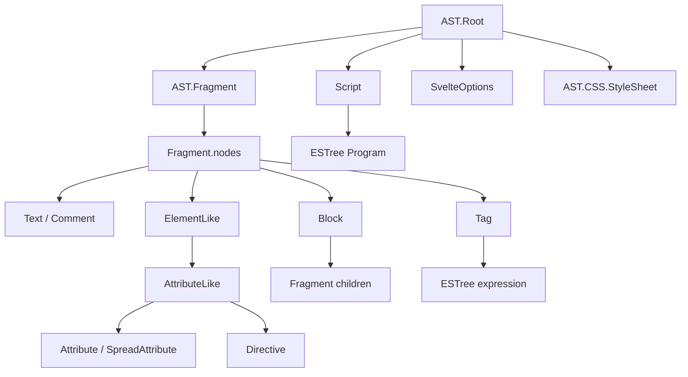
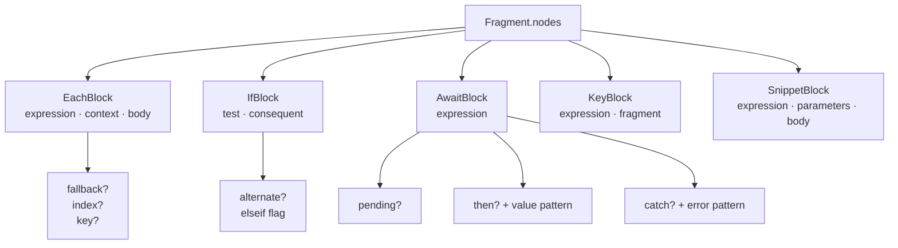
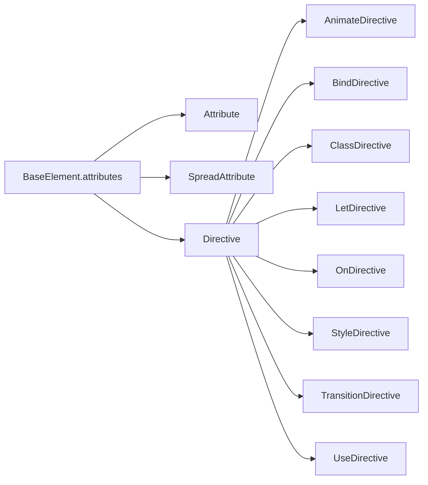
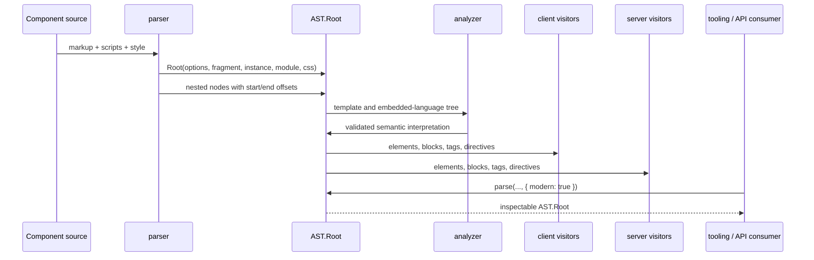

# template_ast

`template_ast` is Svelte's public TypeScript model for the modern abstract syntax tree (AST) of
a component template. It describes the tree returned by `parse(source, { modern: true })` and the
AST exposed on compiler results when modern AST output is requested. The declarations live in
`packages/svelte/types/index.d.ts`; parsing and compiler behavior are implemented elsewhere.

The module gives tooling and compiler phases a stable vocabulary for roots, fragments, text,
expressions, elements, blocks, attributes, directives, scripts, and source locations. It is a
structural contract: it does not parse, analyze, render, or transform components itself.

For the internal, analysis-enriched declarations, see [compiler_ast_types](compiler_ast_types.md).
For the public parser and `modern` option, see [compiler_api](compiler_api.md) and
[compiler_parse](compiler_parse.md).

## 1. Role in the compilation pipeline



The normal lifecycle is:

1. The parser creates a `Root`, its template `Fragment`, optional scripts, and optional CSS.
2. Analysis validates and interprets the nodes for scope, reactivity, exports, and CSS usage.
3. Client and server visitors walk the same conceptual tree and emit environment-specific code.
4. Tooling can inspect the root without running code generation by calling `parse`.

The implementation details of those phases are documented in [compilation_pipeline](compilation_pipeline.md),
[compiler_analyze](compiler_analyze.md), [compiler_transform_client](compiler_transform_client.md),
and [compiler_transform_server](compiler_transform_server.md).

## 2. Type architecture



### 2.1 Common source-location contract

`BaseNode` is the discriminator and location base for template nodes:

| Field | Meaning |
| --- | --- |
| `type: string` | Runtime node discriminator used by visitors and type narrowing. |
| `start: number` | Zero-based source offset where the node begins. |
| `end: number` | Zero-based, exclusive source offset where the node ends. |

Offsets refer to the original component source. Diagnostics, formatters, source-map generation,
and editor tooling use them to map syntax back to the file. Embedded JavaScript nodes retain the
ESTree location/type contract supplied by `estree`; CSS nodes use the parallel CSS declaration
surface documented in [compiler_ast_types](compiler_ast_types.md).

### 2.2 Unions and narrowing

The AST uses discriminated unions so a visitor can switch on `node.type`:

| Union | Members |
| --- | --- |
| `ElementLike` | `Component`, `TitleElement`, `SlotElement`, `RegularElement`, and the `svelte:*` element types. |
| `Block` | `EachBlock`, `IfBlock`, `AwaitBlock`, `KeyBlock`, `SnippetBlock`. |
| `Tag` | `AttachTag`, `ConstTag`, `DebugTag`, `ExpressionTag`, `HtmlTag`, `RenderTag`. |
| `Directive` | Animate, bind, class, let, on, style, transition, and use directives. |
| `TemplateNode` | Root plus text, comments, tags, elements, attributes, directives, and blocks. |
| `SvelteNode` | ESTree nodes, template nodes, fragments, CSS nodes, and scripts. |

`Fragment.nodes` is ordered and accepts `Text`, `Tag`, `ElementLike`, `Block`, and `Comment`.
This ordering is semantically significant because it represents document order and determines
the order in which generated content is emitted.

## 3. Root and component-level nodes

### 3.1 `AST.Root`

`Root` is the top-level component container:

| Field | Type | Purpose |
| --- | --- | --- |
| `type` | `'Root'` | Identifies the root node. |
| `options` | `SvelteOptions \| null` | Parsed inline `<svelte:options>` settings. |
| `fragment` | `Fragment` | Ordered template content. |
| `css` | `AST.CSS.StyleSheet \| null` | Parsed `<style>` content, if present. |
| `instance` | `Script \| null` | Default component `<script>`. |
| `module` | `Script \| null` | `<script module>`. |
| `comments` | `JSComment[]` | Comments retained from scripts and expressions. |

`Root` therefore joins three languages in one component model: Svelte markup, embedded
JavaScript/TypeScript, and component CSS. CSS is a separate AST family; see
[compiler_ast_types](compiler_ast_types.md) for its node hierarchy.

### 3.2 `SvelteOptions`

`SvelteOptions` is the normalized form of inline `<svelte:options>`. It records source offsets,
the supported compiler overrides (`runes`, `immutable`, `accessors`, `preserveWhitespace`,
`namespace`, and injected CSS), custom-element configuration, and parsed `attributes`.

`SvelteOptionsRaw` is different: it is a parser-only `ElementLike` node with `type: 'SvelteOptions'`.
Consumers should treat it as an intermediate representation and use `Root.options` after normal
compiler processing.

### 3.3 `Script` and `JSComment`

`Script` stores `context: 'default' | 'module'`, its ESTree `Program` in `content`, and script
attributes. `JSComment` retains line/block kind, value, offsets, and line/column locations.
The AST intentionally embeds ESTree rather than defining a second JavaScript expression model.

## 4. Template content

### 4.1 Text, comments, and expression tags

| Node | Syntax | Payload |
| --- | --- | --- |
| `Text` | literal markup text | `data` is entity-decoded; `raw` preserves original text. |
| `Comment` | `<!-- ... -->` | Comment contents in `data`. |
| `ExpressionTag` | `{expression}` | ESTree `expression`. |
| `HtmlTag` | `{@html expression}` | ESTree expression whose result is inserted as raw HTML. |
| `ConstTag` | `{@const declaration}` | A constrained one-declarator `VariableDeclaration`. |
| `DebugTag` | `{@debug a, b}` | Identifier list. |
| `RenderTag` | `{@render snippet(...)}` | A simple or optionally chained call expression. |
| `AttachTag` | `{@attach expression}` | Attachment expression. |

Expression tags are syntactic nodes; dependency tracking, purity, and reactivity decisions are
performed by analysis. See [compiler_analyze_expression_metadata](compiler_analyze_expression_metadata.md).

### 4.2 Elements

`BaseElement` supplies the shared shape: `name`, mixed `attributes`, and a child `fragment`.
Concrete element types preserve semantic distinctions that affect validation and generation:

| Type | Syntax / role |
| --- | --- |
| `RegularElement` | Ordinary HTML, SVG, or MathML element. |
| `Component` | Component invocation resolved by its name. |
| `SvelteComponent` | Dynamic component via `svelte:component`; includes `expression`. |
| `SvelteSelf` | Recursive reference to the current component. |
| `SvelteElement` | Dynamic DOM tag via `svelte:element`; includes `tag` expression. |
| `SlotElement` | Legacy slot outlet. |
| `SvelteFragment` | Named fragment content for component composition. |
| `SvelteHead` | Content emitted into the document head. |
| `SvelteBody` | Body-level event/binding target. |
| `SvelteDocument` | Document-level event/binding target. |
| `SvelteWindow` | Window-level event/binding target. |
| `TitleElement` | The document title element. |
| `SvelteBoundary` | Error/pending boundary content. |

All element attributes are ordered and may be ordinary attributes, spreads, directives, or
attachments. Child content is recursively represented by another `Fragment`.

## 5. Control-flow and composition blocks



| Block | Model |
| --- | --- |
| `EachBlock` | Iterates `expression` with an optional `context` pattern, `index`, keyed expression, `body`, and `fallback`. |
| `IfBlock` | Stores `test`, `consequent`, optional `alternate`, and whether it represents an `elseif`. |
| `AwaitBlock` | Stores the awaited expression, optional pending/then/catch fragments, and value/error patterns. |
| `KeyBlock` | Recreates its fragment when its key expression changes. |
| `SnippetBlock` | Declares a named snippet with an identifier, parameter patterns, optional TypeScript type parameters, and body. |

Blocks own fragments rather than flat node arrays. This makes nesting explicit and gives compiler
visitors a direct representation of branch and iteration boundaries. Runtime behavior is covered
by [client_blocks](client_blocks.md) and the server block visitors in [compiler_transform_server_blocks](compiler_transform_server_blocks.md).

## 6. Attributes and directives



`Attribute` values use three forms: `true` for valueless attributes, one `ExpressionTag` for a
single expression, or an ordered array of `Text | ExpressionTag` for quoted/mixed content.
`SpreadAttribute` contains the expression being spread.

| Directive | Important fields |
| --- | --- |
| `AnimateDirective` | `name`, nullable `expression`. |
| `BindDirective` | `name`, assignable `Identifier`, `MemberExpression`, or `SequenceExpression`. |
| `ClassDirective` | Fixed `name: 'class'` and an expression. |
| `LetDirective` | `name` and nullable identifier/array/object pattern. |
| `OnDirective` | event `name`, optional expression, and event modifiers. |
| `StyleDirective` | style `name`, `true` or expression/text value, and `important` modifier. |
| `TransitionDirective` | transition `name`, expression, `local/global` modifiers, `intro`, and `outro`. |
| `UseDirective` | action `name` and nullable parameter expression. |

Directive semantics are implemented by the corresponding client/server visitors and runtime
modules. See [compiler_transform_client_directives](compiler_transform_client_directives.md) for directive
visitor behavior
and [client_bindings](client_bindings.md) for binding runtime behavior.

## 7. Data flow and visitor interaction



The AST is shared conceptually across targets, but visitors interpret it differently:

- Client transforms map elements, blocks, directives, and expressions to DOM/runtime operations;
  see [compiler_transform_client](compiler_transform_client.md).
- Server transforms map the same structures to serialized HTML and server runtime helpers; see
  [compiler_transform_server](compiler_transform_server.md).
- Analysis validates special elements, tracks scopes and exports, and annotates compiler-internal
  state; see [compiler_analyze](compiler_analyze.md).
- CSS analysis consumes `Root.css` and the template's element usage; see [compiler_analyze_css](compiler_analyze_css.md).

## 8. Public API and compatibility

The published declaration surface re-exports these names from `packages/svelte/types/index.d.ts`.
The public parser is:

```ts
import { parse } from 'svelte/compiler';
import type { AST } from 'svelte/compiler';

const root: AST.Root = parse(source, { modern: true });
```

`modern: true` selects this modern AST. Without it, Svelte 5's parser returns the legacy AST for
compatibility. `modernAst` is the corresponding compile option for compiler results; the migration
plan is documented in [compiler_api](compiler_api.md). Consumers that must support both forms
should branch at the API boundary rather than assuming legacy and modern node shapes are
interchangeable.

## 9. Maintenance guidance

When adding or changing a template construct:

1. Update the internal declaration in `packages/svelte/src/compiler/types/template.d.ts`.
2. Update the published mirror in `packages/svelte/types/index.d.ts`.
3. Add the node to the appropriate union (`ElementLike`, `Tag`, `Block`, `Directive`, or
   `TemplateNode`).
4. Update parser construction, analysis validation, and both client/server visitor coverage.
5. Update CSS or runtime declarations when the node introduces cross-phase behavior.
6. Add parser/compiler tests and verify source offsets and modern AST output.

The internal declarations and phase-specific metadata are intentionally documented once in
[compiler_ast_types](compiler_ast_types.md); this page should remain the public AST contract and
its relationships rather than duplicating implementation-specific analysis fields.

## References

- [compiler_api](compiler_api.md) — public `parse`, `compile`, and modern AST options.
- [compiler_parse](compiler_parse.md) — parser state machine that constructs the tree.
- [compiler_ast_types](compiler_ast_types.md) — internal AST and analysis-enriched type model.
- [compiler_transform_client_directives](compiler_transform_client_directives.md) — directive visitor behavior.
- [compiler_ast_types](compiler_ast_types.md) — stylesheet and selector AST referenced by `Root.css`.
- [compiler_analyze](compiler_analyze.md) — semantic validation and analysis consumers.
- [compiler_transform_client](compiler_transform_client.md) — browser code generation consumers.
- [compiler_transform_server](compiler_transform_server.md) — SSR code generation consumers.
