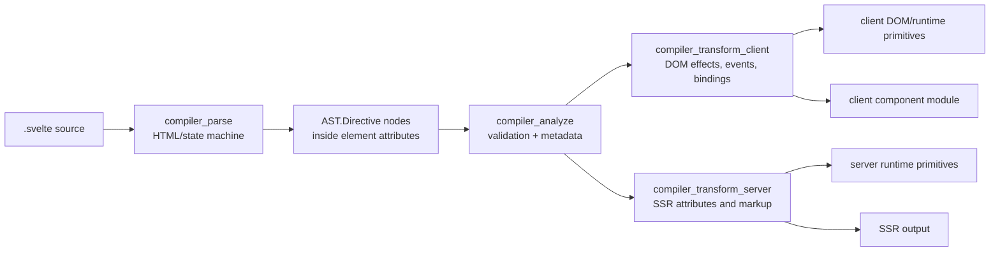
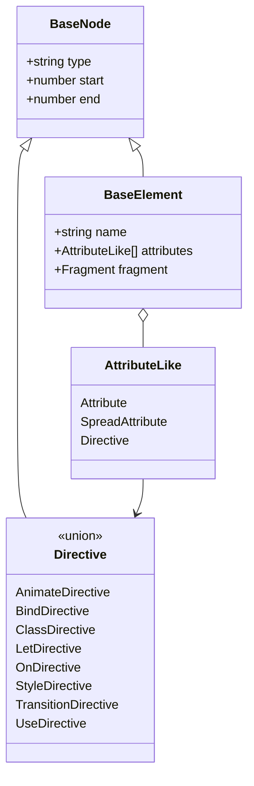
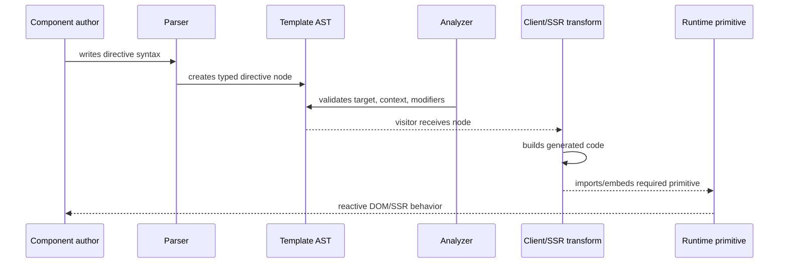
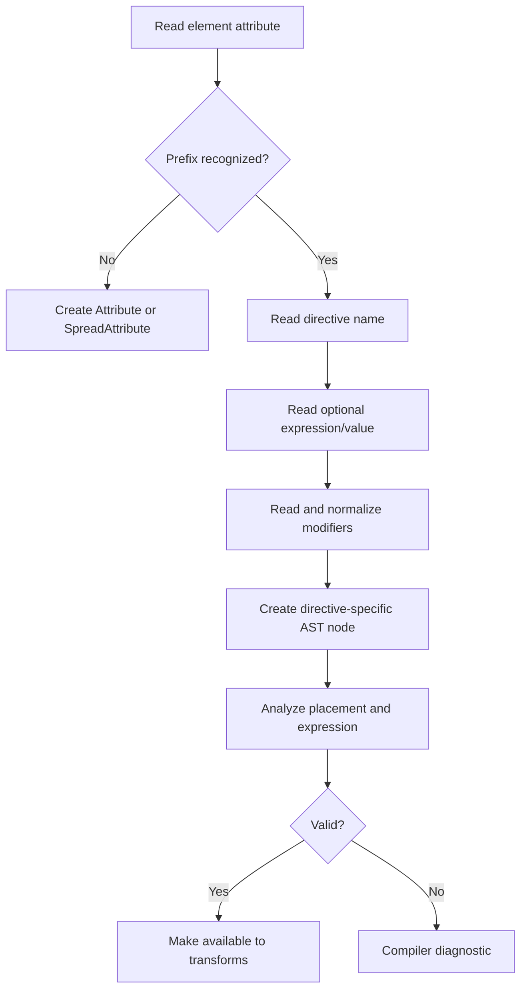
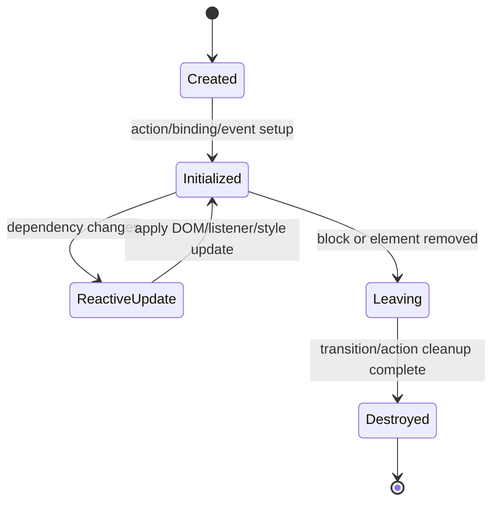
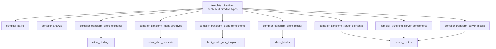

# Template directives

Template directives are the typed, compiler-visible extension points attached to Svelte elements. They describe bindings, events, classes, styles, actions, transitions, local variables, and list animations in the public template AST. The module is primarily a type contract: parsing and validation are implemented by the compiler phases, while generated code delegates behavior to client or server runtime modules.

The public declarations live in `packages/svelte/types/index.d.ts`, under `svelte/compiler` → `AST`. The directive union is exposed as `AST.Directive`, and element attributes accept directives alongside ordinary and spread attributes.

## Scope and public surface

| Directive | Syntax represented | AST payload | Main responsibility |
| --- | --- | --- | --- |
| `AnimateDirective` | `animate:name={expression}` | `name`, nullable `expression` | Reorders/moves keyed list items with an animation function. |
| `BindDirective` | `bind:name={target}` | `name`, `Identifier \\| MemberExpression \\| SequenceExpression` | Connects DOM/component state to a writable expression. |
| `ClassDirective` | `class:name={condition}` or `class:name` | fixed `name: 'class'`, `expression` | Conditionally applies a CSS class. |
| `LetDirective` | `let:name` or `let:name={pattern}` | `name`, nullable binding pattern | Exposes slot/component data to child content. |
| `OnDirective` | `on:event={handler}` | `name`, nullable `expression`, event `modifiers` | Registers an event listener and applies modifier semantics. |
| `StyleDirective` | `style:property`, `style:property={value}` | `name`, `value`, `important` modifier | Applies a reactive inline style. |
| `TransitionDirective` | `transition:name`, `in:name`, `out:name` | `name`, expression, `local/global`, `intro/outro` flags | Coordinates element enter/leave transitions. |
| `UseDirective` | `use:action={parameter}` | `name`, nullable `expression` | Invokes an action when an element is created and manages its lifecycle. |

All nodes extend `BaseNode`, so every directive carries source `start` and `end` offsets. The declarations intentionally preserve the source-level distinction between a missing expression (`null`), a valueless directive, and an expression whose value happens to be undefined.

## Position in the compiler

Directives are produced while the parser reads an element’s attribute sequence. The analyzer then validates their placement and records semantic metadata. Client and server transforms consume the same AST but emit different behavior: client code creates reactive DOM effects and listeners; server code serializes initial markup and component data, with browser-only behavior omitted or deferred.

Parser details are documented in [compiler_parse_state_machine_element.md](compiler_parse_state_machine_element.md), [compiler_parse_state_machine_tag.md](compiler_parse_state_machine_tag.md), and [compiler_parse_readers_expression.md](compiler_parse_readers_expression.md). The resulting template node model is described in [template_ast.md](template_ast.md). The overall compile orchestration is covered by [compiler_core.md](compiler_core.md).

## AST relationships

An element owns an ordered `attributes` array. Directive nodes are therefore siblings of `Attribute`, `SpreadAttribute`, and `AttachTag`; they are not standalone template children. `AST.Directive` is the discriminated union used by visitors and tooling.

The AST also feeds tooling such as formatters, language services, migration, and compiler diagnostics. Public aliases and compatibility declarations are maintained in [compiler_ast_types.md](compiler_ast_types.md) and [public_api.md](public_api.md).

## Directive semantics and compiler consumers

### `bind:`

`BindDirective.expression` is deliberately narrower than a general JavaScript expression: it must identify a writable location, optionally represented by a sequence expression for special binding forms. Analysis checks the target and the element/property combination. Client transformation builds getter/setter logic and connects it to DOM binding implementations; relevant runtime families include [client_bindings.md](client_bindings.md) and [client_bindings_input.md](client_bindings_input.md). Component and special-element bindings are handled by the client element/component visitors.

### `on:`

The event name is stored separately from the handler expression. Modifiers are normalized into a fixed union: capture, passive/nonpassive, once, propagation control, `preventDefault`, `self`, and `trusted`. Client transformation converts these into event handlers and options/wrappers, backed by [client_dom_elements_events.md](client_dom_elements_events.md). Server transformation does not install listeners; it retains only server-relevant component/attribute behavior.

### `class:` and `style:`

Class and style directives represent reactive presentation state without requiring the user to manually construct an attribute. `StyleDirective.value` supports a literal valueless form, one expression tag, or an interleaved text/expression array, allowing values such as `style:color="{color};"`. The `important` modifier is represented explicitly. Client element visitors generate updates through attribute/style helpers; SSR visitors serialize the initial value. See [compiler_transform_client_elements_attributes.md](compiler_transform_client_elements_attributes.md) and [compiler_transform_server_elements_attributes.md](compiler_transform_server_elements_attributes.md).

### `use:`

An action name and optional parameter expression are retained in the AST. The client transform invokes the resolved action with the element, calls `update` when the parameter changes, and calls `destroy` when the element is removed. The public action lifecycle types (`Action` and `ActionReturn`) are defined in the same declaration file, while the public action API is summarized in [public_api.md](public_api.md). `{@attach ...}` is a newer, related element lifecycle mechanism but is represented by `AttachTag`, not `UseDirective`.

### `transition:`, `in:`, and `out:`

One AST type covers all three spellings. `intro` and `outro` encode whether the directive runs on insertion and removal; `local` and `global` control how nested block boundaries affect transition coordination. The client transform turns the expression into a transition factory and schedules it with block lifecycle operations. SSR emits the stable initial markup and does not play browser transitions. Runtime behavior is documented in [client_dom_elements_transitions.md](client_dom_elements_transitions.md), while transition definitions and configuration types are in [transitions.md](transitions.md).

### `animate:`

Animation directives are intended for keyed each-block movement. The parser records an optional expression, and analysis/transform enforce the placement and block constraints. Client code measures positions before and after reconciliation and invokes an animation function such as `flip`; server output has no movement animation. See [compiler_transform_client_blocks_control_flow.md](compiler_transform_client_blocks_control_flow.md) and [animations.md](animations.md).

### `let:`

`LetDirective` exposes a value supplied by a component or slot to the receiving template. Its expression can be absent or a destructuring pattern (`Identifier`, array, or object). Client and server component transforms use it while building slot/component entry points; broader component and slot relationships are documented in [compiler_transform_client_components.md](compiler_transform_client_components.md), [compiler_transform_server_components.md](compiler_transform_server_components.md), and [client_blocks_composition.md](client_blocks_composition.md).

## Data flow for a directive

The important boundary is that this module does not execute directives. It defines the stable shape passed across compiler phases and the type-level contract consumed by downstream tools.

## Representative process flows

### Parsing and validation

### Client update lifecycle

Not every directive uses every state. For example, `on:` is initialized once unless its handler is reactive, `bind:` has both DOM-to-state and state-to-DOM paths, and transitions insert an intermediate leave phase.

## Dependency map

The links above intentionally point to module-level documentation rather than repeating implementation details. The most direct implementation groupings are [compiler_transform_client_directives.md](compiler_transform_client_directives.md), [compiler_transform_client_elements.md](compiler_transform_client_elements.md), [compiler_transform_client_components.md](compiler_transform_client_components.md), and [compiler_transform_server.md](compiler_transform_server.md).

## Maintenance guidance

When adding or changing a directive:

1. Update the AST interface and `AST.Directive` union in `packages/svelte/types/index.d.ts`.
2. Update parser recognition and source-shape tests.
3. Add analyzer validation for legal hosts, expressions, modifiers, and block context.
4. Implement both client and server visitor behavior, even when server behavior is intentionally a no-op.
5. Update runtime imports/types and migration or legacy compatibility if syntax overlaps an older feature.
6. Keep published aliases and generated declaration surfaces synchronized.

Common failure modes are inconsistent modifier unions, accepting a general expression where a writable pattern is required, emitting client-only behavior during SSR, and updating the public declaration without updating the modern AST or visitor implementations.

## Related documentation

- [template_ast.md](template_ast.md) — complete modern template AST model.
- [compiler_analyze.md](compiler_analyze.md) — semantic analysis and validation phase.
- [compiler_transform_client_directives.md](compiler_transform_client_directives.md) — client directive visitors.
- [compiler_transform_server.md](compiler_transform_server.md) — server-side transform architecture.
- [client_dom_elements_events.md](client_dom_elements_events.md) — event runtime.
- [client_dom_elements_transitions.md](client_dom_elements_transitions.md) — transition runtime.
- [client_bindings.md](client_bindings.md) — DOM binding runtime.
- [transitions.md](transitions.md) and [animations.md](animations.md) — public transition and animation contracts.
- [public_api.md](public_api.md) — package-level public API exports.
