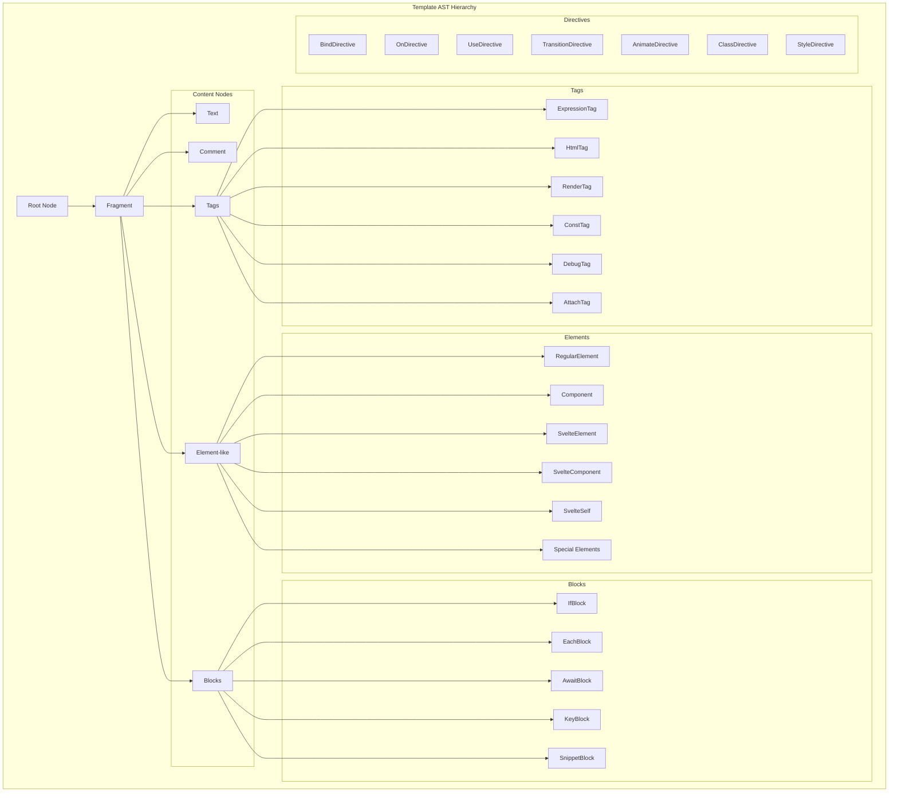
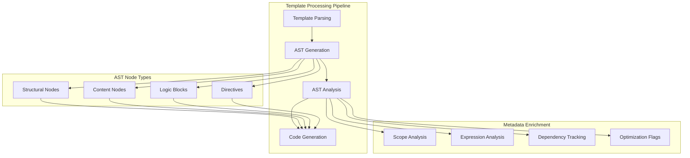
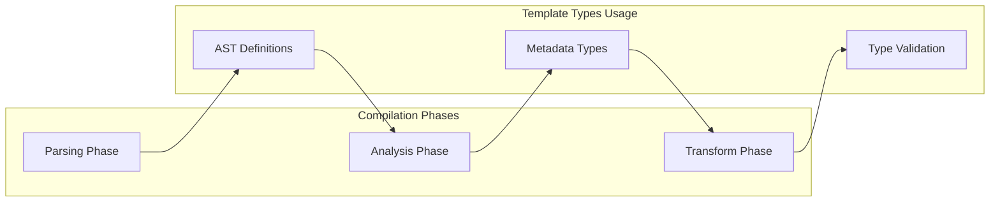

# Template Types Module

The template_types module defines the comprehensive Abstract Syntax Tree (AST) type definitions for Svelte templates. It serves as the foundational type system that represents the parsed structure of Svelte components, including HTML elements, directives, blocks, and expressions.

## Overview

This module provides TypeScript type definitions for all possible nodes in a Svelte template AST. It defines the structure that results from parsing Svelte component templates and is used throughout the compilation pipeline for type safety and code generation.

## Architecture



## Core Components

### Root Structure

#### Root
The top-level AST node representing an entire Svelte component.

**Key Properties:**
- `fragment`: The main template content
- `css`: Parsed stylesheet (if present)
- `instance`: Component script block
- `module`: Module script block
- `options`: Inline component options from `<svelte:options>`
- `comments`: JavaScript comments found in scripts and expressions

#### Fragment
A container for template nodes with metadata about scope and rendering behavior.

**Key Properties:**
- `nodes`: Array of child template nodes
- `metadata.transparent`: Whether the fragment's scope delegates to parent
- `metadata.dynamic`: Whether traversal is needed during mount/hydrate
- `metadata.has_await`: Contains await blocks

### Content Nodes

#### Text
Represents static text content in templates.

**Key Properties:**
- `data`: Decoded HTML text
- `raw`: Original text with HTML entities

#### Comment
HTML comments in templates.

**Key Properties:**
- `data`: Comment content

### Expression Tags

#### ExpressionTag
Reactive template expressions (`{expression}`).

**Key Properties:**
- `expression`: The JavaScript expression
- `metadata.expression`: Expression analysis metadata

#### HtmlTag
Raw HTML expressions (`{@html expression}`).

**Key Properties:**
- `expression`: Expression producing HTML
- `metadata.expression`: Expression analysis metadata

#### RenderTag
Snippet rendering tags (`{@render snippet(...)}`).

**Key Properties:**
- `expression`: Call expression for snippet
- `metadata.dynamic`: Whether render is dynamic
- `metadata.arguments`: Argument analysis
- `metadata.snippets`: Set of possible snippet targets

### Elements

#### RegularElement
Standard HTML elements (`<div>`, `<span>`, etc.).

**Key Properties:**
- `name`: Element tag name
- `attributes`: Element attributes and directives
- `fragment`: Child content
- `metadata.svg`: Whether element is SVG
- `metadata.mathml`: Whether element is MathML
- `metadata.has_spread`: Contains spread attributes

#### Component
Svelte component instances.

**Key Properties:**
- `name`: Component name
- `attributes`: Props and directives
- `fragment`: Slot content
- `metadata.scopes`: Component scopes
- `metadata.snippets`: Renderable snippets

#### SvelteElement
Dynamic elements (`<svelte:element this={tag}>`).

**Key Properties:**
- `tag`: Expression determining element type
- `metadata.expression`: Tag expression analysis
- `metadata.svg/mathml`: Inferred namespace

### Directives

#### BindDirective
Two-way data binding (`bind:property={value}`).

**Key Properties:**
- `name`: Bound property name
- `expression`: Bound value expression
- `metadata.binding_group_name`: Group identifier
- `metadata.parent_each_blocks`: Containing each blocks

#### OnDirective
Event handlers (`on:event={handler}`).

**Key Properties:**
- `name`: Event name
- `expression`: Handler expression
- `modifiers`: Event modifiers (preventDefault, stopPropagation, etc.)
- `metadata.expression`: Handler analysis

#### UseDirective
Action directives (`use:action={params}`).

**Key Properties:**
- `name`: Action name
- `expression`: Action parameters

#### TransitionDirective
Animation directives (`transition:`, `in:`, `out:`).

**Key Properties:**
- `name`: Transition function name
- `expression`: Transition parameters
- `modifiers`: Local/global modifiers
- `intro/outro`: Direction flags

### Control Flow Blocks

#### IfBlock
Conditional rendering (`{#if condition}`).

**Key Properties:**
- `test`: Condition expression
- `consequent`: Content when true
- `alternate`: Else content
- `elseif`: Whether this is an else-if branch

#### EachBlock
List rendering (`{#each items as item}`).

**Key Properties:**
- `expression`: Iterable expression
- `context`: Item binding pattern
- `body`: Loop content
- `fallback`: Empty state content
- `index`: Index variable name
- `key`: Keying expression
- `metadata.keyed`: Whether block is keyed
- `metadata.contains_group_binding`: Has grouped bindings

#### AwaitBlock
Promise handling (`{#await promise}`).

**Key Properties:**
- `expression`: Promise expression
- `value`: Resolved value pattern
- `error`: Error pattern
- `pending/then/catch`: State fragments

#### KeyBlock
Reactivity keying (`{#key expression}`).

**Key Properties:**
- `expression`: Key expression
- `fragment`: Keyed content

#### SnippetBlock
Reusable template snippets (`{#snippet name(params)}`).

**Key Properties:**
- `expression`: Snippet name
- `parameters`: Parameter patterns
- `body`: Snippet content
- `metadata.can_hoist`: Optimization flag
- `metadata.sites`: Usage locations

## Data Flow



## Integration Points

### Compiler Pipeline Integration



The template_types module integrates with:

- **[parsing_phase](parsing_phase.md)**: Provides target types for parser output
- **[analysis_phase](analysis_phase.md)**: Enriches AST nodes with analysis metadata
- **[transform_phase](transform_phase.md)**: Consumes typed AST for code generation
- **[css_types](css_types.md)**: References CSS AST types for style processing

### Runtime Integration

Template types define the compile-time representation that gets transformed into runtime code:

- **[client_runtime](client_runtime.md)**: Client-side rendering targets
- **[server_runtime](server_runtime.md)**: Server-side rendering targets
- **[component_system](component_system.md)**: Component instance types

## Type System Features

### Namespace Support
The module supports multiple XML namespaces:
- `html`: Standard HTML elements
- `svg`: SVG elements and attributes
- `mathml`: Mathematical markup elements

### Expression Metadata
All expression-containing nodes include metadata for:
- Dependency tracking
- Reactivity analysis
- Optimization opportunities
- Scope resolution

### Directive System
Comprehensive directive type system covering:
- Data binding (`bind:`)
- Event handling (`on:`)
- Actions (`use:`)
- Styling (`class:`, `style:`)
- Animations (`transition:`, `animate:`)

### Block Control Flow
Type-safe representation of Svelte's control flow:
- Conditional rendering (`{#if}`)
- List iteration (`{#each}`)
- Promise handling (`{#await}`)
- Reactivity keying (`{#key}`)
- Template snippets (`{#snippet}`)

## Usage Examples

### Basic Element Structure
```typescript
// RegularElement with attributes and directives
const element: AST.RegularElement = {
  type: 'RegularElement',
  name: 'div',
  attributes: [
    {
      type: 'Attribute',
      name: 'class',
      value: [{ type: 'Text', data: 'container' }]
    },
    {
      type: 'BindDirective',
      name: 'value',
      expression: { type: 'Identifier', name: 'inputValue' }
    }
  ],
  fragment: {
    type: 'Fragment',
    nodes: [/* child nodes */]
  }
};
```

### Component with Snippets
```typescript
// Component with snippet rendering
const component: AST.Component = {
  type: 'Component',
  name: 'MyComponent',
  attributes: [
    {
      type: 'Attribute',
      name: 'prop',
      value: [{ type: 'ExpressionTag', expression: { type: 'Identifier', name: 'value' } }]
    }
  ],
  fragment: {
    type: 'Fragment',
    nodes: [
      {
        type: 'RenderTag',
        expression: {
          type: 'CallExpression',
          callee: { type: 'Identifier', name: 'mySnippet' },
          arguments: []
        }
      }
    ]
  }
};
```

## Best Practices

### Type Safety
- Always use the provided AST types for template manipulation
- Leverage TypeScript's discriminated unions for node type checking
- Use metadata properties for optimization decisions

### Performance Considerations
- Check `metadata.dynamic` flags to avoid unnecessary traversals
- Use `metadata.transparent` for scope delegation optimization
- Leverage `metadata.can_hoist` for snippet optimization

### Extension Points
- Implement custom directive types by extending the Directive union
- Add custom metadata properties for specialized analysis
- Use the SvelteNode union for comprehensive AST traversal

## Related Documentation

- **[compiler_core](compiler_core.md)**: Overall compiler architecture
- **[parsing_phase](parsing_phase.md)**: AST generation from source
- **[analysis_phase](analysis_phase.md)**: AST enrichment and validation
- **[transform_phase](transform_phase.md)**: Code generation from AST
- **[css_types](css_types.md)**: Stylesheet AST integration
- **[compilation_interface](compilation_interface.md)**: Public compilation API