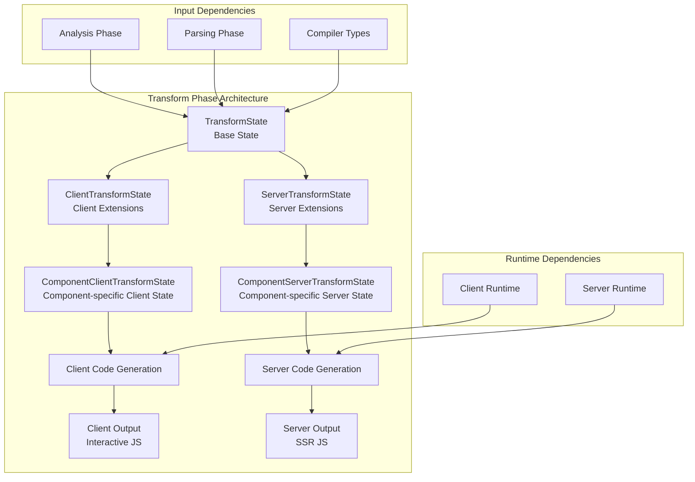
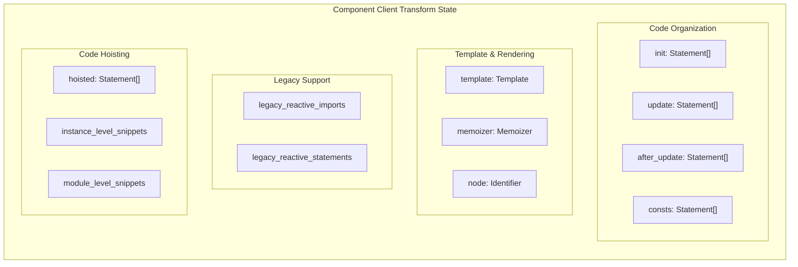
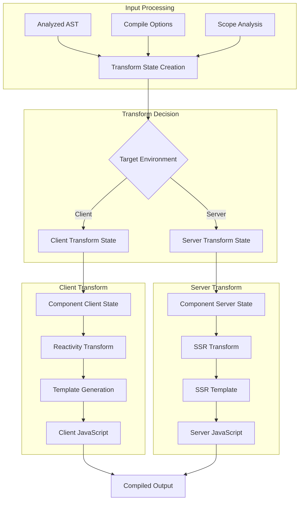
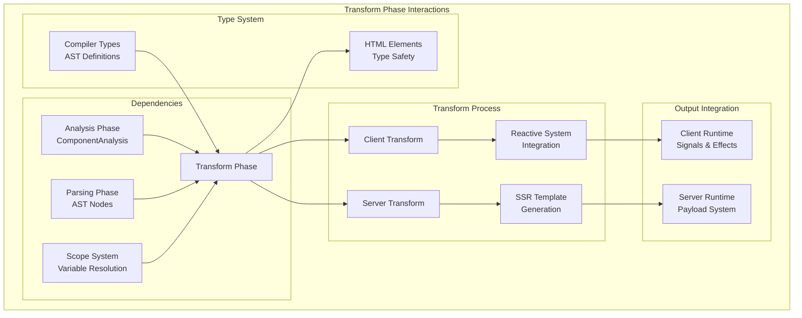

# Transform Phase Module

The Transform Phase is the third and final phase of the Svelte compilation pipeline, responsible for converting analyzed AST nodes into executable JavaScript code for both client-side and server-side rendering. This phase takes the output from the [analysis_phase](analysis_phase.md) and generates optimized runtime code that implements Svelte's reactive system.

## Overview

The Transform Phase operates on the analyzed AST and produces two distinct outputs:
- **Client-side code**: Interactive JavaScript that runs in the browser with full reactivity
- **Server-side code**: Static rendering code for server-side rendering (SSR)

The transformation process maintains state through specialized state objects that track compilation context, scope information, and code generation requirements for each target environment.

## Architecture



## Core Components

### TransformState (Base State)

The foundational state interface that provides common transformation context:

```typescript
interface TransformState {
    readonly analysis: Analysis;           // Analysis results from phase 2
    readonly options: ValidatedModuleCompileOptions; // Compilation options
    readonly scope: Scope;                // Current lexical scope
    readonly scopes: Map<AST.SvelteNode, Scope>; // Scope mapping for all nodes
    readonly state_fields: Map<string, StateField>; // Component state fields
}
```

**Key Responsibilities:**
- Maintains analysis results and compilation options
- Tracks lexical scopes for proper variable resolution
- Manages component state field mappings

### Client Transform States

#### ClientTransformState

Extends `TransformState` with client-specific transformation capabilities:

```typescript
interface ClientTransformState extends TransformState {
    readonly in_constructor: boolean;     // Constructor context flag
    readonly in_derived: boolean;         // $derived expression context
    readonly is_instance: boolean;        // <script> content flag
    readonly transform: Record<string, TransformOperations>; // Variable transformations
}
```

**Transform Operations:**
- **read**: Converts variable access to reactive reads (`foo` → `$.get(foo)`)
- **assign**: Converts assignments to reactive updates (`foo = bar` → `$.set(foo, bar)`)
- **mutate**: Handles property mutations with reactivity
- **update**: Manages increment/decrement operations

#### ComponentClientTransformState

Component-specific client transformation state with comprehensive code generation tracking:



**Code Generation Phases:**
1. **init**: Pre-render effect initialization
2. **update**: Render effect content
3. **after_update**: Post-render effects (bindings, actions, etc.)
4. **consts**: Transformed `{@const}` declarations

### Server Transform States

#### ServerTransformState

Minimal server-specific extensions focusing on legacy reactive statement handling:

```typescript
interface ServerTransformState extends TransformState {
    readonly legacy_reactive_statements: Map<LabeledStatement, Statement>;
}
```

#### ComponentServerTransformState

Server-side component transformation with SSR-specific optimizations:

```typescript
interface ComponentServerTransformState extends ServerTransformState {
    readonly template: Array<Statement | Expression>; // SSR template
    readonly namespace: Namespace;                     // HTML/SVG namespace
    readonly preserve_whitespace: boolean;             // Whitespace handling
    readonly skip_hydration_boundaries: boolean;       // Hydration optimization
}
```

## Data Flow



## Component Interactions



## Key Features

### Reactive Transformation

The transform phase implements Svelte's reactive system by converting regular JavaScript variables into reactive primitives:

- **State Variables**: Transformed into signals with getter/setter patterns
- **Derived Values**: Converted to computed expressions with dependency tracking
- **Effects**: Generated for side effects and DOM updates

### Dual-Target Compilation

**Client-Side Features:**
- Full reactivity with signals and effects
- Event handling and user interactions
- Dynamic DOM updates and transitions
- Component lifecycle management

**Server-Side Features:**
- Static HTML generation
- Hydration boundary optimization
- Minimal runtime overhead
- SEO-friendly output

### Code Organization

The transform phase organizes generated code into logical sections:

1. **Hoisted Code**: Module-level declarations and imports
2. **Initialization**: Component setup and initial state
3. **Render Effects**: Template rendering and updates
4. **Post-Render**: Bindings, actions, and cleanup

### Legacy Support

Maintains compatibility with Svelte's legacy reactive syntax (`$:`) while providing migration paths to the new reactive system.

## Integration Points

### With Analysis Phase
- Consumes `ComponentAnalysis` for transformation decisions
- Uses scope information for variable resolution
- Leverages binding analysis for reactive transformations

### With Runtime Systems
- **Client Runtime**: Integrates with [client_runtime](client_runtime.md) signals and effects
- **Server Runtime**: Utilizes [server_runtime](server_runtime.md) payload system

### With Type System
- Maintains type safety through [compiler_types](compiler_types.md)
- Ensures proper HTML element handling via [html_elements](html_elements.md)

## Performance Considerations

### Client Optimizations
- Memoization of expensive computations
- Efficient DOM update strategies
- Minimal reactive overhead

### Server Optimizations
- Static template generation
- Hydration boundary skipping
- Reduced bundle size for SSR

### Memory Management
- Proper cleanup of reactive subscriptions
- Efficient scope chain management
- Optimized code generation patterns

## Error Handling

The transform phase includes comprehensive error handling for:
- Invalid reactive patterns
- Scope resolution failures
- Type mismatches during transformation
- Runtime compatibility issues

## Future Considerations

The transform phase is designed to accommodate:
- New reactive primitives and patterns
- Enhanced SSR capabilities
- Performance optimizations
- Developer experience improvements

This modular architecture ensures that the transform phase can evolve while maintaining backward compatibility and supporting both current and future Svelte features.