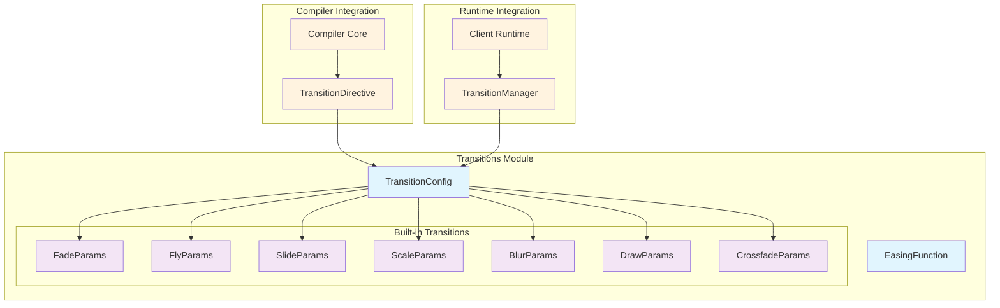
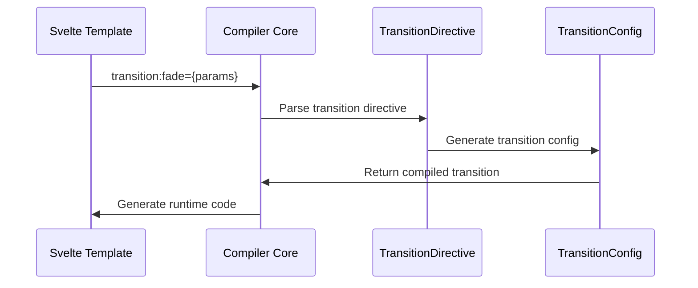
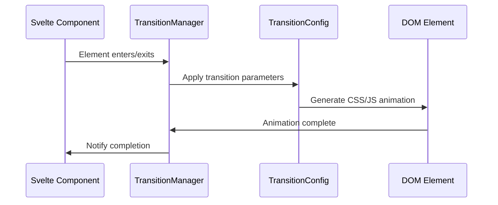
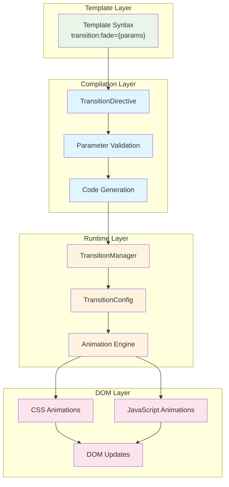

# Transitions Module

The transitions module provides a comprehensive system for creating smooth, animated transitions between different states of DOM elements in Svelte applications. It offers both built-in transition effects and a flexible framework for creating custom transitions.

## Overview

The transitions module is a core part of Svelte's animation system, working closely with the [compiler_core](compiler_core.md) during template compilation and the [client_runtime](client_runtime.md) during execution. It provides declarative APIs for common transition effects like fade, fly, slide, scale, blur, draw, and crossfade, while also offering low-level primitives for custom transition implementations.

## Architecture



## Core Components

### TransitionConfig

The foundational interface that defines the structure of all transition configurations:

```typescript
interface TransitionConfig {
    delay?: number;           // Delay before transition starts (ms)
    duration?: number;        // Duration of transition (ms)
    easing?: EasingFunction;  // Easing function for animation curve
    css?: (t: number, u: number) => string;  // CSS-based animation
    tick?: (t: number, u: number) => void;   // JavaScript-based animation
}
```

**Key Features:**
- **Flexible timing control** with delay and duration
- **Easing functions** for natural animation curves
- **Dual animation modes**: CSS-based for performance, JavaScript-based for complex logic
- **Progress parameters**: `t` (0→1 progress), `u` (1→0 reverse progress)

### EasingFunction

```typescript
type EasingFunction = (t: number) => number;
```

Defines the mathematical curve for animation progression, where:
- Input `t`: Linear progress from 0 to 1
- Output: Eased progress value (typically 0 to 1, but can exceed for bounce effects)

## Built-in Transition Parameters

### Basic Transitions

#### FadeParams
```typescript
interface FadeParams {
    delay?: number;
    duration?: number;
    easing?: EasingFunction;
}
```
Simple opacity-based fade in/out transition.

#### SlideParams
```typescript
interface SlideParams {
    delay?: number;
    duration?: number;
    easing?: EasingFunction;
    axis?: 'x' | 'y';  // Slide direction
}
```
Slides elements along specified axis using transform translations.

### Advanced Transitions

#### FlyParams
```typescript
interface FlyParams {
    delay?: number;
    duration?: number;
    easing?: EasingFunction;
    x?: number | string;    // Horizontal offset
    y?: number | string;    // Vertical offset
    opacity?: number;       // Final opacity
}
```
Combines translation and opacity changes for flying in/out effects.

#### ScaleParams
```typescript
interface ScaleParams {
    delay?: number;
    duration?: number;
    easing?: EasingFunction;
    start?: number;         // Starting scale factor
    opacity?: number;       // Final opacity
}
```
Scales elements with optional opacity changes for zoom effects.

#### BlurParams
```typescript
interface BlurParams {
    delay?: number;
    duration?: number;
    easing?: EasingFunction;
    amount?: number | string;  // Blur intensity
    opacity?: number;          // Final opacity
}
```
Applies blur filter with opacity changes for focus/unfocus effects.

### Specialized Transitions

#### DrawParams
```typescript
interface DrawParams {
    delay?: number;
    speed?: number;                           // Drawing speed
    duration?: number | ((len: number) => number);  // Duration or length-based function
    easing?: EasingFunction;
}
```
Animates SVG path drawing using stroke-dasharray manipulation.

#### CrossfadeParams
```typescript
interface CrossfadeParams {
    delay?: number;
    duration?: number | ((len: number) => number);  // Duration or distance-based function
    easing?: EasingFunction;
}
```
Creates smooth transitions between elements at different positions.

## Integration with Svelte System

### Compiler Integration



The transitions module integrates with the [compiler_core](compiler_core.md) through:
- **TransitionDirective**: Parsed from template syntax like `transition:fade`
- **Modifiers**: Support for `local` and `global` transition scoping
- **Expression binding**: Dynamic parameter passing from component state

### Runtime Integration



The transitions module works with the [client_runtime](client_runtime.md) through:
- **TransitionManager**: Orchestrates transition lifecycle
- **Effect system**: Integrates with Svelte's reactivity for state-driven transitions
- **Batch processing**: Coordinates multiple simultaneous transitions

## Data Flow



## Usage Patterns

### Basic Usage
```svelte
<script>
  import { fade, fly, scale } from 'svelte/transition';
  let visible = true;
</script>

{#if visible}
  <div transition:fade>Fade in/out</div>
  <div in:fly={{ x: 200 }} out:scale={{ start: 0.7 }}>
    Different in/out transitions
  </div>
{/if}
```

### Custom Transitions
```javascript
function customTransition(node, params) {
  return {
    delay: params.delay || 0,
    duration: params.duration || 400,
    easing: params.easing || linear,
    css: (t, u) => `
      transform: scale(${t}) rotate(${t * 180}deg);
      opacity: ${t};
    `
  };
}
```

### Advanced Crossfade
```javascript
import { crossfade } from 'svelte/transition';

const [send, receive] = crossfade({
  duration: 300,
  fallback: fade
});

// Use in template with matching keys
<div in:receive={{ key: id }} out:send={{ key: id }}>
  Content that crossfades between positions
</div>
```

## Performance Considerations

### CSS vs JavaScript Animations
- **CSS animations** (`css` function): Hardware accelerated, better performance
- **JavaScript animations** (`tick` function): More control, complex logic support

### Optimization Strategies
- Use `transform` and `opacity` properties for best performance
- Avoid animating layout properties (`width`, `height`, `margin`)
- Leverage `will-change` CSS property for complex animations
- Consider `prefers-reduced-motion` for accessibility

## Related Modules

- **[animations](animations.md)**: Complementary animation system for layout changes
- **[motion](motion.md)**: Physics-based animations with springs and tweening
- **[client_runtime](client_runtime.md)**: Runtime execution and effect management
- **[compiler_core](compiler_core.md)**: Template compilation and directive processing
- **[component_system](component_system.md)**: Component lifecycle integration

## Best Practices

1. **Performance**: Prefer CSS-based transitions for simple animations
2. **Accessibility**: Respect `prefers-reduced-motion` user preferences
3. **Timing**: Use appropriate durations (200-500ms for most UI transitions)
4. **Easing**: Choose easing functions that match the transition's purpose
5. **Fallbacks**: Provide fallback transitions for crossfade operations
6. **Testing**: Test transitions across different devices and browsers

The transitions module provides a powerful, declarative way to add smooth animations to Svelte applications while maintaining excellent performance and developer experience through its tight integration with Svelte's compilation and runtime systems.