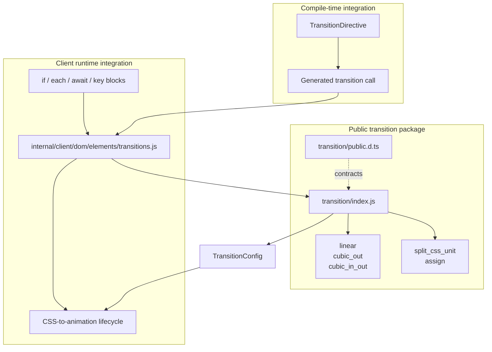
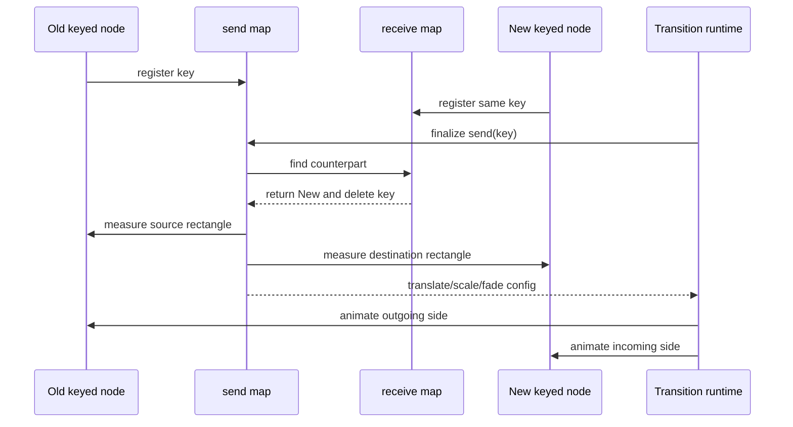
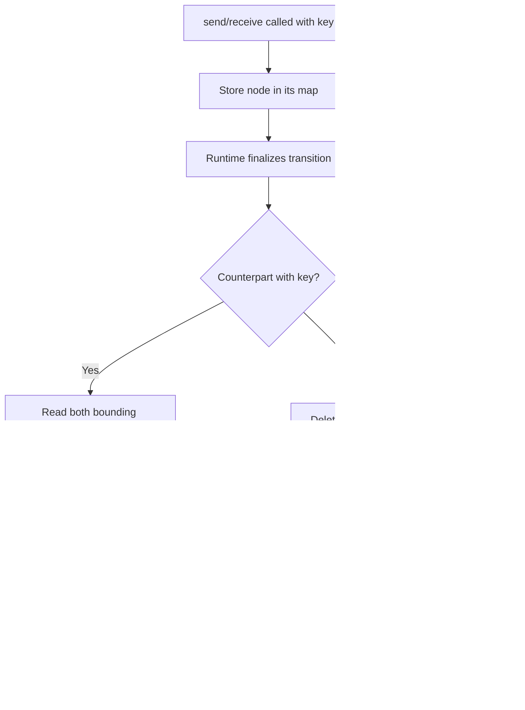

# Transitions

The transitions module provides Svelte's built-in element transition factories and their public TypeScript contracts. It converts an element's current computed style or geometry into a time-based `TransitionConfig`; the client DOM runtime then evaluates that configuration during an intro or outro. The module also exports easing functions and `crossfade`, a paired transition factory for keyed elements that move between locations.

This page focuses on the factory library. The compiler visitor that emits runtime transition calls is documented in [compiler_transform_client_directives.md](compiler_transform_client_directives.md), and the runtime lifecycle that executes the returned configurations is documented in [client_dom_elements_transitions.md](client_dom_elements_transitions.md). The module participates in the broader compiler/runtime path described by [compilation_pipeline.md](compilation_pipeline.md).

## Responsibilities and boundaries

`packages/svelte/src/transition/index.js` owns:

- Built-in CSS transition factories: `fade`, `blur`, `fly`, `slide`, `scale`, and `draw`.
- Paired keyed transitions through `crossfade`.
- Default easing functions: `linear`, `cubic_out`, and `cubic_in_out`.
- Reading the element's computed opacity, transform, filter, box metrics, or SVG path length to establish the transition's target state.

`packages/svelte/src/transition/public.d.ts` owns the public parameter types and the `TransitionConfig` shape. It does not implement scheduling, DOM insertion/removal, cancellation, reversal, or Web Animations conversion. Those concerns belong to the client DOM runtime.

```mermaid
flowchart LR
    Svelte["Svelte component\ntransition:fade / in:fly / out:slide"] --> Compiler["TransitionDirective\ncompiler transform"]
    Compiler --> Call["Generated $.transition(...) call"]
    Call --> Runtime["Client DOM transition runtime"]
    Runtime --> Factory["Factory from transition/index.js"]
    Factory --> Config["TransitionConfig\ndelay, duration, easing, css/tick"]
    Config --> Animation["Runtime animation lifecycle"]
    Animation --> DOM["Element styles and DOM state"]
```

## Public API

All built-in factories accept an `Element` (or an SVG element for `draw`) and an optional parameter object. They return a `TransitionConfig` with optional `delay`, `duration`, `easing`, and either a `css(t, u)` function or a runtime `tick(t, u)` function. The runtime supplies normalized progress `t` and its complement `u = 1 - t`; factories use either value depending on whether an effect is entering or leaving.

| Factory | Main effect | Important parameters | Implementation basis |
| --- | --- | --- | --- |
| `fade` | Opacity | `delay`, `duration`, `easing` | Current computed opacity |
| `blur` | Opacity plus blur filter | `amount`, `opacity`, common timing options | Computed opacity and existing filter |
| `fly` | Translation plus opacity | `x`, `y`, `opacity`, common timing options | Computed transform and opacity; CSS units accepted |
| `slide` | Collapse/expand along one axis | `axis: 'x' \| 'y'`, common timing options | Computed dimensions, padding, margins, and borders |
| `scale` | Scale plus opacity | `start`, `opacity`, common timing options | Computed transform and opacity |
| `draw` | SVG stroke reveal/erase | `speed` or `duration`, `easing` | `getTotalLength()` and stroke width |
| `crossfade` | Move, resize, and fade between keyed elements | `key`, timing options, optional `fallback` | Bounding rectangles of source and destination |

The parameter contracts are defined in [`public.d.ts`](https://github.com/sveltejs/svelte/blob/main/packages/svelte/src/transition/public.d.ts) in the source tree. `TransitionConfig.duration` is numeric for ordinary factories; `crossfade` and `draw` additionally support duration functions derived from a distance or path length.

## Architecture

```mermaid
graph TD
    subgraph Public["Public transition package"]
        API["transition/index.js"]
        Types["transition/public.d.ts"]
        Easing["linear\ncubic_out\ncubic_in_out"]
        Helpers["split_css_unit\nassign"]
        API --> Easing
        API --> Helpers
        Types -. contracts .-> API
    end

    subgraph Compiler["Compile-time integration"]
        Visitor["TransitionDirective"]
        Generated["Generated transition call"]
        Visitor --> Generated
    end

    subgraph Runtime["Client runtime integration"]
        Manager["internal/client/dom/elements/transitions.js"]
        Blocks["if / each / await / key blocks"]
        WebAnim["CSS-to-animation lifecycle"]
        Manager --> WebAnim
        Blocks --> Manager
    end

    Generated --> Manager
    Manager --> API
    API --> Config["TransitionConfig"]
    Config --> WebAnim
```

The dependency direction is intentional: factories are policy-free descriptions of visual interpolation. The compiler chooses when to request a transition; the runtime chooses when to start, reverse, finish, or cancel it. See [compiler_transform_client_directives.md](compiler_transform_client_directives.md) for directive placement and [client_dom_elements_transitions.md](client_dom_elements_transitions.md) for lifecycle behavior.

## Factory behavior

### Shared timing and progress

Every factory applies defaults at call time. Unless overridden, most factories use a `400ms` duration and a factory-specific easing function. `fade` defaults to `linear`; `blur` defaults to `cubic_in_out`; `fly`, `slide`, `scale`, and `crossfade` default to `cubic_out`; `draw` defaults to `cubic_in_out`.

`css` is a function rather than a precomputed string because the runtime repeatedly evaluates it as progress changes. This keeps the factories independent of the animation scheduler and permits the runtime to support intros, outros, and reversals using the same configuration.

### `fade`

`fade` reads the element's current computed opacity (`o`) and returns `opacity: t * o`. Consequently, an intro progresses from zero to the current opacity, while an outro progresses from the current opacity to zero when the runtime supplies reversed progress.

### `blur`

`blur` preserves an existing non-`none` filter and interpolates both opacity and `blur(...)`. `amount` accepts a number or a CSS unit string; `split_css_unit` parses values such as `12px`, `1.5rem`, or numeric values, defaulting numeric values to pixels. `opacity` is the opacity endpoint used for the transition rather than the element's computed target opacity.

### `fly`

`fly` preserves an existing transform, appends a translation, and interpolates opacity. `x` and `y` use the same number-or-unit-string parsing as `blur`. The translation is based on `(1 - t)`, while opacity uses the complementary interpolation needed to support both entering and leaving transitions.

### `slide`

`slide` collapses an element without relying only on `height` or `width`. For a vertical slide it interpolates height, top/bottom padding, margins, and border widths; for a horizontal slide it uses width and left/right properties. It always emits `overflow: hidden` and `min-height: 0` or `min-width: 0`.

In development builds, a one-shot warning is emitted for `contents`, `inline`, or `table` display values because those display modes do not provide reliable dimensions for this technique. The warning state is reset in a microtask so repeated problematic calls do not spam indefinitely.

### `scale`

`scale` preserves an existing transform and appends a scale operation. `start` controls the initial scale, and `opacity` controls the non-target opacity endpoint. As with `fly`, the factory reads the current computed target opacity and transform before producing CSS.

### `draw`

`draw` is restricted to SVG nodes exposing `getTotalLength()`. It computes a path length, adds the stroke width for non-`butt` line caps, and emits `stroke-dasharray` plus `stroke-dashoffset`. Duration selection is:

1. An explicit numeric duration wins.
2. A duration function receives the measured path length.
3. Otherwise `speed` is converted to duration as `length / speed`.
4. If neither duration nor speed is supplied, duration defaults to `800ms`.

## Crossfade coordination

`crossfade({ ...defaults, fallback })` returns `[send, receive]`. Each returned function is used as a transition factory and expects a `key` in its parameters. Internally, two maps temporarily register nodes waiting to send or receive:

- `to_send` stores outgoing nodes.
- `to_receive` stores incoming nodes.

When a transition is finalized by the runtime, it checks the opposite map for the same key. If found, the source and destination rectangles are measured, the counterpart is claimed and removed, and a configuration is returned that translates, scales, and fades the destination relative to the source. The default duration is proportional to travel distance: `sqrt(distance) * 30`.

```mermaid
sequenceDiagram
    participant Old as Old keyed node
    participant Send as send map
    participant Receive as receive map
    participant New as New keyed node
    participant Runtime as Transition runtime

    Old->>Send: register key
    New->>Receive: register same key
    Runtime->>Send: finalize send(key)
    Send->>Receive: find counterpart
    Receive-->>Send: return New and delete key
    Send->>Old: measure source rectangle
    Send->>New: measure destination rectangle
    Send-->>Runtime: translate/scale/fade config
    Runtime->>Old: animate outgoing side
    Runtime->>New: animate incoming side
```

If the opposite key is absent, the item is removed from its own map and `fallback(node, params, intro)` is called when a fallback was supplied. This handles elements that disappear altogether instead of moving to a counterpart. The `intro` boolean distinguishes the receive-side fallback from the send-side fallback.

The crossfade CSS calculation preserves the destination's existing transform, uses `transform-origin: top left`, translates by the rectangle delta, and interpolates width and height through scale factors. The distance passed to a duration function is the Euclidean distance between rectangle origins, not the full transformed path.

```mermaid
flowchart TD
    Start["send/receive called with key"] --> Register["Store node in its map"]
    Register --> Finalize["Runtime finalizes transition"]
    Finalize --> Match{"Counterpart with key?"}
    Match -->|Yes| Measure["Read both bounding rectangles"]
    Measure --> Build["Build translate/scale/opacity config"]
    Build --> Animate["Runtime executes paired transition"]
    Match -->|No| Delete["Delete unclaimed node"]
    Delete --> Fallback{"fallback supplied?"}
    Fallback -->|Yes| UseFallback["Return fallback config"]
    Fallback -->|No| Noop["No crossfade config"]
```

## End-to-end process

```mermaid
flowchart LR
    Source[".svelte source"] --> Parse["Parse transition directive"]
    Parse --> Analyze["Analyze directive and block ownership"]
    Analyze --> Transform["Client transform emits transition call"]
    Transform --> Mount["Element mounted or block changes"]
    Mount --> Invoke["Runtime invokes factory with node"]
    Invoke --> Snapshot["Factory snapshots computed style/geometry"]
    Snapshot --> Tick["Runtime evaluates css(t,u)"]
    Tick --> Paint["Browser applies styles"]
    Paint --> Complete["Finish, reverse, or cancel"]
```

The factory is normally invoked only in the browser because it calls `getComputedStyle`, `getBoundingClientRect`, or `getTotalLength`. It is therefore a client-side visual-effects API. Server rendering may emit the element markup, but it does not execute these browser measurements; see [server_runtime.md](server_runtime.md) for server-side rendering responsibilities.

## Integration and maintenance notes

- Changes to parameter defaults or CSS formulas belong in `packages/svelte/src/transition/index.js`.
- Changes to public parameter names, accepted types, or `TransitionConfig` belong in `packages/svelte/src/transition/public.d.ts` and the published type surface.
- Changes to when transitions start, reverse, or clean up belong in `internal/client/dom/elements/transitions.js`, not in the factories.
- Changes to how `transition:`, `in:`, and `out:` are compiled belong in `compiler/phases/3-transform/client/visitors/TransitionDirective.js`.
- `slide` is the only built-in factory with an explicit development warning in this file; preserve its throttling behavior when changing validation.
- `crossfade` depends on lifecycle ordering: its maps are populated before the runtime finalizes a transition. Changes to block or transition scheduling should be checked against keyed `each` and conditional block behavior documented in [client_blocks.md](client_blocks.md).

The module has no independent reactive state. Its persistent state is limited to the two per-`crossfade` maps and the transient development warning flag for `slide`; all animation progress and cleanup are owned by the client runtime.
