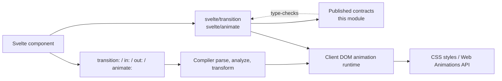
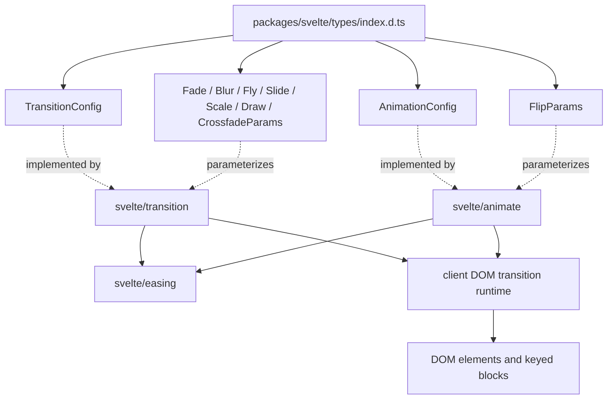
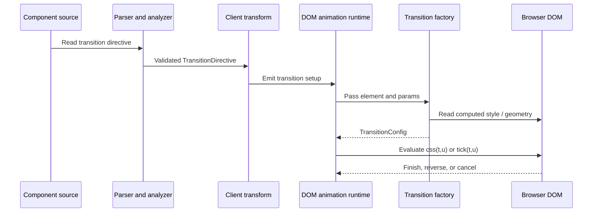
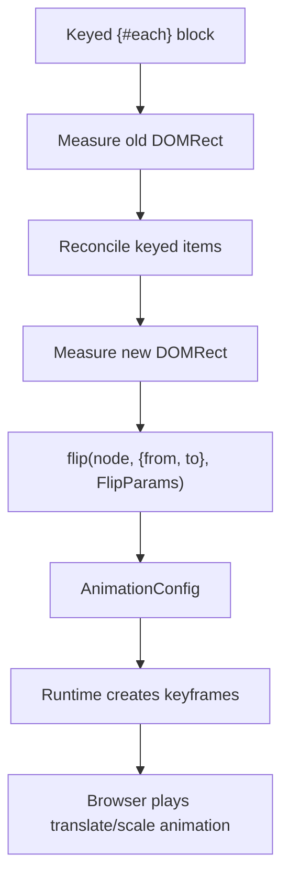
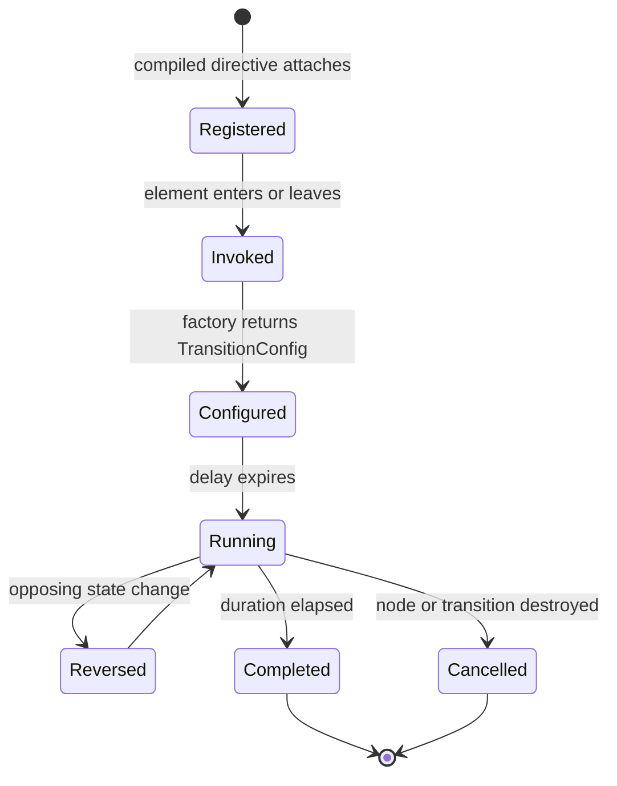
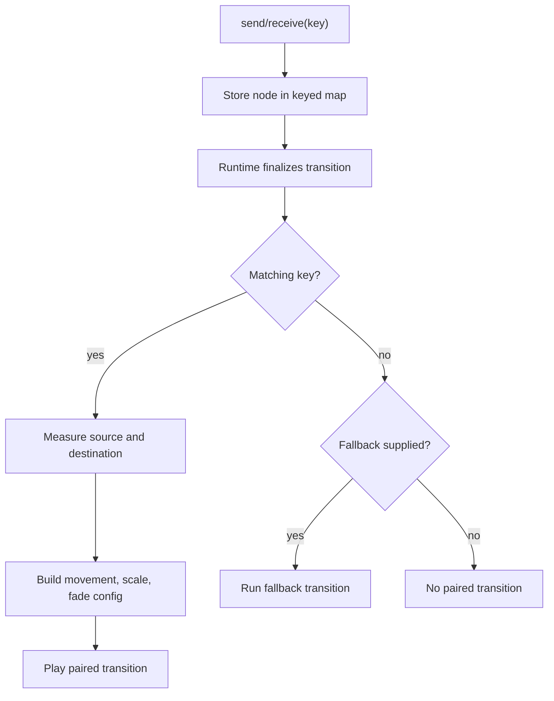

# Transitions and Animations

The `transitions_and_animations` module is Svelte's published type surface for visual effects that operate on DOM elements. It groups the contracts for element transitions, keyed-list animations, and the configuration objects returned to Svelte's client runtime. The implementation is distributed across [`svelte/transition`](transitions.md), [`svelte/animate`](animations.md), [`svelte/easing`](easing.md), and the client DOM runtime; this document explains how those pieces fit together.

The public declarations are defined in `packages/svelte/types/index.d.ts` and re-export the following contracts:

- `TransitionConfig` and `AnimationConfig` — runtime-facing animation descriptions.
- `FadeParams`, `FlyParams`, `SlideParams`, `ScaleParams`, `BlurParams`, `DrawParams`, and `CrossfadeParams` — built-in transition options.
- `FlipParams` — options for the keyed-list `flip` animation.

## Position in the system

This module is a type/API boundary rather than an animation engine. It describes what factories accept and return. The compiler recognizes directives, the client runtime supplies timing and geometry, and the browser applies CSS or Web Animations updates.



The module does not own reactive state, frame scheduling, DOM insertion/removal, keyed reconciliation, or server-side animation playback. Those responsibilities are documented in [client_dom_elements_transitions.md](client_dom_elements_transitions.md), [client_blocks.md](client_blocks.md), [client_reactivity.md](client_reactivity.md), and [server_runtime.md](server_runtime.md).

## Public contracts

### `TransitionConfig`

`TransitionConfig` is returned by a transition factory such as `fade` or `fly`:

```ts
interface TransitionConfig {
  delay?: number;
  duration?: number;
  easing?: (t: number) => number;
  css?: (t: number, u: number) => string;
  tick?: (t: number, u: number) => void;
}
```

`t` is normalized progress and `u` is its complement (`1 - t`). A factory may describe an effect with generated CSS or imperative `tick` updates. The runtime invokes the callback repeatedly and decides whether progress represents an intro or outro.

### `AnimationConfig`

`AnimationConfig` has the same shape as `TransitionConfig` for the public `flip` API:

```ts
interface AnimationConfig {
  delay?: number;
  duration?: number;
  easing?: (t: number) => number;
  css?: (t: number, u: number) => string;
  tick?: (t: number, u: number) => void;
}
```

The separate name communicates intent: transitions describe element entry/exit, while animations describe an already-present element moving or resizing after an update. See [animations.md](animations.md) for the `flip` lifecycle.

### Transition parameter interfaces

All transition parameter interfaces accept optional timing controls unless noted otherwise.

| Contract | Main options | Intended effect |
| --- | --- | --- |
| `FadeParams` | `delay`, `duration`, `easing` | Opacity interpolation |
| `BlurParams` | common timing options, `amount`, `opacity` | Blur and opacity interpolation |
| `FlyParams` | common timing options, `x`, `y`, `opacity` | Translation and opacity |
| `SlideParams` | common timing options, `axis: 'x' \| 'y'` | Dimension, padding, margin, and border collapse |
| `ScaleParams` | common timing options, `start`, `opacity` | Scale and opacity interpolation |
| `DrawParams` | `delay`, `speed`, `duration`, `easing` | SVG stroke reveal/erase |
| `CrossfadeParams` | `delay`, `duration` or duration function, `easing` | Movement between keyed source/destination nodes |

`FlyParams.x` and `y` accept numbers or CSS unit strings. `BlurParams.amount` accepts a number or CSS unit string. `DrawParams` and `CrossfadeParams` can derive duration from measured length or distance through a `(len: number) => number` callback.

The implementation behavior and defaults belong to [transitions.md](transitions.md); this page records the stable contract and its consumers.

### `FlipParams`

```ts
interface FlipParams {
  delay?: number;
  duration?: number | ((len: number) => number);
  easing?: (t: number) => number;
}
```

`flip(node, { from, to }, params)` receives the element's old and new `DOMRect` values and returns an `AnimationConfig`. The duration callback receives the calculated translation distance. `flip` implements First–Last–Invert–Play for keyed `{#each}` updates; see [animations.md](animations.md).

## Component relationships



The aggregate declaration intentionally sits above implementation-specific files. A change to a public option must be reflected in the relevant implementation declaration and in the published aggregate types; a change to scheduling or lifecycle belongs in the compiler/runtime modules instead.

## Transition data flow



The supported directive forms are represented in the template AST as `TransitionDirective` with `intro`, `outro`, and `local/global` modifier information. The compiler transform is described in [compiler_transform_client_directives.md](compiler_transform_client_directives.md), and the AST contract is described in [template_ast.md](template_ast.md).

## Animation data flow



Unlike transitions, `animate:flip` is not an entry/exit effect. It requires a keyed `each` block and is coupled to the block runtime's before/after measurement window. The compiler validates placement and marks the block for animated reconciliation; the runtime owns the measurement and playback sequence.

## Process flows

### Element transition lifecycle



The runtime can reverse an in-progress transition and coordinates block-level outro groups. Factory functions remain stateless descriptions of interpolation. Details are maintained in [client_dom_elements_transitions.md](client_dom_elements_transitions.md).

### Crossfade process

`crossfade` returns paired `send` and `receive` factories. Each side registers a keyed node; when the counterpart exists, the runtime measures both rectangles and creates a transform/opacity transition. If no counterpart exists, the configured fallback handles the unmatched side.



## Runtime and compiler boundaries

| Concern | Owning component | Relationship to this module |
| --- | --- | --- |
| Parse `transition:` and `animate:` syntax | `compiler_transform_client_directives` | Produces the validated directive representation |
| Validate transition/animation placement | `compiler_analyze` | Rejects invalid hosts and block contexts |
| Emit runtime setup | `compiler_transform_client_directives` and block visitors | Connects compiled templates to runtime helpers |
| Execute CSS/tick callbacks | `client_dom_elements_transitions` | Consumes `TransitionConfig` and `AnimationConfig` |
| Measure keyed list changes | `client_blocks` | Supplies `from`/`to` rectangles to `flip` |
| Provide easing functions | `easing` | Supplies pure progress transforms |
| Render on the server | `server_runtime` | Emits markup; does not perform browser animation |
| Publish aggregate declarations | `published_type_declaration_surface` | Re-exports these contracts for consumers |

The full compile path is documented in [compilation_pipeline.md](compilation_pipeline.md). The public package entry points and runtime exports are described in [public_api.md](public_api.md).

## Maintenance guidance

- Update `packages/svelte/src/transition/public.d.ts` when transition options or `TransitionConfig` change.
- Update `packages/svelte/src/animate/public.d.ts` when `FlipParams` or `AnimationConfig` changes.
- Keep `packages/svelte/types/index.d.ts` synchronized with both module-level declarations.
- Update [template_ast.md](template_ast.md) and compiler directive documentation when directive shape or modifiers change.
- Test changes against keyed `each` blocks, conditional blocks, initial intros, outros, reversals, and SSR output.
- Preserve reduced-motion and easing behavior documented by [motion.md](motion.md) and [easing.md](easing.md) when changing timing APIs.

## Related documentation

- [transitions.md](transitions.md) — built-in transition factories and `crossfade`.
- [animations.md](animations.md) — `flip`, keyed-list measurement, and animation playback.
- [motion.md](motion.md) — value-level `Spring`/`Tween` APIs and reduced-motion support.
- [easing.md](easing.md) — pure easing functions.
- [client_dom_elements_transitions.md](client_dom_elements_transitions.md) — runtime execution and cleanup.
- [compiler_transform_client_directives.md](compiler_transform_client_directives.md) — directive compilation.
- [template_ast.md](template_ast.md) — `TransitionDirective` and `AnimateDirective` AST contracts.
- [public_api.md](public_api.md) — package-level public entry points and consumer-facing API boundaries.
