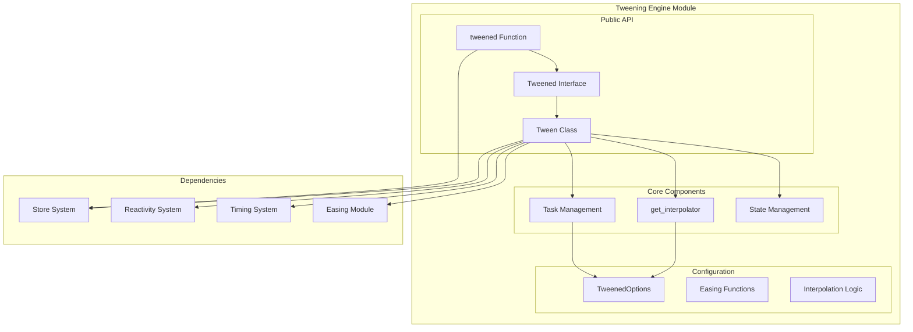
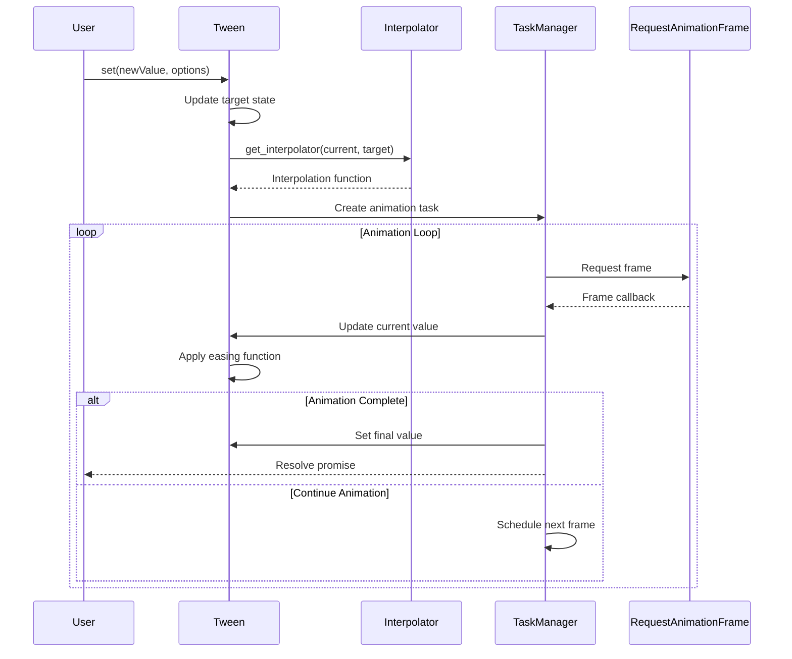
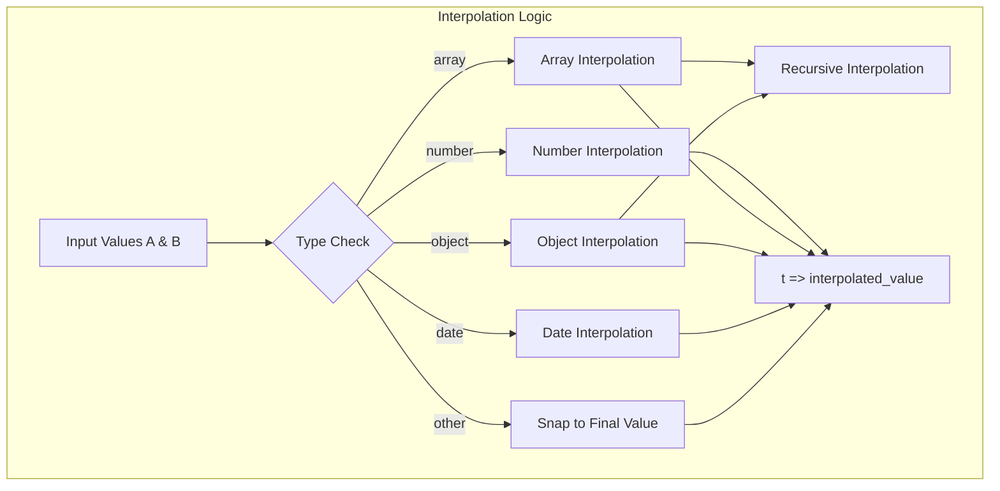
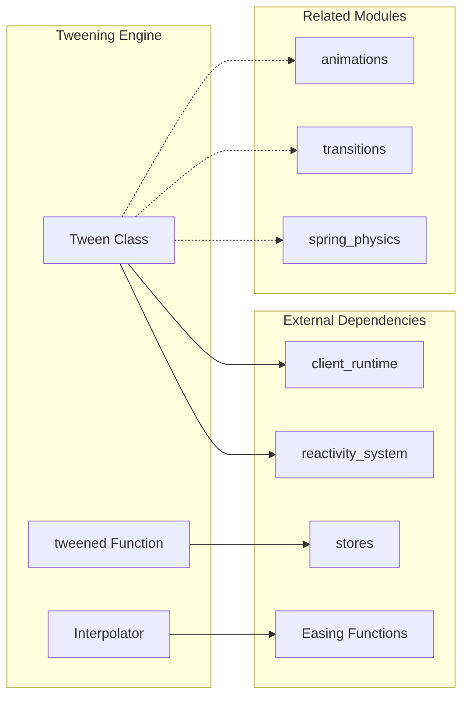

# Tweening Engine Module

The tweening engine module provides smooth animation capabilities for Svelte applications through interpolated value transitions over time. It offers both legacy store-based and modern class-based APIs for creating smooth animations between different states.

## Overview

The tweening engine enables developers to create smooth transitions between values using customizable easing functions, durations, and interpolation methods. It supports various data types including numbers, objects, arrays, and dates, making it versatile for different animation scenarios.

## Architecture



## Core Components

### Tween Class

The modern `Tween` class provides a reactive approach to value tweening with automatic state management.

**Key Features:**
- Reactive `current` and `target` properties
- Promise-based completion tracking
- Automatic interpolation between different data types
- Configurable easing and duration options

**Usage Pattern:**
```javascript
const tween = new Tween(initialValue, options);
tween.target = newValue; // Triggers smooth transition
```

### Tweened Interface & Function

The legacy `tweened` function creates store-based tweened values compatible with Svelte's store system.

**Key Features:**
- Store-compatible API with subscribe/set/update methods
- Backward compatibility with existing codebases
- Manual value management through function calls

### TweenedOptions Configuration

Comprehensive configuration interface supporting:
- **delay**: Animation start delay in milliseconds
- **duration**: Animation duration (static or dynamic based on values)
- **easing**: Timing function for animation progression
- **interpolate**: Custom interpolation logic for complex data types

## Data Flow



## Interpolation System



## Component Interactions



## Implementation Details

### Type Safety and Interpolation

The tweening engine provides robust type checking and interpolation for various data types:

- **Numbers**: Linear interpolation with delta calculation
- **Arrays**: Element-wise recursive interpolation
- **Objects**: Property-wise recursive interpolation with key preservation
- **Dates**: Time-based interpolation using millisecond values
- **Other Types**: Immediate snap to final value

### Task Management

Animation tasks are managed through the client runtime's loop system:
- Integration with `requestAnimationFrame` for smooth animations
- Automatic cleanup of previous tasks when new animations start
- Promise-based completion tracking for chaining animations

### State Management

The modern `Tween` class leverages Svelte's reactivity system:
- Reactive state sources for current and target values
- Automatic effect tracking for derived animations
- Development-time debugging support with state tagging

## Migration Path

The module provides both legacy and modern APIs to support gradual migration:

**Legacy (Deprecated):**
```javascript
import { tweened } from 'svelte/motion';
const store = tweened(0);
store.set(100);
```

**Modern (Recommended):**
```javascript
import { Tween } from 'svelte/motion';
const tween = new Tween(0);
tween.target = 100;
```

## Integration Points

### With Store System
- Legacy `tweened` function creates store-compatible objects
- Seamless integration with existing store-based architectures
- See [stores](stores.md) for store system details

### With Reactivity System
- Modern `Tween` class uses reactive state sources
- Automatic dependency tracking and updates
- See [reactivity_system](reactivity_system.md) for reactivity details

### With Client Runtime
- Task scheduling through client runtime loop system
- Integration with animation frame timing
- See [client_runtime](client_runtime.md) for runtime details

### Related Motion Systems
- Complementary to spring physics for different animation styles
- Integration with transition and animation systems
- See [spring_physics](spring_physics.md), [transitions](transitions.md), and [animations](animations.md)

## Performance Considerations

- Efficient interpolation algorithms for different data types
- Automatic task cleanup to prevent memory leaks
- Optimized animation loops using `requestAnimationFrame`
- Minimal overhead for simple numeric interpolations

## Development Features

- Development-time state tagging for debugging
- Type-safe configuration options
- Comprehensive error handling for interpolation edge cases
- Promise-based API for animation sequencing