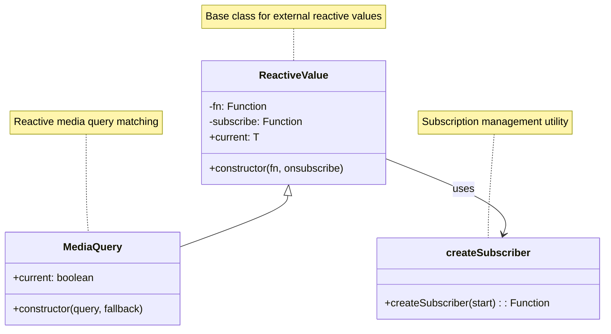
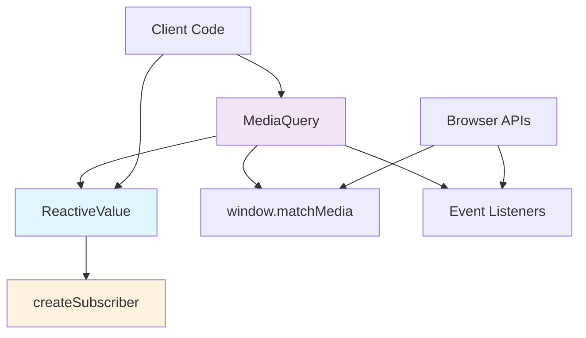
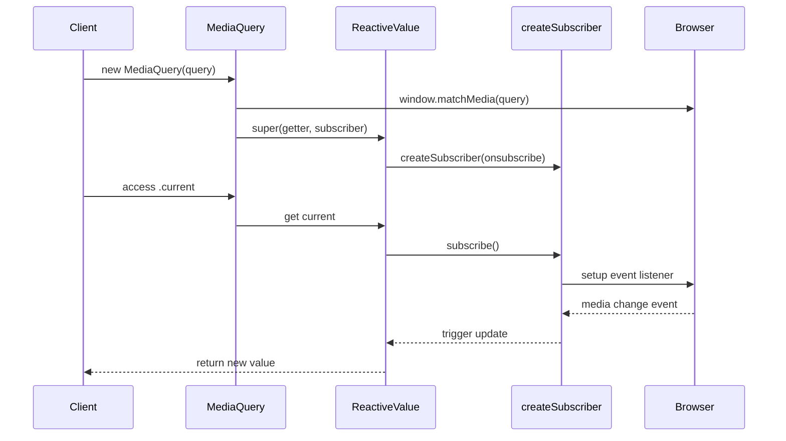
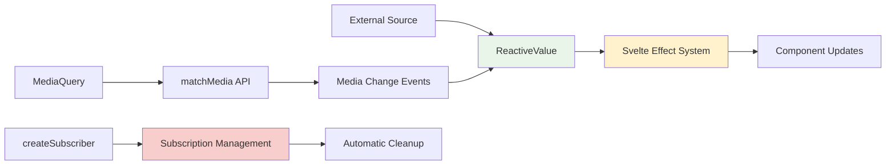

# Utility Classes Module

The utility_classes module provides specialized reactive utility classes that extend Svelte's reactivity system for common use cases. These classes offer convenient abstractions for working with browser APIs and reactive patterns while maintaining Svelte's reactive principles.

## Overview

This module contains utility classes that bridge the gap between browser APIs and Svelte's reactivity system:

- **MediaQuery**: Reactive media query matching for responsive design
- **ReactiveValue**: Base class for creating custom reactive values with external subscriptions

These utilities are part of Svelte's reactive data structures ecosystem, providing type-safe, reactive wrappers around common browser functionality.

## Architecture



## Component Relationships



## Core Components

### ReactiveValue

The `ReactiveValue` class serves as a base class for creating reactive values that depend on external subscriptions. It provides a foundation for integrating non-Svelte reactive systems with Svelte's reactivity.

**Key Features:**
- Generic type support for any value type
- Lazy subscription management
- Integration with Svelte's effect system
- Automatic cleanup of subscriptions

**Usage Pattern:**
```javascript
const reactiveValue = new ReactiveValue(
    () => getValue(), // Value getter function
    (update) => subscribeToChanges(update) // Subscription setup
);
```

### MediaQuery

The `MediaQuery` class extends `ReactiveValue` to provide reactive media query matching. It automatically handles browser compatibility and provides a clean API for responsive design patterns.

**Key Features:**
- Automatic parenthesis handling for media queries
- Support for standard media query keywords
- Server-side rendering fallback support
- Real-time updates when media conditions change

**Media Query Processing:**
- Automatically wraps queries in parentheses when needed
- Recognizes standard keywords: `all`, `print`, `screen`, `and`, `or`, `not`, `only`
- Handles complex media query syntax correctly

## Data Flow



## Integration with Svelte's Reactivity



## Usage Examples

### MediaQuery Usage

```javascript
import { MediaQuery } from 'svelte/reactivity';

// Basic media query
const isMobile = new MediaQuery('max-width: 768px');

// Complex media query
const isDarkMode = new MediaQuery('(prefers-color-scheme: dark)');

// With fallback for SSR
const isLargeScreen = new MediaQuery('min-width: 1200px', false);

// In a component
$: screenSize = isMobile.current ? 'mobile' : 'desktop';
```

### Custom ReactiveValue

```javascript
import { ReactiveValue } from 'svelte/reactivity';

// Custom reactive value for geolocation
const location = new ReactiveValue(
    () => getCurrentPosition(),
    (update) => {
        const watchId = navigator.geolocation.watchPosition(update);
        return () => navigator.geolocation.clearWatch(watchId);
    }
);
```

## Performance Considerations

### Subscription Management
- **Lazy Subscription**: Subscriptions are only active when the value is being observed
- **Automatic Cleanup**: Subscriptions are automatically cleaned up when no longer needed
- **Microtask Scheduling**: Cleanup is deferred to prevent unnecessary re-subscriptions

### MediaQuery Optimization
- **Single matchMedia Instance**: Each MediaQuery creates only one `matchMedia` instance
- **Event-Driven Updates**: Only updates when media conditions actually change
- **Efficient Query Processing**: Smart parenthesis handling reduces redundant processing

## Error Handling

### MediaQuery Error Cases
- **Invalid Queries**: Malformed media queries will be handled by the browser's `matchMedia`
- **SSR Compatibility**: Fallback values prevent hydration mismatches
- **Browser Support**: Graceful degradation for older browsers

### ReactiveValue Error Cases
- **Subscription Failures**: Errors in subscription setup are propagated to the caller
- **Value Getter Errors**: Exceptions in value getters are not caught by the class
- **Cleanup Errors**: Subscription cleanup errors are handled gracefully

## Related Modules

- **[collection_structures](collection_structures.md)**: Other reactive data structures like SvelteMap and SvelteSet
- **[web_api_wrappers](web_api_wrappers.md)**: Reactive wrappers for Web APIs like Date, URL, and URLSearchParams
- **[reactivity_system](reactivity_system.md)**: Core reactivity primitives that power these utility classes
- **[client_runtime](client_runtime.md)**: Runtime system that manages reactive updates and effects

## Browser Compatibility

### MediaQuery Support
- **Modern Browsers**: Full support for all media query features
- **Legacy Support**: Basic media query support in older browsers
- **SSR**: Server-side rendering safe with fallback values

### ReactiveValue Support
- **Event System**: Requires modern event handling capabilities
- **Effect System**: Depends on Svelte's client-side reactivity system
- **Memory Management**: Automatic cleanup requires modern JavaScript features

## Best Practices

### MediaQuery Usage
1. **Use CSS When Possible**: Prefer CSS media queries for styling
2. **Provide SSR Fallbacks**: Always provide fallback values for server-side rendering
3. **Avoid Frequent Access**: Cache the current value when possible to avoid repeated evaluations
4. **Use Semantic Breakpoints**: Use meaningful breakpoint names and values

### ReactiveValue Implementation
1. **Proper Cleanup**: Always return cleanup functions from subscription handlers
2. **Error Handling**: Handle errors in both getter and subscription functions
3. **Performance**: Minimize work in getter functions as they may be called frequently
4. **Type Safety**: Use TypeScript generics for type-safe reactive values

## Migration Guide

### From Svelte 4 to Svelte 5
- MediaQuery is a new addition in Svelte 5.7.0
- ReactiveValue provides a new pattern for external reactive integration
- These classes replace manual reactive statement patterns for external data sources

### Upgrading Patterns
```javascript
// Old pattern (Svelte 4)
let matches = false;
$: if (browser) {
    const mq = window.matchMedia('(min-width: 768px)');
    matches = mq.matches;
    mq.addEventListener('change', (e) => matches = e.matches);
}

// New pattern (Svelte 5)
const isDesktop = new MediaQuery('min-width: 768px');
$: matches = isDesktop.current;
```