# Web API Wrappers Module

The Web API Wrappers module provides reactive versions of standard Web APIs, enabling seamless integration with Svelte's reactivity system. These wrappers automatically trigger updates in effects and derived values when their underlying data changes, making it easy to work with time-sensitive data and URL manipulation in reactive contexts.

## Overview

This module contains three core reactive wrapper classes:
- **SvelteDate**: A reactive wrapper for the native Date object
- **SvelteURL**: A reactive wrapper for the native URL object  
- **SvelteURLSearchParams**: A reactive wrapper for the native URLSearchParams object

These wrappers maintain full API compatibility with their native counterparts while adding reactivity capabilities that integrate seamlessly with Svelte's [reactivity system](reactivity_system.md).

## Architecture


## Core Components

### SvelteDate

A reactive version of the built-in Date object that automatically triggers updates when date values change.

**Key Features:**
- Reactive getters for all date properties and methods
- Lazy initialization of derived values for performance
- Automatic memoization of method results
- Full compatibility with native Date API

**Implementation Details:**
- Uses a single reactive `#time` source to track the underlying timestamp
- Creates derived values on-demand for getter methods
- Intercepts setter methods to update the reactive time source
- Maintains the original reaction context for proper dependency tracking

**Usage Example:**
```javascript
import { SvelteDate } from 'svelte/reactivity';

const date = new SvelteDate();

// This will reactively update when date changes
$effect(() => {
  console.log('Current time:', date.getTime());
});

// Update the date (triggers reactive updates)
setInterval(() => {
  date.setTime(Date.now());
}, 1000);
```

### SvelteURL

A reactive wrapper for the URL object that tracks changes to all URL components.

**Key Features:**
- Individual reactive sources for each URL component (protocol, hostname, pathname, etc.)
- Automatic synchronization between related properties (host ↔ hostname + port)
- Integration with SvelteURLSearchParams for search parameter reactivity
- Bidirectional data binding support

**Reactive Properties:**
- `protocol`, `username`, `password`, `hostname`, `port`
- `pathname`, `hash`, `search`, `href`
- `host` (computed from hostname + port)
- `origin` (computed from protocol + hostname + port)
- `searchParams` (SvelteURLSearchParams instance)

**Usage Example:**
```javascript
import { SvelteURL } from 'svelte/reactivity';

const url = new SvelteURL('https://example.com/path');

// Reactive updates when any URL component changes
$effect(() => {
  console.log('Full URL:', url.href);
});

// Changes trigger reactive updates
url.pathname = '/new-path';
url.searchParams.set('query', 'value');
```

### SvelteURLSearchParams

A reactive wrapper for URLSearchParams that tracks changes to search parameters.

**Key Features:**
- Version-based change tracking for efficient updates
- Automatic URL synchronization when used with SvelteURL
- Support for iteration and all standard URLSearchParams methods
- Prevents infinite update loops during synchronization

**Implementation Details:**
- Uses a `#version` counter to track changes efficiently
- Integrates with parent SvelteURL instance for bidirectional updates
- Implements update guards to prevent circular updates
- Provides reactive access to all query methods

**Usage Example:**
```javascript
import { SvelteURLSearchParams } from 'svelte/reactivity';

const params = new SvelteURLSearchParams('?foo=bar');

// Reactive iteration over parameters
$effect(() => {
  for (const [key, value] of params) {
    console.log(`${key}: ${value}`);
  }
});

// Changes trigger reactive updates
params.set('new', 'value');
params.delete('foo');
```

## Component Relationships

```mermaid
graph LR
    subgraph "SvelteURL Instance"
        UP[URL Properties]
        SP[searchParams]
    end
    
    subgraph "SvelteURLSearchParams"
        V[#version]
        M[Methods]
        U[#url reference]
    end
    
    UP <--> SP
    SP --> V
    SP --> M
    SP --> U
    U -.->|updates| UP
    
    subgraph "Reactivity Integration"
        RS[Reactive Sources]
        E[Effects/Derived]
    end
    
    UP --> RS
    V --> RS
    RS --> E
```



## Data Flow


## Integration with Svelte Reactivity

The Web API Wrappers integrate deeply with Svelte's [reactivity system](reactivity_system.md):

### State Management
- Each wrapper maintains reactive sources using `state()` from the reactivity system
- Changes to wrapper properties automatically update these sources
- Reading properties in reactive contexts creates proper dependencies

### Derived Values
- SvelteDate uses `derived()` for lazy computation of getter methods
- Computed properties like `url.href` read multiple reactive sources
- Automatic memoization prevents unnecessary recalculations

### Effect Integration
- All wrappers work seamlessly with `$effect()` and `$derived`
- Property access creates reactive dependencies
- Changes trigger re-evaluation of dependent computations

## Performance Considerations

### Lazy Initialization
- SvelteDate creates derived values only when first accessed
- Reduces memory overhead for unused date methods
- Maintains original reaction context for proper dependency tracking

### Efficient Change Detection
- SvelteURLSearchParams uses version counters instead of deep comparison
- Update guards prevent infinite loops during synchronization
- Minimal reactive sources reduce update overhead

### Memory Management
- Derived values are cached and reused
- No memory leaks from circular references
- Proper cleanup of reactive subscriptions

## Usage Patterns

### Real-time Clock
```javascript
import { SvelteDate } from 'svelte/reactivity';

const clock = new SvelteDate();

$effect(() => {
  const interval = setInterval(() => {
    clock.setTime(Date.now());
  }, 1000);
  
  return () => clearInterval(interval);
});

// Reactive time display
$derived(clock.toLocaleTimeString());
```

### URL State Management
```javascript
import { SvelteURL } from 'svelte/reactivity';

const appUrl = new SvelteURL(window.location.href);

// Sync with browser history
$effect(() => {
  history.replaceState(null, '', appUrl.href);
});

// Reactive route handling
$derived({
  path: appUrl.pathname,
  query: Object.fromEntries(appUrl.searchParams)
});
```

### Search Parameter Binding
```javascript
import { SvelteURLSearchParams } from 'svelte/reactivity';

const params = new SvelteURLSearchParams(location.search);

// Two-way binding with form inputs
let searchTerm = $state('');

$effect(() => {
  if (searchTerm) {
    params.set('q', searchTerm);
  } else {
    params.delete('q');
  }
});

$effect(() => {
  searchTerm = params.get('q') || '';
});
```

## Related Modules

- [Reactivity System](reactivity_system.md) - Core reactive primitives and state management
- [Collection Structures](collection_structures.md) - Reactive Map and Set implementations
- [Utility Classes](utility_classes.md) - Additional reactive utility classes
- [Component System](component_system.md) - Integration with Svelte components

## Best Practices

1. **Use for Time-Sensitive Data**: Ideal for clocks, timers, and real-time displays
2. **URL State Management**: Perfect for managing application state through URLs
3. **Form Integration**: Excellent for search forms and filter interfaces
4. **Avoid Overuse**: Don't wrap static dates or URLs that never change
5. **Memory Awareness**: Clean up intervals and subscriptions in effect cleanup functions

## Browser Compatibility

These wrappers maintain the same browser compatibility as their native counterparts:
- **Date**: Universal support
- **URL**: Modern browsers (IE not supported)
- **URLSearchParams**: Modern browsers (polyfill available for older browsers)

The reactive functionality adds no additional browser requirements beyond Svelte's own compatibility matrix.