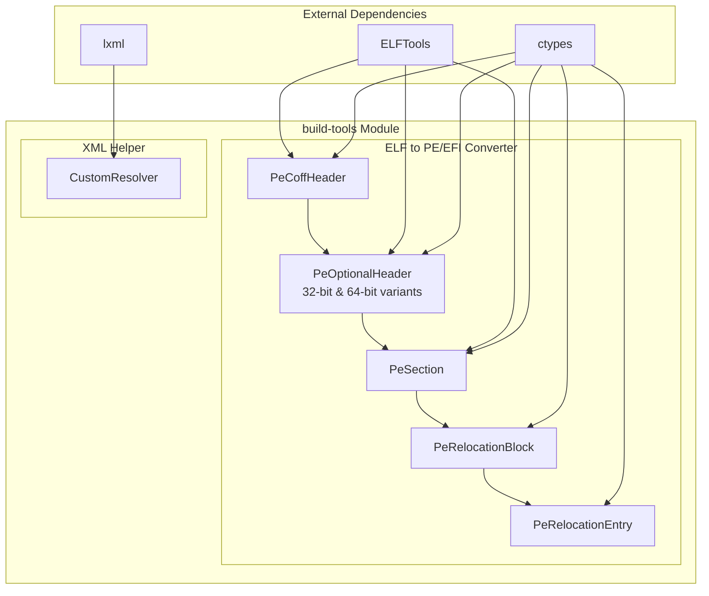
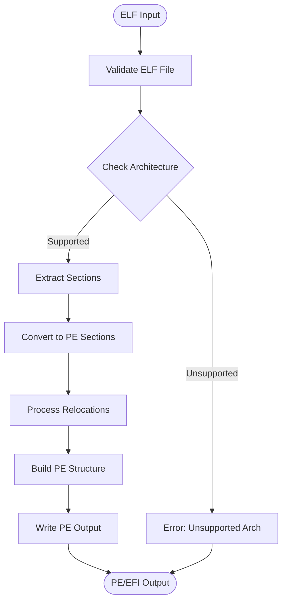
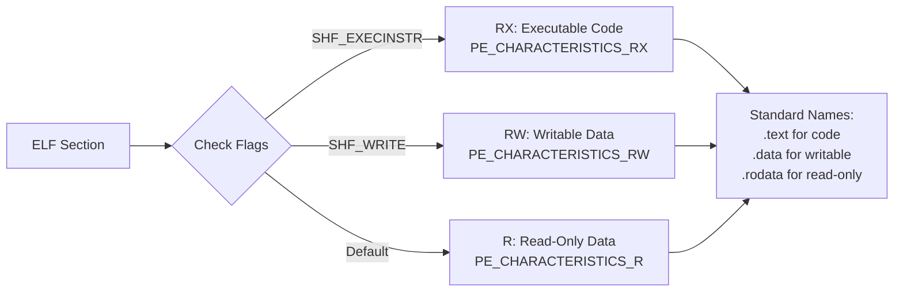
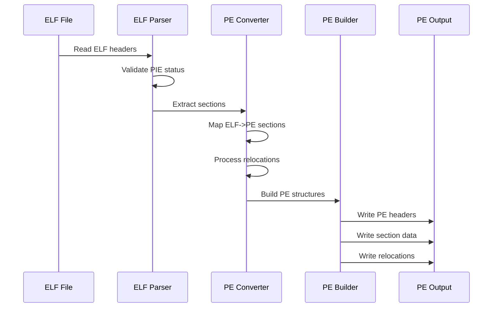
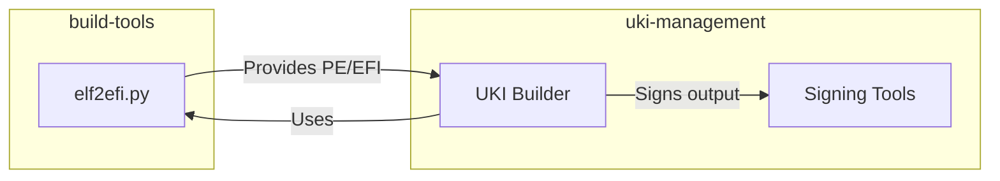

# build-tools Module Documentation

## Introduction

The build-tools module provides essential utilities for converting and processing binary formats in the systemd-boot ecosystem. It consists of two main components: an ELF to PE/EFI converter (`elf2efi.py`) and an XML processing helper (`xml_helper.py`). These tools are critical for creating bootable EFI images from ELF binaries and handling XML configuration files with custom entity resolution.

## Module Architecture

### Core Components Overview

The build-tools module contains the following core components:

- **tools.elf2efi.PeCoffHeader**: PE COFF header structure definition
- **tools.elf2efi.PeOptionalHeader**: PE optional header with 32-bit and 64-bit variants
- **tools.elf2efi.PeSection**: PE section structure for managing code and data sections
- **tools.elf2efi.PeRelocationBlock**: PE relocation block for runtime address fixing
- **tools.elf2efi.PeRelocationEntry**: Individual PE relocation entry
- **tools.xml_helper.CustomResolver**: Custom XML entity resolver for documentation processing

### Architecture Diagram



## Component Details

### ELF to PE/EFI Converter (elf2efi.py)

The ELF to PE/EFI converter is the primary component of this module, responsible for transforming ELF static PIE (Position Independent Executable) binaries into PE/EFI format suitable for UEFI firmware loading.

#### Key Features

- **Static PIE Conversion**: Specifically designed to work with static PIE binaries that contain only base relocations
- **Section Preservation**: Maintains memory layout while copying desired ELF sections to PE format
- **Relocation Translation**: Converts ELF relocations to PE relocations for runtime loading
- **Multi-Architecture Support**: Supports x86, x86_64, ARM, AArch64, RISC-V, and LoongArch architectures

#### Conversion Process Flow



#### PE Structure Components

##### PeCoffHeader
The COFF (Common Object File Format) header contains essential information about the PE file:
- Machine architecture identifier
- Number of sections
- Timestamp
- Characteristics flags
- Size of optional header

##### PeOptionalHeader
The optional header (required for executable images) comes in two variants:
- **PeOptionalHeader32**: For 32-bit executables
- **PeOptionalHeader32Plus**: For 64-bit executables

Contains critical information such as:
- Image base address
- Entry point address
- Section alignment
- Stack and heap sizes
- Data directories

##### PeSection
Represents individual sections within the PE file:
- Section name (up to 8 characters)
- Virtual address and size
- Raw data location and size
- Characteristics (read/write/execute permissions)

##### PeRelocationBlock and PeRelocationEntry
Handle runtime address relocation:
- **PeRelocationBlock**: Groups relocations by memory page
- **PeRelocationEntry**: Individual relocation with offset and type

#### Section Processing

The converter processes ELF sections according to the following rules:



#### Architecture Support

The converter supports multiple architectures with specific PE machine types:

| Architecture | PE Machine Type | Value |
|--------------|-----------------|--------|
| x86 | IMAGE_FILE_MACHINE_I386 | 0x014C |
| x86_64 | IMAGE_FILE_MACHINE_AMD64 | 0x8664 |
| ARM | IMAGE_FILE_MACHINE_ARM | 0x01C2 |
| AArch64 | IMAGE_FILE_MACHINE_ARM64 | 0xAA64 |
| RISC-V 32-bit | IMAGE_FILE_MACHINE_RISCV32 | 0x5032 |
| RISC-V 64-bit | IMAGE_FILE_MACHINE_RISCV64 | 0x5064 |
| LoongArch 32-bit | IMAGE_FILE_MACHINE_LOONGARCH32 | 0x6232 |
| LoongArch 64-bit | IMAGE_FILE_MACHINE_LOONGARCH64 | 0x6264 |

### XML Helper (xml_helper.py)

The XML helper provides custom entity resolution for XML processing, primarily used in documentation generation.

#### CustomResolver

The `CustomResolver` class extends lxml's resolver to handle custom entity references:

- **custom-entities.ent**: Resolves to `man/custom-entities.ent`
- **ethtool-link-mode**: Resolves to `src/shared/ethtool-link-mode.xml`
- **bpf-delegate**: Resolves to `src/core/bpf-delegate.xml`

This enables XML documents to include external entities and maintain consistency across the systemd documentation.

## Data Flow

### ELF to PE Conversion Data Flow



## Integration with Other Modules

The build-tools module serves as a foundational component for the [uki-management](uki-management.md) module, which uses the PE/EFI conversion capabilities to create Unified Kernel Images (UKIs).

### Relationship with uki-management



## Usage Examples

### Basic ELF to PE Conversion

```bash
python3 tools/elf2efi.py input.elf output.pe
```

### Advanced Conversion with Custom Parameters

```bash
python3 tools/elf2efi.py \
    --version-major 1 \
    --version-minor 0 \
    --efi-major 2 \
    --efi-minor 70 \
    --subsystem 10 \
    --minimum-sections 16 \
    --copy-sections ".note,.comment" \
    input.elf output.pe
```

### XML Processing

```python
from tools.xml_helper import xml_parse, xml_print

# Parse XML with custom entity resolution
doc = xml_parse('documentation.xml')

# Process and print formatted XML
formatted_xml = xml_print(doc)
```

## Error Handling

The module implements comprehensive error handling for various scenarios:

- **BadSectionError**: Raised when ELF sections are in an invalid state
- **ValueError**: Raised for unsupported ELF types or architectures
- **Validation Errors**: Checked for PIE status, architecture support, and alignment requirements

## Configuration and Customization

### PE Header Configuration

The converter allows customization of various PE header fields:

- **Version Information**: Major and minor image versions
- **EFI Subsystem**: Minimum EFI subsystem version requirements
- **PE Subsystem**: Target subsystem (default: 10 for EFI application)
- **Section Management**: Minimum section count and additional sections to copy

### Memory Layout

The converter maintains specific memory alignment requirements:

- **Section Alignment**: 4KiB (EFI requirement)
- **File Alignment**: 512 bytes
- **Image Base**: Automatically calculated based on filename hash

## Performance Considerations

- **Static PIE Requirement**: Only processes static PIE binaries to minimize relocation complexity
- **Base Relocations Only**: Focuses on base relocations for optimal performance
- **Memory Efficiency**: Uses bytearray operations for efficient data manipulation
- **Streaming Processing**: Processes large files without loading entire content into memory

## Security Features

- **PIE Validation**: Ensures input binaries are position-independent
- **Alignment Enforcement**: Maintains proper memory alignment for security
- **Relocation Validation**: Validates all relocations before processing
- **Buffer Overflow Protection**: Uses proper bounds checking in all operations

This comprehensive approach ensures that the build-tools module provides reliable, secure, and efficient binary format conversion capabilities essential for the systemd-boot ecosystem.