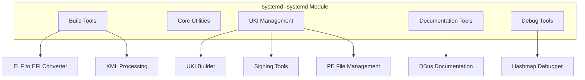
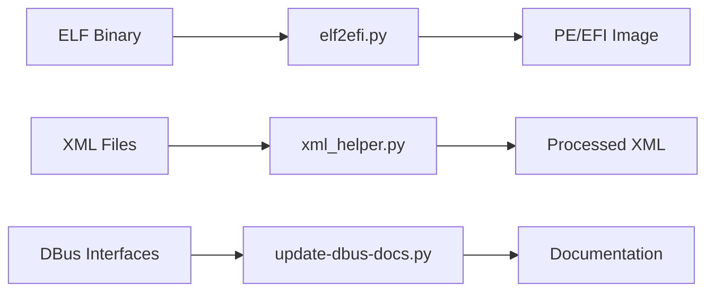
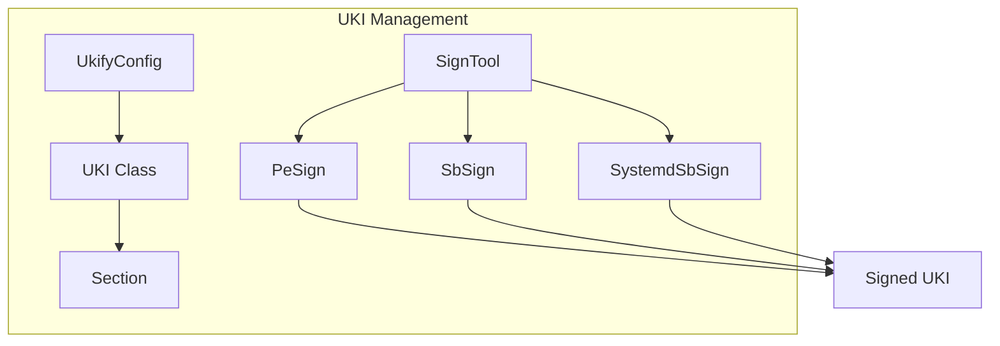
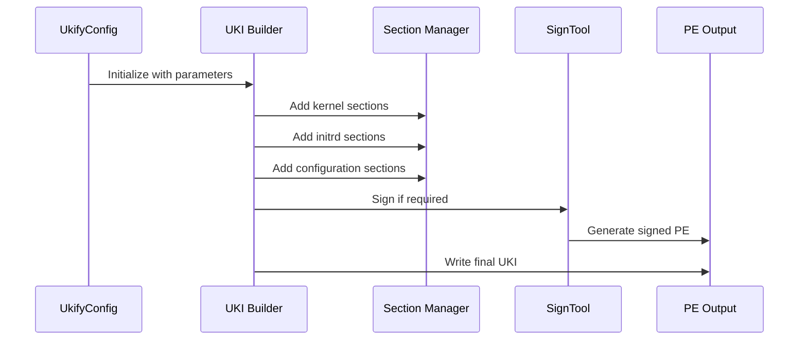
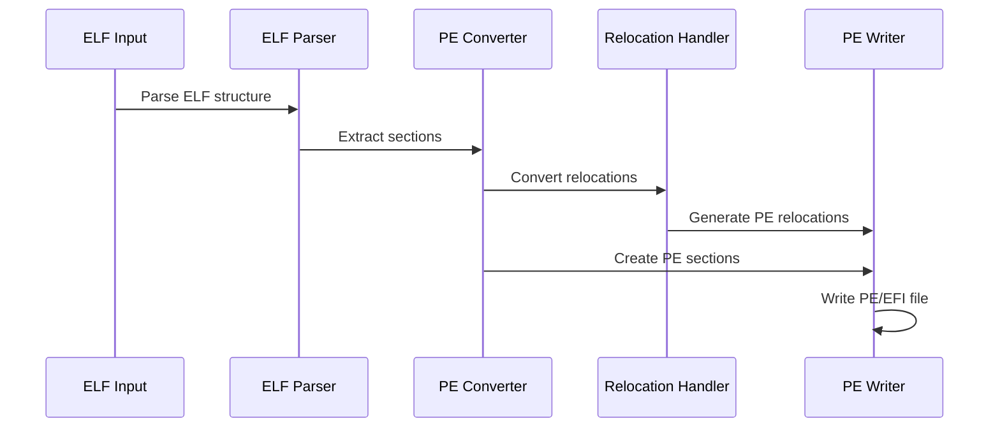

# systemd--systemd Module Documentation

## Overview

The systemd--systemd module represents the core systemd system and service manager. This module encompasses the fundamental components that make up the systemd ecosystem, including build tools, utilities, and core functionality for system initialization, service management, and system administration.

## Purpose and Scope

The systemd--systemd module serves as the central hub for:
- System initialization and boot process management
- Service and daemon control
- System resource management
- Logging and system state tracking
- Hardware and device management
- Security and authentication mechanisms

## Architecture Overview

## Sub-modules and Components

### 1. Build Tools Sub-module

The build tools sub-module provides essential utilities for converting and processing various file formats used in the systemd build process.

**Key Components:**
- **tools.elf2efi**: Converts ELF static PIE binaries to PE/EFI images for UEFI boot compatibility
- **tools.xml_helper**: XML processing utilities with custom entity resolution
- **tools.update-dbus-docs**: Automated DBus interface documentation generator

**Architecture:**

For detailed information about the build tools sub-module, see [build-tools.md](build-tools.md).

### 2. UKI (Unified Kernel Image) Management Sub-module

The UKI management sub-module handles the creation, signing, and management of Unified Kernel Images, which are essential for modern UEFI boot processes.

**Key Components:**
- **src.ukify.ukify**: Main UKI builder and management tool
- **UKI Class**: Represents Unified Kernel Images with multiple sections
- **SignTool Hierarchy**: Abstract base class for different signing implementations
- **Section Management**: Handles different UKI sections (.linux, .initrd, .cmdline, etc.)

**Architecture:**

For detailed information about the UKI management sub-module, see [uki-management.md](uki-management.md).

### 3. Debug and Development Tools Sub-module

This sub-module provides specialized tools for debugging and development purposes.

**Key Components:**
- **tools.gdb-sd_dump_hashmaps**: GDB extension for debugging systemd hashmaps

## Data Flow and Dependencies

### UKI Creation Process

### ELF to EFI Conversion Process

## Key Features and Capabilities

### 1. Multi-Architecture Support
The module supports multiple architectures including:
- x86_64 (x64)
- i386 (ia32)
- AArch64 (aa64)
- ARM (arm)
- LoongArch (loongarch32/64)
- RISC-V (riscv32/64)

### 2. Security and Signing
- Secure Boot support through multiple signing tools (pesign, sbsign, systemd-sbsign)
- PCR (Platform Configuration Register) measurement and signing
- Certificate and key management
- Policy digest generation

### 3. Flexible Configuration
- Command-line interface with extensive options
- Configuration file support
- Profile-based UKI building
- Section customization

### 4. Development and Debugging Tools
- Hashmap debugging for development
- XML processing utilities
- DBus documentation generation
- Comprehensive inspection capabilities

## Integration Points

The systemd--systemd module integrates with:
- **systemd-boot**: For boot management
- **systemd-stub**: For UKI stub functionality
- **systemd-measure**: For PCR measurements
- **systemd-keyutil**: For key management
- **External tools**: pesign, sbsign, various compression tools

## File Formats Supported

- **Input**: ELF binaries, compressed kernels (gzip, lz4, lzma, zstd), XML files
- **Output**: PE/EFI images, signed UKIs, documentation
- **Configuration**: INI-style config files, command-line arguments

## Error Handling and Validation

The module implements comprehensive error handling:
- Format validation for all input files
- Architecture compatibility checks
- Security validation for signing operations
- Resource allocation verification
- Cross-platform compatibility checks

This documentation provides a comprehensive overview of the systemd--systemd module's architecture, components, and functionality. For detailed information about specific sub-modules, refer to their individual documentation files.