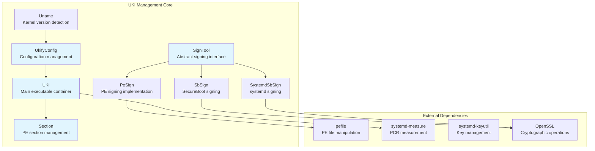
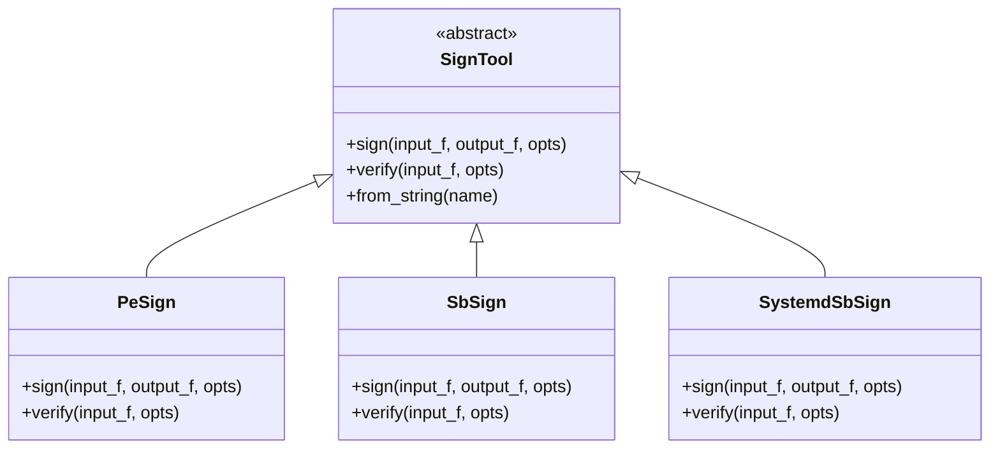
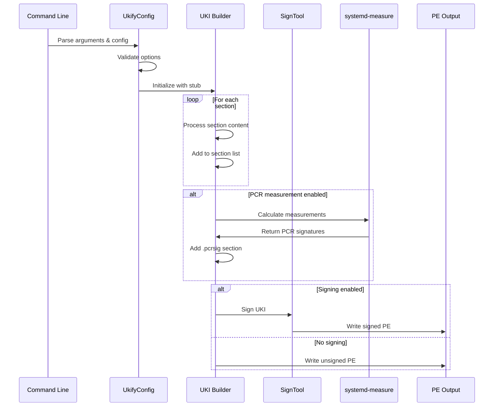
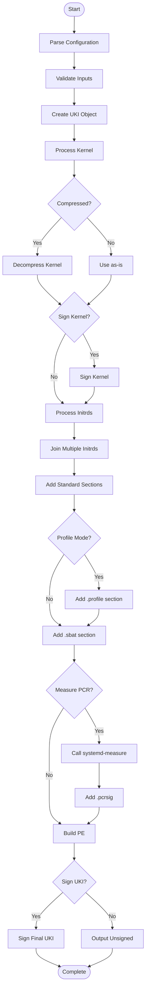

# UKI Management Module Documentation

## Introduction

The UKI (Unified Kernel Image) Management module is a comprehensive system for building, signing, and managing unified kernel images in systemd. It provides functionality to create bootable EFI images that combine the Linux kernel, initrd, command line parameters, and other boot components into a single signed PE (Portable Executable) file.

This module serves as the core implementation for `ukify`, systemd's tool for building and managing UKIs with support for secure boot signing, PCR measurements, and profile-based configurations.

## Architecture Overview



## Core Components

### UKI Class

The `UKI` class represents the main unified kernel image container. It manages the collection of sections that make up the final bootable image.

**Key Responsibilities:**
- Section management and ordering
- Profile handling for multi-profile UKIs
- PE structure manipulation

**Key Methods:**
- `add_section()`: Adds sections to the UKI with proper ordering
- Section validation and duplicate prevention

### UkifyConfig Class

The `UkifyConfig` class serves as the central configuration management system, handling all parameters needed for UKI construction.

**Configuration Categories:**
- **Input Files**: Linux kernel, initrd, device tree, microcode
- **Signing Parameters**: Secure boot keys, certificates, signing tools
- **PCR Configuration**: Banks, keys, certificates for measurement
- **Output Control**: Architecture, stub selection, output paths
- **Profile Management**: Multi-profile support and joining

**Key Features:**
- Configuration file parsing with INI format
- Command-line argument processing
- Validation and normalization of parameters
- Support for both build and inspect operations

### SignTool Hierarchy

The signing system uses a polymorphic design pattern with an abstract base class and multiple implementations:



**Signing Tool Selection:**
- **pesign**: Uses NSS certificate database
- **sbsign**: Direct key/certificate files
- **systemd-sbsign**: systemd's integrated signing with provider support

### Section Management

The `Section` class handles individual PE sections within the UKI:

**Section Types:**
- **Boot Components**: `.linux`, `.initrd`, `.ucode`
- **Configuration**: `.cmdline`, `.osrel`, `.uname`
- **Security**: `.pcrpkey`, `.pcrsig`, `.sbat`
- **Hardware**: `.dtb`, `.dtbauto`, `.hwids`, `.efifw`
- **Profiles**: `.profile` for multi-profile support

**Section Processing:**
- Automatic temporary file creation for inline content
- Content validation and format checking
- PE section name validation (max 8 characters, ASCII)

### Uname Version Detection

The `Uname` class provides kernel version extraction from various kernel formats:

**Detection Methods:**
1. **x86 Real-Mode Header**: Direct parsing of kernel header
2. **ELF Notes**: Reading version information from ELF notes
3. **Generic Text Search**: Pattern matching in decompressed kernel

**Supported Formats:**
- Raw ELF kernels
- Compressed kernels (gzip, lz4, lzma, zstd)
- zboot efistub kernels

## Data Flow Architecture



## Key Processes

### UKI Construction Process



### PCR Measurement and Signing

The module supports comprehensive PCR (Platform Configuration Register) measurement and signing:

**Measurement Process:**
1. Collect all sections marked for measurement
2. Handle device tree auto-selection if present
3. Call `systemd-measure` with appropriate parameters
4. Generate JSON signatures for specified PCR banks
5. Support for phase-based measurements

**Signing Process:**
1. Support for multiple private keys
2. Engine/provider-based signing (OpenSSL engines, TPM providers)
3. Certificate-based signing
4. Phase-specific signature generation

### Multi-Profile Support

The module supports building UKIs with multiple boot profiles:

**Profile Features:**
- Base profile with shared sections
- Additional profiles with specific configurations
- Selective PCR signing per profile
- Profile joining from separate PE binaries

**Profile Processing:**
1. Base UKI construction with shared sections
2. Profile-specific section addition
3. Per-profile PCR measurement and signing
4. Final assembly with all profiles

## Configuration System

The configuration system supports multiple input methods with precedence:

1. **Command-line arguments** (highest priority)
2. **User-specified config file** (`--config`)
3. **System config files** (searched in order):
   - `/etc/systemd/ukify.conf`
   - `/run/systemd/ukify.conf`
   - `/usr/local/lib/systemd/ukify.conf`
   - `/usr/lib/systemd/ukify.conf`

**Configuration Sections:**
- `[UKI]`: General UKI parameters
- `[PCRSignature]`: PCR signing configuration
- `[PCRSignature:NAME]`: Named PCR signature groups

## Security Features

### Secure Boot Integration
- Support for multiple signing tools (pesign, sbsign, systemd-sbsign)
- Certificate chain validation
- Kernel signing capabilities
- SBAT (Secure Boot Advanced Targeting) policy support

### PCR Measurement
- TPM-based measurement of UKI components
- Support for multiple PCR banks (SHA1, SHA256, etc.)
- Phase-aware measurements for different boot stages
- Policy digest generation for offline signing

### Key Management
- Automatic key generation for development
- Support for hardware security modules (HSMs)
- OpenSSL engine and provider integration
- Certificate and public key extraction

## Integration Points

### systemd Integration
- Uses `systemd-measure` for PCR operations
- Integrates with `systemd-stub` for boot support
- Supports systemd's boot phases
- Uses systemd key utilities for key management

### External Tools
- **pefile**: Python library for PE file manipulation
- **pesign/sbsign**: Secure boot signing tools
- **OpenSSL**: Cryptographic operations and engines
- **PIL**: Image processing for splash screens (optional)

## Error Handling

The module implements comprehensive error handling:

**Validation Errors:**
- Input file validation and accessibility checks
- Configuration parameter validation
- PE structure validation
- Cryptographic parameter validation

**Runtime Errors:**
- Tool availability checking
- Signing operation failures
- PCR measurement errors
- File system operation failures

**Recovery Mechanisms:**
- Graceful degradation for optional components
- Temporary file cleanup
- Partial operation rollback
- Detailed error reporting

## Performance Considerations

**Optimization Strategies:**
- Streaming decompression for large files
- Efficient PE section manipulation
- Minimal memory footprint for large UKIs
- Parallel processing where applicable

**Resource Management:**
- Temporary file lifecycle management
- Memory-efficient section processing
- Tool process lifecycle management
- File descriptor management

## Dependencies

### Required Dependencies
- Python 3.6+ standard library
- pefile library for PE manipulation
- systemd tools (systemd-measure, systemd-keyutil)

### Optional Dependencies
- PIL (Python Imaging Library) for splash screen processing
- Cryptography libraries for key generation
- Compression libraries (gzip, lz4, lzma, zstd)
- OpenSSL engines and providers

### System Dependencies
- Signing tools (pesign, sbsign, or systemd-sbsign)
- EFI stub files (systemd-stub)
- Kernel and initrd files

## Usage Examples

### Basic UKI Construction
```bash
ukify build \
  --linux=/boot/vmlinuz-6.0.0 \
  --initrd=/boot/initrd.img \
  --cmdline="root=/dev/sda1 quiet" \
  --output=linux.efi
```

### Secure Boot Signed UKI
```bash
ukify build \
  --linux=/boot/vmlinuz-6.0.0 \
  --initrd=/boot/initrd.img \
  --secureboot-private-key=sb.key \
  --secureboot-certificate=sb.crt \
  --output=linux-signed.efi
```

### PCR Measurement and Signing
```bash
ukify build \
  --linux=/boot/vmlinuz-6.0.0 \
  --initrd=/boot/initrd.img \
  --pcr-private-key=pcr.key \
  --pcr-public-key=pcr.pub \
  --phases="enter-initrd:sysinit:ready" \
  --output=linux-measured.efi
```

### Multi-Profile UKI
```bash
# Build base UKI
ukify build \
  --linux=/boot/vmlinuz-6.0.0 \
  --profile=@profile-main.conf \
  --output=base.efi

# Build profile UKI
ukify build \
  --linux=/boot/vmlinuz-6.0.0 \
  --profile=@profile-rescue.conf \
  --output=rescue.efi

# Join profiles
ukify build \
  --linux=/boot/vmlinuz-6.0.0 \
  --profile=@profile-main.conf \
  --join-profile=rescue.efi \
  --output=multi-profile.efi
```

## References

- [systemd-boot](systemd-boot.md) - Boot loader specification and implementation
- [systemd-stub](systemd-stub.md) - EFI stub loader for UKIs
- [systemd-measure](systemd-measure.md) - PCR measurement tool
- [Secure Boot](secure-boot.md) - Secure boot implementation details
- [TPM2](tpm2.md) - TPM 2.0 integration and PCR operations