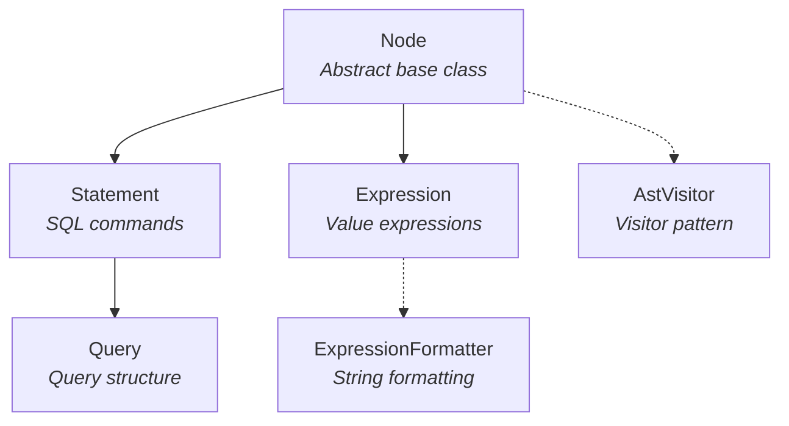
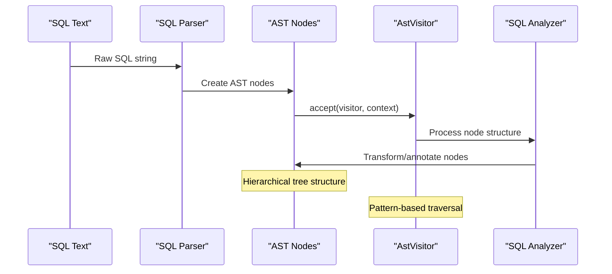
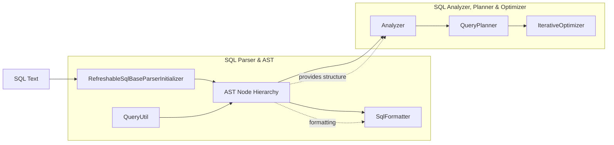

# AST Node Hierarchy Module

## Introduction

The AST Node Hierarchy module forms the foundation of Trino's SQL parsing infrastructure, providing a comprehensive object-oriented representation of SQL syntax trees. This module defines the core abstract classes and interfaces that represent all SQL constructs, from simple expressions to complex queries, enabling the SQL parser to build structured representations of SQL statements that can be analyzed, transformed, and executed by the query engine.

## Overview

The AST (Abstract Syntax Tree) Node Hierarchy is a fundamental component of Trino's SQL Parser & AST module, serving as the bridge between raw SQL text and the query processing pipeline. It provides a type-safe, hierarchical representation of SQL syntax that enables sophisticated query analysis, optimization, and execution planning.

## Core Architecture

### Base Node Class

The `Node` class serves as the root of the entire AST hierarchy, providing common functionality for all SQL syntax elements:

- **Location tracking**: Maintains source location information for error reporting and debugging
- **Visitor pattern support**: Enables traversal and transformation of AST nodes
- **Child management**: Provides access to child nodes for tree navigation
- **Equality and hashing**: Ensures proper comparison and collection behavior
- **String representation**: Supports debugging and logging

### Specialized Node Types

The hierarchy extends into three primary categories:

1. **Statements**: Represent complete SQL commands (SELECT, INSERT, UPDATE, etc.)
2. **Expressions**: Represent value-producing constructs (literals, functions, operations)
3. **Queries**: Represent complex query structures with multiple clauses

## Component Architecture

## Core Components

### Node Class

The `Node` class is the abstract base class for all AST nodes, providing:

- **Location Management**: Optional `NodeLocation` for source position tracking
- **Visitor Pattern Integration**: `accept()` method for AST traversal
- **Child Access**: `getChildren()` method for tree navigation
- **Equality Semantics**: Abstract `equals()` and `hashCode()` methods
- **String Representation**: Abstract `toString()` method
- **Shallow Comparison**: `shallowEquals()` for structural comparison

### Statement Class

The `Statement` class extends `Node` and represents complete SQL commands:

- **Command Representation**: Base class for all SQL statements
- **Visitor Specialization**: Dedicated visitor method for statement processing
- **Location Inheritance**: Maintains source location from parent Node class

### Expression Class

The `Expression` class extends `Node` and represents value-producing constructs:

- **Immutable Design**: Annotated with `@Immutable` for thread safety
- **Automatic Formatting**: Uses `ExpressionFormatter` for string representation
- **Visitor Integration**: Specialized visitor method for expression processing
- **Value Semantics**: Represents any construct that produces a value

### Query Class

The `Query` class extends `Statement` and represents complex query structures:

- **Complete Query Structure**: Encapsulates all query components
- **Session Properties**: Supports session-level configuration
- **Function Definitions**: Allows user-defined functions within queries
- **CTE Support**: Common Table Expression (WITH clause) support
- **Query Body**: Contains the main query logic
- **Ordering and Pagination**: ORDER BY, OFFSET, and LIMIT support
- **Child Management**: Comprehensive child node enumeration

## Data Flow Architecture

## Integration with SQL Processing Pipeline

## Key Features

### Type Safety
- Strong typing through inheritance hierarchy
- Compile-time validation of node relationships
- Immutable expressions for thread safety

### Visitor Pattern
- Extensible traversal and transformation
- Type-safe visitor methods for each node type
- Context-aware processing

### Location Tracking
- Source position information for error reporting
- Debugging support with line/column information
- Integration with SQL formatter for pretty-printing

### Extensibility
- Abstract base classes for custom node types
- Visitor pattern enables new operations without modifying nodes
- Clean separation of concerns between structure and behavior

## Usage Patterns

### AST Construction
The SQL parser constructs AST nodes during parsing, building a hierarchical representation of the SQL syntax that accurately reflects the grammatical structure of the query.

### AST Traversal
Components throughout Trino use the visitor pattern to traverse AST nodes for analysis, transformation, and code generation purposes.

### AST Transformation
The query optimizer and analyzer transform AST nodes to represent optimized query plans and annotated syntax trees.

### AST Serialization
The SQL formatter and utility classes convert AST nodes back to string representations for logging, debugging, and result formatting.

## Dependencies

The AST Node Hierarchy module depends on:

- **Parser Infrastructure**: [RefreshableSqlBaseParserInitializer](Parser Infrastructure.md) for parser integration
- **SQL Formatting**: [SqlFormatter](SQL Formatting and Utilities.md) for string representation
- **Query Utilities**: [QueryUtil](SQL Formatting and Utilities.md) for AST manipulation helpers

## Related Modules

- **SQL Parser & AST**: Parent module containing parser infrastructure and utilities
- **SQL Analyzer, Planner & Optimizer**: Consumes AST nodes for query processing
- **SQL Intermediate Representation**: Transforms AST into intermediate representation

## Design Principles

1. **Immutability**: Expression nodes are immutable for thread safety and predictability
2. **Visitor Pattern**: Enables extensible operations without modifying node classes
3. **Type Safety**: Strong typing prevents invalid AST constructions
4. **Location Awareness**: Maintains source information for debugging and error reporting
5. **Hierarchical Structure**: Reflects SQL grammar through inheritance relationships

## Conclusion

The AST Node Hierarchy module provides the foundational data structures for Trino's SQL processing capabilities. Its well-designed class hierarchy, visitor pattern implementation, and integration with the broader query processing pipeline make it a critical component for parsing, analyzing, and executing SQL queries in Trino.