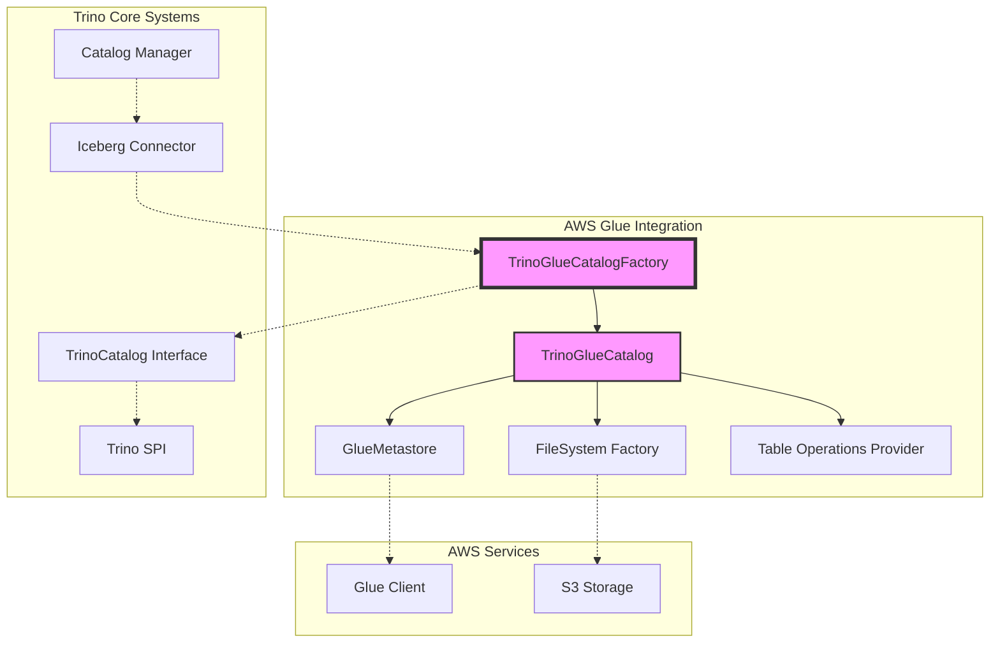
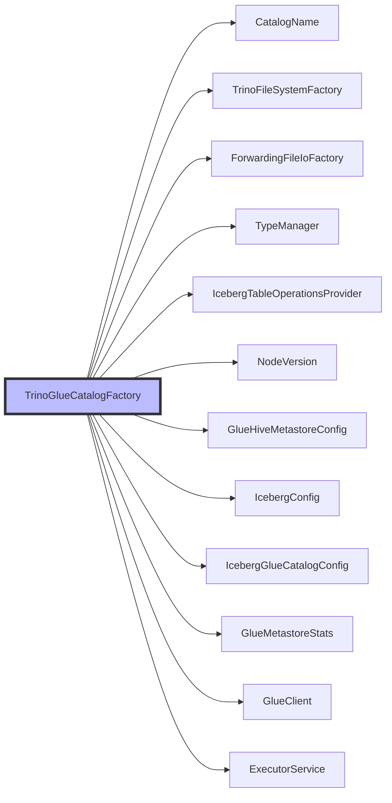
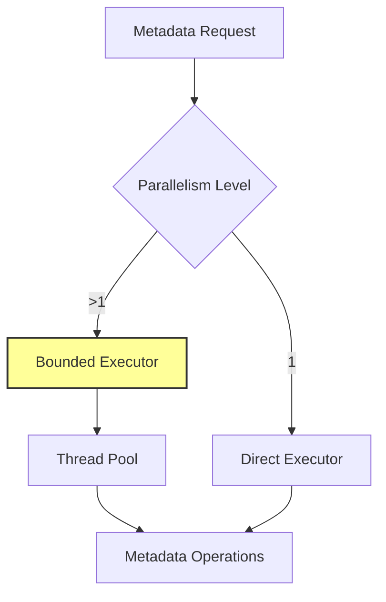
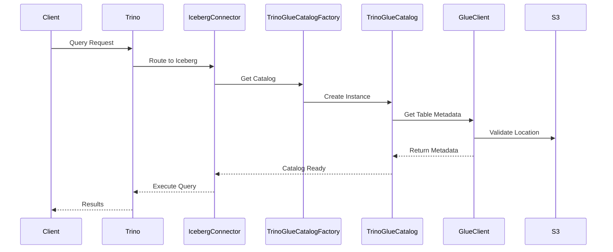
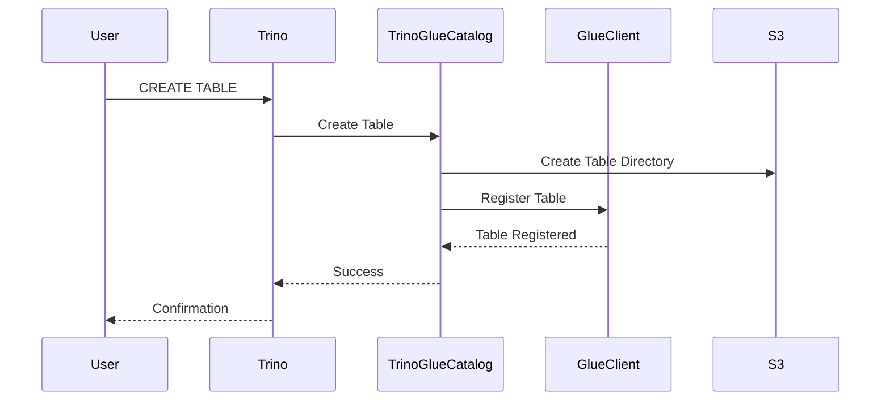

# AWS Glue Integration Module

## Introduction

The AWS Glue Integration module provides Trino with the capability to interact with AWS Glue Data Catalog as a metadata store for Iceberg tables. This integration enables Trino to leverage AWS Glue's managed metadata service for table schema management, partition tracking, and data discovery in Amazon S3 environments.

The module serves as a bridge between Trino's Iceberg connector and AWS Glue, allowing users to query and manage Iceberg tables that are registered in the Glue Data Catalog while maintaining full compatibility with Trino's SQL interface and optimization capabilities.

## Architecture Overview

The AWS Glue Integration module is built on top of Trino's plugin architecture and integrates with multiple core systems:



## Core Components

### TrinoGlueCatalogFactory

The `TrinoGlueCatalogFactory` is the primary entry point for creating AWS Glue-backed catalogs within Trino's Iceberg connector. This factory class implements the `TrinoCatalogFactory` interface and is responsible for:

- **Dependency Injection**: Receives all necessary components through constructor injection, including AWS Glue client, file system factories, and configuration settings
- **Catalog Creation**: Produces `TrinoGlueCatalog` instances configured with appropriate AWS Glue settings
- **Resource Management**: Manages thread pools and executors for metadata operations
- **Statistics Collection**: Provides JMX-managed statistics for monitoring Glue operations

#### Key Dependencies



#### Configuration Integration

The factory integrates with multiple configuration sources:

- **GlueHiveMetastoreConfig**: Provides AWS Glue connection settings and default warehouse directory
- **IcebergConfig**: Controls table location uniqueness and materialized view storage behavior
- **IcebergGlueCatalogConfig**: Manages Glue-specific settings like metadata caching

#### Threading Model

The factory implements a sophisticated threading model for metadata operations:



## Integration Points

### Iceberg Connector Integration

The AWS Glue Integration module is tightly integrated with Trino's Iceberg connector:

- **Catalog Factory Registration**: The `TrinoGlueCatalogFactory` is registered as a catalog factory within the Iceberg connector
- **Table Operations**: Delegates table metadata operations to Iceberg's table operations provider
- **File System Integration**: Uses Trino's file system abstraction for S3 access

### AWS Glue Client Integration

The module uses AWS SDK v2 for Java to interact with Glue services:

- **Authentication**: Leverages AWS default credential chain for authentication
- **Region Configuration**: Supports AWS region configuration through standard AWS mechanisms
- **Retry Logic**: Benefits from AWS SDK's built-in retry and error handling

### Security Integration

Security is handled through Trino's security framework:

- **System Security**: Supports both system-level and connector-level security models
- **Identity Propagation**: Passes connector identity to catalog instances for authorization
- **Access Control**: Integrates with Trino's access control manager for permission enforcement

## Data Flow

### Metadata Operations Flow



### Table Creation Flow



## Configuration

### Required Configuration

The AWS Glue Integration requires the following configuration parameters:

```properties
# Catalog configuration
catalog.name=iceberg
catalog.type=iceberg

# AWS Glue configuration
glue.region=us-east-1
glue.default-warehouse-dir=s3://my-bucket/warehouse/

# Iceberg configuration
iceberg.unique-table-location=true
iceberg.hide-materialized-view-storage-table=true
iceberg.metadata-parallelism=4
```

### Optional Configuration

Additional configuration options include:

- **Metadata Caching**: Enable/disable table metadata caching
- **Parallelism**: Control metadata operation parallelism
- **Security Model**: Choose between system and connector security

## Performance Considerations

### Metadata Caching

The module supports table metadata caching to reduce AWS Glue API calls:

- **Cache Configuration**: Controlled through `IcebergGlueCatalogConfig`
- **Cache Invalidation**: Automatic invalidation on table updates
- **Memory Management**: Bounded cache size to prevent memory issues

### Parallel Operations

Metadata operations can be parallelized for better performance:

- **Configurable Parallelism**: Set through `iceberg.metadata-parallelism`
- **Thread Pool Management**: Uses bounded executor to prevent resource exhaustion
- **Operation Batching**: Groups related operations for efficiency

### Statistics Collection

JMX metrics are available for monitoring:

- **API Call Metrics**: Track Glue API usage and latency
- **Error Rates**: Monitor failed operations
- **Cache Hit Rates**: Measure caching effectiveness

## Error Handling

### AWS Glue Errors

The module handles various AWS Glue error scenarios:

- **Network Issues**: Automatic retry with exponential backoff
- **Permission Errors**: Clear error messages for access issues
- **Resource Not Found**: Graceful handling of missing tables/databases

### Trino Integration Errors

Integration errors are properly propagated:

- **Configuration Errors**: Validated at startup with clear messages
- **Runtime Errors**: Wrapped in Trino exceptions for consistency
- **Recovery**: Automatic recovery where possible

## Dependencies

### Direct Dependencies

- **[Iceberg Connector](Iceberg Connector.md)**: Provides the catalog framework and table operations
- **[Hive Support Libraries](Hive Support Libraries.md)**: Leverages Glue metastore configuration and statistics
- **[Trino SPI](Trino SPI.md)**: Core interfaces for plugin integration
- **[Filesystem Abstraction Layer](Filesystem Abstraction Layer.md)**: S3 file system access

### Indirect Dependencies

- **[SQL Analyzer, Planner & Optimizer](SQL Analyzer, Planner & Optimizer.md)**: Query planning and optimization
- **[Query Execution Engine](Query Execution Engine.md)**: Query execution framework
- **[Metadata & Connector Abstraction](Metadata & Connector Abstraction.md)**: Catalog management

## Usage Examples

### Basic Configuration

```sql
-- Create a catalog using AWS Glue
CREATE CATALOG iceberg_glue USING iceberg
WITH (
    "iceberg.catalog.type" = 'glue',
    "hive.metastore.glue.region" = 'us-east-1',
    "hive.metastore.glue.default-warehouse-dir" = 's3://my-bucket/warehouse/'
);
```

### Querying Tables

```sql
-- Query tables registered in Glue
SELECT * FROM iceberg_glue.my_schema.my_table;

-- Create a new table
CREATE TABLE iceberg_glue.my_schema.new_table (
    id BIGINT,
    name VARCHAR,
    created_date DATE
)
WITH (format = 'PARQUET');
```

## Best Practices

### Performance Optimization

1. **Enable Metadata Caching**: Reduce Glue API calls for frequently accessed tables
2. **Configure Parallelism**: Set appropriate metadata parallelism based on workload
3. **Use Appropriate File Formats**: Choose Parquet for analytical workloads
4. **Partition Strategically**: Design partitions based on query patterns

### Security Considerations

1. **IAM Permissions**: Ensure proper IAM permissions for Glue and S3 access
2. **Encryption**: Enable encryption for data at rest and in transit
3. **Network Security**: Use VPC endpoints for Glue access where possible
4. **Access Control**: Implement proper access control through Trino's security framework

### Operational Excellence

1. **Monitor Metrics**: Use JMX metrics to monitor performance and errors
2. **Backup Strategy**: Implement backup strategies for critical metadata
3. **Testing**: Test failover scenarios and recovery procedures
4. **Documentation**: Maintain documentation of catalog configurations and dependencies

## Troubleshooting

### Common Issues

1. **Permission Denied**: Check IAM permissions for Glue and S3
2. **Table Not Found**: Verify table registration in Glue Data Catalog
3. **Slow Performance**: Check metadata caching and parallelism settings
4. **Connection Issues**: Verify AWS region and network connectivity

### Debug Information

Enable debug logging to troubleshoot issues:

```properties
# Enable debug logging for Glue operations
io.trino.plugin.iceberg.catalog.glue=DEBUG
io.trino.plugin.hive.metastore.glue=DEBUG
```

## Future Enhancements

### Planned Features

- **Cross-Region Support**: Enhanced support for cross-region Glue catalogs
- **Advanced Caching**: More sophisticated caching strategies
- **Performance Optimization**: Improved parallel processing capabilities
- **Monitoring Integration**: Enhanced monitoring and alerting capabilities

### Extension Points

The modular design allows for future extensions:

- **Custom Catalogs**: Support for custom catalog implementations
- **Additional Stores**: Integration with other metadata stores
- **Enhanced Security**: Support for additional security models
- **Performance Features**: Advanced optimization techniques