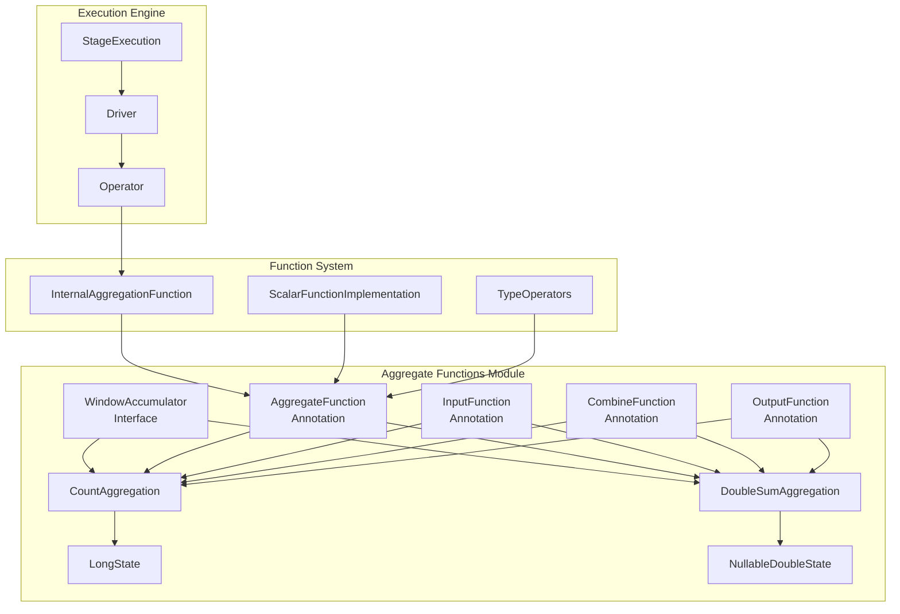
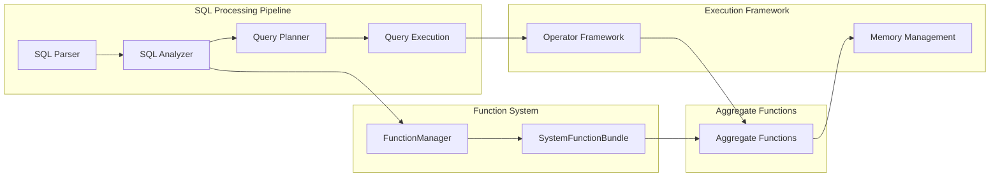
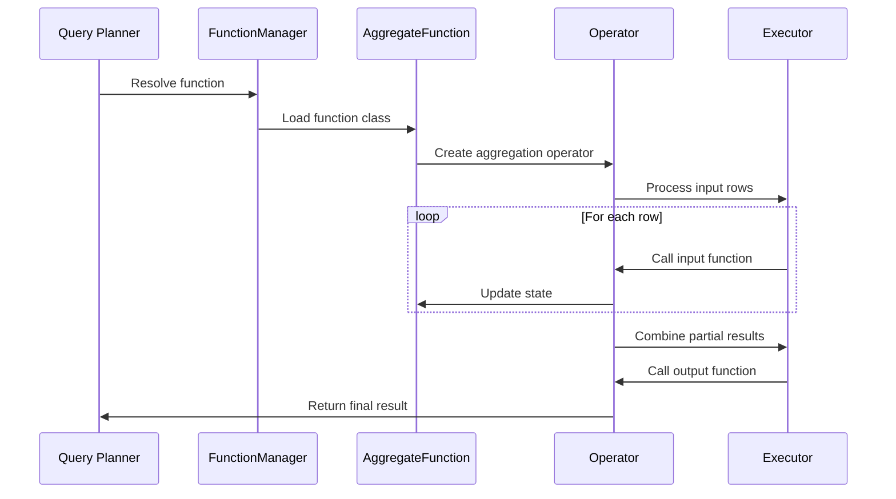
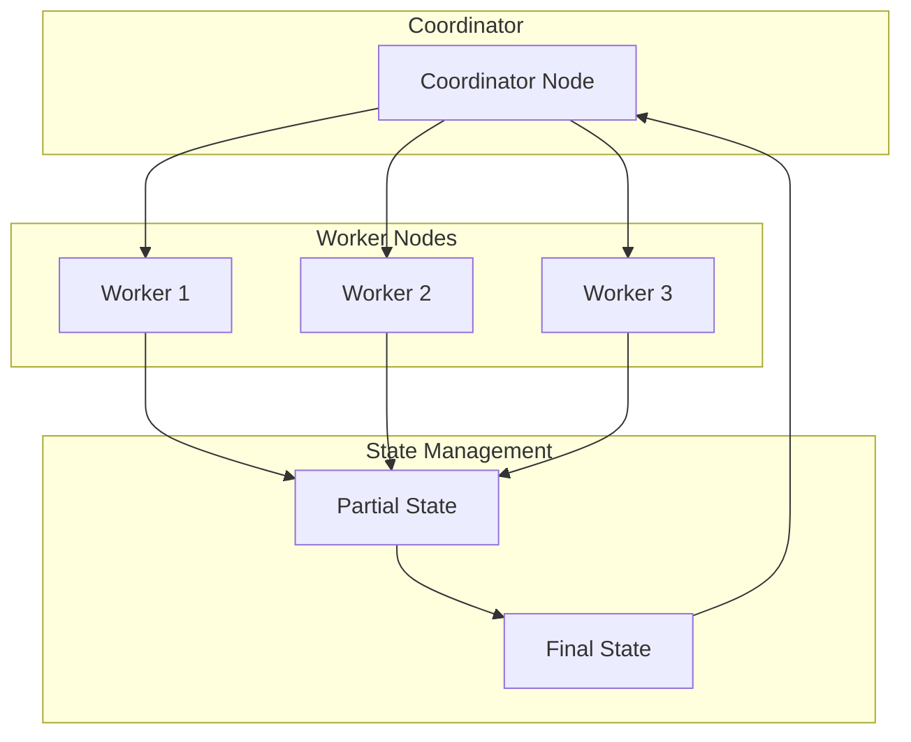
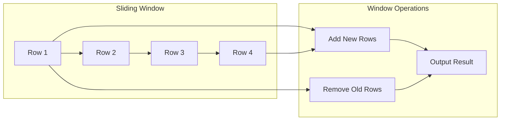

# Aggregate Functions Module

## Introduction

The Aggregate Functions module is a core component of Trino's SQL function system, providing the implementation framework for aggregate operations like COUNT, SUM, AVG, MIN, MAX, and other statistical functions. This module bridges the gap between SQL query planning and distributed execution, enabling efficient computation of aggregate results across large datasets.

## Overview

Aggregate functions are essential SQL operations that combine multiple rows into a single result. The module provides both the function implementations and the execution framework necessary for distributed aggregation, including support for window functions and incremental computation.

## Architecture

### Core Components

The module is built around several key architectural patterns:

1. **Function Definition Framework**: Uses annotations to define aggregate functions
2. **State Management**: Maintains intermediate aggregation state across distributed workers
3. **Window Function Support**: Provides incremental computation for sliding window operations
4. **Type-Safe Implementation**: Ensures type safety across different data types

### Component Architecture



### Integration with Trino Ecosystem



## Key Components

### CountAggregation

The `CountAggregation` class implements the COUNT aggregate function with the following characteristics:

- **State Type**: Uses `LongState` to maintain the count value
- **Input Function**: Increments the counter for each input row
- **Combine Function**: Merges counts from different workers
- **Output Function**: Writes the final count as a BIGINT
- **Window Support**: Provides `CountWindowAccumulator` for window function operations

#### Window Accumulator Features
- Efficient incremental computation
- Memory-efficient with constant space complexity
- Supports both add and remove operations for sliding windows

### DoubleSumAggregation

The `DoubleSumAggregation` class implements the SUM function for DOUBLE type with:

- **State Type**: Uses `NullableDoubleState` to handle NULL values
- **Input Function**: Accumulates double values, handling NULL inputs
- **Combine Function**: Merges partial sums from distributed workers
- **Output Function**: Produces NULL for empty sets, sum otherwise
- **Window Support**: Provides `DoubleSumWindowAccumulator` with finite value tracking

#### Advanced Features
- NULL value handling with proper SQL semantics
- Finite value tracking for window operations
- Memory-efficient state management

## Function Definition Framework

### Annotation-Based Definition

Aggregate functions are defined using a set of specialized annotations:

```java
@AggregationFunction(value = "count", windowAccumulator = CountWindowAccumulator.class)
public final class CountAggregation
```

### Function Lifecycle



## State Management

### State Types

The module supports various state types for different aggregation needs:

- **LongState**: For counter-based aggregations (COUNT)
- **NullableDoubleState**: For numeric aggregations with NULL handling (SUM, AVG)
- **Complex State Types**: For statistical functions (VAR, STDDEV)

### Distributed Aggregation



## Window Function Support

### Window Accumulator Interface

The `WindowAccumulator` interface provides methods for efficient window function computation:

- **addInput()**: Adds a range of rows to the accumulator
- **removeInput()**: Removes a range of rows (for sliding windows)
- **copy()**: Creates a copy for parallel processing
- **getEstimatedSize()**: Provides memory usage information

### Incremental Computation

Window functions benefit from incremental computation:



## Type System Integration

### Type Safety

The module integrates with Trino's type system through:

- **Type Annotations**: `@SqlType(StandardTypes.DOUBLE)`
- **Type Registry**: Integration with [Type System](Type System.md)
- **Standard Types**: Predefined type constants (BIGINT, DOUBLE, etc.)

### Type Operators

Leverages [TypeOperators](Type System.md) for:
- Type-specific operations
- Comparison functions
- Hash code generation
- Serialization support

## Performance Optimizations

### Memory Efficiency

- **Compact State**: Minimal memory footprint for state objects
- **Primitive Types**: Direct use of primitive types where possible
- **Nullable Handling**: Efficient NULL value representation

### Distributed Processing

- **Partial Aggregation**: Early aggregation at data source
- **Combining Functions**: Efficient merge operations
- **Parallel Execution**: Support for multi-threaded processing

## Error Handling

### NULL Value Semantics

- **COUNT**: Counts all rows, including NULL values
- **SUM**: Returns NULL for empty input sets
- **Window Functions**: Proper NULL handling in sliding windows

### Overflow Protection

- **Numeric Types**: Built-in overflow detection
- **Memory Limits**: State size tracking and limits
- **Error Reporting**: Clear error messages for edge cases

## Testing and Validation

### Test Framework Integration

The module integrates with Trino's testing framework:

- **BaseConnectorTest**: Standard aggregation tests
- **QueryRunner**: Test query execution
- **MaterializedResult**: Result validation

### Performance Testing

- **Benchmark Suite**: Performance regression testing
- **Memory Profiling**: State size validation
- **Scalability Tests**: Large dataset handling

## Dependencies

### Core Dependencies

- **[Function System](SQL Functions & Operators.md)**: Function implementation framework
- **[Type System](Type System.md)**: Type safety and operations
- **[Execution Engine](Query Execution Engine.md)**: Distributed execution support
- **[SPI](Trino SPI.md)**: Plugin and function interfaces

### Integration Points

- **Metadata Manager**: Function registration and resolution
- **Query Planner**: Aggregation pushdown optimization
- **Memory Manager**: State allocation and tracking
- **Code Generator**: Runtime code generation for performance

## Future Enhancements

### Planned Features

- **Approximate Aggregations**: HyperLogLog, Bloom filters
- **Statistical Functions**: Advanced statistical aggregations
- **User-Defined Aggregates**: Custom aggregation function support
- **GPU Acceleration**: Hardware-accelerated aggregation

### Performance Improvements

- **Vectorized Execution**: SIMD operations for aggregation
- **Adaptive Execution**: Runtime optimization based on data characteristics
- **Memory Pooling**: Reduced allocation overhead
- **Network Optimization**: Improved partial result transfer

## Conclusion

The Aggregate Functions module provides a robust, scalable foundation for SQL aggregation operations in Trino. Its annotation-based design, distributed state management, and window function support make it suitable for both simple aggregations and complex analytical workloads. The module's integration with Trino's broader ecosystem ensures consistent performance and reliability across diverse data sources and query patterns.