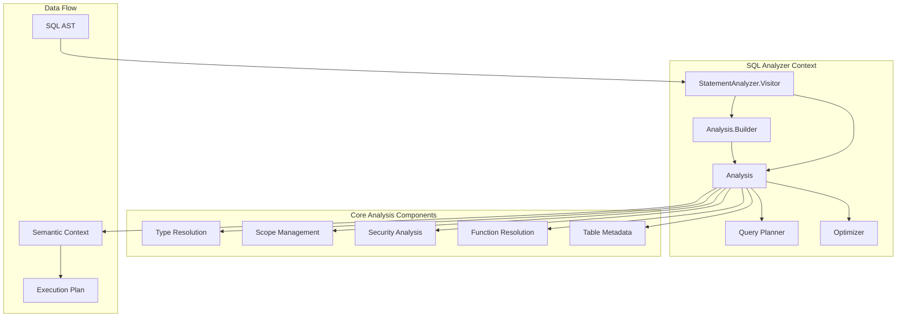
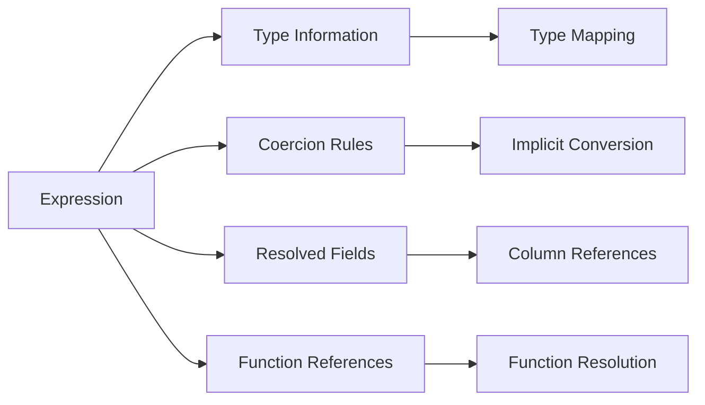
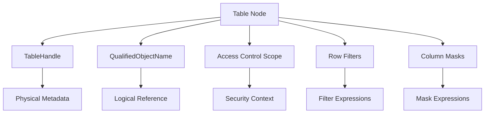
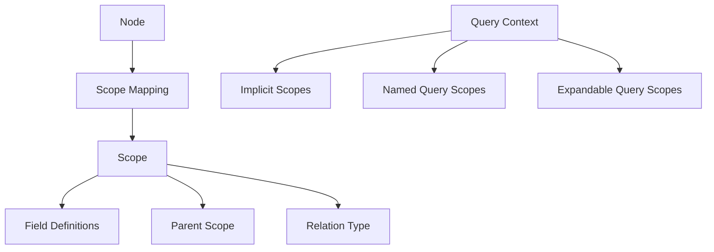
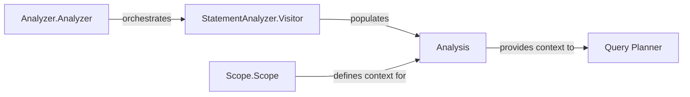
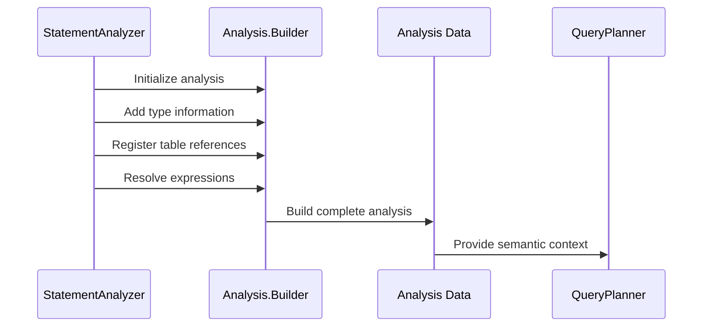
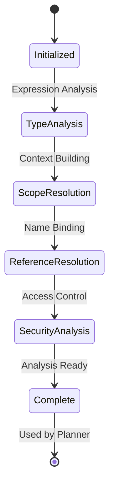
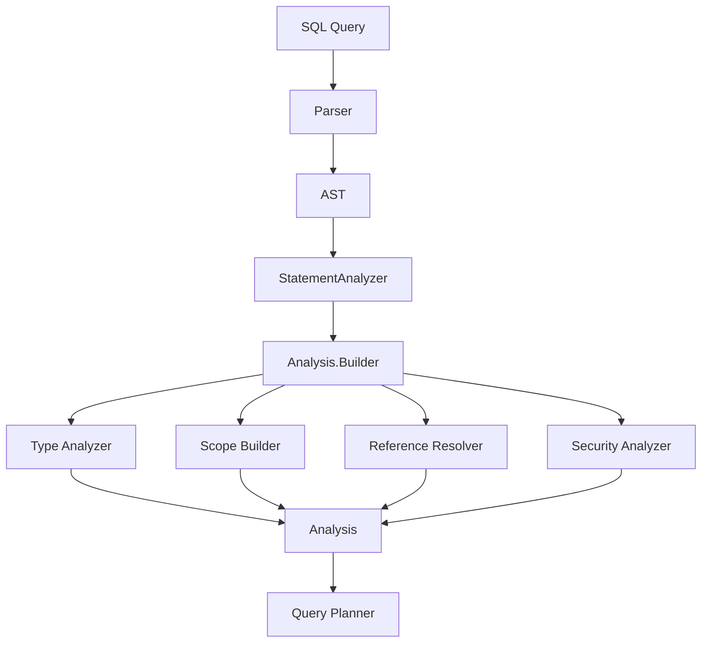

# Analysis Data Structure Module

## Introduction

The Analysis Data Structure module is a core component of Trino's SQL Analyzer subsystem that serves as the central repository for all semantic analysis information about SQL queries. It captures and organizes the complete context of query analysis, including resolved references, type information, scope relationships, and security constraints. This comprehensive data structure enables subsequent query planning and optimization phases to make informed decisions based on the semantic understanding of the query.

## Architecture Overview

The Analysis class acts as the primary data container that accumulates information throughout the semantic analysis phase. It maintains detailed mappings between AST nodes and their semantic interpretations, providing a complete picture of how each component of the SQL query should be understood and processed.

## Core Components

### Analysis Class Structure

The `Analysis` class serves as the central data structure with the following key responsibilities:

- **Semantic Context Storage**: Maintains comprehensive mappings between AST nodes and their semantic interpretations
- **Type Resolution Tracking**: Records type information for all expressions and their coercions
- **Scope Management**: Tracks lexical scopes and their relationships throughout the query
- **Security Context**: Manages access control information and security constraints
- **Metadata Integration**: Connects logical query elements to physical metadata objects

### Key Data Structures

#### Expression Analysis

#### Table and Relation Analysis

#### Scope and Context Management

## Component Relationships

### Integration with SQL Analyzer

The Analysis Data Structure module integrates closely with other SQL Analyzer components:

### Data Flow Architecture

## Key Features

### Type System Integration

The Analysis module maintains comprehensive type information:

- **Expression Types**: Maps every expression to its resolved type
- **Type Coercions**: Tracks implicit type conversions and their rules
- **Function Resolution**: Records resolved function calls with their signatures
- **Sort Key Coercions**: Manages special coercions for window frame calculations

### Security and Access Control

Security context management includes:

- **Row-Level Security**: Tracks row filter expressions per table
- **Column-Level Security**: Manages column mask expressions
- **Access Control Scopes**: Maintains security context for each table reference
- **Reference Chains**: Records the chain of references for audit trails

### Advanced SQL Features

Support for complex SQL constructs:

- **Window Functions**: Resolves window specifications and function calls
- **Pattern Recognition**: Analyzes row pattern matching expressions
- **JSON Operations**: Handles JSON path analysis and table functions
- **Recursive Queries**: Manages expandable query analysis
- **Table Functions**: Supports polymorphic and table-valued functions

## Usage Patterns

### Analysis Construction

The Analysis is built incrementally during semantic analysis:

1. **Initialization**: Created with the root statement and query type
2. **Type Resolution**: Types are added as expressions are analyzed
3. **Scope Building**: Scopes are established for each query block
4. **Reference Resolution**: Tables, columns, and functions are resolved
5. **Security Application**: Access controls and filters are applied

### Information Retrieval

The Analysis provides comprehensive query information:

- **Output Descriptor**: Describes the result set structure
- **Referenced Tables**: Lists all tables with their access patterns
- **Routine Information**: Details all functions and procedures used
- **Security Context**: Provides complete security analysis

## Dependencies

The Analysis Data Structure module depends on several key Trino components:

### Core Dependencies

- **[Trino SPI](Trino SPI.md)**: For type system, connector interfaces, and security models
- **[SQL Parser & AST](SQL Parser & AST.md)**: For AST node representations and tree structure
- **[Metadata & Connector Abstraction](Metadata & Connector Abstraction.md)**: For table handles and metadata objects

### Related Analyzer Components

- **[Statement Analysis Engine](Statement Analysis Engine.md)**: The primary consumer that populates the Analysis
- **[Scope Management](Scope Management.md)**: Provides lexical scope definitions
- **[Main Analyzer](Main Analyzer.md)**: Orchestrates the overall analysis process

## Process Flow

### Analysis Lifecycle

### Query Analysis Integration

## Implementation Details

### Memory Management

The Analysis uses efficient data structures:

- **Immutable Collections**: Ensures thread-safety and prevents modification
- **LinkedHashMap**: Maintains insertion order for predictable behavior
- **Multimaps**: Handles one-to-many relationships efficiently
- **Optional Values**: Represents nullable fields explicitly

### Performance Considerations

- **Incremental Building**: Information is added as it becomes available
- **Lazy Evaluation**: Complex analysis is performed only when needed
- **Caching**: Resolved information is cached to avoid recomputation
- **Reference Equality**: Uses object identity for fast comparisons

### Thread Safety

The Analysis is designed to be immutable after construction:

- **Builder Pattern**: All modifications happen through the builder
- **Immutable Collections**: Final data structures are immutable
- **Defensive Copying**: Input data is copied to prevent external modification

## Extension Points

The Analysis module provides several extension mechanisms:

- **Custom Analysis Types**: Support for connector-specific analysis
- **Security Extensions**: Pluggable access control mechanisms
- **Function Analysis**: Extensible function resolution framework
- **Type System Extensions**: Support for custom types and coercions

This comprehensive data structure serves as the foundation for Trino's semantic understanding of SQL queries, enabling sophisticated optimization and execution strategies while maintaining security and correctness guarantees.