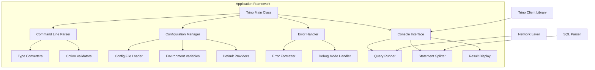
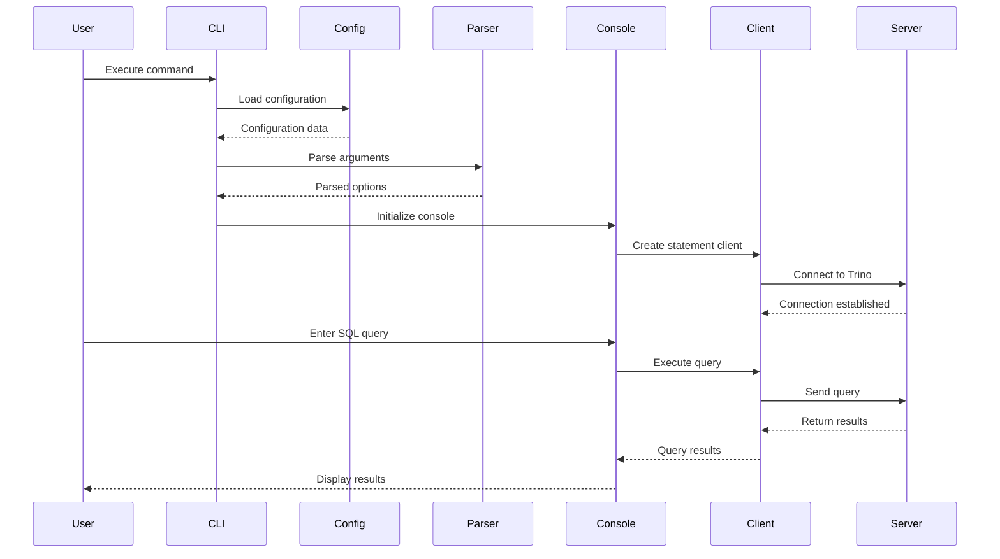

# Application Framework

## Introduction

The Application Framework module serves as the entry point and command-line interface (CLI) for Trino, providing users with a comprehensive tool to interact with the Trino distributed SQL query engine. This module implements the main application logic that handles command-line parsing, configuration management, error handling, and the interactive console interface for executing SQL queries against Trino clusters.

The framework is built using the picocli library for command-line interface management and JLine for terminal interaction, offering a robust and user-friendly experience for both interactive and batch query execution.

## Architecture Overview

The Application Framework follows a modular design pattern that separates concerns into distinct components while maintaining a cohesive user experience. The architecture is centered around the main `Trino` class which orchestrates the entire CLI application lifecycle.



## Core Components

### Main Application Entry Point

The `Trino` class serves as the primary entry point for the CLI application. It encapsulates the main method and provides static utility methods for command-line creation and error handling.

**Key Responsibilities:**
- Application initialization and bootstrap
- Command-line argument parsing and validation
- Configuration file discovery and loading
- Error handling and user-friendly error messages
- Version information management

**Component Details:**
- **Class**: `client.trino-cli.src.main.java.io.trino.cli.Trino.Trino`
- **Type**: Main application class
- **Dependencies**: picocli, JLine, Google Guava

### Command Line Interface

The framework implements a sophisticated command-line interface using the picocli library, providing extensive customization options and type-safe argument parsing.

**Features:**
- Automatic help generation
- Type conversion for complex data types (Duration, HostAndPort, etc.)
- Custom resource bundle for localized messages
- Exception handling with debug mode support
- Configuration file integration

**Type Converters:**
- `ClientResourceEstimate`: Resource estimation for queries
- `ClientSessionProperty`: Session property configuration
- `ClientExtraCredential`: Additional authentication credentials
- `HostAndPort`: Server connection details
- `Duration`: Timeout and interval specifications

### Configuration Management

The framework implements a hierarchical configuration system that searches for configuration files in multiple locations:

1. **Environment Variable**: `TRINO_CONFIG`
2. **User Home Directory**: `~/.trino_config`
3. **XDG Config Directory**: `$XDG_CONFIG_HOME/trino/config`

**Configuration Features:**
- Properties-based configuration
- Validation through `ValidatingPropertiesDefaultProvider`
- Fallback to default values
- Support for complex data types

### Error Handling and User Experience

The framework provides comprehensive error handling with user-friendly message formatting:

**Error Handling Components:**
- **Error Formatter**: Converts exceptions into colored, readable messages
- **Debug Mode**: Provides full stack traces when enabled
- **Exception Handler**: Centralized exception processing
- **Message Pattern**: Consistent error message formatting

**Error Message Features:**
- Colored output using JLine AttributedStringBuilder
- Conditional stack trace display
- Class name and message extraction
- Debug mode toggle support

## Data Flow Architecture



## Integration with Trino Ecosystem

The Application Framework integrates with multiple Trino modules to provide a complete user experience:

### Client Library Integration
- **StatementClient**: Manages query execution and result retrieval
- **ClientSession**: Handles session configuration and properties
- **QueryResults**: Processes and formats query results
- **Network Layer**: Manages HTTP connections and authentication

### SQL Processing Pipeline
- **StatementSplitter**: Parses and splits multi-statement SQL scripts
- **QueryRunner**: Orchestrates query execution workflow
- **Result Processing**: Formats and displays query results
- **Error Handling**: Manages SQL execution errors

### Configuration and Resource Management
- **ClientResourceEstimate**: Specifies query resource requirements
- **Session Properties**: Manages Trino session configuration
- **Authentication**: Handles various authentication methods
- **SSL/TLS**: Manages secure connections

## Key Features and Capabilities

### Interactive Console
- **Line Editing**: Advanced command-line editing capabilities
- **History**: Command history with search functionality
- **Completion**: Auto-completion for SQL keywords and identifiers
- **Syntax Highlighting**: SQL syntax highlighting in supported terminals
- **Progress Indicators**: Real-time query progress display

### Batch Mode Execution
- **Script Processing**: Execute SQL scripts from files
- **Output Formats**: Multiple output formats (CSV, TSV, JSON, etc.)
- **Error Handling**: Continue execution on non-critical errors
- **Result Export**: Save query results to files

### Advanced Configuration
- **Connection Pooling**: Efficient connection management
- **Timeout Management**: Configurable timeouts for various operations
- **Retry Logic**: Automatic retry for transient failures
- **Proxy Support**: HTTP/HTTPS proxy configuration

### Security and Authentication
- **Multiple Auth Methods**: Basic, Kerberos, OAuth, certificate-based
- **Credential Management**: Secure credential storage and handling
- **SSL Configuration**: Comprehensive SSL/TLS settings
- **Audit Logging**: Security event logging capabilities

## Error Handling and Diagnostics

The framework implements a comprehensive error handling strategy that provides clear, actionable error messages while maintaining the ability to debug complex issues.

### Error Categories
- **Connection Errors**: Network connectivity, authentication failures
- **Query Errors**: SQL syntax, semantic errors, execution failures
- **Configuration Errors**: Invalid settings, missing required parameters
- **System Errors**: Resource exhaustion, internal failures

### Diagnostic Features
- **Verbose Mode**: Detailed logging for troubleshooting
- **Debug Information**: Stack traces and internal state
- **Error Codes**: Standardized error codes for programmatic handling
- **Recovery Suggestions**: Actionable recommendations for common errors

## Performance and Resource Management

### Memory Management
- **Result Streaming**: Efficient handling of large result sets
- **Buffer Management**: Configurable buffer sizes for different operations
- **Garbage Collection**: Minimized GC pressure through object reuse

### Network Optimization
- **Connection Reuse**: HTTP connection pooling and reuse
- **Compression**: Optional response compression for large results
- **Chunked Transfer**: Support for streaming large responses

### Query Optimization
- **Client-Side Caching**: Intelligent caching of metadata and results
- **Parallel Execution**: Support for concurrent query execution
- **Resource Estimation**: Query resource requirement specification

## Extensibility and Customization

### Plugin Architecture
The framework supports extensibility through:
- **Custom Type Converters**: Extend command-line type handling
- **Output Formatters**: Custom result display formats
- **Authentication Providers**: Custom authentication mechanisms
- **Configuration Sources**: Additional configuration providers

### Resource Bundle Customization
- **Localized Messages**: Support for multiple languages
- **Custom Variables**: Dynamic variable substitution
- **Message Formatting**: Customizable message templates

## Dependencies and Integration Points

### External Dependencies
- **picocli**: Command-line interface framework
- **JLine**: Terminal interaction and line editing
- **Google Guava**: Utility libraries and collections
- **Airlift Units**: Duration and data size handling

### Internal Module Dependencies
- **[Trino Client Library](Trino Client Library.md)**: Query execution and result handling
- **[SQL Parser & AST](SQL Parser & AST.md)**: SQL parsing and validation
- **[Trino Server & API](Trino Server & API.md)**: Server communication protocols

## Configuration Reference

### Environment Variables
- `TRINO_CONFIG`: Path to configuration file
- `XDG_CONFIG_HOME`: XDG configuration directory base
- `TRINO_USER`: Default username for authentication
- `TRINO_PASSWORD`: Default password for authentication

### Configuration File Format
```properties
# Connection Settings
server=localhost:8080
user=trino_user
password=secure_password

# Session Properties
session_properties=query_max_memory=2GB,query_max_cpu_time=1h

# Output Settings
output-format=CSV
null-printing=<null>

# Security Settings
ssl=true
ssl-verify=true
keystore-path=/path/to/keystore
```

### Command-Line Options
- `--server`: Trino server URL
- `--user`: Authentication username
- `--password`: Authentication password
- `--catalog`: Default catalog
- `--schema`: Default schema
- `--execute`: Execute SQL statement and exit
- `--file`: Execute SQL from file
- `--output-format`: Result output format
- `--debug`: Enable debug mode

## Best Practices and Usage Guidelines

### Interactive Usage
1. **Connection Setup**: Always verify connection settings before executing queries
2. **Catalog Selection**: Set appropriate default catalog and schema
3. **Query History**: Utilize command history for repetitive queries
4. **Result Pagination**: Use appropriate result display settings for large datasets

### Script Execution
1. **Error Handling**: Implement proper error handling in SQL scripts
2. **Transaction Management**: Understand transaction boundaries and implications
3. **Resource Management**: Specify appropriate resource estimates for complex queries
4. **Output Formatting**: Choose appropriate output formats for downstream processing

### Performance Optimization
1. **Connection Pooling**: Configure appropriate connection pool settings
2. **Result Streaming**: Enable streaming for large result sets
3. **Compression**: Enable compression for network-intensive operations
4. **Caching**: Leverage client-side caching for metadata operations

## Troubleshooting and Common Issues

### Connection Issues
- **Network Connectivity**: Verify server accessibility and port configuration
- **Authentication Failures**: Check credentials and authentication method
- **SSL/TLS Errors**: Validate certificate configuration and trust stores
- **Timeout Problems**: Adjust timeout settings for slow networks

### Query Execution Issues
- **Syntax Errors**: Verify SQL syntax and compatibility
- **Permission Errors**: Check user permissions and access controls
- **Resource Limits**: Review query resource requirements and limits
- **Data Type Issues**: Ensure proper data type handling and conversion

### Performance Issues
- **Slow Queries**: Analyze query execution plans and optimization opportunities
- **Memory Issues**: Monitor memory usage and adjust configuration
- **Network Bottlenecks**: Optimize network settings and compression
- **Large Results**: Implement appropriate result streaming and pagination

This comprehensive documentation provides developers and maintainers with a thorough understanding of the Application Framework module, its architecture, integration points, and usage patterns within the Trino ecosystem.