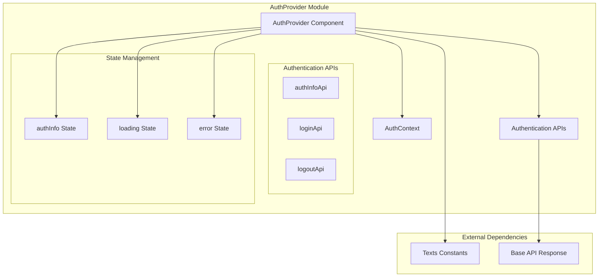
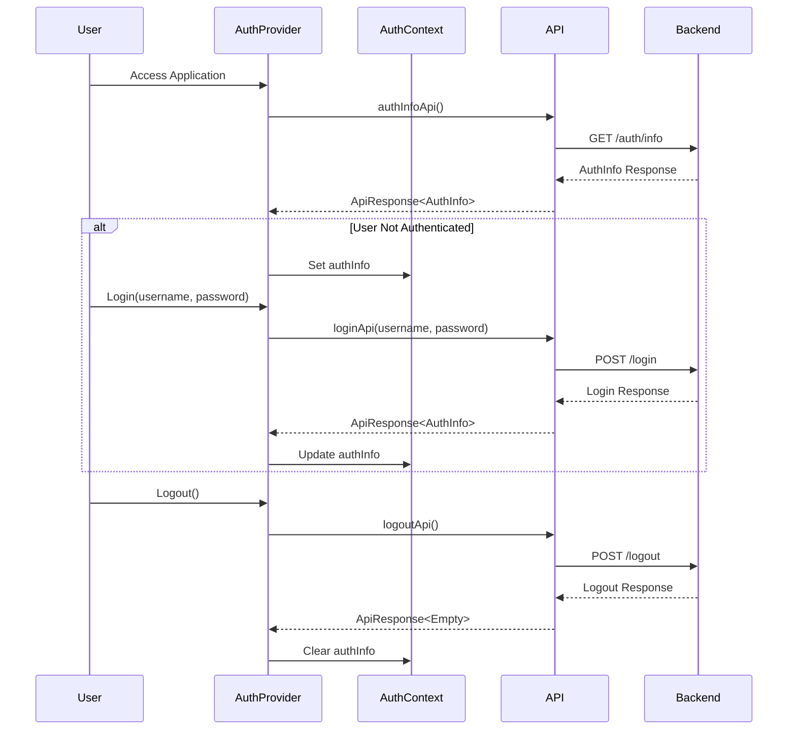
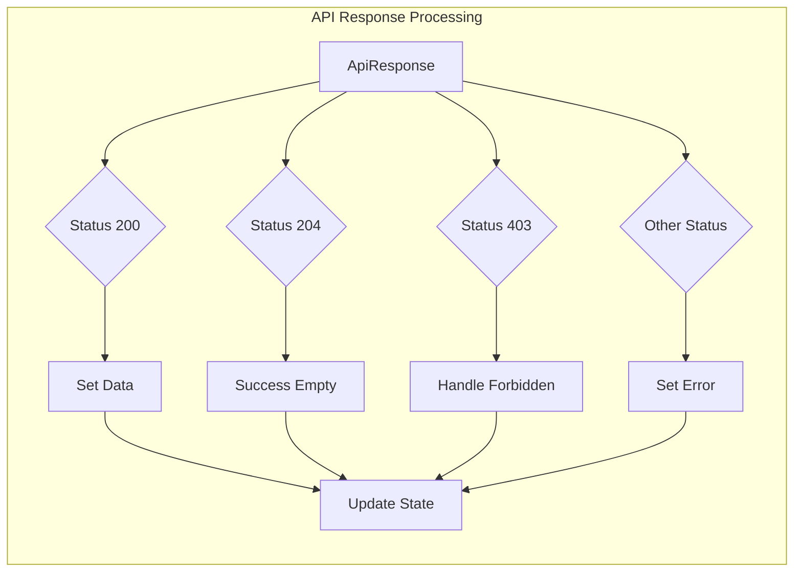
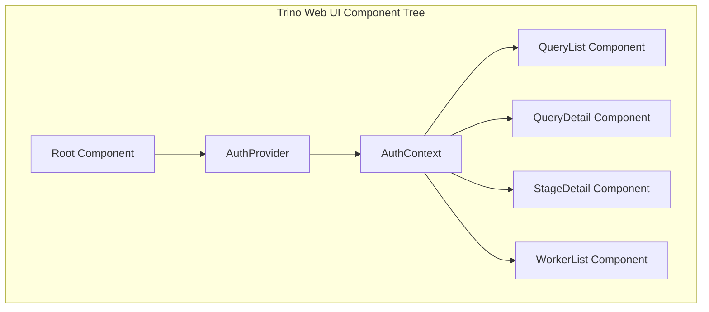

# AuthProvider Module Documentation

## Introduction

The AuthProvider module is a React-based authentication management component within the Trino Web UI system. It provides centralized authentication state management, user login/logout functionality, and authentication context distribution throughout the web application. This module serves as the primary interface between the Trino Web UI frontend and the backend authentication services.

## Module Overview

The AuthProvider module implements a React Context-based authentication system that manages user authentication state, handles login/logout operations, and provides authentication information to child components throughout the application. It integrates with Trino's backend authentication APIs to provide secure user authentication capabilities.

## Core Architecture

### Component Structure



### Authentication Flow



## Core Components

### AuthProvider Component

The main React functional component that wraps the application and provides authentication context to all child components.

**Key Features:**
- Manages authentication state using React hooks
- Handles API communication with backend authentication services
- Provides login and logout functionality
- Manages loading and error states
- Implements automatic authentication status checking on component mount

**State Management:**
- `authInfo`: Stores current authentication information (user details, authentication status)
- `loading`: Tracks API call loading states
- `error`: Stores error messages from failed authentication operations

### AuthProviderProps Interface

```typescript
interface AuthProviderProps {
    children: ReactNode // Accepts any valid JSX components as children
}
```

### Authentication Context Integration

The AuthProvider integrates with the AuthContext to provide authentication state and methods to child components throughout the application tree.

**Provided Context Values:**
- `authInfo`: Current authentication information
- `login`: Function to perform user login
- `logout`: Function to perform user logout
- `loading`: Current loading state
- `error`: Current error state

## API Integration

### Authentication APIs

The module integrates with three primary authentication APIs:

1. **authInfoApi**: Retrieves current authentication information
2. **loginApi**: Handles user login requests
3. **logoutApi**: Handles user logout requests

### API Response Handling



## Authentication Methods

### Login Process

1. Validates current authentication information availability
2. Calls login API with username and password
3. Updates authentication state on successful login
4. Handles forbidden responses (invalid credentials)
5. Manages error states for failed login attempts

### Logout Process

1. Supports both API-based and redirect-based logout
2. Clears authentication state on successful logout
3. Handles logout API responses appropriately
4. Provides option for immediate redirect to logout endpoint

## Error Handling

### Error Types

1. **Communication Errors**: Network or server communication failures
2. **Authentication Errors**: Invalid credentials or authentication failures
3. **Authorization Errors**: Access forbidden responses (403)
4. **General Errors**: Unexpected API responses or system errors

### Error Management

- Automatic error state clearing before new API calls
- Context-specific error messages based on response status
- Fallback error handling for unexpected responses
- Loading state management during API operations

## Security Considerations

### Authentication State Security

- Authentication information is stored in React state (memory-only)
- No persistent client-side storage of sensitive authentication data
- Automatic authentication status verification on component initialization

### API Security

- All authentication API calls use secure HTTP methods
- Proper error handling prevents information leakage
- Forbidden responses are handled without exposing system details

## Integration with Trino Web UI

### Component Hierarchy



### Dependencies

The AuthProvider module depends on:

- **AuthContext**: Provides authentication context interface
- **Base API Framework**: Handles API communication and response processing
- **Text Constants**: Provides localized error and status messages
- **Authentication APIs**: Backend API endpoints for authentication operations

## Usage Patterns

### Basic Implementation

```typescript
// Wrap application with AuthProvider
<AuthProvider>
    <App />
</AuthProvider>
```

### Component Authentication Access

Child components can access authentication functionality through the AuthContext:

- Check authentication status
- Perform login operations
- Execute logout operations
- Access user information
- Handle authentication errors

## Performance Considerations

### State Management

- Efficient React state updates using functional state setters
- Minimal re-renders through proper dependency management
- Loading state optimization to prevent unnecessary API calls

### API Call Optimization

- Automatic authentication status checking only when needed
- Proper cleanup and state management to prevent memory leaks
- Efficient error state handling to prevent cascading failures

## Testing Considerations

### Unit Testing

- Mock API responses for authentication operations
- Test state management and updates
- Verify error handling scenarios
- Test login/logout functionality

### Integration Testing

- Test API integration with backend services
- Verify authentication flow end-to-end
- Test error scenarios and recovery
- Validate security considerations

## Future Enhancements

### Potential Improvements

1. **Token-based Authentication**: Support for JWT or OAuth tokens
2. **Multi-factor Authentication**: Enhanced security options
3. **Session Management**: Advanced session timeout and renewal
4. **Role-based Access**: Integration with Trino's authorization system
5. **Authentication Providers**: Support for external authentication providers

### Scalability Considerations

- Support for high-concurrency authentication scenarios
- Efficient state management for large user bases
- Optimized API communication patterns
- Enhanced caching strategies for authentication information

## Related Documentation

- [Trino Web UI](TrinoWebUI.md) - Main web interface documentation
- [Trino Server Security](TrinoServer.md#security-framework) - Server-side security implementation
- [Authentication APIs](TrinoWebUI.md#api-integration) - Backend authentication service details
- [AuthContext](AuthContext.md) - Authentication context implementation

## Conclusion

The AuthProvider module serves as a critical component in the Trino Web UI authentication system, providing a robust, secure, and user-friendly authentication management solution. Its React Context-based architecture ensures efficient state distribution throughout the application while maintaining clean separation of concerns and providing comprehensive error handling and security features.