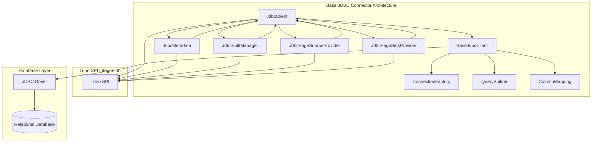

# Base JDBC Connector

## Overview

The Base JDBC Connector is a foundational module in Trino that provides a generic framework for connecting to and querying databases via JDBC (Java Database Connectivity). It serves as the base implementation for all JDBC-based connectors in Trino, offering a standardized approach to database connectivity, query execution, and data type mapping.

## Purpose and Core Functionality

The Base JDBC Connector abstracts the common functionality required to interact with relational databases through JDBC drivers. It provides:

- **Unified Database Access**: Standardized interface for connecting to various relational databases
- **Query Execution**: Framework for executing SQL queries and processing results
- **Data Type Mapping**: Conversion between database-specific types and Trino's type system
- **Transaction Management**: Support for database transactions and isolation levels
- **Performance Optimization**: Query pushdown capabilities and optimization strategies
- **Metadata Operations**: Schema discovery, table listing, and column information retrieval

## Architecture Overview

## Key Components

### 1. JdbcClient Interface
The primary interface defining the contract for JDBC-based database operations. It provides methods for:
- Schema and table discovery
- Column metadata retrieval
- Query preparation and execution
- Data type mapping
- Transaction support

### 2. BaseJdbcClient
Abstract base implementation providing common functionality for JDBC operations, including:
- Connection management
- Query building and execution
- Table and column operations
- Type mapping utilities

### 3. JdbcConnector
Main connector implementation that integrates with Trino's connector framework, managing:
- Transaction lifecycle
- Metadata operations
- Split management
- Data source and sink providers

### 4. Query Processing Components
- **JdbcSplitManager**: Handles query splitting and parallelization
- **JdbcPageSourceProvider**: Manages data reading from JDBC sources
- **JdbcPageSinkProvider**: Handles data writing to JDBC destinations

## Sub-modules

The Base JDBC Connector consists of several specialized sub-modules:

### [Client Interface and Implementation](JdbcClient.md)
Core client interface and base implementation providing the foundation for database interactions.

### [Query Processing](QueryProcessing.md)
Components responsible for query execution, optimization, and result processing.

### [Data Type System](DataTypeSystem.md)
Type mapping framework for converting between database-specific types and Trino types.

### [Transaction Management](TransactionManagement.md)
Transaction handling, connection pooling, and isolation level management.

## Related Documentation

- [Trino SPI](Trino%20SPI.md) - Core Service Provider Interface
- [SQL Parser & AST](SQL%20Parser%20&%20AST.md) - SQL parsing and query representation
- [SQL Analyzer, Planner & Optimizer](SQL%20Analyzer,%20Planner%20&%20Optimizer.md) - Query optimization and planning
- [Query Execution Engine](Query%20Execution%20Engine.md) - Distributed query execution
- [Metadata & Connector Abstraction](Metadata%20&%20Connector%20Abstraction.md) - Metadata management framework

## Integration with Trino Ecosystem

The Base JDBC Connector integrates with several other Trino modules:

- **[Trino SPI](Trino%20SPI.md)**: Provides the core interfaces and contracts for all Trino connectors
- **[SQL Parser & AST](SQL%20Parser%20&%20AST.md)**: Handles SQL parsing and query representation
- **[SQL Analyzer, Planner & Optimizer](SQL%20Analyzer,%20Planner%20&%20Optimizer.md)**: Optimizes queries and plans execution
- **[Query Execution Engine](Query%20Execution%20Engine.md)**: Executes distributed queries across the cluster

## Supported Operations

### Schema Operations
- Schema creation, deletion, and renaming
- Table discovery and metadata retrieval
- Column information and type mapping

### Data Operations
- SELECT queries with pushdown optimization
- INSERT, UPDATE, DELETE operations
- Bulk data loading and extraction
- Transaction support with ACID properties

### Performance Features
- Predicate pushdown to underlying databases
- Aggregation pushdown for compatible functions
- Join operation pushdown
- Top-N query optimization
- Dynamic filtering for improved performance

## Extension Points

The Base JDBC Connector is designed to be extended for specific database implementations:

- **Custom Type Mapping**: Override type conversion for database-specific types
- **Query Dialects**: Implement database-specific SQL syntax
- **Connection Management**: Customize connection handling and pooling
- **Optimization Rules**: Add database-specific query optimizations

## Configuration and Usage

The connector supports various configuration options for:
- Connection pooling and timeouts
- Query optimization settings
- Type mapping preferences
- Transaction isolation levels
- Performance tuning parameters

## Error Handling and Diagnostics

The module provides comprehensive error handling:
- SQL exception translation to Trino exceptions
- Connection failure recovery
- Query timeout management
- Detailed error reporting and diagnostics

## Performance Considerations

- **Connection Pooling**: Efficient reuse of database connections
- **Query Pushdown**: Minimizes data transfer by pushing operations to the database
- **Parallel Execution**: Supports parallel query execution across multiple splits
- **Caching**: Metadata caching to reduce database round trips

This Base JDBC Connector serves as the foundation for all JDBC-based connectors in Trino, providing a robust and extensible framework for relational database integration.