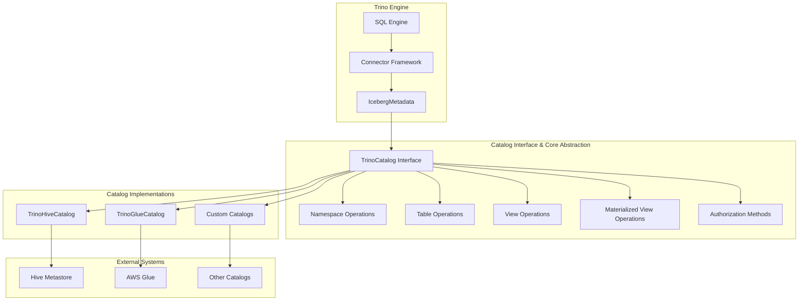
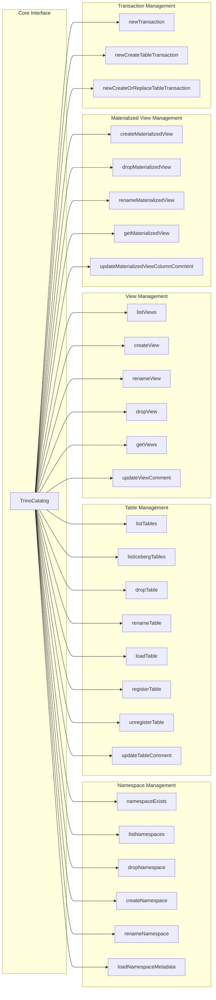
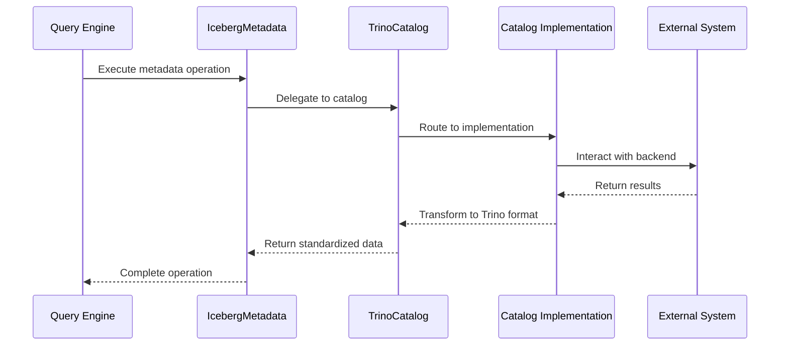
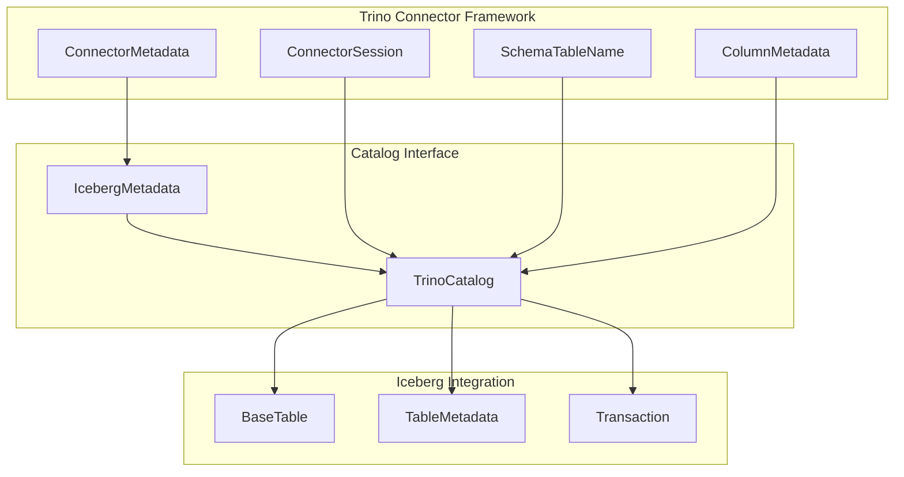
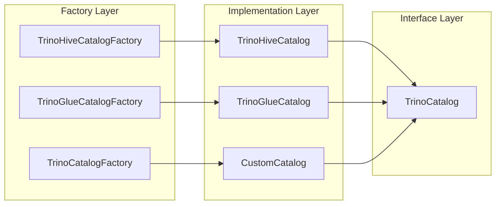

# Catalog Interface & Core Abstraction

## Introduction

The Catalog Interface & Core Abstraction module provides the foundational contract for Iceberg catalog implementations within the Trino query engine. This module defines the `TrinoCatalog` interface, which serves as the primary abstraction layer between Trino's SQL engine and various Iceberg catalog backends (Hive Metastore, AWS Glue, etc.). It enables Trino to interact with Iceberg tables across different storage systems and metadata services through a unified API.

## Architecture Overview

The Catalog Interface acts as a bridge between Trino's connector framework and Iceberg's native catalog system, adapting Iceberg concepts to Trino's architectural requirements while maintaining compatibility with Iceberg's table format specifications.

## Core Components

### TrinoCatalog Interface

The `TrinoCatalog` interface is the central abstraction that defines the contract for all Iceberg catalog implementations. It provides a comprehensive set of methods for managing namespaces, tables, views, and materialized views while adapting Iceberg's native concepts to Trino's architectural requirements.

**Key Design Principles:**
- **Session-Aware**: All methods accept `ConnectorSession` as the first parameter, enabling context-aware operations
- **Namespace Abstraction**: Uses `String` instead of Iceberg's `Namespace` class, with `Optional.empty()` representing empty namespaces
- **Table Identification**: Uses `SchemaTableName` instead of Iceberg's `TableIdentifier` for consistency with Trino conventions
- **Metadata Flexibility**: Supports `Map<String, Object>` for metadata instead of Iceberg's `Map<String, String>`
- **Authorization Integration**: Includes additional methods for security and authorization

## Component Relationships

## Data Flow Architecture

## Key Functional Areas

### Namespace Operations

The interface provides comprehensive namespace management capabilities:

- **Existence Checking**: `namespaceExists()` for validation
- **Listing**: `listNamespaces()` for enumeration
- **Lifecycle**: `createNamespace()`, `dropNamespace()`, `renameNamespace()`
- **Metadata**: `loadNamespaceMetadata()` for properties and configuration
- **Security**: `getNamespacePrincipal()`, `setNamespacePrincipal()` for authorization

### Table Operations

Table management forms the core functionality:

- **Discovery**: `listTables()`, `listIcebergTables()` for table enumeration
- **Lifecycle**: `dropTable()`, `renameTable()`, `registerTable()`, `unregisterTable()`
- **Access**: `loadTable()` for table loading with type validation
- **Metadata**: `updateTableComment()`, `tryGetColumnMetadata()` for bulk operations
- **Location**: `defaultTableLocation()` for storage path resolution

### View and Materialized View Support

Comprehensive view management including:

- **Standard Views**: Creation, renaming, dropping, and metadata operations
- **Materialized Views**: Full lifecycle management with properties support
- **Comments**: Column and view comment management
- **Authorization**: Principal management for access control

### Transaction Management

Transaction support for table operations:

- **Standard Transactions**: `newTransaction()` for existing tables
- **Create Transactions**: `newCreateTableTransaction()` for new table creation
- **Replace Transactions**: `newCreateOrReplaceTableTransaction()` for atomic replacements

## Integration with Trino Ecosystem

### Connector Framework Integration

### Type System Integration

The interface seamlessly integrates with Trino's type system:

- **Column Metadata**: Uses `ColumnMetadata` for schema information
- **Type Mapping**: Leverages Trino's type registry for data type handling
- **Identity Management**: Uses `ColumnIdentity` for column tracking

### Security Framework Integration

Built-in security capabilities:

- **Principal Management**: `TrinoPrincipal` for user/role management
- **Authorization**: Integrated with Trino's access control system
- **Session Context**: Security context through `ConnectorSession`

## Implementation Patterns

### Catalog Factory Pattern

### Error Handling Strategy

The interface defines specific exception handling:

- **Type Validation**: `UnknownTableTypeException` for non-Iceberg tables
- **Existence Checks**: Return types indicate presence/absence of entities
- **Optional Returns**: Extensive use of `Optional` for safe null handling

## Performance Considerations

### Bulk Operations

- **Column Metadata**: `tryGetColumnMetadata()` supports bulk table operations
- **Table Listing**: Optimized enumeration with filtering capabilities
- **Streaming Support**: `streamRelationColumns()` and `streamRelationComments()` for large datasets

### Caching Strategy

- **Metadata Caching**: Implementations can cache namespace and table metadata
- **Session Context**: Leverages session for caching and state management
- **Lazy Loading**: Supports on-demand loading of table metadata

## Extension Points

### Custom Catalog Implementations

The interface supports custom catalog implementations:

- **Plugin Integration**: Works with Trino's plugin system
- **Factory Pattern**: Catalog factories for instantiation
- **Configuration**: Support for catalog-specific properties

### Namespace Separator

- **Multi-level Support**: `getNamespaceSeparator()` enables hierarchical namespaces
- **Flexibility**: Different implementations can support different namespace structures

## Dependencies and References

### Related Modules

- **[Iceberg Connector](Iceberg Connector.md)**: Primary consumer of this interface
- **[Metadata & Connector Abstraction](Metadata & Connector Abstraction.md)**: Core metadata management
- **[Trino SPI](Trino SPI.md)**: Foundation interfaces and types
- **[SQL Analyzer, Planner & Optimizer](SQL Analyzer, Planner & Optimizer.md)**: Query planning integration

### External Dependencies

- **Apache Iceberg**: Native table format integration
- **Trino Metastore**: Hive metastore integration
- **AWS SDK**: Glue catalog support

## Future Considerations

### Evolution Path

The interface is designed for extensibility:

- **Iceberg View Integration**: View methods will evolve as Iceberg view support matures
- **New Catalog Types**: Interface supports addition of new catalog implementations
- **Enhanced Security**: Authorization methods can be extended for new security models

### Best Practices

- **Implementation Consistency**: All implementations should maintain semantic consistency
- **Error Handling**: Consistent exception handling across implementations
- **Performance**: Implementations should optimize for common access patterns
- **Security**: Proper integration with Trino's security framework

This catalog interface serves as the cornerstone of Trino's Iceberg integration, providing a flexible and extensible foundation for managing Iceberg tables across diverse storage and metadata systems while maintaining consistency with Trino's architectural principles.