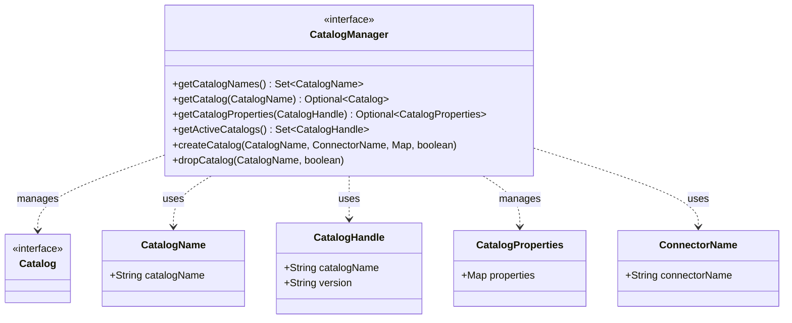
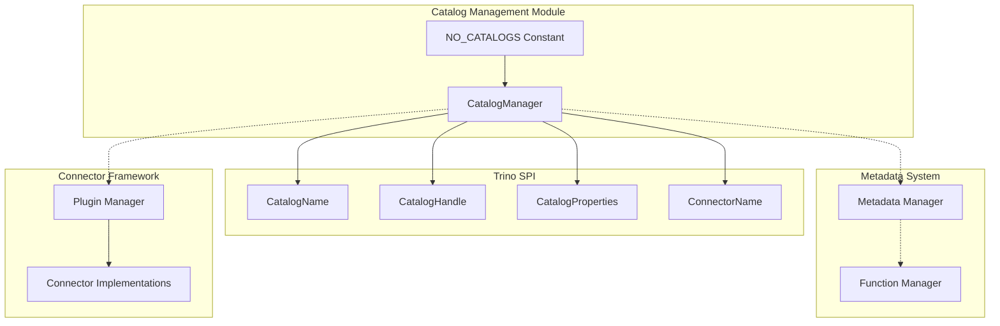
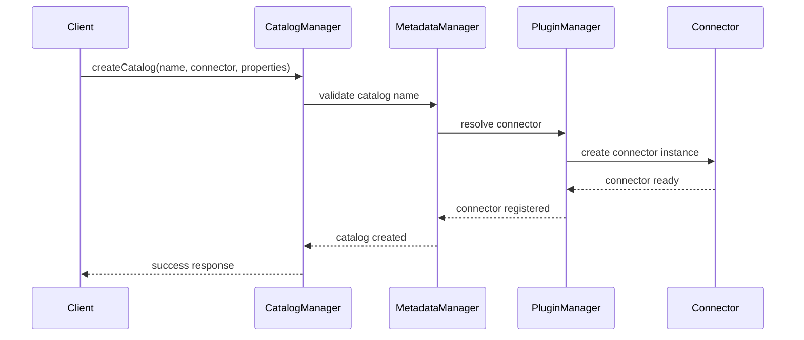
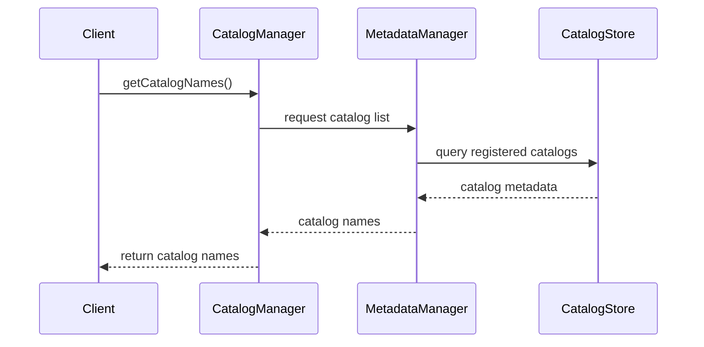
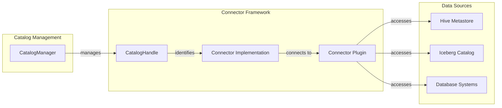

# Catalog Management Module

## Introduction

The Catalog Management module is a core component of Trino's metadata system that provides centralized management of data source catalogs. It serves as the primary interface for registering, configuring, and managing connections to various data sources through Trino's connector architecture. This module enables dynamic catalog lifecycle management, allowing administrators to add, remove, and configure data sources without restarting the Trino cluster.

## Overview

Catalogs in Trino represent logical namespaces that contain schemas and tables from external data sources. The Catalog Management module provides the foundational infrastructure for:

- **Catalog Registration**: Dynamic registration of new data sources via connectors
- **Catalog Lifecycle Management**: Creation, updates, and removal of catalogs
- **Configuration Management**: Handling catalog-specific properties and settings
- **Runtime Discovery**: Runtime enumeration of available catalogs and their properties
- **Connector Integration**: Bridging between Trino's metadata system and connector implementations

## Architecture

### Core Components

### System Integration

## Key Features

### 1. Catalog Discovery and Enumeration

The module provides comprehensive catalog discovery capabilities:

- **Runtime Catalog Listing**: `getCatalogNames()` returns all registered catalog names
- **Active Catalog Management**: `getActiveCatalogs()` identifies currently active catalogs
- **Catalog Property Access**: `getCatalogProperties()` retrieves configuration for specific catalogs

### 2. Dynamic Catalog Management

Supports dynamic catalog lifecycle operations:

- **Catalog Creation**: `createCatalog()` registers new data sources with specified connectors
- **Catalog Removal**: `dropCatalog()` removes catalogs from the system
- **Conditional Operations**: Support for `IF NOT EXISTS` and `IF EXISTS` semantics

### 3. Connector Integration

Seamless integration with Trino's connector architecture:

- **Connector Name Resolution**: Maps catalog names to specific connector implementations
- **Property Management**: Handles connector-specific configuration properties
- **Version Management**: Supports catalog versioning through `CatalogHandle`

## Data Flow

### Catalog Registration Process

### Catalog Discovery Flow

## Component Relationships

### Integration with Metadata System

The Catalog Management module integrates closely with Trino's broader metadata infrastructure:

- **Metadata Manager**: Provides high-level metadata operations that delegate to catalog managers
- **Function Manager**: Manages functions across different catalogs
- **Type Registry**: Coordinates type definitions across catalogs
- **Access Control**: Enforces security policies at the catalog level

### Connector Framework Integration

## Configuration and Usage

### Catalog Configuration

Catalogs are configured through:

- **Catalog Properties**: Key-value pairs defining connector-specific settings
- **Connector Selection**: Specification of which connector to use for the catalog
- **Runtime Parameters**: Dynamic configuration that can be updated without restart

### Default Implementation

The module provides a `NO_CATALOGS` constant that represents an empty catalog manager, useful for:

- **Testing Scenarios**: Isolated testing environments
- **Minimal Deployments**: Systems without external data sources
- **Fallback Behavior**: Default behavior when no catalogs are configured

## Error Handling

The Catalog Management module implements comprehensive error handling:

- **Validation Errors**: Invalid catalog names or properties
- **Connector Resolution**: Failures to locate or instantiate connectors
- **Runtime Exceptions**: Issues during catalog operations
- **Existence Checks**: Proper handling of `IF EXISTS`/`IF NOT EXISTS` semantics

## Performance Considerations

### Scalability

- **Catalog Enumeration**: Efficient listing of large numbers of catalogs
- **Property Caching**: Cached access to frequently used catalog properties
- **Lazy Loading**: On-demand initialization of catalog resources

### Resource Management

- **Memory Efficiency**: Minimal memory footprint for catalog metadata
- **Connection Pooling**: Integration with connector connection management
- **Cleanup Operations**: Proper resource cleanup on catalog removal

## Security Integration

The Catalog Management module works with Trino's security framework:

- **Access Control**: Integration with [Access Control Manager](Access%20Control%20Manager.md)
- **Authentication**: Support for catalog-level authentication mechanisms
- **Authorization**: Fine-grained permissions at the catalog level

## Testing and Development

### Testing Support

- **Mock Implementations**: Test-friendly catalog manager implementations
- **Isolation**: Ability to test catalog operations in isolation
- **Configuration Flexibility**: Easy setup of test catalogs

### Development Guidelines

When extending the Catalog Management module:

1. **Interface Compliance**: Maintain compatibility with the `CatalogManager` interface
2. **Error Handling**: Implement proper error handling and reporting
3. **Performance**: Consider performance implications of catalog operations
4. **Security**: Integrate with Trino's security framework

## Related Modules

- **[Metadata & Connector Abstraction](Metadata%20&%20Connector%20Abstraction.md)**: Higher-level metadata management that uses catalog management
- **[Plugin Architecture](Plugin%20Architecture.md)**: Connector registration and management
- **[Security Framework](Security%20Framework.md)**: Catalog-level security and access control
- **[Connector Framework](Connector%20Framework.md)**: Individual connector implementations

## Future Enhancements

Potential areas for future development:

- **Dynamic Catalog Updates**: Runtime modification of catalog properties
- **Catalog Templates**: Predefined configurations for common data sources
- **Monitoring Integration**: Enhanced observability of catalog health and performance
- **Multi-tenant Support**: Improved isolation between different catalog users