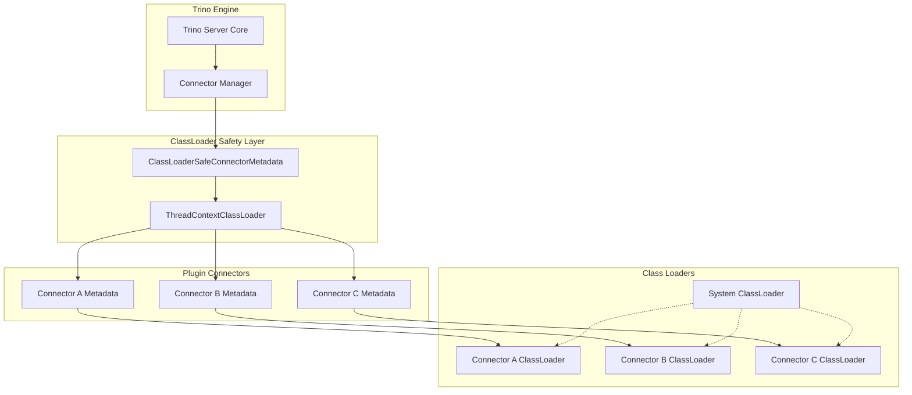
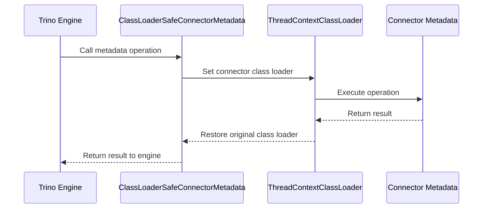
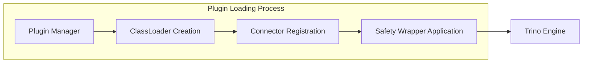
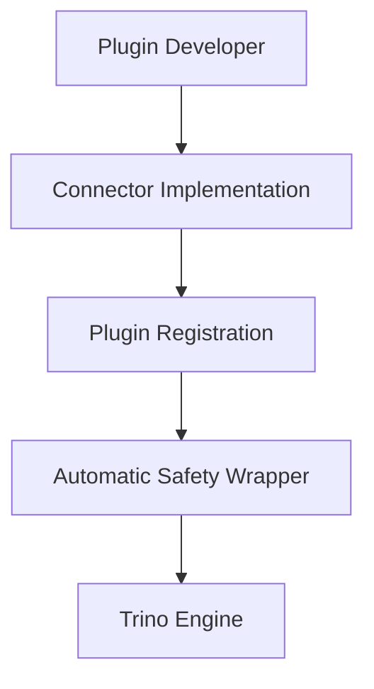

# ClassLoader Safety Module

## Introduction

The ClassLoader Safety module provides a critical isolation mechanism within Trino's plugin architecture, ensuring that connector operations execute within the correct class loader context. This module prevents class loading conflicts and maintains proper isolation between different connectors and the core Trino engine.

## Overview

The ClassLoader Safety module is part of the [Plugin Toolkit](Plugin Toolkit.md) and serves as a protective wrapper around connector metadata operations. It ensures that all connector-specific operations execute within the appropriate class loader context, preventing class loading issues that could arise when multiple connectors with different dependencies are loaded simultaneously.

## Core Architecture

### ClassLoaderSafeConnectorMetadata

The primary component of this module is the `ClassLoaderSafeConnectorMetadata` class, which implements the `ConnectorMetadata` interface from the [Trino SPI](Trino SPI.md). This class acts as a decorator that wraps any connector metadata implementation and ensures all operations execute within the correct class loader context.

```java
public class ClassLoaderSafeConnectorMetadata
        implements ConnectorMetadata
{
    private final ConnectorMetadata delegate;
    private final ClassLoader classLoader;
    
    @Inject
    public ClassLoaderSafeConnectorMetadata(@ForClassLoaderSafe ConnectorMetadata delegate, ClassLoader classLoader)
    {
        this.delegate = requireNonNull(delegate, "delegate is null");
        this.classLoader = requireNonNull(classLoader, "classLoader is null");
    }
}
```

## Architecture Diagram



## Key Components

### ThreadContextClassLoader

The `ThreadContextClassLoader` is a utility class from the Trino SPI that manages the thread context class loader. It ensures that operations execute within the correct class loading context and properly restores the original class loader when the operation completes.

### ClassLoaderSafeConnectorMetadata

This class implements all methods from the `ConnectorMetadata` interface, wrapping each method call with proper class loader management:

1. **Delegation Pattern**: Each method delegates to the wrapped connector metadata implementation
2. **Class Loader Management**: Uses `ThreadContextClassLoader` to ensure proper context
3. **Exception Safety**: Ensures class loader is restored even if exceptions occur
4. **Resource Management**: Uses try-with-resources for automatic cleanup

## Data Flow



## Integration with Trino Architecture

### Plugin System Integration

The ClassLoader Safety module integrates with Trino's [Plugin Architecture](Trino SPI.md#plugin-architecture) to provide seamless class loader isolation:



### Connector Framework Integration

The module works within the [Connector Framework](Trino SPI.md#connector-framework) to ensure all connector operations are properly isolated:

- **Metadata Operations**: All metadata calls are wrapped with class loader safety
- **Transaction Management**: Ensures proper context during transaction operations
- **Query Planning**: Maintains isolation during query planning phases
- **Data Access**: Protects data access operations from class loading conflicts

## Implementation Details

### Method Wrapping Pattern

Every method in `ClassLoaderSafeConnectorMetadata` follows a consistent pattern:

```java
@Override
public Optional<ConnectorTableHandle> getTableHandle(ConnectorSession session, SchemaTableName tableName, Optional<ConnectorTableVersion> startVersion, Optional<ConnectorTableVersion> endVersion)
{
    try (ThreadContextClassLoader _ = new ThreadContextClassLoader(classLoader)) {
        return delegate.getTableHandle(session, tableName, startVersion, endVersion);
    }
}
```

### Iterator Safety

For methods returning iterators, the module provides special handling through `ClassLoaderSafeIterator`:

```java
@Override
public ClassLoaderSafeIterator<TableColumnsMetadata> streamTableColumns(ConnectorSession session, SchemaTablePrefix prefix)
{
    try (ThreadContextClassLoader _ = new ThreadContextClassLoader(classLoader)) {
        return new ClassLoaderSafeIterator<>(delegate.streamTableColumns(session, prefix), classLoader);
    }
}
```

## Benefits

### Isolation
- **Connector Independence**: Each connector operates within its own class loader context
- **Dependency Isolation**: Prevents dependency conflicts between connectors
- **Version Compatibility**: Allows different versions of libraries in different connectors

### Safety
- **Class Loading Protection**: Prevents ClassNotFoundException and similar errors
- **Thread Safety**: Ensures proper thread context management
- **Resource Management**: Automatic cleanup of class loader contexts

### Maintainability
- **Transparent Operation**: Connectors don't need to be aware of class loader management
- **Consistent Interface**: Provides the same interface as regular connector metadata
- **Easy Integration**: Simple to apply to existing connectors

## Usage Patterns

### Plugin Development

When developing plugins, the ClassLoader Safety module is automatically applied by the [Plugin Manager](Trino Server & API.md#server-infrastructure):



### Connector Operations

All connector operations benefit from class loader safety:

- **Schema Operations**: CREATE SCHEMA, DROP SCHEMA, RENAME SCHEMA
- **Table Operations**: CREATE TABLE, DROP TABLE, ALTER TABLE
- **View Operations**: CREATE VIEW, DROP VIEW, ALTER VIEW
- **Data Operations**: INSERT, UPDATE, DELETE, MERGE
- **Metadata Operations**: Statistics collection, constraint application

## Dependencies

The ClassLoader Safety module depends on:

- **[Trino SPI](Trino SPI.md)**: Core interfaces and `ThreadContextClassLoader` utility
- **[Plugin Toolkit](Plugin Toolkit.md)**: Integration with plugin infrastructure
- **[Connector Framework](Trino SPI.md#connector-framework)**: Metadata operation interfaces

## Related Modules

- **[Metadata & Connector Abstraction](Metadata & Connector Abstraction.md)**: Higher-level metadata management
- **[Plugin Toolkit](Plugin Toolkit.md)**: Parent module containing this safety mechanism
- **[Trino Server & API](Trino Server & API.md)**: Server infrastructure that applies safety wrappers

## Best Practices

### For Plugin Developers

1. **No Special Handling Required**: The safety wrapper is applied automatically
2. **Focus on Business Logic**: Implement connector functionality without worrying about class loading
3. **Use Proper Dependencies**: Declare all dependencies in your plugin configuration

### For System Administrators

1. **Monitor Class Loading**: Watch for class loading issues in logs
2. **Plugin Isolation**: Ensure plugins are properly isolated in their class loaders
3. **Dependency Management**: Keep track of dependency versions across plugins

## Troubleshooting

### Common Issues

1. **ClassNotFoundException**: Usually indicates missing dependencies in plugin configuration
2. **NoClassDefFoundError**: Often caused by version conflicts between plugins
3. **LinkageError**: Typically indicates incompatible library versions

### Diagnostic Steps

1. **Check Plugin Configuration**: Verify all dependencies are declared
2. **Review Class Loader Hierarchy**: Ensure proper parent-child relationships
3. **Analyze Dependency Conflicts**: Use dependency analysis tools to identify conflicts

## Future Enhancements

The ClassLoader Safety module continues to evolve with:

- **Enhanced Debugging**: Better logging and diagnostic capabilities
- **Performance Optimization**: Reduced overhead for class loader switching
- **Extended Coverage**: Additional safety wrappers for other connector components
- **Dynamic Loading**: Support for hot-swapping plugins without restart

## Conclusion

The ClassLoader Safety module is a fundamental component of Trino's plugin architecture, providing essential isolation and safety guarantees. By ensuring that all connector operations execute within the correct class loader context, it enables a robust and reliable multi-connector environment where plugins can coexist without interfering with each other or the core Trino engine.