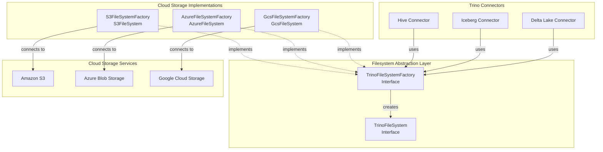
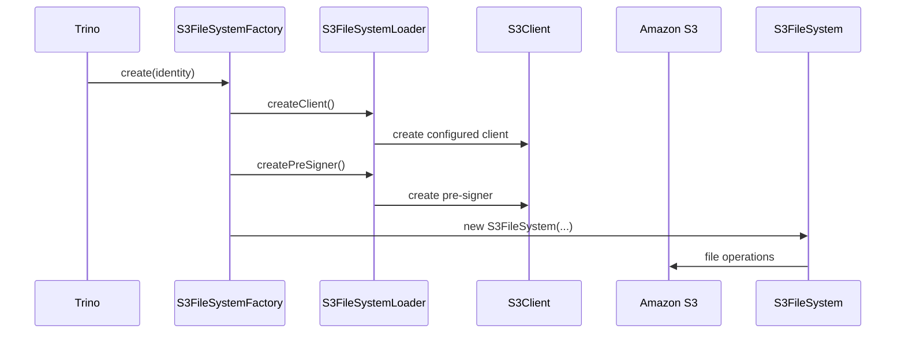
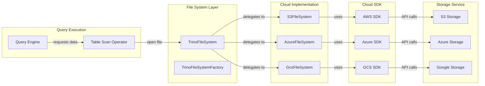
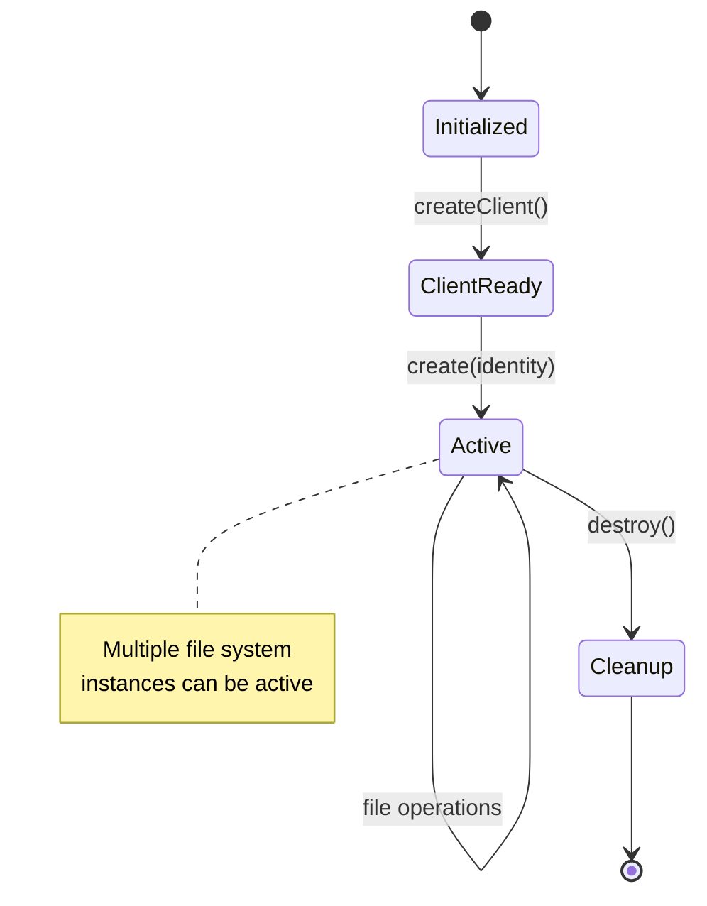

# Cloud Storage Implementations Module

## Introduction

The Cloud Storage Implementations module provides Trino with unified access to major cloud storage platforms including Amazon S3, Microsoft Azure Blob Storage, and Google Cloud Storage (GCS). This module implements the [Filesystem Abstraction Layer](Filesystem Abstraction Layer.md) interface, enabling Trino connectors to read and write data from cloud storage systems using a consistent API.

The module handles cloud-specific authentication, connection management, retry logic, and performance optimizations while abstracting these complexities from the higher-level Trino components.

## Architecture Overview

## Core Components

### S3FileSystemFactory

The `S3FileSystemFactory` creates S3-compatible file system instances with the following key features:

- **AWS SDK Integration**: Uses AWS SDK v2 for modern S3 API support
- **Credential Management**: Handles AWS credentials through Trino's identity system
- **Performance Optimization**: Configurable upload executors and connection pooling
- **Pre-signing Support**: Generates pre-signed URLs for secure access

### AzureFileSystemFactory

The `AzureFileSystemFactory` provides Azure Blob Storage integration with:

- **Azure SDK Integration**: Uses Azure SDK for Java with Netty HTTP client
- **Connection Management**: Custom connection pooling and concurrency limits
- **Authentication**: Supports various Azure authentication methods
- **Performance Tuning**: Configurable block sizes and write concurrency

Key configuration options:
- Read/write block sizes for optimal performance
- Maximum write concurrency
- HTTP connection limits
- Multipart upload support

### GcsFileSystemFactory

The `GcsFileSystemFactory` implements Google Cloud Storage access with:

- **Google Cloud SDK**: Integrates with Google Cloud Storage client library
- **Executor Service**: Dedicated thread pool for GCS operations
- **Batch Operations**: Configurable batch sizes for efficient API calls
- **Pagination**: Handles GCS API pagination for large result sets

## Data Flow Architecture

## Configuration and Lifecycle Management

### Factory Lifecycle

Each cloud storage factory follows a consistent lifecycle pattern:

1. **Construction**: Initialize with configuration and telemetry
2. **Client Creation**: Set up cloud-specific SDK clients
3. **File System Creation**: Create file system instances per identity
4. **Cleanup**: Properly shutdown clients and executors

### Identity-Based Access

The module supports Trino's identity-based access control:

- Each file system instance is created for a specific `ConnectorIdentity`
- Credentials are resolved based on the identity context
- Supports impersonation and delegation scenarios
- Integrates with Trino's security framework

## Performance Optimizations

### Connection Pooling

Each implementation includes sophisticated connection management:

- **S3**: AWS SDK built-in connection pooling
- **Azure**: Custom Netty-based connection provider with limits
- **GCS**: Google Cloud SDK connection management

### Concurrent Operations

The module optimizes for concurrent access patterns:

- Dedicated thread pools for upload operations
- Configurable concurrency limits
- Non-blocking I/O where supported
- Batch operations for multiple files

### Block Size Configuration

Optimal block sizes are configurable for different workloads:

- **Read Block Size**: Tunes sequential read performance
- **Write Block Size**: Optimizes upload throughput
- **Multipart Threshold**: Configures when to use multipart uploads

## Error Handling and Resilience

### Retry Logic

Each implementation includes cloud-specific retry strategies:

- **Transient Error Handling**: Automatic retry for temporary failures
- **Backoff Strategies**: Exponential backoff with jitter
- **Timeout Management**: Configurable timeouts for different operations
- **Circuit Breaker**: Prevents cascading failures

### Exception Translation

Cloud-specific exceptions are translated to Trino's file system exceptions:

- Storage service errors → TrinoFileSystemException
- Authentication failures → AccessDeniedException
- Network timeouts → TrinoFileSystemException
- Resource not found → FileNotFoundException

## Integration with Trino Connectors

### Hive Connector Integration

The Hive connector uses cloud storage for:

- Table data files (ORC, Parquet, TextFile formats)
- Partition metadata
- Temporary staging directories
- Transaction logs

### Iceberg Connector Integration

The Iceberg connector leverages cloud storage for:

- Table metadata files
- Data files with snapshot isolation
- Manifest files
- Delete files

### Delta Lake Connector Integration

The Delta Lake connector uses cloud storage for:

- Delta transaction logs
- Data files with ACID guarantees
- Checkpoint files
- Metadata operations

## Security Features

### Authentication Methods

Each cloud provider supports multiple authentication methods:

**S3:**
- IAM roles and policies
- Access keys
- Session tokens
- Cross-account access

**Azure:**
- Managed identities
- Service principals
- Shared access signatures
- Connection strings

**GCS:**
- Service account keys
- Application default credentials
- Workload identity
- User credentials

### Encryption Support

All implementations support encryption at rest and in transit:

- **Server-Side Encryption**: AES-256, KMS-managed keys
- **Client-Side Encryption**: Optional client-side encryption
- **TLS**: All data transfer encrypted in transit
- **Key Management**: Integration with cloud KMS services

## Monitoring and Observability

### Metrics Collection

Each implementation provides comprehensive metrics:

- Operation latency and throughput
- Error rates and retry counts
- Connection pool utilization
- Transfer sizes and counts

### Distributed Tracing

Integration with OpenTelemetry provides:

- End-to-end request tracing
- Performance bottleneck identification
- Error propagation tracking
- Service dependency mapping

## Best Practices

### Configuration Recommendations

1. **Block Sizes**: Tune based on file sizes and access patterns
2. **Concurrency Limits**: Set based on cluster size and workload
3. **Timeout Values**: Configure based on network latency
4. **Retry Settings**: Balance between resilience and performance

### Performance Tuning

1. **Connection Pools**: Size appropriately for concurrent queries
2. **Thread Pools**: Configure upload executors for write-heavy workloads
3. **Caching**: Leverage Trino's metadata caching where possible
4. **Batch Operations**: Use bulk operations for multiple files

### Security Considerations

1. **Least Privilege**: Grant minimal required permissions
2. **Credential Rotation**: Implement regular credential rotation
3. **Network Security**: Use VPC endpoints where available
4. **Audit Logging**: Enable cloud provider audit logs

## Dependencies

This module depends on:

- [Filesystem Abstraction Layer](Filesystem Abstraction Layer.md): Provides the base interfaces
- [Trino SPI](Trino SPI.md): For identity and configuration support
- Cloud provider SDKs: AWS SDK, Azure SDK, Google Cloud SDK

## Future Enhancements

Potential improvements include:

- Additional cloud provider support (Oracle Cloud, Alibaba Cloud)
- Advanced caching mechanisms
- Intelligent data placement strategies
- Enhanced monitoring and alerting
- Support for cloud-native table formats