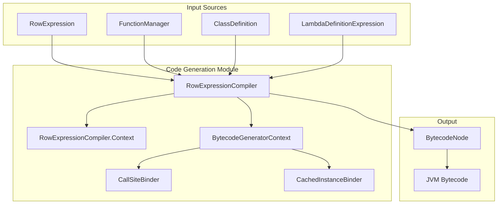
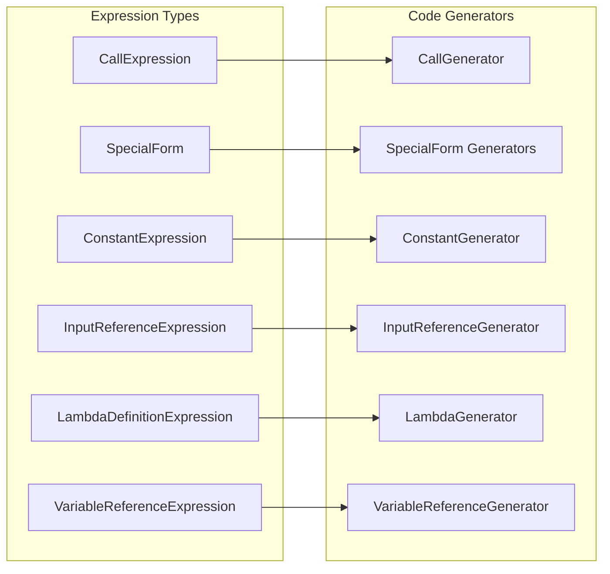
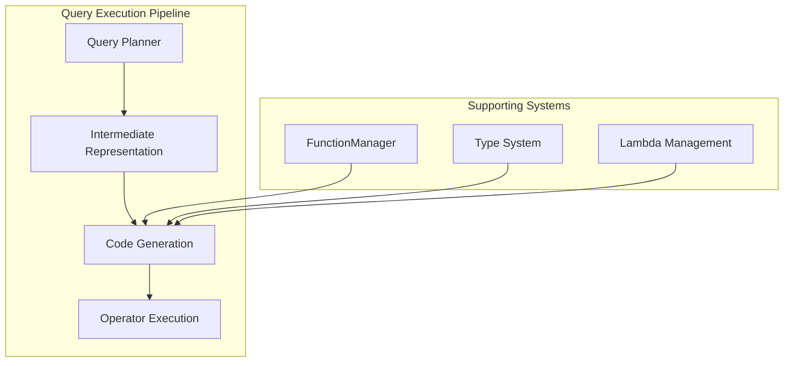
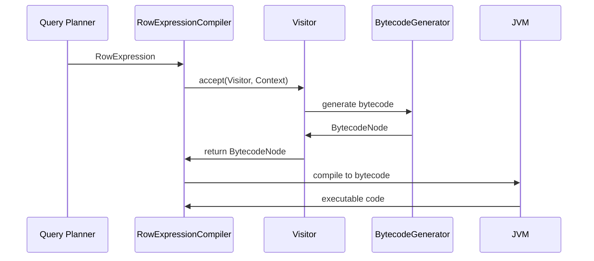

# Code Generation Module

## Introduction

The Code Generation module is a critical component of Trino's query execution engine that transforms SQL expressions into optimized Java bytecode at runtime. This module enables Trino to achieve high performance by compiling query expressions into native Java code rather than interpreting them, leveraging the JVM's Just-In-Time (JIT) compilation capabilities.

## Core Purpose

The module's primary responsibility is to convert Trino's intermediate representation of SQL expressions (RowExpression) into efficient Java bytecode that can be executed directly by the JVM. This approach provides significant performance benefits over traditional interpretation-based query execution.

## Architecture Overview



## Core Components

### RowExpressionCompiler

The `RowExpressionCompiler` is the main entry point for the code generation process. It orchestrates the compilation of RowExpression objects into bytecode by:

- Managing the compilation context and scope
- Delegating to specialized code generators for different expression types
- Handling lambda expressions and function calls
- Managing constant binding and field references

### RowExpressionCompiler.Context

The `Context` class encapsulates the compilation state, including:
- **Scope**: Variable scope management for bytecode generation
- **Lambda Interface**: Optional functional interface for lambda expressions
- **Compilation State**: Maintains context across recursive compilation calls

## Expression Type Support

The module supports compilation of various expression types through specialized generators:



### Special Form Support

Special forms are SQL constructs that require custom bytecode generation:

- **Conditional**: `IF`, `NULL_IF`, `SWITCH`, `BETWEEN`
- **Logical**: `AND`, `OR`, `IS_NULL`, `IN`
- **Constructors**: `ROW_CONSTRUCTOR`, `ARRAY_CONSTRUCTOR`
- **Dereferencing**: `DEREFERENCE`
- **Lambda Binding**: `BIND`

## Integration with Query Execution



The Code Generation module integrates with:

- **[Query Planner](SQL Analyzer, Planner & Optimizer.md)**: Receives optimized query plans
- **[Function Manager](Metadata & Connector Abstraction.md)**: Resolves function implementations
- **[Type System](Trino SPI.md)**: Handles type-specific operations
- **[Operator Framework](Query Execution Engine.md)**: Provides compiled expressions to operators

## Bytecode Generation Process



## Performance Optimizations

### Constant Binding
- Constants are bound directly into call-sites using invokedynamic
- Primitive types use LDC (Load Constant) instructions for efficiency
- Object constants are cached to avoid repeated allocations

### Lambda Compilation
- Lambda expressions are pre-compiled and cached
- Functional interface validation ensures proper lambda generation
- Compiled lambdas are reused across expression evaluations

### Field Reference Optimization
- Input references are compiled to direct field access
- Variable references use optimized scope resolution
- Temporary variables are managed efficiently

## Error Handling

The module includes comprehensive error handling for:
- Unsupported expression types
- Invalid lambda interfaces
- Compilation failures
- Type mismatches

## Dependencies

The Code Generation module depends on:

- **[Trino SPI](Trino SPI.md)**: For type system and function definitions
- **[SQL Analyzer, Planner & Optimizer](SQL Analyzer, Planner & Optimizer.md)**: For query plan representation
- **[Query Execution Engine](Query Execution Engine.md)**: For operator integration
- **[Metadata & Connector Abstraction](Metadata & Connector Abstraction.md)**: For function resolution

## Usage Patterns

### Expression Compilation
```java
// Typical usage within Trino
RowExpressionCompiler compiler = new RowExpressionCompiler(
    classDefinition,
    callSiteBinder,
    cachedInstanceBinder,
    fieldReferenceCompiler,
    functionManager,
    compiledLambdaMap,
    contextArguments
);

BytecodeNode bytecode = compiler.compile(rowExpression, scope);
```

### Lambda Expression Handling
```java
// Lambda compilation with interface validation
Optional<Class<?>> lambdaInterface = Optional.of(FunctionalInterface.class);
BytecodeNode lambdaBytecode = compiler.compile(lambdaExpression, scope, lambdaInterface);
```

## Future Enhancements

Potential areas for improvement include:
- Advanced optimization techniques (loop unrolling, vectorization)
- Support for new SQL constructs and functions
- Enhanced debugging and profiling capabilities
- Integration with modern JVM features (Project Valhalla, Loom)

## Related Documentation

- [Query Execution Engine](Query Execution Engine.md) - Understanding how generated code is executed
- [SQL Analyzer, Planner & Optimizer](SQL Analyzer, Planner & Optimizer.md) - Query plan generation
- [Trino SPI](Trino SPI.md) - Type system and function framework
- [Metadata & Connector Abstraction](Metadata & Connector Abstraction.md) - Function management