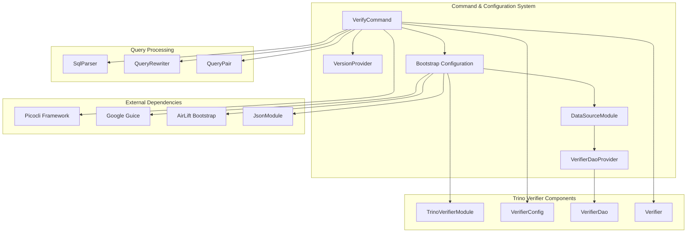
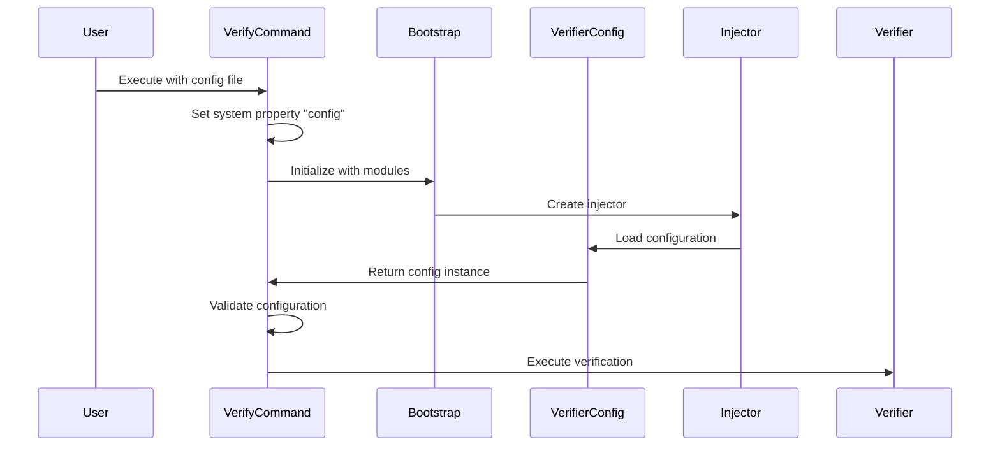
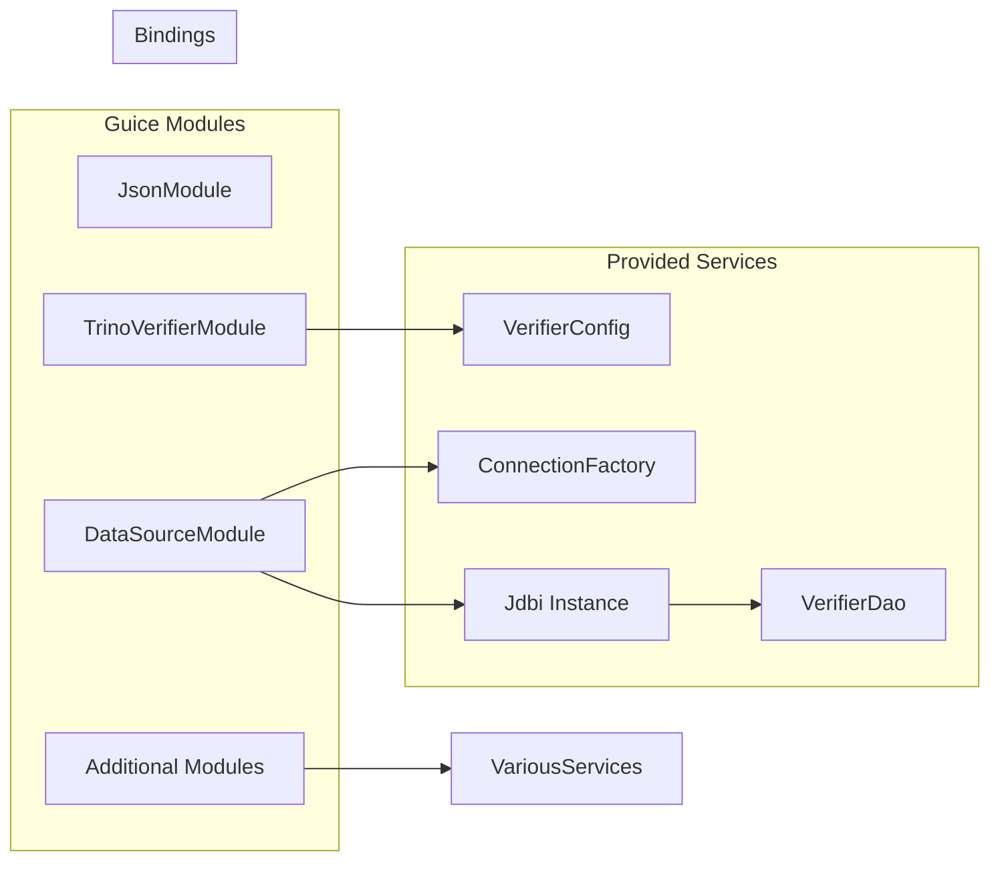
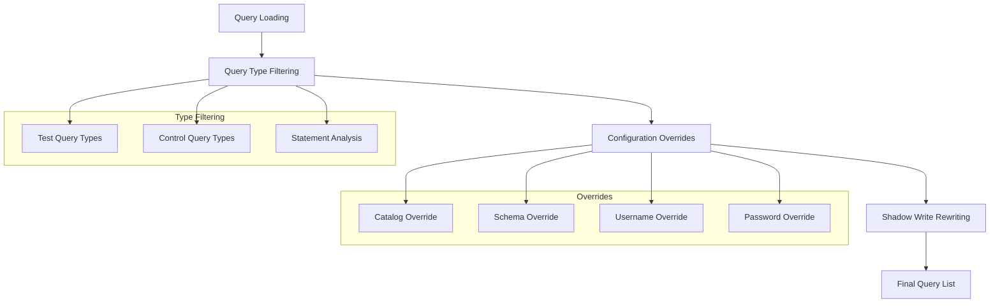
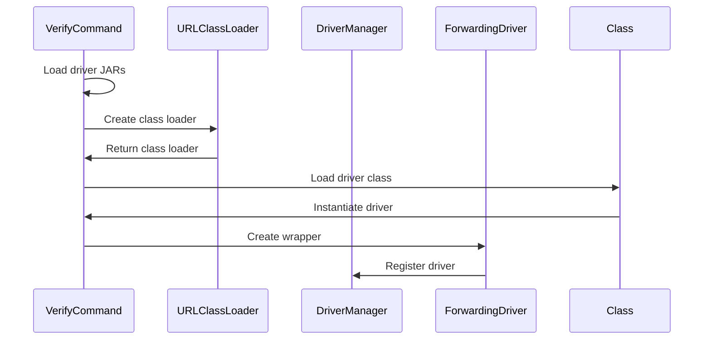
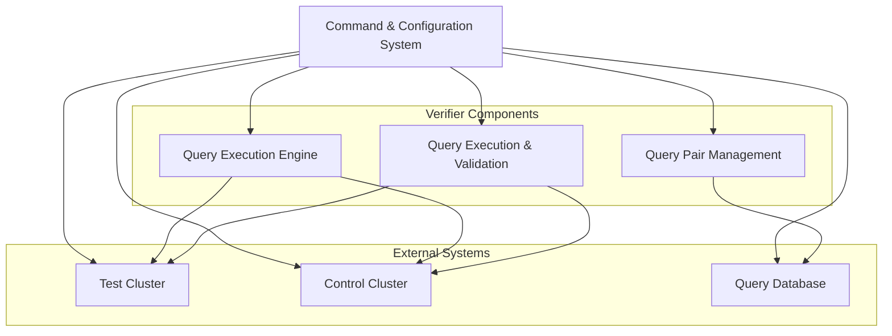

# Command & Configuration System

## Introduction

The Command & Configuration System module provides the foundational command-line interface and configuration management capabilities for the Trino Verifier service. This module serves as the entry point for the verifier application, handling command-line argument parsing, configuration loading, and application initialization through dependency injection.

The system is built using the Picocli framework for command-line parsing and Google Guice for dependency injection, providing a robust and extensible foundation for the verification workflow.

## Architecture Overview

The Command & Configuration System acts as the orchestration layer for the Trino Verifier, managing the complete lifecycle from command-line invocation to query verification execution. It integrates with multiple subsystems including the [Query Execution & Validation Engine](Trino%20Verifier.md#query-execution--validation-engine), [Query Pair Management](Trino%20Verifier.md#query-pair-management), and various data source modules.



## Core Components

### VerifyCommand

The `VerifyCommand` class serves as the main entry point for the Trino Verifier application. It implements the `Runnable` interface and is annotated with Picocli's `@Command` annotation to define the command-line interface structure.

**Key Responsibilities:**
- Command-line argument parsing and validation
- Configuration file loading and processing
- Dependency injection container initialization
- Query filtering and transformation
- JDBC driver management
- Verification execution orchestration

**Command-Line Interface:**
```bash
trina-verifier <configuration-file> [options]
```

**Available Options:**
- `--help, -h`: Display help message and exit
- `--version`: Print version information and exit

### VersionProvider

The `VersionProvider` class implements Picocli's `IVersionProvider` interface to provide version information for the application. It dynamically retrieves the implementation version from the package metadata.

**Features:**
- Automatic version detection from package implementation
- Integration with Picocli's version help system
- Graceful handling of missing version information

## Configuration Management

### Configuration Loading Process

The configuration system follows a systematic approach to load and validate application settings:



### Configuration Modules

The system uses a modular approach to configuration with several key modules:

1. **JsonModule**: Handles JSON serialization and deserialization
2. **TrinoVerifierModule**: Core verifier-specific bindings and configurations
3. **DataSourceModule**: Database connection and DAO provider configuration

### Dependency Injection Architecture

The system leverages Google Guice for dependency injection, providing a clean separation of concerns and testability:



## Query Processing Pipeline

### Query Filtering and Transformation

The Command & Configuration System implements a sophisticated query processing pipeline that handles various aspects of query preparation:



### Query Type Classification

The system classifies queries into three main categories based on SQL statement analysis:

- **READ**: SELECT, SHOW, EXPLAIN statements
- **CREATE**: CREATE TABLE, CREATE VIEW, CREATE MATERIALIZED VIEW statements
- **MODIFY**: INSERT, UPDATE, DELETE, DROP, ALTER statements

This classification is performed by analyzing the AST (Abstract Syntax Tree) of SQL statements using the [SQL Parser & AST](SQL%20Parser%20&%20AST.md) module.

## JDBC Driver Management

### Dynamic Driver Loading

The system supports dynamic loading of JDBC drivers for both test and control database connections:



### Driver Loading Features

- **JAR File Discovery**: Automatically discovers JDBC driver JAR files from specified directories
- **ClassLoader Isolation**: Uses URLClassLoader to isolate driver classes
- **Driver Registration**: Wraps drivers with ForwardingDriver for proper DriverManager registration
- **Multiple Driver Support**: Can load different drivers for test and control connections

## Integration with Trino Verifier

### System Integration Points

The Command & Configuration System integrates with various components of the Trino Verifier:



### Configuration Validation

The system performs comprehensive validation of configuration parameters:

- **Event Client Validation**: Ensures specified event clients are supported
- **Query Type Validation**: Validates allowed query types for test and control clusters
- **Shadow Write Validation**: Ensures proper configuration for write shadowing mode
- **JDBC Driver Validation**: Validates driver availability and compatibility

## Error Handling and Logging

### Exception Management

The system implements robust error handling with appropriate logging:

- **Configuration Errors**: Detailed error messages for invalid configurations
- **Database Connection Errors**: Graceful handling of connection failures
- **Query Processing Errors**: Proper error propagation during query rewriting
- **Driver Loading Errors**: Comprehensive error handling for JDBC driver issues

### Logging Integration

The system uses AirLift's logging framework to provide structured logging throughout the verification process:

- **Startup Logging**: Configuration loading and initialization status
- **Query Processing Logging**: Progress tracking during query filtering and rewriting
- **Error Logging**: Detailed error information with stack traces
- **Performance Logging**: Timing information for critical operations

## Extensibility Features

### Module System

The Command & Configuration System supports extensibility through additional modules:

```java
protected Iterable<Module> getAdditionalModules()
{
    return ImmutableList.of();
}
```

This method can be overridden to provide custom Guice modules for extended functionality.

### Custom Query Filtering

The system allows for custom query filtering through method overriding:

```java
protected List<QueryPair> filterQueries(List<QueryPair> queries)
{
    return queries;
}
```

### Database Connection Customization

Custom database connection strategies can be implemented:

```java
protected ConnectionFactory getQueryDatabase(Injector injector)
{
    // Custom connection implementation
}
```

## Performance Considerations

### Concurrent Query Processing

The system implements concurrent query rewriting to improve performance:

- **Thread Pool Management**: Configurable thread pool for parallel processing
- **Completion Service**: Uses ExecutorCompletionService for efficient task coordination
- **Progress Tracking**: Real-time progress reporting during query processing

### Memory Management

- **Immutable Data Structures**: Uses Guava's immutable collections for thread safety
- **Resource Cleanup**: Proper cleanup of database connections and thread pools
- **Lifecycle Management**: Integration with AirLift's lifecycle management for proper shutdown

## Security Considerations

### Credential Management

The system handles database credentials securely:

- **Configuration-Based Credentials**: Supports credential overrides through configuration
- **Password Protection**: Proper handling of sensitive configuration parameters
- **Connection Security**: Support for secure database connections

### Access Control

- **Configuration File Access**: Proper file system permissions for configuration files
- **JDBC Driver Security**: Secure loading of JDBC drivers from specified paths
- **Network Security**: Support for secure network connections to database systems

## Testing and Quality Assurance

### Testability Features

The system is designed with testability in mind:

- **Dependency Injection**: All dependencies are injected for easy mocking
- **VisibleForTesting**: Key methods are annotated for testing access
- **Modular Design**: Clear separation of concerns enables unit testing

### Configuration Testing

- **Configuration Validation**: Comprehensive validation of configuration parameters
- **Mock Support**: Easy integration with mock objects for testing
- **Error Simulation**: Ability to simulate various error conditions for testing

This comprehensive command and configuration system provides a solid foundation for the Trino Verifier, ensuring reliable and efficient query verification workflows while maintaining flexibility and extensibility for future enhancements.