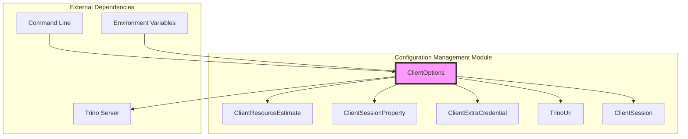
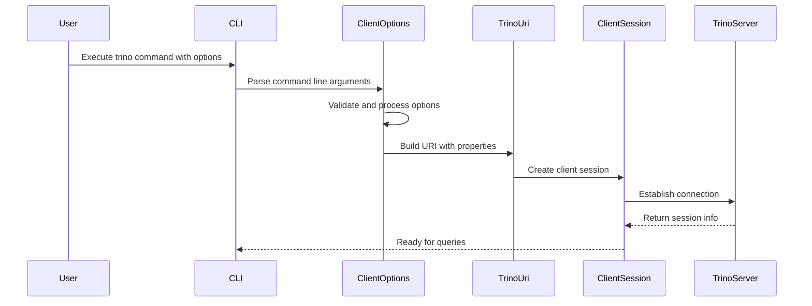
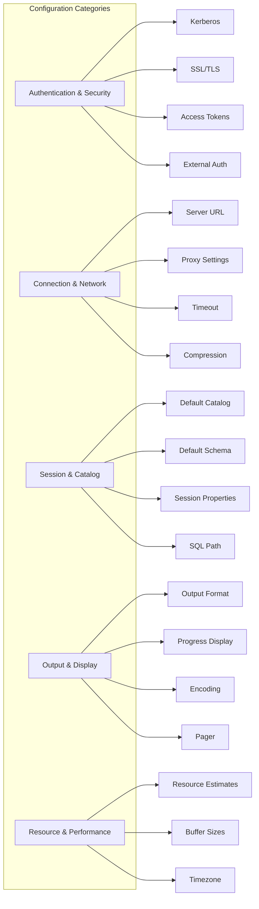
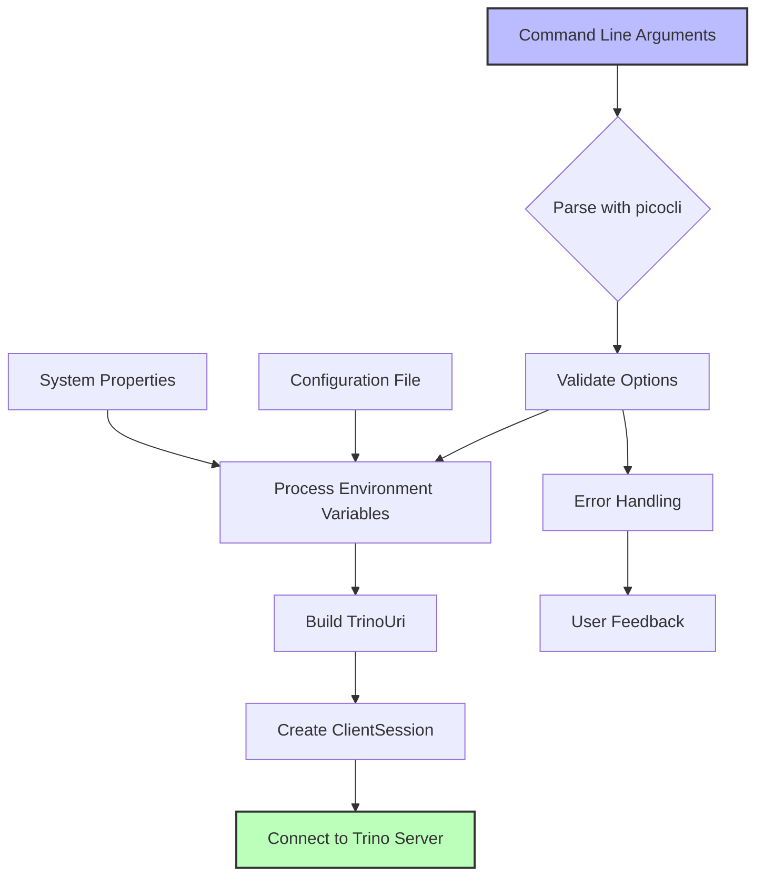
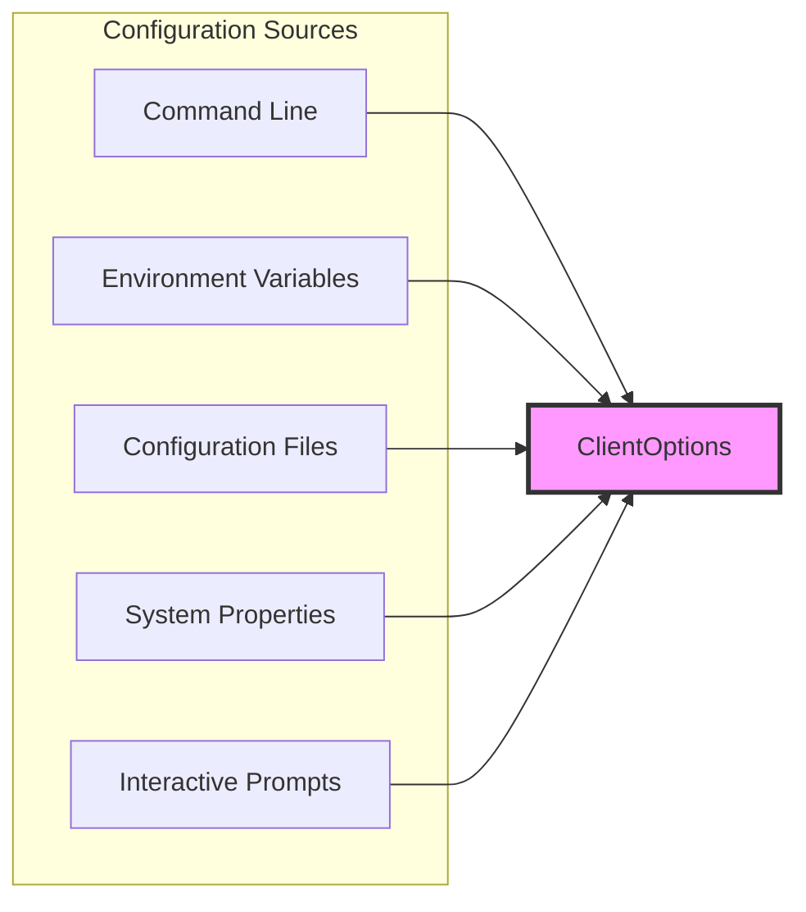
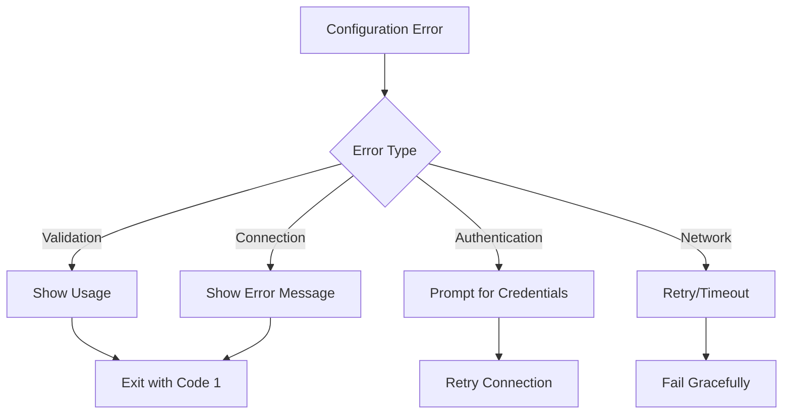

# Configuration Management Module

## Introduction

The Configuration Management module in Trino provides a comprehensive framework for handling client-side configuration options, session properties, resource estimates, and authentication settings. This module is primarily implemented through the `ClientOptions` class in the Trino CLI, which serves as the central configuration hub for client connections to Trino servers.

The module enables users to configure various aspects of their Trino client experience, including connection parameters, authentication methods, session settings, output formats, and resource allocation hints. It acts as a bridge between command-line arguments, connection URIs, and the underlying client session configuration.

## Architecture

### Core Components



### Configuration Flow



## Component Details

### ClientOptions Class

The `ClientOptions` class is the main configuration container that uses the picocli library for command-line argument parsing. It provides:

- **Connection Configuration**: Server URLs, authentication settings, proxy configuration
- **Session Management**: Default catalog, schema, session properties
- **Security Settings**: SSL/TLS configuration, Kerberos authentication, access tokens
- **Output Control**: Format options, progress display, encoding settings
- **Resource Management**: Resource estimates for query execution

#### Key Configuration Categories



### ClientResourceEstimate

The `ClientResourceEstimate` class handles resource allocation hints that help the Trino optimizer make better decisions about query execution:

- **Format**: `key=value` pairs (e.g., `memory=10GB`, `cpu=4`)
- **Validation**: Ensures ASCII characters and proper format
- **Purpose**: Provides hints for query planning and resource allocation

### ClientSessionProperty

The `ClientSessionProperty` class manages session-level configuration properties:

- **Format**: `[catalog.]property=value` (e.g., `hive.orc_bloom_filters_enabled=true`)
- **Scope**: Can be global or catalog-specific
- **Validation**: Ensures proper naming and value format

### ClientExtraCredential

The `ClientExtraCredential` class handles additional authentication credentials:

- **Format**: `key=value` pairs
- **Security**: Credentials are handled securely and not logged
- **Usage**: Passed to connectors that require additional authentication

## Configuration Processing Flow



## Integration with Other Modules

### Trino Client Library Integration

The Configuration Management module works closely with the [Trino Client Library](Trino Client Library.md):

- **ClientSession**: Configuration is converted to `ClientSession` objects
- **StatementClient**: Session configuration is used for query execution
- **QueryResults**: Output format settings affect result presentation

### Authentication Integration

Configuration integrates with the [Security Framework](Trino Server & API.md#security-framework):

- **Password Authentication**: Secure password prompting and handling
- **Kerberos Authentication**: Full Kerberos configuration support
- **External Authentication**: OAuth and external auth provider support
- **SSL/TLS**: Comprehensive SSL configuration options

### Session Management Integration

Configuration affects [SQL Analyzer, Planner & Optimizer](SQL Analyzer, Planner & Optimizer.md) behavior:

- **Session Properties**: Passed to the analyzer for query planning
- **Resource Estimates**: Used by the optimizer for cost-based decisions
- **Catalog/Schema**: Determines default query context

## Key Features

### 1. Flexible Configuration Sources



### 2. Validation and Security

- **Input Validation**: All configuration options are validated for format and content
- **Security**: Passwords and sensitive data are handled securely
- **Error Handling**: Clear error messages for invalid configurations

### 3. Extensibility

- **Custom Converters**: Support for custom data type conversion
- **Property Mapping**: Flexible mapping between CLI options and connection properties
- **Plugin Support**: Configuration can be extended for custom connectors

## Usage Examples

### Basic Connection
```bash
trinio --server https://trino.example.com --catalog hive --schema default
```

### With Authentication
```bash
trinio --server https://trino.example.com --user alice --password
```

### With Session Properties
```bash
trinio --server localhost:8080 \
  --session hive.orc_bloom_filters_enabled=true \
  --session query_max_memory=10GB
```

### With Resource Estimates
```bash
trinio --server localhost:8080 \
  --resource-estimate memory=50GB \
  --resource-estimate cpu=8
```

## Configuration Validation

The module implements comprehensive validation:

1. **Format Validation**: Ensures proper syntax for all options
2. **Range Validation**: Validates numeric values and ranges
3. **Dependency Validation**: Checks inter-option dependencies
4. **Security Validation**: Ensures secure configuration practices

## Error Handling



## Best Practices

### 1. Security
- Use SSL/TLS for production connections
- Store sensitive credentials in environment variables
- Use external authentication when possible
- Validate server certificates

### 2. Performance
- Provide accurate resource estimates
- Configure appropriate timeouts
- Use compression for large result sets
- Set proper buffer sizes

### 3. Usability
- Use meaningful client tags
- Configure appropriate output formats
- Set up proper history file locations
- Use session properties for connector-specific settings

## Dependencies

The Configuration Management module depends on:

- **picocli**: Command-line argument parsing
- **Airlift**: Configuration and utility libraries
- **JLine**: Interactive terminal handling
- **Trino Client**: Core client functionality

## Future Enhancements

Potential areas for improvement:

1. **Configuration Profiles**: Support for named configuration profiles
2. **Dynamic Configuration**: Runtime configuration updates
3. **Configuration Validation**: Enhanced validation with suggestions
4. **GUI Configuration**: Graphical configuration interface
5. **Configuration Templates**: Predefined templates for common scenarios