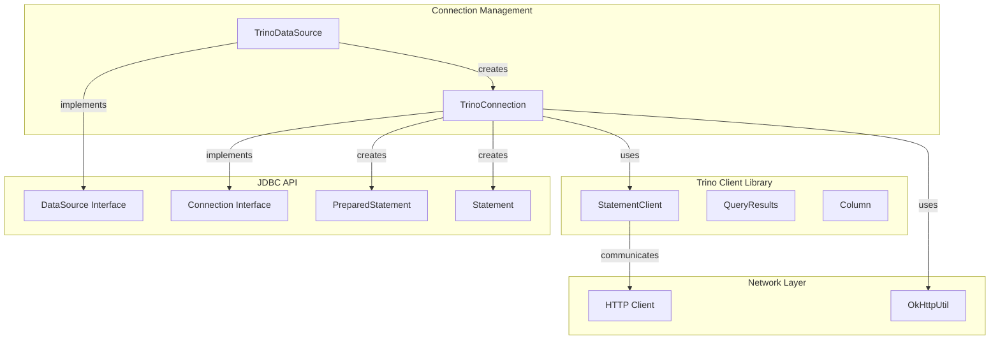
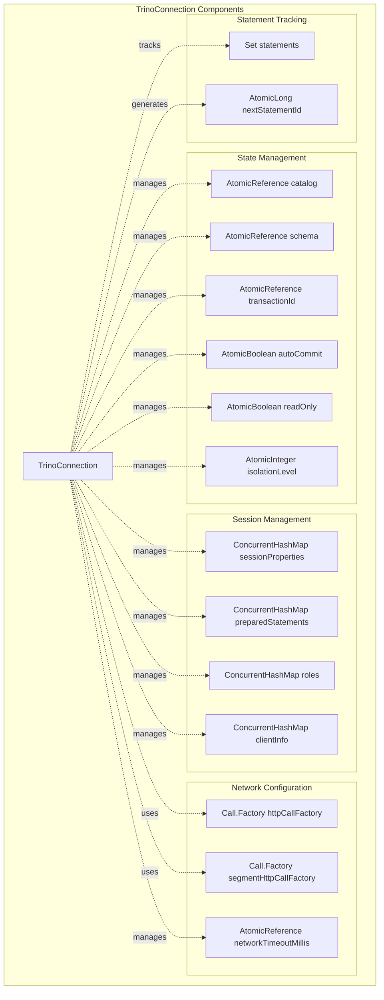
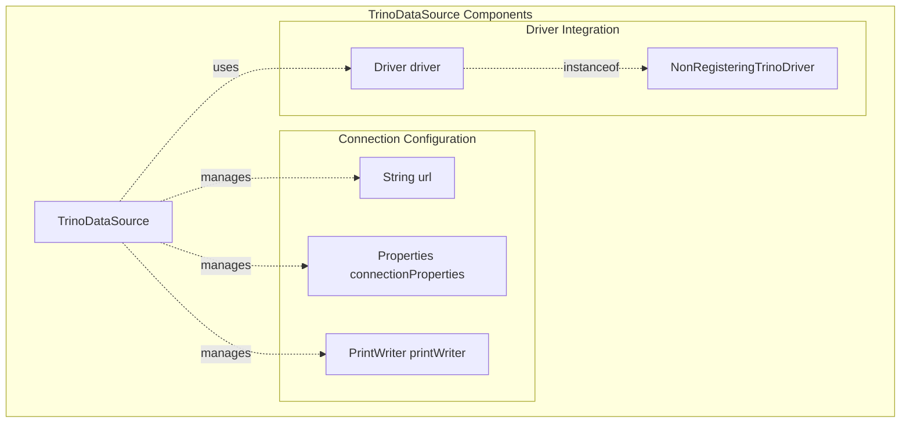
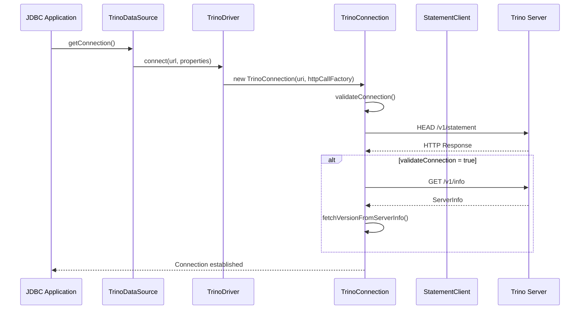
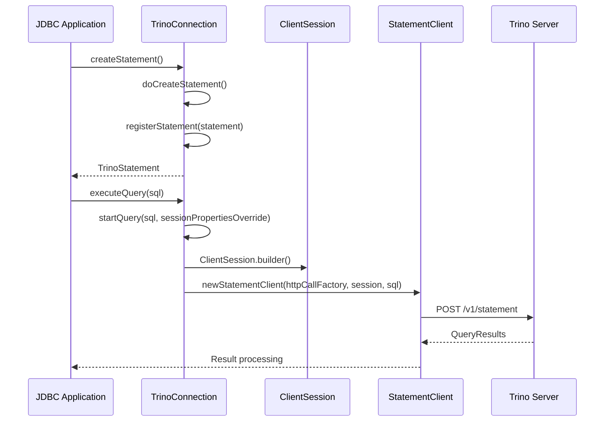
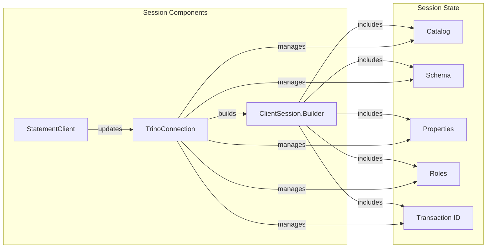
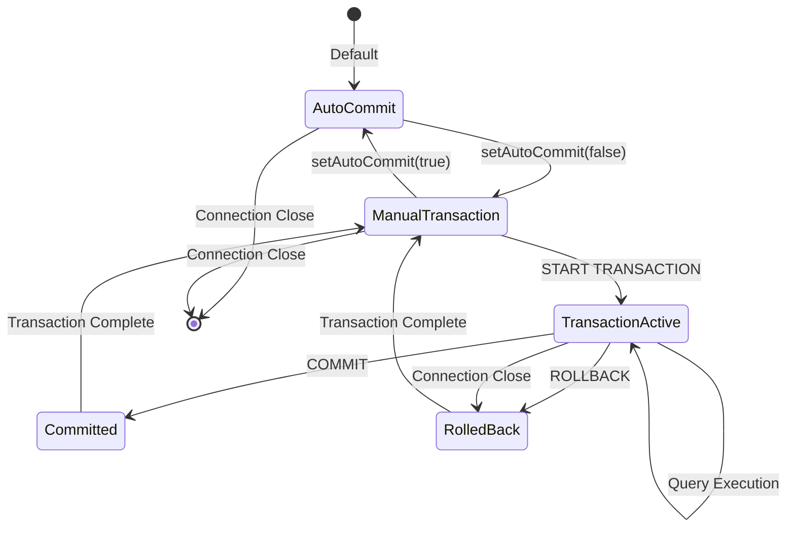

# Connection Management Module

## Introduction

The Connection Management module is a critical component of the Trino JDBC Driver that handles database connections, session management, and client-server communication. It provides the foundational infrastructure for establishing and maintaining connections between JDBC applications and Trino clusters, implementing the standard JDBC Connection interface while adding Trino-specific functionality.

This module serves as the primary entry point for JDBC applications to interact with Trino, managing connection lifecycle, authentication, session properties, transaction states, and providing the necessary abstractions for executing queries and retrieving results.

## Architecture Overview

The Connection Management module is built around two core components that work together to provide comprehensive connection handling capabilities:

### Core Components

1. **TrinoConnection** - The main connection implementation that manages the lifecycle of individual database connections, session state, and query execution context
2. **TrinoDataSource** - A connection pool-friendly data source implementation that provides connection factory capabilities for enterprise applications

### Module Relationships



## Detailed Component Architecture

### TrinoConnection Architecture



### TrinoDataSource Architecture



## Data Flow Architecture

### Connection Establishment Flow



### Query Execution Flow



## Component Interactions

### Session Management Interactions



### Transaction Management Flow



## Key Features and Capabilities

### Connection Management
- **Connection Validation**: Built-in connection validation with configurable timeout
- **Server Version Detection**: Automatic server version detection and caching
- **Connection Pooling Support**: DataSource implementation for connection pooling
- **Network Timeout Management**: Configurable network timeout with atomic updates

### Session Management
- **Dynamic Session Properties**: Runtime session property management
- **Catalog and Schema Switching**: Dynamic catalog and schema changes
- **Role Management**: Support for role-based access control
- **Time Zone and Locale Support**: Configurable time zone and locale settings

### Transaction Support
- **Transaction Isolation Levels**: Support for standard SQL isolation levels
- **Auto-commit Mode**: Configurable auto-commit behavior
- **Transaction State Tracking**: Atomic transaction ID management
- **Rollback on Close**: Automatic rollback on connection closure

### Security Features
- **Authentication Integration**: Support for various authentication methods
- **Extra Credentials**: Secure credential management
- **SSL/TLS Support**: Built-in SSL configuration support
- **Client Information**: Secure client information handling

## Integration with Other Modules

### Trino Client Library Integration
The Connection Management module heavily relies on the [Trino Client Library](Trino Client Library.md) for:
- **StatementClient**: Query execution and result processing
- **ClientSession**: Session state management
- **QueryResults**: Result set handling
- **Network Utilities**: HTTP client configuration and security

### JDBC API Compliance
The module implements standard JDBC interfaces while adding Trino-specific functionality:
- **Connection Interface**: Full JDBC Connection implementation
- **DataSource Interface**: Standard DataSource for enterprise integration
- **PreparedStatement Support**: Trino-specific prepared statement handling
- **DatabaseMetaData**: Comprehensive metadata support

## Configuration and Usage

### Connection URL Format
```
jdbc:trino://host:port/catalog/schema
```

### Key Configuration Properties
- **User Authentication**: User credentials and session user management
- **Catalog/Schema**: Default catalog and schema configuration
- **Session Properties**: Custom session property configuration
- **Network Settings**: Timeout, compression, and encoding settings
- **Client Information**: Application name, tags, and trace tokens

### Connection Pooling Integration
The TrinoDataSource implementation supports standard connection pooling frameworks:
- **HikariCP**: High-performance connection pooling
- **Apache DBCP**: Apache database connection pooling
- **Spring Boot**: Native Spring Boot data source integration

## Error Handling and Resilience

### Connection Validation
- **Health Checks**: Periodic connection health validation
- **Timeout Handling**: Configurable timeout with proper exception handling
- **Retry Logic**: Built-in retry mechanisms for transient failures
- **Graceful Degradation**: Fallback mechanisms for connection issues

### Exception Management
- **SQL Exception Mapping**: Proper JDBC SQL exception mapping
- **Error Code Handling**: Standard SQL state code support
- **Exception Chaining**: Proper exception cause chaining
- **Resource Cleanup**: Automatic resource cleanup on errors

## Performance Considerations

### Connection Optimization
- **Connection Reuse**: Efficient connection reuse strategies
- **Statement Caching**: Prepared statement caching mechanisms
- **Session Property Caching**: Efficient session property management
- **Network Optimization**: HTTP connection pooling and keep-alive

### Memory Management
- **Statement Tracking**: Efficient statement lifecycle tracking
- **Resource Cleanup**: Automatic resource cleanup on connection close
- **Memory-efficient Data Structures**: Optimized concurrent data structures
- **Garbage Collection**: Minimized object creation and retention

## Security and Compliance

### Authentication Security
- **Credential Management**: Secure credential storage and transmission
- **SSL/TLS Encryption**: End-to-end encryption support
- **Certificate Validation**: Server certificate validation
- **Authentication Methods**: Support for multiple authentication protocols

### Data Protection
- **Client Information Security**: Secure client information handling
- **Session Security**: Secure session property management
- **Network Security**: Secure network communication protocols
- **Compliance Standards**: JDBC compliance and SQL standard adherence

This comprehensive connection management system provides a robust, scalable, and secure foundation for JDBC applications to interact with Trino clusters, offering both simplicity for basic use cases and advanced features for enterprise deployments.